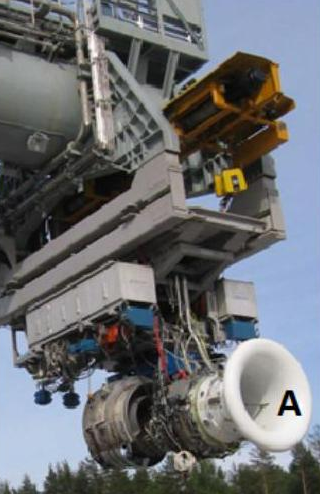
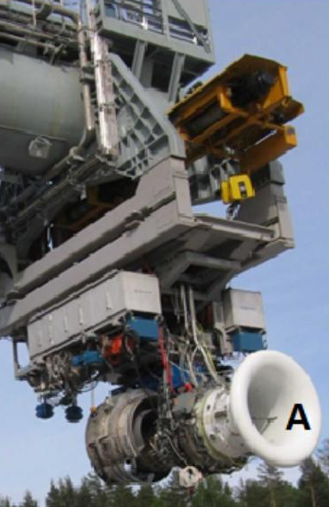
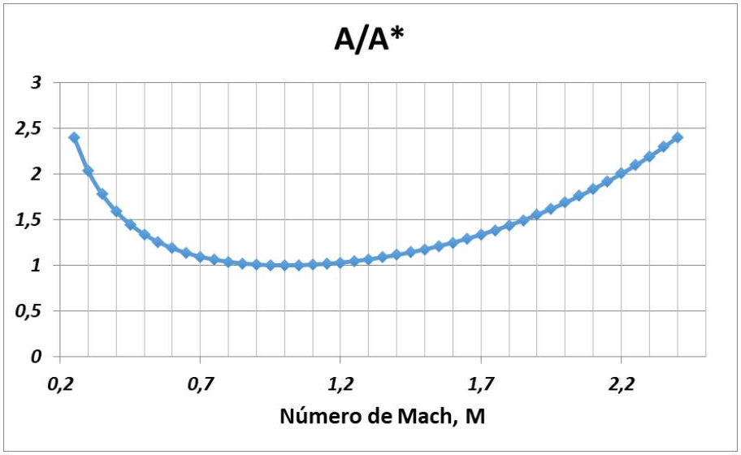

# Exámenes
> **Fuente:** Exámenes de la asignatura "Vehículos Aeroespaciales" del Grado en Ingeniería Aeroespacial impartida por la E.T.S.I.Aeronaútica y del Espacio (UPM).



## Enero-20-2022 Parte 1

### Test

1. En un turborreactor de doble flujo optimizado, cuya velocidad de salida del turborreactor base vale $V_{t b}=600 \mathrm{~m} / \mathrm{s}$, supuesto ciclo ideal y velocidad de vuelo $V_{0}=270 \mathrm{~m} / \mathrm{s}$, cuánto sería la potencia específica por unidad de gasto primario aproximadamente que consumiría el fan

    a) $180000 \mathrm{~m}^{2} / \mathrm{s}^{2}$

    b) $287000 \mathrm{~m}^{2} / \mathrm{s}^{2}$

    c) $143500 \mathrm{~m}^{2} / \mathrm{s}^{2}$

    d) $360000 \mathrm{~m}^{2} / \mathrm{s}^{2}$

    

    

    
Solución

    **c**
    

2. En el banco de ensayos de la figura se pretende medir el empuje no instalado del motor. Suponiendo que el efecto de la corriente por el exterior es despreciable en las fuerzas sobre la célula de carga, para obtener el empuje mencionado

    a) La toma A tiene que ir unida al motor y a la fuerza sobre la célula de carga debe añadirse el término $G V_{2}+A_{2}\left(P_{2}-P_{0}\right)$

    b) El efecto de la toma A es despreciable.

    c) La toma A debe estar separada del motor y a la fuerza sobre la célula de carga debe añadirse el término $G V_{2}+A_{2}\left(P_{2}-P_{0}\right)$

    d) Es independiente de como se instale la toma A.

    

    
Solución

    **c**
    

3. El exceso de potencia especifica $P_{\mathrm{s}}$ para una velocidad de vuelo dada representa

    a) Las posibilidades de subir el valor de la carga alar del avión.

    b) Una medida del peso del avión.

    c) El exceso de empuje por unidad de peso del avión disponible para incrementar el nivel de energía del avión.

    d) Siempre es nula.

    

    
Solución

    **c**
    

4. Se dispone de dos turborreactores de flujo único, el $\mathrm{A}$ con $V_{S} / V_{0}=2$ y el B con $V_{S} / V_{0}=4$. De ellos se pude decir

    a) Que el A siempre tendrá mayor rendimiento motor.

    b) Que el A tendrá mayor rendimiento de propulsión.

    c) Que no hay diferencias en cuanto a rendimientos.

    d) Nada en cuanto a los rendimientos del sistema (motor, propulsión y global).

    

    
Solución

    **b**
    

5. Para vuelo equilibrado, exceso de potencia específica de la aeronave nula, representan condiciones de

    a) Vuelo a velocidad constante.

    b) Subida con velocidad ascensional y de vuelo constantes y no nulas.

    c) Vuelo a altura constante.

    d) Nivel de energía de la aeronave constante.

    

    
Solución

    **d**
    

6. Para un $\Lambda$ dado, se optimiza la relación de presiones del fan, $\pi_{f}$, para tener un turbofan con $C_{\mathrm{E}}$ mínimo. Se puede decir que la $\pi_{f}$ resultante

    a) Disminuye al subir $T_{4 t}$

    b) Aumenta al mejorar la calidad de la turbina.

    c) Es independiente de la relación de compresión del compresor, $\pi_{c}$.

    d) Aumenta con la $V_{0}$

    

    
Solución

    **b**
    

7. Se están estudiando dos góndolas para equipar un aerorreactor que proporciona $22000 \mathrm{~N}$ a nivel del mar y $M_{0}=0,5$ con un gasto de aire $G=41,75 \mathrm{~kg} / \mathrm{s}$. La primera (1), tiene un área de entrada $A_{e}=0,2 \mathrm{~m}^{2}$ y la segunda (2) un área de entrada $A_{e}=0,26 \mathrm{~m}^{2}$. Suponiendo que ambas góndolas tienen la misma resistencia externa en esa condición de vuelo, ¿cuál es la más conveniente para esa condición de vuelo?

    a) La $2 .$

    b) Depende de los parámetros del ciclo.

    c) Depende de la presión de salida del chorro.

    d) La 1.

    

    
Solución

    **d**
    

8. Un motor se ha diseñado en crucero $\left(h=11 \mathrm{~km}\right.$ y $\left.M_{0}=0,7\right)$ con la condición máximo rendimiento motor. Posteriormente, manteniendo la relación de presiones del compresor y la temperatura máxima, se ha cambiado el Mach vuelo de diseño a $M_{0}=0,8$. ¿A qué altitud tendría que volar ahora para seguir manteniendo el máximo rendimiento motor en la condición de diseño nueva?

    a) A ninguna altitud se podría recuperar el rendimiento motor máximo.

    b) A una altitud menor.

    c) A la misma altitud.

    d) A una altitud mayor.

    

    
Solución

    **a**
    

9. Si el impulso de un turborreactor de flujo único es $800 \mathrm{~m} / \mathrm{s}$, su rendimiento propulsivo sería

    a) 0,3 si la velocidad de vuelo fuera $250 \mathrm{~m} / \mathrm{s}$.

    b) 0,33 si la velocidad de vuelo fuera $150 \mathrm{~m} / \mathrm{s}$.

    c) 0,58 si la velocidad de vuelo fuera $200 \mathrm{~m} / \mathrm{s}$.

    d) 0,43 si la velocidad de vuelo fuera $300 \mathrm{~m} / \mathrm{s}.

    

    
Solución

    **d**
    

10. Típicamente, la hélice de barco presenta un rendimiento de propulsión

    a) Más bajo que la hélice de un avión.

    b) Más alto que la hélice de un avión.

    c) No se sabe, depende de la hélice.

    d) Parecido a la hélice de un avión.

    

    
Solución

    **b**
    

11. En un turbofan ideal, con $\Lambda$ y $\tau_{f}$ optimizados para tener $C_{\mathrm{E}}$ mínimo se cumple que

    a) $\Lambda$ es finita.

    b) La velocidad de salida de los flujos primario, $V_{9}$, y secundario, $V_{19}$, son iguales.

    c) $\mathrm{El} \tau_{f}$ es igual a `$V_{9}^{**} \cdot V_{19}^{**}$`.

    d) $\mathrm{El} \tau_{f}$ crece al aumentar $\Lambda$

    

    
Solución

    **b**
    

12. En un turbofan optimizado, supuesto ideal, el trabajo específico del fan

    a) Es independiente de la altura y velocidad de vuelo.

    b) Depende de la temperatura máxima del ciclo del turborreactor base.

    c) No depende de la velocidad de vuelo pero si de la altura de optimización.

    d) Sube cuando sube la velocidad de vuelo.

    

    
Solución

    **a**
    

13. El empuje neto instalado y el empuje neto solo coinciden si se supone que

    a) El fluido que se mueve alrededor del aerorreactor es ideal y la tobera está adaptada.

    b) La tobera está adaptada

    c) Por simplificación, que son iguales.

    d) El fluido que se mueve alrededor del aerorreactor es ideal.

    

    
Solución

    **a**
    

14. Para una polar del tipo $C_{\mathrm{D}}=K_{1} \cdot C_{\mathrm{L}}^{2}+K_{2} \cdot C_{\mathrm{L}}+C_{\mathrm{D} 0}$, con coeficientes constantes, el empuje / peso mínimo necesario para un vuelo de crucero

    a) Es constante para cualquier velocidad de vuelo.

    b) Es mayor a mayor velocidad de vuelo.

    c) Es menor a mayor velocidad de vuelo.

    d) Es menor a mayor altura.

    

    
Solución

    **a**
    

15. El rendimiento motor de un turbohélice es

    a) Siempre son iguales.

    b) Igual al del turborreactor de flujo único base si son ideales los procesos involucrados en la transferencia de potencia a la hélice y es ideal el ciclo del turborreactor base.

    c) Igual al del turborreactor de flujo único base si son ideales los procesos involucrados en la transferencia de potencia a la hélice, independientemente de que el ciclo del turborreactor base sea ideal o no.

    d) Siempre mayor que el de su turborreactor de flujo único base.

    

    
Solución

    **c**
    

16. Un turbohélice diseñado a partir de un turborreactor con una velocidad de salida, $V_{t b}$, de 580 $\mathrm{m} / \mathrm{s}$, con un $\eta_{m}=0,98$ y un $\eta_{h}=0,8$; se optimiza para la condición de vuelo $h=5000 \mathrm{~m}$ y $V_{0}$ $=170 \mathrm{~m} / \mathrm{s} .$ ¿Cuál sería su valor de $\lambda^{*}$ ?

    a) Aproximadamente $0,62 .$

    b) Aproximadamente de $1 .$

    c) Aproximadamente 0,3 .

    d) Aproximadamente $0,14$.

    

    
Solución

    **d**
    

17. El rendimiento global de un motor de reacción es una medida de

    a) Su eficiencia como sistema generador de potencia.

    b) El consumo de combustible, independientemente del empuje.

    c) Su eficiencia como sistema motor.

    d) El consumo específico para una velocidad de vuelo dada.

    

    
Solución

    **d**
    

18. Para turbohélices típicos, optimizados para bajas velocidades de vuelo $\left(M_{0} \approx 0,55\right)$, desde el punto de vista de obtener mínimo tamaño y mínimo consumo especifico de combustible, interesa

    a) Subir la temperatura máxima para mínimo tamaño a costa de subir el consumo específico.

    b) Subir la temperatura máxima y bajar la relación de presiones.

    c) Subir siempre la temperatura máxima del motor.

    d) Subir siempre la relación global de presiones del ciclo.

    

    
Solución

    **c**
    

19. De un aerorreactor, funcionando con tobera adaptada y moviéndose en un fluido ideal, se conoce su resistencia adicional o de entrada $D a d c=60 \mathrm{kN}$. ¿Cuál sería su resistencia externa?

    a) $0 \mathrm{kN}$

    b) $60 \mathrm{kN}$ en el sentido contrario de la Dadc.

    c) $60 \mathrm{kN}$ en el sentido de la Dadc.

    d) Menor que $60 \mathrm{kN}$ y en sentido contrario de la Dadc.

    

    
Solución

    **b**
    

20. Se tiene un turborreactor con una relación de presiones que optimiza el impulso específico para un Mach de vuelo $\left(M_{0, \text { diseño }}\right)$. Si se desea rediseñar el aerorreactor para mejorar su $C_{\mathrm{E}}$ para el mismo $M_{0, \text { diseño }} T_{4 t}$, habría que

    a) Bajar la relación de presiones del compresor.

    b) Subir el gasto de aire que entra al motor.

    c) Necesariamente modificar la $T_{4 t}$

    d) Subir la relación de presiones del compresor.

    

    
Solución

    **d**
    

### Ejercicios

Se obtendrá un punto por pregunta si la solución numérica indicada se corresponde con la solución correcta $\pm 1 \%$, excepto cuando la solución numérica se corresponda con un hecho térico, en cuyo caso no se aceptará error alguno; por ejemplo, el rendimiento adiabático de un compresor en una evolución ideal es $=1 .$

Suponga, siempre que no se indique lo contrario, que para el aire es $R=287 \mathrm{~J} / \mathrm{kg} \cdot \mathrm{K} y \gamma=1,4 ; y$ que el poder calorífico inferior del combustible utilizado es $L=42 \mathrm{MJ} / \mathrm{kg}$. Condiciones de despegue: $M_{0}=0 \boldsymbol{y} h=0 \mathrm{~m}\left(T_{0}=288 \mathrm{~K} ; P_{0}=101325 \mathrm{~Pa}\right)$.

---

21. La polar parabólica de un avión de combate, con un peso al despegue de 20 toneladas, y carga alar de $4,5 \mathrm{kPa}$ es

    $$
    C_{\mathrm{D}}=K_{1} \cdot C_{\mathrm{L}}^{2}+C_{\mathrm{D} 0} \quad\left[K_{1}=0,22 ; C_{\mathrm{D} 0}=0,011\right]
    $$

    En la condición de crucero subsónico $M_{0}=0,75, h=6000 \mathrm{~m}\left[P_{0}=47,18 \mathrm{kPa} ; T_{0}=249,2 \mathrm{~K}\right]$, cuánto debe ser la fracción de combustible gastado respecto del peso en despegue, $(1-\beta)$, para que la relación de empuje / peso sea mínima.

    

    
Solución

    Sol: 0,0769
    

22. Un avión, volando en vuelo equilibrado, con un nivel de energía de $10000 \mathrm{~m}$, decide subir su altura de vuelo manteniendo un ángulo constante de subida de $15^{\circ}$ así como su nivel de energía.

    ¿Cuál sería su velocidad de vuelo, en $\mathrm{km} / \mathrm{h}$, si se estabiliza a una altura de $9000 \mathrm{~m}$?

    

    
Solución

    Sol: $504,2 \mathrm{~km} / \mathrm{h}$
    

23. El peso de combustible de un avión de gran autonomía es el $40 \%$ del peso máximo de despegue. Si se quiere que el radio de acción del avión sea $13000 \mathrm{~km}$, volando a $M_{0}=0,85 ; h=11000 \mathrm{~m}\left(T_{0}\right.$ $=216,7 \mathrm{~K} ; P_{0}=22,63 \mathrm{kPa}$, cuánto tendría que ser como máximo el consumo específico de sus motores, en $\mathrm{g} /(\mathrm{kN} \cdot \mathrm{s})$. Suponga que se puede considerar la eficiencia aerodinámica constante e igual a 18 y que el consumo en las fases de despegue y ascenso se puedan considerar despreciables frente al consumo de crucero.

    

    
Solución

    Sol: $18,09 \mathrm{~g} /(\mathrm{kN} \cdot \mathrm{s})$
    

24. De la sección de entrada de un aerorreactor en vuelo subsónico se conoce la presión estática $\left(P_{e}=P_{\text {ambiente }}=60 \mathrm{kPa}\right)$, así como la sección de paso de dicha sección $\left(A_{e}=4,35 \mathrm{~m}^{2}\right)$. En dichas condiciones de vuelo, cuánto vale la resistencia adicional, en kN.

    

    
Solución

    Sol: $0 \mathrm{kN}$
    

25. El empuje no instalado de un motor es $70 \mathrm{kN}$, funcionando con una gasto de $50 \mathrm{~kg} / \mathrm{s}$. Cuanto sería la fuerza, en $\mathrm{kN}$, sobre la célula de carga de un banco de ensayos de este motor al mismo régimen y condiciones, si se hubiese medido un Mach en la sección de entrada del motor en el banco de Me $=0,35$ y son despreciables los efectos del aire sobre las superficies exteriores del motor. Suponga siempre condiciones de entrada correspondientes a nivel del mar.

    

    
Solución

    Sol: $67,15 \mathrm{kN}$
    

26. Un motor en régimen de crucero $\left(V_{0}=250 \mathrm{~m} / \mathrm{s}\right)$ proporciona un impulso de $800 \mathrm{~m} / \mathrm{s}$ (tobera adaptada) con un rendimiento motor de 0,40 . ¿Cuál sería su consumo específico de combustible $C_{\mathrm{E}}$, en $\mathrm{g} /(\mathrm{kN} \cdot \mathrm{s}) ? \quad$

    

    
Solución

    Sol: $38,69 \mathrm{~g} /(\mathrm{kN} \cdot \mathrm{s})$
    

27. Se tiene un turborreactor con $\pi_{23}$ de diseño de $10: 1$ y $T_{4 t}=1550 \mathrm{~K}\left(V_{0}=0 \mathrm{~m} / \mathrm{s}, \mathrm{SLS}\right)$. Cuánto valdría el rendimiento motor ideal volando a un Mach de 0,80 y $5000 \mathrm{~m}\left(P_{0}=54,02 \mathrm{kPa}, T_{0}=\right.$ $255,7 \mathrm{~K})$, y con una $T_{4 t}=1400 \mathrm{~K} . \quad$ Sol: 0,5180 28. Un turborreactor de flujo único, con $V_{0} / V_{t b}=0,5$, se ha transformado en un turbohélice. Suponiendo una transferencia de potencia ideal, que el rendimiento de la hélice es la unidad, y que se quiere obtener consumo específico mínimo, qué potencia por unidad de gasto habrá transferir a la hélice referida a la potencia disponible $\left(V_{t b}^{2} / 2\right)$

    

    
Solución

    Sol: 0,75
    

28. Un turbofan ideal con una relación de derivación de 8, funciona con un trabajo específico del fan optimizado a una velocidad de $250 \mathrm{~m} / \mathrm{s}$. Si a esa condición de vuelo la velocidad de salida del turborreactor base es de $875 \mathrm{~m} / \mathrm{s}$, la velocidad de salida del primario (flujo caliente) sería, en $\mathrm{m} / \mathrm{s} . \quad$

    

    
Solución

    Sol: $375,0 \mathrm{~m} / \mathrm{s}$
    

## Enero-20-2022 Parte 2

### Test

1. El ángulo girado por la corriente tanto en el rotor como en el estator en un escalón de compresor $\mathrm{es}$

    a) Igual al girado en álabes de turbinas.

    b) Algo mayor que el girado en álabes de turbinas.

    c) Bastante menor que el girado en álabes de turbinas.

    d) Siempre del orden de $60^{\circ}$

    

    
Solución

    **c**
    

2. En un turbofán de flujos mezclados:

    a) La ganancia de empuje aumenta cuando las temperaturas de los chorros frío y caliente tiende a igualarse, independientemente de las presiones de remanso.

    b) La ganancia de empuje es independiente de las temperaturas de los chorros.

    c) La ganancia de empuje mayor ocurre cuando las presiones de remanso del chorro frío y caliente son similares.

    d) Si las presiones de remanso de los chorros es la misma, la presión de remanso después de la mezcla será la misma.

    

    
Solución

    **c**
    

3. En un motor de empuje constante, la $T_{0}$ (temperatura ambiente) hasta la que puede mantener empuje constante sin sobrepasar el régimen máximo (Nmax; $\left.T_{4 t}, \max \right)$ :

    a) Aumenta si aumenta $P_{0}$

    b) Disminuye si aumenta $P_{0}$

    c) Es independiente de $P_{0}$

    

    
Solución

    **a**
    

4. El tamaño del difusor a la entrada del postcombustor viene fijado básicamente por

    a) La temperatura de salida del postcombustor.

    b) La condición de mantener constante el gasto del motor.

    c) La condición de bloqueo térmico.

    d) La estabilización de la llama con pérdidas de presión de remanso razonables.

    

    
Solución

    **d**
    

5. Cuando en un turborreactor mono-eje funcionando con turbina y tobera en condiciones críticas se aumenta el área de la garganta de la tobera manteniendo $T_{4 t} / T_{2 t}$ constante

    a) El parámetro de gasto de la turbina baja.

    b) El parámetro de gasto del compresor sube.

    c) La relación combustible/aire sube.

    d) La relación de presión del compresor baja.

    

    
Solución

    **b**
    

6. Al aumentar el área de salida de la tobera (A8) de un turborreactor de flujo único funcionando con la turbina y la tobera en condiciones críticas, la línea de funcionamiento:

    a) Se desplaza a valores inferiores de la relación de compresión.

    b) No se desplaza puesto que los parámetros de gasto de la turbina y la tobera son constantes.

    c) Se desplaza a valores mayores de la relación de compresión.

    

    
Solución

    **a**
    

7. Manteniendo la temperatura fin de combustión constante, el efecto de la inyección de agua en el compresor hace que el aumento de temperaturas en el mismo sea menor, pero la relación de compresión aumenta. Esto es debido a que

    a) El parámetro de gasto del compresor ha disminuido.

    b) Aumenta la entropía de la fase gaseosa por la inyección de agua.

    c) La inyección de agua produce el efecto de una compresión refrigerada, que permite con la misma potencia obtener mayor relación de compresión.

    d) Las pérdidas por fricción han disminuido.

    

    
Solución

    **c**
    

8. Normalmente, en un compresor, funcionando a vueltas constantes, si se sobrepasa la línea de estabilidad funcional se originarían:

    a) Vibraciones longitudinales de baja frecuencia y baja amplitud.

    b) Oscilaciones de gran amplitud y baja frecuencia en el gasto del compresor.

    c) Importantes subidas del rendimiento del compresor.

    d) Vibraciones transversales de alta frecuencia y gran amplitud.

    

    
Solución

    **b**
    

9. En un difusor supersónico, la relación de presiones de remanso $P_{2 t} / P_{0 t}$ en el mismo, funcionando en régimen supersónico $\left(M_{0}>1\right)$

    a) Disminuye de forma apreciable siempre al disminuir el parámetro de gasto.

    b) Disminuye de forma apreciable siempre al aumentar el parámetro de gasto.

    c) Disminuye de forma apreciable siempre al disminuir el número de Mach.

    d) Disminuye de forma apreciable siempre al aumentar el número de Mach.

    

    
Solución

    **d**
    

10. En actuaciones de compresores, el parámetro $G \sqrt{\theta_{2 t}} / \delta_{2 t}$ representa

    a) El gasto que pasaría por el compresor si las condiciones de entrada fueran las de un día ISA a nivel del mar.

    b) El gasto que puede admitir la turbina.

    c) El mínimo gasto que pasa por el compresor a unas vueltas dada.

    d) El máximo gasto que pasa por el compresor a unas vueltas dadas.

    

    
Solución

    **a**
    

11. La línea del "surge" de un compresor:

    a) Se debe a incidencias negativas en los álabes del compresor.

    b) Se debe a efectos de entrada en pérdida de los álabes del compresor.

    c) Se debe a problemas metalúrgicos que aparecen cuando se aumenta la temperatura de entrada del compresor.

    d) Se debe a problemas de bloqueo sónico en la entrada del compresor.

    

    
Solución

    **b**
    

12. En turbomáquinas, la deflexión de la corriente en los rotores produce cambios en el momento cinético que dan lugar a pares en los álabes. Estas deflexiones

    a) Al disminuir la deflexión aumenta el trabajo específico de la turbomáquina.

    b) Deben ser mayores en los radios exteriores de los álabes si se quiere mantener un trabajo específico constante en todo el radio del álabe.

    c) Son mayores en los álabes de los compresores que en los de las turbinas.

    d) Son las causantes de que se produzcan desprendimientos si son muy elevadas.

    

    
Solución

    **d**
    

13. En un turbofán de flujos mezclados, con un mezclador de área constante y suponiendo flujo ideal y propiedades del gas constantes, con los siguientes valores: $\Lambda=5, T_{5 t}=600 \mathrm{~K}, T_{15 t}=$ $320 \mathrm{~K}, P_{15 t}=P_{5 t}$, se cumple

    a) $P_{6 t}=P_{15 t}$.

    b) $M_{6}=M_{5}$

    c) $M_{15}=M_{6}$.

    d) $M_{15}=M_{5}$.

    

    
Solución

    **d**
    

14. La línea de funcionamiento de puntos en equilibrio de un turborreactor de flujo único sobre el mapa del compresor es una línea

    a) $\left(T_{5 t} / T_{2 t}\right)=$ cte.

    b) $\left(T_{4 t} / T_{2 t}\right)=$ cte.

    c) $\left(T_{5 t} / T_{4 t}\right)=$ cte.

    d) $\left(T_{5 t} / T_{3 t}\right)=$ cte.

    

    
Solución

    **c**
    

15. En un compresor de un solo escalón, con un radio medio $\mathrm{r}=1 \mathrm{~m}$ y una velocidad de giro de 10000 rpm, se ha comprobado que en el estátor se ha producido un giro de la corriente con $\left(V_{\theta 2}-V_{\theta 1}\right)=100 \mathrm{~m} / \mathrm{s}$. ¿Cuánto valdría el trabajo específico medio del escalón?

    a) No se sabe.

    b) $159154,90(\mathrm{~m} / \mathrm{s})^{2}$

    c) $79577,45(\mathrm{~m} / \mathrm{s})^{2}$.

    d) $59154,90(\mathrm{~m} / \mathrm{s})^{2}$

    

    
Solución

    **a**
    

16. Tras analizar los efectos reales en postcombustores, se puede afirmar del $M_{6}$ que

    a) El valor de $M_{7}$ disminuye al aumentar $M_{6}$.

    b) Tiene valores rondando $0,45-0,50$

    c) Si es pequeño, aumentan las pérdidas de presión de remanso.

    d) El parámetro de combustible límite disminuye al aumentar $M_{6}$.

    

    
Solución

    **d**
    

17. A nivel del mar, un motor de empuje constante hasta $30^{\circ} \mathrm{C}$; tiene una $T_{4 t}$ máxima de despegue de $1650 \mathrm{~K}$. Cuál sería la $T_{4 t}$ de despegue si la temperatura ambiente fuera de $20^{\circ} \mathrm{C}$ y la presión $101,325 \mathrm{kPa}$

    a) Alrededor de $1595 \mathrm{~K}$.

    b) Alrededor de $1628 \mathrm{~K}$.

    c) Alrededor de $1543 \mathrm{~K}$.

    d) Alrededor de $1673 \mathrm{~K}$

    

    
Solución

    **a**
    

18. El límite aerodinámico del funcionamiento de los álabes de un compresor está relacionado con

    a) La diferencia de las velocidades tangenciales en la salida y la entrada del álabe.

    b) La velocidad de giro del compresor.

    c) Con la velocidad absoluta de entrada.

    d) La diferencia de las velocidades axiales en la salida y la entrada del álabe.

    

    
Solución

    **a**
    

19. La cantidad de agua que puede ser inyectada en la cámara de combustión, para incrementar el empuje, está limitada por

    a) Fenómenos de bloqueo térmico.

    b) La línea de estabilidad del compresor.

    c) La saturación del aire.

    d) Problemas de corrosión.

    

    
Solución

    **b**
    

20. El incremento de empuje, $\Delta E / E$, de un postcombustor a velocidad de vuelo nula es del $35 \%$, cuánto tendría que ser el aumento de área, $A_{8, p c} / A_{8}$

    a) Del orden de $1,35^{2}$

    b) Del orden de $1,35$.

    c) Del orden de $\ln (0,35)$.

    d) Del orden de $1,35^{0,5}$.

    

    
Solución

    **b**
    

### Ejercicios

Se obtendrá un punto por pregunta si la solución numérica indicada se corresponde con la solución correcta $\pm 1 \%$, excepto cuando la solución numérica se corresponda con un hecho térico, en cuyo caso no se aceptará error alguno; por ejemplo, el rendimiento adiabático de un compresor en una evolución ideal es $=1.$

Suponga, siempre que no se indique lo contrario, que para el aire es $R=287 \mathrm{~J} / \mathrm{kg} \cdot \mathrm{K} y \gamma=1,4 ; y$ que el poder calorífico inferior del combustible utilizado es $L=42 \mathrm{MJ} / \mathrm{kg}$. Condiciones de despegue: $M_{0}=0 \boldsymbol{y} h=0 \mathrm{~m}\left(T_{0}=288 \mathrm{~K} ; P_{0}=101325 \mathrm{~Pa}\right)$.

---

21. Un turborreactor monoeje, volando dentro de la troposfera, dispone de un sistema de control que funciona limitando la temperatura máxima de funcionamiento, $T_{4 t, \max }$, o las máximas vueltas aerodinámicas del compresor, $\left(N / \sqrt{T_{2 t}}\right) \max$.

    Para una altura dada, al ir aumentando el Mach de vuelo, $M_{0}$, el sistema pasa de controlar por $\left(N / \sqrt{T_{2 t}}\right)_{\max }$ a controlar por $T_{4 t, \max }$

    Para una atmósfera estándar, a qué altura, en metros, el Mach de vuelo que exige el cambio de control es máximo.

    

    
Solución

    Sol: $11000 \mathrm{~m}$
    

    Un turborreactor de flujo único de empuje constante puede alcanzar su empuje nominal de 164 kN hasta una temperatura ambiente de $30^{\circ} \mathrm{C}$ cuando la presión ambiente es de 101325 Pa. En esas condiciones, se sabe que funciona con su máxima temperatura fin de combustión, $T_{4 t}=1900 \mathrm{~K}$, y que su $\mathrm{EPR}=9,87$

    Despegando con la misma temperatura ambiente, $30^{\circ} \mathrm{C}$, y con una presión de $85000 \mathrm{~Pa}$, se pide:

22. Cuál sería su temperatura de funcionamiento, en $\mathrm{K} . \quad$

    

    
Solución

    Sol: $1900 \mathrm{~K}$
    

23. Cuál sería su EPR.

    

    
Solución

    Sol: 9,87
    

24. Cuál sería su empuje de despegue, en $\mathrm{kN}$.

    

    
Solución

    Sol: $137,6 \mathrm{kN}$
    

25. Un turborreactor, en condiciones de despegue ISA $\left(T_{0}=15^{\circ} \mathrm{C}\right)$, funciona con su máxima temperatura fin de combustión, $T_{4 t}=1550 \mathrm{~K}$, y una $\pi_{c}=26: 1$. Suponiendo ciclo ideal y que la turbina y tobera del motor anterior trabajasen en condiciones críticas, calcular el EPR si el despegue se produjese con la máxima temperatura fin de combustión, $1550 \mathrm{~K}$, y una temperatura ambiente de $40^{\circ} \mathrm{C}$.

    

    
Solución

    Sol: 6,733
    

26. De un generador de gas, en el cual la turbina funciona en condiciones críticas, se conocen, para un día ISA $\left(P_{0}=101,325 \mathrm{kPa}, T_{0}=288 \mathrm{~K}\right)$, la relación de presiones de funcionamiento del compresor $\pi_{c}=18: 1$, el gasto $G=32 \mathrm{~kg} / \mathrm{s}, \mathrm{y} T_{4 t} / T_{2 t}=5,7$. Cuál sería la nueva relación de presiones de funcionamiento del compresor $\pi_{c}$ si se mantienen las condiciones de funcionamiento del generador de gas $\left(P_{0}=101,325 \mathrm{kPa}, T_{0}=288 \mathrm{~K}, G=32 \mathrm{~kg} / \mathrm{s}\right.$, y $\left.T_{4 t} / T_{2 t}=5,7\right)$ y se aumenta el área de la directriz de la turbina en un $15 \%$

    $A_{\text {turbina nueva }}=A_{\text {turbina }} \cdot 1,15 \quad$

    

    
Solución

    Sol: 15,65
    

27. Se tiene una cámara de combustión funcionado con una $T_{3 t}=890 \mathrm{~K} ; P_{3 t}=2500 \mathrm{kPa} ; G=20 \mathrm{~kg} / \mathrm{s}$; y $c=0,6 \mathrm{~kg} / \mathrm{s}$. Cuánto debe ser la cantidad de combustible inyectado en la cámara, en $\mathrm{kg} / \mathrm{s}$, si se quiere obtener la misma relación $T_{4 t} / T_{3 t}$, con las siguientes condiciones: $T_{3 t}=700 \mathrm{~K} ; P_{3 t}=$ $1500 \mathrm{kPa} ; G=15 \mathrm{~kg} / \mathrm{s} . \quad$ Sol: $0,3539 \mathrm{~kg} / \mathrm{s}$ 28. Una turbina de un aerorreactor ensayada en banco $\left(T_{0}=288 \mathrm{~K}, P_{0}=101,325 \mathrm{kPa}\right)$ y funcionado en condiciones críticas, proporciona un gasto de $100 \mathrm{~kg} / \mathrm{s}$. ¿Qué gasto, en $\mathrm{kg} / \mathrm{s}$, proporcionaría, si manteniendo la temperatura de entrada se baja la presión en un $20 \%$ ?

    

    
Solución

    Sol: $80 \mathrm{~kg} / \mathrm{s}$
    

28. Un compresor funcionando en condiciones ISA $\left(T_{0}=288 \mathrm{~K}, P_{0}=101,325 \mathrm{kPa}\right)$ proporciona un gasto de $50 \mathrm{~kg} / \mathrm{s}$ para unas vueltas dadas. Si se mantienen las vueltas aerodinámicas y la relación de presiones del compresor, cuál sería el nuevo gasto, en $\mathrm{kg} / \mathrm{s}$, para $P_{0}=90 \mathrm{kPa}, T_{0}=288 \mathrm{~K}$.

    

    
Solución

    Sol: $44,41 \mathrm{~kg} / \mathrm{s}$
    

## Noviembre-24-2021 Parte 1

### Test

1. Se dispone de dos turborreactores de flujo único, el $\mathrm{A}$ con $V_{t b} / V_{0}=2 \mathrm{y}$ el $\mathrm{B} \operatorname{con} V_{t b} / V_{0}=4$ para transformar en turbohélices optimizados. ¿En dicha transformación, supuesto ciclo ideal, en cuál de ellos habría que extraer más potencia para mover la hélice relativa a la disponible en la expansión, $(\mathrm{Ph} / \mathrm{G}) /\left(1 / 2 V_{t b}{ }^{2}\right)$ ?

    a) En ambos habría que extraer la misma.

    b) No se sabe.

    c) En al A.

    d) En el B.

    

    
Solución

    **d**
    

2. Un aerorreactor está optimizado para tener potencia mecánica por unidad de gasto adimensional máxima a una altitud y Mach de vuelo dados. Si se quiere optimizar a una altitud más elevada con las mismas calidades

    a) Disminuyendo la temperatura fin de combustión, habrá que aumentar la relación de compresión y el Mach de vuelo.

    b) Manteniendo la temperatura fin de combustión constante, habrá que aumentar el Mach de vuelo si se mantiene la relación de compresión constante.

    c) Aumentando la temperatura fin de combustión, habrá que disminuir la relación de compresión del compresor manteniendo el Mach de vuelo constante.

    d) Manteniendo la temperatura fin de combustión constante, habrá que mantener la relación de compresión constante si se mantiene el Mach de vuelo constante.

    

    
Solución

    **b**
    

3. Para una $T_{4 t}$ dada, los Aerorreactores alcanzan una velocidad donde dejan de dar empuje porque

    a) La turbina deja de funcionar.

    b) El rendimiento motor se anula.

    c) El rendimiento propulsivo se anula.

    d) El consumo tiende a infinito.

    

    
Solución

    **b**
    

4. Aplicando las ecuaciones simplificadas, en un turborreactor con una $T_{4 t}=1600 \mathrm{~K}$ y $\pi_{c}=30: 1$, qué diferencia porcentual aproximadamente existe, en despegue, entre el rendimiento motor real e ideal, $\left[100^{*}\left(\eta_{M}\right.\right.$, real- $\eta_{M}$, ideal $) / \eta_{M}$, ideal $]$
    a) $-25 \%$
    b) $-39 \%$
    c) $-59 \%$
    d) $-47 \%$

    

    
Solución

    **a**
    

5. En vuelo equilibrado típico de crucero y, dadas las condiciones de vuelo y aerodinámica del avión, los valores exigidos de $T_{\mathrm{sl}} / W_{\text {to }}$ para cumplir la misión encomendada

    a) Son una constante.

    b) Suben si la carga alar del avión sube.

    c) Bajan con la carga alar.

    d) Suben con la carga alar, solo si el factor de carga es superior a $1 .$

    

    
Solución

    **c**
    

6. Un turborreactor de flujo único, diseñado para máximo impulso especifico del primario, se quiere transformar en turbofán óptimo. En la transformación se decide subir la relación global de presiones del turborreactor base para $T_{4 t}=$ cte. Si se quiere seguir obteniendo un turbofán óptimo para la misma velocidad de vuelo, ello se traduce, comparando con el diseño inicial del turbofán, en:

    a) Disminuir la relación de derivación del fan.

    b) Aumentar la relación de compresión del fan.

    c) Disminuir la relación de compresión del fan.

    d) Aumentar la relación de derivación del fan.

    

    
Solución

    **a**
    

7. El objetivo principal al convertir un turborreactor de flujo único en turbofan es

    a) Incrementar el empuje.

    b) Subir el impulso.

    c) Mejorar el rendimiento de propulsión.

    d) Mejorar el rendimiento motor.

    

    
Solución

    **c**
    

8. Un avión quiere volar continuamente manteniendo la eficiencia aerodinámica constante e igual a su valor óptimo. Si decide mantener la altura constante, como variaría la potencia específica en exceso disponible, si el empuje máximo del motor es función únicamente de la densidad, $\alpha$ $\approx \rho_{0}$

    a) Disminuye.

    b) No se sabe.

    c) Aumenta.

    d) Se mantiene constante.

    

    
Solución

    **c**
    

9. La potencia neta adimensional de un turborreactor suponiendo ciclo ideal

    a) Tiene un máximo con $\pi_{23}$ y un máximo con $T_{4 t}$.

    b) Aumenta siempre con $T_{4 t} \mathrm{y}$ tiene un máximo con $\pi_{23}$

    c) Aumenta siempre con $\pi_{23}$ y tiene una máximo con $T_{4 t}$.

    d) Aumenta siempre con $T_{4 t} \mathrm{y} \pi_{23}$

    

    
Solución

    **b**
    

10. Para reducir la emisión de $\mathrm{NOx}$ hay que tomar la siguiente medida

    a) Aumentar la presión de la cámara.

    b) Aumentar la temperatura de la zona primaria.

    c) Reducir el tiempo de residencia.

    d) Operar con riqueza estequiométrico en la zona primaria.

    

    
Solución

    **c**
    

11. Al aumentar la característica del ciclo $\theta_{t}$

    a) Aumenta ligeramente la potencia mecánica neta específica adimensional.

    b) Aumenta ligeramente más la potencia mecánica neta específica adimensional que el rendimiento motor.

    c) Aumenta mucho más la potencia mecánica neta específica adimensional que el rendimiento motor.

    d) El rendimiento motor aumenta más que la potencia mecánica neta específica adimensional.

    

    
Solución

    **c**
    

12. Para un $\Lambda$ dado, se optimiza la relación de presiones del fan, $\pi_{f}$, para tener un turbofan con $C_{\mathrm{E}}$ mínimo. Se puede decir que la $\pi_{f}$ resultante

    a) Aumenta con la $V_{0}$

    b) Es independiente de la relación de compresión del compresor, $\pi_{c}$.

    c) Disminuye con la $T_{4 t}$.

    d) Aumenta al mejorar la calidad de la turbina.

    

    
Solución

    **d**
    

13. Un turborreactor de flujo único, que proporciona una velocidad de salida ideal de $850 \mathrm{~m} / \mathrm{s}$ con una velocidad de vuelo de $250 \mathrm{~m} / \mathrm{s}$, se ha transformado en turbofan óptimo. Supuesto turbofan ideal, proporcionaría un impulso referido al gasto primario de:

    a) $932 \mathrm{~m} / \mathrm{s}$

    b) $715 \mathrm{~m} / \mathrm{s}$

    c) $1155 \mathrm{~m} / \mathrm{s}$

    d) $1320 \mathrm{~m} / \mathrm{s}$$.

    

    
Solución

    **d**
    

14. Un turbohélice diseñado a partir de un turborreactor con una velocidad de salida, $V_{t b}$, de 580 $\mathrm{m} / \mathrm{s}$, con un $\eta_{m}=0,98$ y un $\eta_{h}=0,8$; se optimiza para la condición de vuelo a $=5000 \mathrm{~m}$ y $V_{0}$ $=360 \mathrm{~m} / \mathrm{s}$. Cuál sería su valor de $\lambda^{*}$ :

    a) Aproximadamente $1 .$

    b) Aproximadamente $0,62$.

    c) Aproximadamente $0,43 .$

    d) Aproximadamente $0,14 .$

    

    
Solución

    **b**
    

15. Un aerorreactor funcionando idealmente y con un combustible genérico, fest $=0.06 \mathrm{y} L=50$ $\mathrm{MJ} / \mathrm{kg}$, podría proporcionar una potencia mecánica especifica máxima alrededor de

    a) $50 \mathrm{MJ} / \mathrm{kg}$

    b) $30 \mathrm{MJ} / \mathrm{kg}$.

    c) $1,5 \mathrm{MJ} / \mathrm{kg}$.

    d) $3 \mathrm{MJ} / \mathrm{kg}$.

    

    
Solución

    **d**
    

16. El exceso de potencia de una aeronave, $P_{\mathrm{s}}$, puede representar para velocidad de vuelo constante

    a) Una medida del nivel de energía del avión.

    b) Una medida de la altura de vuelo.

    c) La medida de la velocidad ascensional del avión.

    d) La medida de la velocidad.

    

    
Solución

    **c**
    

17. Una persona lanza piedras desde un bote. En un momento dado se conocen los siguientes parámetros:

    $R=$ rocas arrojadas por segundo

    $\mathrm{Mb}=$ masa del bote $\mathrm{y}$ de todo lo que hay dentro

    $\mathrm{Mr}=$ masa de una roca

    $\mathrm{Vr}=$ Velocidad de la roca relativa al bote

    $\mathrm{Vb}=$ Velocidad del bote

    Cuál es la fuerza, F, sobre el bote debido a este lanzamiento de piedras.

    a) $\mathrm{F}=\mathrm{RMrVr}$

    b) $\mathrm{F}=\mathrm{RMr}(\mathrm{Vb}-\mathrm{Vr})$

    c) Ninguna de las otras respuestas es válida

    d) $\mathrm{F}=\mathrm{R}(\mathrm{Mr}+\mathrm{Mb})(\mathrm{Vb}-\mathrm{Vr})$

    e) $\mathrm{F}=\mathrm{R}(\mathrm{Mr}+\mathrm{Mb}) \mathrm{Vr}$

    

    
Solución

    **a**
    

18. De un aerorreactor, funcionando con tobera adaptada, y moviéndose en un fluido ideal se conoce su resistencia adicional o de entrada Dadc $=60 \mathrm{kN}$. ¿Cuál sería su resistencia externa?

    a) $60 \mathrm{kN}$ en el sentido contrario de la Dadc.

    b) Menor que $60 \mathrm{kN}$ y en sentido contrario de la Dadc.

    c) $60 \mathrm{kN}$ en el sentido de la Dadc.

    d) $0 \mathrm{kN}$

    

    
Solución

    **a**
    

19. Se tiene un motor en un banco de ensayos; la fuerza $\mathrm{F}$ que se ejerce sobre el soporte de sujeción es:

    a) Mayor que el empuje no instalado en banco.

    b) Menor que el empuje no instalado en banco.

    c) No depende de la instalación.

    d) Igual al empuje no instalado en banco.

    

    
Solución

    **b**
    

20. Para turbohélices típicos, optimizados para bajas velocidades de vuelo $\left(M_{0} \approx 0,55\right)$, desde el punto de vista de obtener mínimo tamaño y mínimo consumo especifico de combustible, interesa

    a) Subir la temperatura máxima para mínimo tamaño a costa de subir el consumo específico.

    b) Subir la temperatura máxima y bajar la relación de presiones.

    c) Subir siempre la temperatura máxima del motor.

    d) Subir siempre la relación global de presiones del ciclo.

    

    
Solución

    **c**
    

### Ejercicios

Se obtendrá un punto por pregunta si la solución numérica indicada se corresponde con la solución correcta $\pm 1 \%$, excepto cuando la solución numérica se corresponda con un hecho térico, en cuyo caso no se aceptará error alguno; por ejemplo, el rendimiento adiabático de un compresor en una evolución ideal es $=1 .$

Suponga, siempre que no se indique lo contrario, que para el aire es $R=287 \mathrm{~J} / \mathrm{kg} \cdot \mathrm{K} y \gamma=1,4 ; y$ que el poder calorífico inferior del combustible utilizado es $L=42 \mathrm{MJ} / \mathrm{kg}$.

Condiciones de despegue: $M_{0}=0 \boldsymbol{y} h=0 \mathrm{~m}\left(T_{0}=288 \mathrm{~K} ; P_{0}=101325 \mathrm{~Pa}\right)$.

21. Un avión volando a $11000 \mathrm{~m}(\theta=0,7519 ; \delta=0,2234)$ y $M_{0}=0,87[\alpha=0,27]$, tiene una capacidad ascensional de $1,5 \mathrm{~m} / \mathrm{s}$ cuando $\beta=0,85$. Si la polar parabólica se mantiene constante, cuánto sería la máxima velocidad ascensional, en m/s, que tendría el avión, con la misma carga a $9000 \mathrm{~m}(\theta=0,7970 ; \delta=0,3034)$ y $M_{0}=0,85[\alpha=0,32]$.

    Datos $K_{1}=0,05 ; K_{2}=-0,006 ; C_{\mathrm{D} 0}=0,018 ;$ Carga Alar $=7 \mathrm{kPa} \quad$

    

    
Solución

    Sol: $3,1101 \mathrm{~m} / \mathrm{s}$
    

22. Un avión, de peso al despegue 200 ton, está aterrizando con una fracción de peso al despegue, $\beta=0,60$. El aterrizaje lo está realizando equilibrado $(L=W)$, a una velocidad de $70 \mathrm{~m} / \mathrm{s}$, siguiendo una senda de planeo de $3^{\circ}$ con la horizontal.

    Por problemas en la pista debe abortar el aterrizaje, para ello selecciona máxima potencia, manteniendo la configuración aerodinámica. El Empuje/Peso al despegue en la condición de máxima potencia es $E / W_{\text {to }}=0,25$

    Si se alcanza una trayectoria de subida de $5^{\circ}$ con la horizontal, con una velocidad de vuelo de $90 \mathrm{~m} / \mathrm{s}$, cuál es el exceso de potencia específica, $P_{s}$, en m/s. $\quad$

    

    
Solución

    Sol: $7,8440 \mathrm{~m} / \mathrm{s}$
    

23. Cuál es la relación entre la Velocidad de salida/Velocidad de vuelo de un turborreactor que sigue un ciclo ideal optimizado para obtener potencia mecánica específica máxima para una temperatura fin de combustión/temperatura ambiente $=6$ y $M_{0}=0,80 \quad$

    

    
Solución

    Sol: 4,1730
    

24. En crucero, $\mathrm{a}=10000 \mathrm{~m}\left(T_{0}=223,2 \mathrm{~K} ; P_{0}=26437 \mathrm{~Pa}\right), M_{0}=0,85 ;$ un turborreactor proporciona una velocidad de salida, $V_{t b}$, de $970 \mathrm{~m} / \mathrm{s}$. Dicho sistema se transforma en turbofán; suponiendo que la evolución en la toma dinámica es isentrópica y que los rendimiento adiabáticos de la turbina que mueve el fan, $\eta_{t} ;$ y del fan, $\eta_{f}$, son iguales a 0,9 . Calcular, para obtener un turbofán que dé el mínimo consumo específico en la condición de vuelo mencionada, el impulso específico referido al gasto primario en $\mathrm{m} / \mathrm{s}$.

    

    
Solución

    Sol: $1399,6 \mathrm{~m} / \mathrm{s}$
    

25. Un turborreactor de flujo único, con un rendimiento de propulsión de 0,20 , se ha transformado en un turbohélice, optimizado para una condición de vuelo típica. Cuál sería la relación aproximada de consumos específicos de combustible $C_{\mathrm{E}, \mathrm{TB}} /\left(V_{0} \cdot C_{\mathrm{E}, \mathrm{TH}}\right)$, donde los $C_{\mathrm{E}}$ son los usados habitualmente en cada sistema.

    

    
Solución

    Sol: 5,00
    

26. A una velocidad de vuelo de $260 \mathrm{~m} / \mathrm{s}$, un turborreactor tiene una velocidad de salida de $580 \mathrm{~m} / \mathrm{s}$. Si transformamos el sistema en turbofan, calcular la potencia por unidad de gasto primario, en $\mathrm{kJ} / \mathrm{kg}$, que hay que extraer al primario para optimizarlo a dicha velocidad suponiendo ciclo ideal. $\quad 134,40 \mathrm{~kJ} / \mathrm{kg}$ 27. La resistencia adicional, en despegue, de un motor de $260 \mathrm{kN}$ de empuje no instalado es $23 \mathrm{kN}$, cuando su Mach de entrada, $M_{e}$, es 0,45 .

    A $11000 \mathrm{~m}(\theta=0,7519 ; \delta=0,2234)$, a qué Mach de vuelo la resistencia adicional es nula sabiendo que el gasto en despegue es 3,0 veces el de crucero.

    

    
Solución

    Sol: 0,51698
    

27. Al realizar una prueba de gases de salida a un aerorreactor, funcionando con un relación combustible / aire, $f$, de 0,030 , no se ha detectado H2 y se ha detectado un índice de emisión de 25 de hidrocarburo sin quemar $(\mathrm{HC})$ por segundo. Si el poder calorífico de las reacciones de oxidación del CO y HC, $L_{\mathrm{CO}}$ y $L_{\mathrm{HC}}$, es $10,1 \mathrm{MJ} / \mathrm{kg}$ y $42 \mathrm{MJ} / \mathrm{kg}$ respectivamente, y el rendimiento de combustión es 0,96 , cuántas deben ser las partes por millón de CO presente en los gases.

    HIPÓTESIS: para los cálculos suponga que todo está a la temperatura de referencia y que la masa molar media de los productos es igual a la del aire $(28,96 \mathrm{~g} / \mathrm{mol})$

    NOTA: ppmv significa partes por millón en volúmenes; o sea, fracciones molares / $10^{-6}$ ppm significa pastes por millón en masa; o sea, fracciones másicas $/ 10^{-6}$

    Se recuerda que las fracciones másicas $=$ las fracciones molares $\times$ la masa molar del componente / masa molar media.

    

    
Solución

    Sol: $1816,8 \mathrm{ppm}$
    

28. Un motor con un Consumo Espefífico de $0,80 \mathrm{~kg} /(\mathrm{kgh})$, en condiciones de crucero $\left(T_{0}=226,7 \mathrm{~K}\right.$; $\left.P_{0}=28700 \mathrm{~Pa} ; M_{0}=0,85\right)$ tienen una velocidad de salida de $700 \mathrm{~m} / \mathrm{s}$. Suponiendo que el fluido que evoluciona es simplemente aire que recibe calor en la cámara de combustión, cuánto será aproximadamente la temperatura del chorro de salida, en $\mathrm{K}$.

    

    
Solución

    Sol: $435,72 \mathrm{~K}$
    

29. Se tiene un turborreactor funcionando a $M_{0}=1,5$ y a una altitud de $9000 \mathrm{~m}\left(T_{0}=229,7 \mathrm{~K}\right.$; $P_{0}=30744 \mathrm{~Pa}$. Se sabe que, en esa condición de vuelo, la potencia útil por unidad de gasto, relativa a $V_{s}^{2}\left(\mathrm{Wu} / \mathrm{G} / V_{s}^{2}\right)$ es máxima. Si, además, se sabe que, a la temperatura de funcionamiento en esa condición, la relación de compresión global es la que maximiza la potencia mecánica por unidad de gasto, suponiendo ciclo ideal (tobera adaptada), se pide:

    La temperatura fin de combustión, $T_{4 t}$, en $\mathrm{K} . \quad$

    

    
Solución

    Sol: $1073,6 \mathrm{~K}$
    

## Enero-7-2020 Parte 2

### Test

1. En los turbofanes civiles de flujo mezclado, típicamente se cumple que:

    a) La presión de remanso de la corriente fría debe ser muchísimo mayor que la presión de remanso de la corriente caliente.

    b) Los números de Mach de las corrientes al mezclarse son muy parecidos.

    c) El número de Mach de la corriente fría es subsónico pero cercano a la unidad para que las áreas de mezcla sean pequeñas.

    d) No existen pérdidas de presión en el mezclado cuando se supone que los fluidos son ideales.

    

    
Solución

    **b**
    

2. La línea de funcionamiento de puntos en equilibrio de un turborreactor monoeje de flujo único sobre el mapa del compresor es una línea

    a) $\left(T_{5} / T_{2 t}\right)=$ cte.

    b) $\left(T_{5 t} / T_{3 t}\right)=$ cte.

    c) $\left(T_{4 t} / T_{2 t}\right)=$ cte.

    d) $\left(T_{5 t} / T_{4 t}\right)=$ cte.

    

    
Solución

    **d**
    

3. El aumento de empuje relativo $\left(E_{p c}-E\right) / E$, en despegue, que produce un postcombustor es del $40 \%$. Por una avería, la tobera de salida del postcombustor solo puede abrirse el $5 \%$ del valor que tiene cuando el postcombustor está apagado. Si se mantiene constante el gasto del turborrector, cuánta pérdida de empuje relativo, $\left(E_{p c}-E_{p c, a v e r i a}\right) / E$, en despegue, supondrá $\mathrm{esO}$

    a) Alrededor del $25 \%$

    b) Alrededor del $35 \%$

    c) Alrededor del $20 \%$

    d) Alrededor del $15 \%$

    

    
Solución

    **b**
    

4. En un aerorreactor si se desea aumentar el margen de surge del compresor es necesario

    a) Aumentar el área del difusor de entrada.

    b) Cambiar las áreas de la directriz de la turbina y de la garganta de la tobera de forma conveniente.

    c) Disminuir el área de la garganta de la tobera.

    d) Solo es posible si se cambia el área de la garganta de la tobera.

    

    
Solución

    **b**
    

5. En un motor mono eje funcionando con la turbina y tobera en condiciones críticas se tienen distintas áreas de directriz de la turbina para mantener en los ensayos en banco la relación de compresión constante independientemente de la temperatura ambiente; para ello si la temperatura ambiente aumenta

    a) Se debe aumentar el área de la directriz, dejando el área de la tobera constante

    b) Se debe disminuir el área de la directriz y el área de la tobera la misma cantidad

    c) Se debe aumentar el área de la directriz y el área de la tobera la misma cantidad

    d) Se debe disminuir el área de la directriz, dejando el área de la tobera constante.

    

    
Solución

    **d**
    

6. La relación de presiones de remanso $P_{4 t} / P_{3 t}$ en una cámara de combustión de aerorreactores:

    a) Es independiente del tamaño de la cámara.

    b) Aumenta cuando disminuye el Mach a la entrada de la cámara.

    c) Aumenta al aumentar la relación combustible / aire, $f$.

    d) Aumenta cuando aumenta la temperatura fin de combustión, $T_{4 t}$.

    

    
Solución

    **b**
    

7. Suponiendo movimiento isentrópico, en una tobera convergente funcionando en condiciones subsónicas con una relación de expansión, $P_{5 t} / P_{0}$, dada

    a) Al aumentar el área de salida disminuye el gasto másico.

    b) $\mathrm{Al}$ aumentar el área de salida disminuye el Mach de salida.

    c) $\mathrm{Al}$ aumentar el área de salida aumenta el Mach de salida.

    d) Al aumentar el área de salida el Mach de salida no cambia.

    

    
Solución

    **d**
    

8. El "surge" es una inestabilidad de los compresores que produce vibraciones

    a) De gran amplitud y baja frecuencia.

    b) De baja amplitud y alta frecuencia.

    c) De baja amplitud y baja frecuencia.

    d) De gran amplitud y alta frecuencia.

    

    
Solución

    **a**
    

9. Un turborreactor funcionando a 10000 rpm en despegue presenta un empuje adimensional de 5,6 . En crucero a $30000 \mathrm{ft}$ y a las mismas revoluciones, $10000 \mathrm{rpm}$, el empuje adimensional (despreciando efectos de segundo orden (Reynolds, propiedades del aire, etc.), sería

    a) Mayor que 5,6

    b) Igual a 5,6

    c) No se sabe.

    d) Menor que 5,6

    

    
Solución

    **c**
    

10. En un turborreactor de flujo único monoeje, cuando la tobera funciona en condiciones críticas, al disminuir el número de Mach manteniendo constante el punto de funcionamiento

    a) El empuje por unidad de gasto aumenta debido al efecto directo del Mach de vuelo en el empuje.

    b) No se sabe.

    c) El empuje por unidad de gasto se mantiene constante por mantenerse constante $T_{4 t} / T_{2} t$.

    d) El empuje por unidad de gasto aumenta porque aumenta $T_{4 t} / T_{2 t}$.

    

    
Solución

    **a**
    

11. Para poder calcular las actuaciones un turbofán de flujo mezclado, aparte de los parámetros de calidad y las condiciones de vuelo, hay que conocer

    a) Tres parámetros de funcionamiento.

    b) Cuatro parámetros de funcionamiento.

    c) Dos parámetros de funcionamiento.

    d) Un parámetro de funcionamiento.

    

    
Solución

    **d**
    

12. Para bloquear una tobera CON-DI, la relación de presiones entre la presión de remanso y la ambiente

    a) Es menor que la necesaria para bloquear una tobera CON, y el valor es independoiente de $A_{9} / A_{8}$

    b) Es menor que la necesaria para bloquear una tobera CON, y tanto menor cuanto mayor sea $A_{9} / A_{8}$.

    c) Es mayor que la necesaria para bloquear una tobera CON, y tanto mayor cuato mayor sea $A_{9} / A_{8}$

    d) Es menor que la necesaria para bloquear una tobera CON, y tanto menor cuaanto menor sea $A_{9} / A_{8}$

    

    
Solución

    **b**
    

13. Si la turbina y tobera de un turborreactor monoeje funcionan en condiciones críticas, se cumple que

    a) Si la $T_{4 t}$ sube, la $T_{5 t}$ subirá proporcionalmente.

    b) Para una $T_{4 t}$ dada, la $T_{5 t}$ variará en función del Mach de vuelo.

    c) Cuando la $T_{5 t}$ sube, la $T_{4 t}$ baja.

    d) Cuando la $T_{4 t}$ sube, la $T_{5 t}$ baja.

    

    
Solución

    **a**
    

14. En un compresor de un solo escalón, con un radio medio, $r_{m}=1,2 \mathrm{~m}, \mathrm{y}$ una velocidad de giro de 2500 rpm, se ha comprobado que en el rotor se ha producido un giro de la corriente con $\Delta V_{\theta}=V_{\theta 2}-V_{\theta 1}=95 \mathrm{~m} / \mathrm{s}$, cuánto valdría el trabajo especifico del escalón en el radio medio

    a) Aproximadamente $79577\left(\mathrm{~m}^{2} / \mathrm{s}^{2}\right)$

    b) Aproximadamente $29845\left(\mathrm{~m}^{2} / \mathrm{s}^{2}\right)$

    c) No se sabe

    d) Aproximadamente $59154\left(\mathrm{~m}^{2} / \mathrm{s}^{2}\right)$

    

    
Solución

    **b**
    

15. Para que la línea de funcionamiento de un turborreactor con área de garganta variable sobre el mapa del compresor sea única e independiente del Mach de vuelo, debe cumplirse como mínimo que

    a) La tobera funcione en condiciones críticas y el turborrecator funcione a régimen constante.

    b) La turbina funciona en condiciones crítica.

    c) La tobera funcione en condiciones críticas.

    d) La turbina y la tobera funcionan en condiciones críticas.

    

    
Solución

    **a**
    

16. Cuando en un turborreactor mono-eje funcionando con turbina y tobera en condiciones críticas se disminuye el área de la garganta de la tobera manteniendo $T_{4 t} / T_{2 t}$ constante

    a) El parámetro de gasto de la turbina baja.

    b) La relación de presión del compresor baja.

    c) La relación combustible/aire sube

    d) El parámetro de gasto del compresor sube.

    

    
Solución

    **d**
    

17. Ensayando en un día estándar, para una $T_{4 t}$ de $1850 \mathrm{~K}$, el gasto de un motor es $65 \mathrm{~kg} / \mathrm{s} . \mathrm{Al}$ ensayar a $T_{0}=303 \mathrm{~K}$ y $P_{0}=95 \mathrm{kPa}$, el gasto ha sido $65 \mathrm{~kg} / \mathrm{s}$; en este ensayo

    a) No se sabe.

    b) La $T_{4 t}$ ha sido más baja de $1850 \mathrm{~K}$.

    c) La $T_{4 t}$ se ha mantenido constante.

    d) $\mathrm{La} T_{4 t}$ ha sido más alta de $1940 \mathrm{~K}$.

    

    
Solución

    **d**
    

18. Los fanes contrarrotatorios movidos por turbinas contrarrotatorias permitirán

    a) Tener rendimiento adiabáticos más altos que los convencionales.

    b) Tener relaciones de derivación inferiores respecto a turbofanes convencionales.

    c) Tener mayores velocidades en la punta de pala.

    d) Diseños más sencillos pero derivaran en niveles de ruido más elevados.

    

    
Solución

    **a**
    

19. En un banco con una $P_{0}=95 \mathrm{kPa}$ y $T_{0}=310 \mathrm{~K}$, se ha medido, para $N=10000 \mathrm{rpm}$, un consumo de combustible de $0,82 \mathrm{~kg} / \mathrm{s}$. En otro ensayo con una $P_{0}=98 \mathrm{kPa} \mathrm{y} \mathrm{} T_{0}=279 \mathrm{~K}$, se ha medido, para $N=11000$ rpm, un consumo de combustible de $0,75 \mathrm{~kg} / \mathrm{s}$. A la vista de los ensayos, y sabiendo que la temperatura fin de combustión del primer ensayo ha sido $1625 \mathrm{~K}$, se puede decir que

    a) Los datos presentan incongruencias.

    b) La temperatura fin de combustión, $T_{4 t}$, de los ensayos ha sido la misma.

    c) La temperatura fin de combustión, $T_{4 t}$, del segundo ensayo es mayor de $1625 \mathrm{~K}$.

    d) La temperatura fin de combustión, $T_{4 t}$, del segundo ensayo es menor de $1465 \mathrm{~K}$.

    

    
Solución

    **a**
    

20. En el estudio de etapas de estátor en compresores axiales, conviene tener en cuenta que

    a) Que se ejerce un par sobre los estátores, puesto que el valor de la velocidad tangencial va a cambiar.

    b) La velocidad absoluta en torno a los estátores no es nula, de modo que se suministra también trabajo a la corriente en estas etapas de acuerdo con la Ecuación de Euler.

    c) El valor de la eficiencia global en cada escalón no depende de lo que pueda ocurrir en el estátor, al no proporcionar éste trabajo a la corriente fluida.

    d) En el estátor no se genera ningún tipo de pérdida.

    

    
Solución

    **a**
    

### Ejercicios

Se obtendrá un punto por pregunta si la solución numérica indicada se corresponde con la solución correcta $\pm 1,5 \%$, excepto cuando la solución numérica se corresponda con un hecho teórico, en cuyo caso no se aceptará error alguno; por ejemplo, el rendimiento adiabático de un compresor en una evolución ideal es $=1$.

Suponga, siempre que no se indique lo contrario, que para el aire es $R=287 \mathrm{~J} / \mathrm{kg} \cdot \mathrm{K} y \gamma=1,4 ; y$ que el poder calorífico inferior del combustible utilizado es $L=42 \mathrm{MJ} / \mathrm{kg}$. Condiciones de despegue: $M_{0}=0 \boldsymbol{y} h=0 \mathrm{~m}\left(T_{0}=288 \mathrm{~K} ; P_{0}=101325 \mathrm{~Pa}\right)$.

Se dispone de un generador de gas, formado por compresor + cámara de combustión + turbina, del que se sabe que el área de directriz de la turbina, que se supondrá siempre en condiciones críticas, es $A_{4}=0,007 \mathrm{~m}^{2}$. Si el área de salida del generador de gas está bloqueada y vale $A_{s}=0,025$ $\mathrm{m}^{2}, \mathrm{y}$ suponiendo un rendimiento de compresor, $\eta_{c}=0,85$, un rendimiento de turbina, $\eta_{t}=1$, que las pérdidas de presión de remanso en la cámara de combustión son despreciables, y que la temperatura fin de combustión del generador de gas es $T_{4 t}=1650 \mathrm{~K}$, calcular, para condiciones de entrada estándares a nivel del mar:

21. La relación de compresión del generador de gas.

    

    
Solución

    $31,67$
    

22. El gasto de aire que suministra, en $\mathrm{kg} / \mathrm{s}$.

    

    
Solución

    $22,35 \mathrm{~kg} / \mathrm{s}$
    

23. La relación de temperaturas de remanso salida $/$ entrada, $T_{s t} / T_{0}.$

    

    
Solución

    $3,748$
    

24. La relación de presiones de remanso salida / entrada, $P_{s t} / P_{0}$.

    

    
Solución

    $7,173$
    

Si para convertir el anterior generador de gas en turborreactor, se le incorpora una entrada isentrópica y una tobera convergente de árae de salida igual a 0,025 y se sigue manteniendo la temperatura fin de combustión igual a $1650 \mathrm{~K}$, calcular:

25.  La velocidad de salida en $\mathrm{m} / \mathrm{s}. 601,3 \mathrm{~m} / \mathrm{s}$

    

    
Solución

    $601,3 \mathrm{~m} / \mathrm{s}$
    

26.  El empuje que daría el motor en $\mathrm{kN}.

    

    
Solución

    $20,5 \mathrm{kN}$
    

Manteniendo el punto de funcionamiento constante (régimen adimensional fijo), se asciende a consdiciones de crucero $\left(a=12000 \mathrm{~m} ; T_{0}=216,7 ; P_{0}=19330 \mathrm{~Pa} ; M_{0}=0,9\right)$; calcular, para dichas condiciones y funcionamiento, y manteniendo constantes los rendimientos de compresor y turbina:

27.  La temperatura fin de combustión de funcionamiento en $\mathrm{K}$.

    

    
Solución

    $1442,6 \mathrm{~K}$
    

Si el sistema tuviera instalado un postcombustor ideal con una tobera convergente de área de salida variable, y en las condiciones de crucero anteriores con la temperatura fin de combustión cálculada en el apartado anterior, se enciende el postcombustor a una temperatura de $2100 \mathrm{~K}$ y se abre la tobera convergente hasta un $A_{8 p c}=0,03 \mathrm{~m}^{2}$; calcular:

28.  La relación de compresión del compresor.

    

    
Solución

    24,00
    

Si se instala una tobera convergente divergente para adaptar el flujo de salida del postcombustor, calcular:

29.  El empuje adaptado, en $\mathrm{kN}$, que daría el turborreactor con el postcombustor encendido en las condiciones de crucero y funcionamiento anteriores.

    

    
Solución

    $6,95 \mathrm{kN}$
    

30.  Cuanto tendría que valer $A_{9} / A_{8}$ para conseguir el anterior flujo adaptado.

    

    
Solución

    2,08
    

## Noviembre-20-2019 Parte 1

### Test

1. Desde el punto de vista de necesidades propulsivas, si se quiere que un avión, de polar parabólica de coeficientes constantes, tenga buenas características a baja cota

    a) Debería tener una superficie alar pequeña, más pequeña si se quiere tener buenas características a una menor velocidad de vuelo.

    b) Debería tener una superficie alar pequeña, más pequeña si se quiere tener buenas características a una mayor velocidad de vuelo.

    c) Debería tener una superficie alar grande, más grande si se quiere tener buenas características a una menor velocidad de vuelo.

    d) Debería tener una superficie alar grande, más grande si se quiere tener buenas características a una mayor velocidad de vuelo.

    

    
Solución

    **b**
    

2. Si los motores de un avión han mejorado el consumo específico $1 \%$

    a) La autonomía disminuye.

    b) Permitiría disminuir la velocidad de vuelo y mantener constante el radio de acción.

    c) Se podrá llevar más peso a una distancia menor.

    d) La velocidad de vuelo para obtener máxima autonomía aumentaría

    

    
Solución

    **b**
    

3. La máxima velocidad ascensional de un avión con un motor dado es

    a) Mayor cuanto menor sea su potencia específica en exceso.

    b) Mayor cuanto mayor sea su carga alar.

    c) Mayor cuanto menor sea su resistencia.

    d) Mayor cuanto mayor sea su velocidad de vuelo.

    

    
Solución

    **c**
    

4. Para reducir la emisión de $\mathrm{NO} \mathrm{x}$ hay que tomar la siguiente medida

    a) Aumentar la presión de la cámara.

    b) Reducir el tiempo de residencia.

    c) Aumentar la temperatura de la zona primaria.

    d) Operar con riqueza estequiométrico en la zona primaria.

    

    
Solución

    **b**
    

5. La resistencia exterior

    a) Anula a la adicional.

    b) Siempre va contra el empuje.

    c) Es debida principalmente a las fuerzas de presión.

    d) Es importante en la medición del empuje en banco.

    

    
Solución

    **c**
    

6. Si se quiere obtener un despegue completamente vertical, habrá que direccionar la sección de salida de forma que la velocidad de salida media

    a) Tenga algo de componente según la dirección del eje del motor y hacia adelante.

    b) Tenga algo de componente según la dirección del eje motor y hacia atrás.

    c) Tenga solamente componente vertical.

    d) Produzca momento cinético nulo respecto del centro de gravedad.

    

    
Solución

    **b**
    

7. De un aerorreactor, funcionando con tobera adaptada, y moviéndose en un fluido ideal se conoce su resistencia adicional o de entrada $D_{a d c}=60 \mathrm{kN}$. ¿Cuál sería su resistencia externa?

    a) $60 \mathrm{kN}$ en el sentido de la $D_{a d c}$

    b) $0 \mathrm{kN}$.

    c) $60 \mathrm{kN}$ en el sentido contrario de la $D_{a d c}$.

    d) Menor que $60 \mathrm{kN}$ y en sentido contrario de la $D_{adc}$.

    

    
Solución

    **c**
    

8. En condiciones de vuelo típicas, la presión de entrada en el motor

    a) Es mayor que la presión ambiente siempre que el vuelo sea subsónico.

    b) Es menor que la presión ambiente siempre que el vuelo sea subsónico.

    c) Es mayor que la presión ambiente en despegue.

    d) Es mayor que la presión ambiente en crucero subsónico.

    

    
Solución

    **d**
    

9. Se tiene un motor en un banco de ensayos; la fuerza F que se ejerce sobre el soporte de sujeción es:

    a) Menor que el empuje no instalado en banco.

    b) Igual al empuje no instalado en banco.

    c) Mayor que el empuje no instalado en banco.

    d) No depende de la instalación.

    

    
Solución

    **a**
    

10. Se ha rediseñado un turborreactor para que la resistencia adicional se anule a un Mach de vuelo mayor. En despegue, que ocurriría

    a) Que la resistencia adicional adimensional es mayor si el gasto ha aumentado.

    b) Que la resistencia adicional adimensional es mayor.

    c) Que la resistencia adicional adimensional es menor.

    d) Que la resistencia adicional adimensional es menor si el gasto ha aumentado.

    

    
Solución

    **b**
    

11. Se dispone de dos turborreactores de flujo único, el $\mathrm{A}$ con $V_{S} / V_{0}=3$ y el B con $V_{S} / V_{0}=3$; el primero volando a $10000 \mathrm{~m}\left(T_{0}=223,2 \mathrm{~K} ; P_{0}=26,437 \mathrm{kPa}\right)$, y $M_{0}=0,87 ;$ el segundo volando a $7000 \mathrm{~m}\left(T_{0}=242,7 \mathrm{~K} ; P_{0}=41,062 \mathrm{kPa}\right)$ y $M_{0}=0,8$. De ellos se pude decir

    a) Que no hay diferencias en cuanto a rendimientos de propulsión

    b) Que el A tendrá mayor rendimiento de propulsión.

    c) Nada en cuanto a los rendimientos del sistema (motor, propulsión y global).

    d) Que el A siempre tendrá mayor rendimiento motor.

    

    
Solución

    **a**
    

12. En un turborreactor de flujo único, con una relación global de presiones $\pi_{03}$ dada, se cumple siempre

    a) Que su rendimiento global o motopropulsor sube al subir la temperatura máxima $T_{4 t}$.

    b) Que su rendimiento de propulsión baja al subir la temperatura máxima $T_{4 t}$.

    c) Que su rendimiento motor baja al subir la temperatura máxima $T_{4 t}$.

    d) Que el rendimiento de propulsión es independiente de la temperatura máxima $T_{4 t}$.

    

    
Solución

    **b**
    

13. Un aerorreactor está optimizado para tener potencia mecánica neta por unidad de gasto adimensional máxima a una altitud y Mach de vuelo dados. Si se quiere optimizar a una altitud más elevada con las mismas calidades

    a) Manteniendo la temperatura fin de combustión constante, habrá que aumentar el Mach de vuelo si se mantiene la relación de compresión constante.

    b) Aumentando la temperatura fin de combustión, habrá que disminuir la relación de compresión del compresor manteniendo el Mach de vuelo constante.

    c) Disminuyendo la temperatura fin de combustión, habrá que aumentar la relación de compresión y el Mach de vuelo.

    d) Manteniendo la temperatura fin de combustión constante, habrá que mantener la relación de compresión constante si se mantiene el Mach de vuelo constante.

    

    
Solución

    **a**
    

14. Independientemente de las limitaciones estructurales, la máxima velocidad de salida que se puede obtener en un aerorreactor

    a) Depende de la potencia mecánica neta específica.

    b) Depende del poder calorífico del combustible.

    c) Depende del rendimiento propulsor.

    d) Depende de la relación de compresión.

    

    
Solución

    **b**
    

15. Un turborreactor de flujo único, cuyo rendimiento motor es $0.5$, se ha transformado en un turbohélice; sí su rendimiento propulsivo ha sido optimizado para una velocidad de vuelo subsónica baja. ¿Cuál sería "aproximadamente" su consumo específico de combustible? usando un combustible de poder calorífico igual a $42 \mathrm{MJ} / \mathrm{kg}$

    a) $171 \mathrm{~g} /(\mathrm{kwh})$

    b) $152 \mathrm{~g} /(\mathrm{kwh})$

    c) $209 \mathrm{~g} /(\mathrm{kwh})$

    d) $187 \mathrm{~g} /(\mathrm{kwh})$

    

    
Solución

    **a**
    

16. Un turbohélice diseñado a partir de un turborreactor con una velocidad de salida, $V_{t b}$, de 800 $\mathrm{m} / \mathrm{s}$, con un $\eta_{t}=0,9 ;$ un $\eta_{m}=0,97$ y un $\eta_{h}=0,82 ;$ se optimiza para la condición de vuelo $a$ $=5000 \mathrm{~m}\left(T_{0}=255,7 \mathrm{~K} ; P_{0}=54,021 \mathrm{kPa} \mathrm{y} V_{0}=350 \mathrm{~m} / \mathrm{s}\right.$. Cuál sería su valor de $\lambda^{*}$ :

    a) Aproximadamente $1 .$

    b) Aproximadamente 0,14

    c) Aproximadamente $0,62$.

    d) Aproximadamente $0,37$.

    

    
Solución

    **d**
    

17. Un turborreactor, diseñado para máxima potencia específica a una velocidad de vuelo dada $V_{0}$, se ha transformado en un turbohélice optimizado. En dicha transformación se ha aumentado la relación de presiones del compresor, $\pi_{c}$, manteniendo la velocidad de vuelo $V_{0}$. Dicho aumento de la $\pi_{c}$ origina

    a) Una bajada de la potencia disponible en el eje de la hélice, comparada con el caso de mantener la $\pi_{c}$ constante.

    b) La potencia disponible en el eje de la hélice debería permanecer constante.

    c) Nada reseñable en cuanto a la potencia en el eje de la hélice.

    d) Una subida de la potencia disponible en el eje de la hélice, comparada con el caso de mantener la $\pi_{c}$ constante.

    

    
Solución

    **a**
    

18. El objetivo principal al convertir un turborreactor de flujo único en turbofan es

    a) Subir el impulso.

    b) Incrementar el empuje.

    c) Mejorar el rendimiento motor.

    d) Mejorar el rendimiento de propulsión.

    

    
Solución

    **d**
    

19. En un turbofan siempre se cumple que

    a) La velocidad de salida del secundario es mayor que la del primario.

    b) La velocidad de salida del secundario es menor que la del primario.

    c) La potencia por unidad de gasto primario extraída para el mover el fan es menor que $\left(V_{t b}^{2}-V_{0}^{2}\right) / 2$.

    d) El impulso específico por unida de gasto total es mayor que el del turborreactor origen.

    

    
Solución

    **c**
    

20. En un turbofan ideal, con $\Lambda$ y $\tau_{f}$ optimizados para tener $C_{E}$ mmo se cumple:

    a) Que el $\tau_{f}$ es igual a $V_{9}^{* *} \cdot V_{19}^{* *}$

    b) Que la velocidad de salida de los flujos primario, $V_{9}$, y secundario, $V_{19}$, son iguales.

    c) Que $\Lambda$ es finita.

    d) Que el $\tau_{f}$ crece al aumentar $\Lambda$

    

    
Solución

    **b**
    

### Ejercicios

Se obtendrá un punto por pregunta si la solución numérica indicada se corresponde con la solución correcta $\pm 1 \%$, excepto cuando la solución numérica se corresponda con un hecho térico, en cuyo caso no se aceptará error alguno; por ejemplo, el rendimiento adiabático de un compresor en una evolución ideal es $=1 .$

Suponga, siempre que no se indique lo contrario, que para el aire es $R=287 \mathrm{~J} / \mathrm{kg} \cdot \mathrm{K} y \gamma=1,4 ; y$ que el poder calorífico inferior del combustible utilizado es $L=42 \mathrm{MJ} / \mathrm{kg}$.

Condiciones de despegue: $M_{0}=0 \boldsymbol{y} h=0 \mathrm{~m}\left(T_{0}=288 \mathrm{~K} ; P_{0}=101325 \mathrm{~Pa}\right)$.

21. Un avión volando a $11000 \mathrm{~m}(\theta=0,7519 ; \delta=0,2234)$ y $M_{0}=0,80[\alpha=0,25]$, tiene una capacidad ascensional de $2 \mathrm{~m} / \mathrm{s}$ cuando $\beta=0,85$. Si la polar parábola se mantiene constante, cuanto sería la máxima velocidad ascensional, en m/s, que tendría el avión, con la misma carga a $9000 \mathrm{~m}(\theta$ $=0,7970 ; \delta=0,3034)$ y $M_{0}=0,8[\alpha=0,3]$

    Datos $K_{1}=0,06 ; K_{2}=-0,005 ; C_{D 0}=0,015 ;$ Carga Alar $=7,2 \mathrm{kPa}$

    

    
Solución

    $5,35(0,08)$
    

22. A un turborreactor que volando a una velocidad de $250 \mathrm{~m} / \mathrm{s}$ tiene un chorro con una velocidad de salida de $900 \mathrm{~m} / \mathrm{s}$, se le quiere mejorar propulsivamente; para ello, se le incorpora un propulsor de rendimiento propulsivo 0,85 , alimentado con parte de la potencia mecánica del chorro. Suponiendo que la transferencia de potencia se realiza con unas pérdidas del $5 \%$; qué potencia por unidad de gasto, en MW/( $\mathrm{kg} / \mathrm{s})$, habría que extraer del chorro para optimizar el sistema

    

    
Solución

    $0,357(0,0054)$
    

23. Un turborreactor de flujo único con tobera convergente y funcionando a $T_{4 t}=1800$, proporciona al nivel del mar una $V_{s}=600 \mathrm{~m} / \mathrm{s}$. A una altura $\mathrm{h}=11 \mathrm{~km}\left(T_{0}=216,7 \mathrm{~K} ; P_{0}=22,632 \mathrm{kPa}\right)$ y una $T_{4 t}=1550$, qué velocidad de salida, $V_{s}$, en $\mathrm{m} / \mathrm{s}$, proporcionaría.

    

    
Solución

    $556,78(8,35)$
    

24. Un motor con un Consumo Específico de $0,9 \mathrm{~kg} /(\mathrm{kgh})$, en condiciones de crucero $\left(T_{0}=226,7\right.$ $\left.\mathrm{K} ; P_{0}=28,7 \mathrm{kPa} ; M_{0}=0,8\right)$ tiene una velocidad de salida de $850 \mathrm{~m} / \mathrm{s}$. Suponiendo que el fluido que evoluciona es simplemente aire $[\gamma=1,4 ; R=287 \mathrm{~J} /(\mathrm{kgK})]$ que recibe calor en la cámara de combustión, cuanto será la temperatura del chorro de salida, en K. Poder Calorífico $=42 \mathrm{MJ} / \mathrm{kg}$

    

    
Solución

    $545,2(8,2)$
    

25. En crucero, $a=10000 \mathrm{~m}\left(T_{0}=223,2 \mathrm{~K} ; P_{0}=26,437 \mathrm{kPa}\right), M_{0}=0,87$, un turborreactor proporciona una velocidad de salida $V_{t b}$ de $970 \mathrm{~m} / \mathrm{s}$. Dicho sistema se transforma en turbofán; suponiendo que la evolución en la toma dinámica es isentrópica y que los rendimiento adiabáticos de la turbina que mueve el fan $\eta$, y del fan $\eta_{f}$, son iguales a 0,92 . Calcular, para un turbofán que dé el mínimo consumo específico en la condición de vuelo mencionada, el impulso específico referido al gasto primario, en $\mathrm{m} / \mathrm{s}$.

    Nota: Use las expresiones simplificadas (NO IDEALES) para obtener las velocidades del primario y secundario.

    

    
Solución

    $1421,7(12,8)$
    

26. De un aerorreactor, diseñado para rendimiento motor máximo, se conocen las condiciones ambiente de diseño $\left(T_{0}=288 \mathrm{~K}\right.$ y $\left.P_{0}=101.325 \mathrm{~Pa}\right)$ y su relación global de presiones, $\pi_{03}=37$. ¿Cuál sería su temperatura mínima $T_{4 t}$, en $K$, si el ciclo fuese ideal?

    

    
Solución

    $808,5(12,8)$
    

En condiciones de crucero $\left(M_{0}=0,82 ; T_{0}=216,7 \mathrm{~K} ; P_{0}=19,33 \mathrm{kPa}\right)$ con una temperatura fin de combustión $T_{4 t}=1550 \mathrm{~K}$, un turborreactor funciona con potencia mecánica específica neta máxima y un gasto, $G=25 \mathrm{~kg} / \mathrm{s}$. Para todo margen de vuelo y funcionamiento, los rendimientos de compresión y expansión global son 0,85 y 0,92 respectivamente, y la entrada se puede considerar isentrópica. Se pide:

27. Calcular el valor de la relación de compresión del compresor, $\pi_{23}$.

    

    
Solución

    $13,08(0,2)$
    

28. Calcular la relación de compresión que tendría en banco a la misma temperatura fin de combustión de funcionamiento, $T_{4 t}=1550 \mathrm{~K}$.

    

    
Solución

    $10,19(0,15)$
    

29. Calcular la relación de compresión que tendría en banco a una temperatura fin de combustión de, $T_{4 t}=1850 \mathrm{~K}$

    

    
Solución

    $13,95(0,21)$
    

30. Calcular el gasto másico en esta última condición (banco y $\left.T_{4 t}=1850 \mathrm{~K}\right)$.

    

    
Solución

    $82,24(1,23)$
    

## Junio-18-2019 Extraordinario

### Test

1. Desde el punto de vista de necesidades propulsivas, si se quiere que un avión, de polar parabólica de coeficientes constantes, tenga buenas características a baja cota

    a) Debería tener una superficie alar pequeña, más pequeña si se quiere tener buenas características a una menor velocidad de vuelo.

    b) Debería tener una superficie alar grande, más grande si se quiere tener buenas características a una mayor velocidad de vuelo.

    c) Debería tener una superficie alar pequeña, más pequeña si se quiere tener buenas características a una mayor velocidad de vuelo.

    d) Debería tener una superficie alar grande, más grande si se quiere tener buenas características a una menor velocidad de vuelo

    

    
Solución

    **c**
    

2. Un avión de 600 ton de peso al despegue, despega con una velocidad de $95 \mathrm{~m} / \mathrm{s}$ cuando el máximo coeficiente de sustentación es 1,8 . Si el valor óptimo de $C_{l}$ es 0,5 y quisiera volar con ese valor a baja altitud (nivel del mar $\mathrm{P} 0=101,325 \mathrm{kPa} ; \mathrm{T} 0=288 \mathrm{~K})$ ), cuanto sería el empuje, en $\mathrm{kN}$, necesario para hacerlo, si los coeficientes de la polar parabólica son $K_{1}=0,056 ; K_{2}$ $=-0,004 ; C_{d 0}=0,014$, y $\beta=1$

    a) Aproximadamente $124,8 \mathrm{kN}$.

    b) Aproximadamente $306,1 \mathrm{kN}$.

    c) Aproximadamente $247,9 \mathrm{kN}$.

    d) Aproximadamente $401,9 \mathrm{kN}$.

    

    
Solución

    **b**
    

3. Cuáles de estos incrementos de entalpía tienen que ver con el rendimiento de combustión

    a) $H_{\text {productos }}\left(T^{*}\right)-H_{\text {productos }}^{c}$

    b) $H_{\text {combustible }}(T s)-H_{\text {combustible }}(T 0)$.

    c) $H_{\text {productos }}(T s)-H_{\text {aire }}(T 0)$.

    d) $H_{\text {productos }}(T s)-H_{\text {productos }}\left(T^{*}\right) .$

    

    
Solución

    **a**
    

4. La resistencia adicional, en despegue, de un motor de $260 \mathrm{kN}$ de empuje no instalado es $23 \mathrm{kN}$, cuando su Mach de entrada, Me, es 0,45 . A $11000 \mathrm{~m}(\theta=0,7519 ; \delta=0,2234)$, a qué Mach de vuelo la resistencia adicional es nula para un gasto la tercera parte del de despegue

    a) Aproximadamente 0,517

    b) Aproximadamente 0,594

    c) Aproximadamente 0,638

    d) Aproximadamente 0,689

    

    
Solución

    **a**
    

5. En el banco de ensayos de la figura se pretende medir el empuje no instalado del motor. Suponiendo que el efecto de la corriente por el exterior es despreciable en las fuerzas sobre la célula de carga, para obtener el empuje mencionado

    a) Es independiente que como se instale la toma A.

    b) La toma A debe estar separada del motor y a la fuerza sobre la célula de carga debe añadirse el término $G V_{2}+A_{2}\left(P_{2}-P_{0}\right)$

    c) El efecto de la toma $\mathrm{A}$ es despreciable.

    d) La toma A tiene que ir unida al motor y a la fuerza sobre la célula de carga debe añadirse el término $G V_{2}+A_{2}\left(P_{2}-P_{0}\right)$

    

    

    
Solución

    **b**
    

6. Se tiene un turborreactor funcionando a $M_{0}=1,8$ y a una altitud de $9000 \mathrm{~m}\left(T_{0}=229,7\right.$ $\mathrm{K} ; P_{0}=30,744 \mathrm{kPa}$. Se sabe que, en esa condición de vuelo, la potencia útil por unidad de gasto, relativa a $V_{s}^{2}\left(W_{u} / G / V_{s}^{2}\right)$ es máxima . Si, también, se sabe que, a la temperatura de funcionamiento en esa condición, la relación de compresión global es la que maximiza la potencia mecánica por unidad de gasto, suponiendo ciclo ideal (tobera adaptada), se pide: La temperatura fin de combustión, $T_{4 t}$, en $\mathrm{K}$ Datos: $\gamma=1,4 ; R=287 \mathrm{~J} / \mathrm{kg} / \mathrm{K}$;

    a) Aproximadamente $1627,8 \mathrm{~K}$

    b) Aproximadamente $1545,9 \mathrm{~K}$

    c) Aproximadamente $1439,7 \mathrm{~K}$

    d) Aproximadamente $1316,8 \mathrm{~K}$

    

    
Solución

    **d**
    

7. Dos turborreactores de flujo único, que utilizan el mismo combustible, volando a $M_{0}=0,5$ a nivel del mar, tienen el mismo rendimiento motor, $\eta_{M}=0,4$. En esas condiciones, el primer turborreactor (1) presenta un rendimiento global de $0,16 \mathrm{y}$ el segundo turborreactor (2) de 0,12 . A la vista de estos datos, se puede afirmar que en la citada condición de vuelo se cumple: (Suponga ciclo ideal)

    a) $\left(T_{4 t}\right)_{1}>\left(T_{4 t}\right)_{2}$

    b) $\left(V_{s}\right)_{1}>\left(V_{s}\right)_{2}$

    c) $f_{1}<f_{2}$

    d) $\left(\pi_{c}\right)_{1}<\left(\pi_{c}\right)_{2} \pi_{c}$ es la relación de compresión del compresor

    

    
Solución

    **c**
    

8. Un turborreactor, diseñado para máximo rendimiento motor a una velocidad de vuelo dada $V_{0}$, se ha transformado en un turbohélice optimizado. En dicha transformación se ha disminuido la relación de presiones del compresor, pc, manteniendo la velocidad de vuelo $V_{0}$. Dicha disminución de la pc origina

    a) Nada reseñable en cuanto a la potencia en el eje de la hélice

    b) Una subida de la potencia disponible en el eje de la hélice, comparada con el caso de mantener la pc constante

    c) La potencia disponible en el eje de la hélice permanecerá constante

    d) Una bajada de la potencia disponible en el eje de la hélice, comparada con el caso de mantener la pc constante

    

    
Solución

    **b**
    

9. En un turbohélice optimizado en función de la velocidad de vuelo, el rendimiento propulsor

    a) Es independiente de los valores de diseño del generador de gas $\left(\pi_{23}\right.$ y $\left.T_{4 t}\right)$

    b) Es ligeramente mayor que el rendimiento de la hélice

    c) Dependería exclusivamente del rendimiento de la hélice

    d) Es siempre menor que el rendimiento de la hélice utilizada en el turbohélice

    

    
Solución

    **b**
    

10. Un turborreactor de flujo único, diseñado para máximo impulso especifico del primario, se quiere transformar en turbofán óptimo. En la transformación se decide subir la relación global de presiones del turborreactor base para $T_{4 t}=$ cte. Si se quiere seguir obteniendo un turbofán óptimo para la misma velocidad de vuelo, ello se traduce, comparando con el diseño inicial del turbofán, en:

    a) Disminuir la relación de compresión del fan

    b) Aumentar la relación de compresión del fan

    c) Disminuir la relación de derivación del fan

    d) Aumentar la relación de derivación del fan

    

    
Solución

    **c**
    

11. Se dispone de dos turborreactores de flujo único con las mismas calidades, el turborreactor A $\operatorname{con} V_{0} / V_{t b}=0,2 \mathrm{y}$ el B con $V_{0} / V_{t b}=0,5$. Para la misma velocidad de vuelo, en una hipotética conversión optimizada de ambos turborreactores en los turbofanes A y B respectivamente, ¿Cuál de ellos tendría una mayor relación de compresión del fan

    a) El A

    b) Depende del valor de $V_{t b}$

    c) $\mathrm{El} \mathrm{B}$

    d) Ambos tendrían la misma relación de compresión del fan

    

    
Solución

    **d**
    

12. En la entrada de un mezclador ideal de sección constante se cumple que

    a) Las presiones de remanso de ambas corrientes deben ser iguales

    b) La relación de presiones estáticas de ambas corrientes en la entrada al mezclador es función de la relación de secciones $\left(A_{15} / A_{5}\right)$

    c) Las presiones de ambas corrientes en la entrada coinciden si ambas corrientes no son supersónicas

    d) La presión estática aumenta aguas abajo el mezclador

    

    
Solución

    **c**
    

13. En diseño, para poder calcular las variables intensivas de un turbofán de flujo mezclado, aparte de los parámetros de calidad, hay que conocer

    a) Cinco parámetros de funcionamiento

    b) Tres parámetros de funcionamiento

    c) Dos parámetros de funcionamiento

    d) Cuatro parámetros de funcionamiento

    

    
Solución

    **a**
    

14. Si el parámetro de combustible en un postcombustor, $\mathrm{PC}$, supera el parámetro límite para conseguir bloqueo

    a) Es imposible superar el parámetro límite

    b) El número de Mach a la salida del PC sería supersónico

    c) La temperatura de salida del postcombustor disminuiría

    d) El número de Mach a la entrada del PC bajaría

    

    
Solución

    **d**
    

15. En postcombustores ideales y en despegue, funcionando a máxima temperatura fin de combustión, la relación entre los consumos específicos con el postcombustor funcionando y con el postcombustor apagado, $C_{E, pc} / C_{E}$

    a) Es menor con mayores temperaturas de funcionamiento del postcombustor

    b) Es mayor en aeropuertos situados a grades altitudes (menores presiones ambientes)

    c) Es menor que en condiciones de crucero

    d) Es mayor en días cálidos

    

    
Solución

    **d**
    

16. Del ciclo de una turbina de gas en la que se ha instalado un cambiador de calor que utiliza la energía interna de los gases de escape para calentar el aire antes de entrar en la cámara de combustión, se puede decir, suponiendo ciclo ideal

    a) Que si se aumentara la relación de compresión, la potencia por unida de gasto disminuiría

    b) Que si se aumentara la relación de compresión, el rendimiento disminuiría

    c) Que si se disminuyera la capacidad regenerativa $\left(T_{5 t}-T_{3 t}\right)$ el rendimiento de la turbina de gas aumentaría.

    d) Que si se aumentara la capacidad regenerativa $\left(T_{5 t}-T_{3 t}\right)$ la potencia por unidad de gasto aumentaría.

    

    
Solución

    **b**
    

17. Si una tobera convergente divergente funciona en condiciones críticas significa que

    a) Las condiciones en la sección de salida son constantes $\left(P_{s}, V_{s}\right.$, etc $)$

    b) $\mathrm{Su}$ gasto es proporcional a la presión de remanso a la entrada, si la temperatura de remanso en la entrada se mantiene constante

    c) Su gasto es constante

    d) La presión en la garganta es constante

    

    
Solución

    **b**
    

18. Para tener menor cantidad de óxidos de nitrógeno, es conveniente

    a) Utilizar mezclas estequiométricas en la zona primaria de la cámara de combustión

    b) Utilizar mucho aire de dilución para obtener mezclas pobres

    c) Tener una zona primaria con altas temperaturas

    d) Utilizar mezclas lo más pobres posible en la zona primaria

    

    
Solución

    **d**
    

19. Para que la línea de funcionamiento de un turborreactor sobre el mapa del compresor sea única, independiente del Mach de vuelo, debe cumplirse como mínimo que

    a) Los rendimientos de la turbomaquinaria sean constantes así como que la tobera funcionen en condiciones críticas

    b) La tobera funcione en condiciones críticas

    c) La turbina funciona en condiciones críticas

    d) La turbina y la tobera funcionan en condiciones críticas

    

    
Solución

    **b**
    

20. En un banco con una $P_{0}=98 \mathrm{kPa} \mathrm{y} \mathrm{} T_{0}=300 \mathrm{~K}$, se ha medido, para $N=15000$ rpm, un gasto de $53 \mathrm{~kg} / \mathrm{s}$. En condiciones estándar, $P_{0}=101,325 \mathrm{kPa} \mathrm{y} \mathrm{} T_{0}=288,15 \mathrm{~K}$ y funcionando a $15000 \mathrm{rpm}$, se puede decir que el gasto

    a) No se sabe nada

    b) Es igual a $55 \mathrm{~kg} / \mathrm{s}$

    c) Es menor de $53 \mathrm{~kg} / \mathrm{s}$

    d) Es mayor de $55 \mathrm{~kg} / \mathrm{s}$

    

    
Solución

    **d**
    

### Ejercicios

Se obtendrá un punto por pregunta si la solución numérica indicada se corresponde con la solución correcta $\pm 1 \%$, excepto cuando la solución numérica se corresponda con un hecho térico, en cuyo caso no se aceptará error alguno; por ejemplo, el rendimiento adiabático de un compresor en una evolución ideal es $=1 .$

Suponga, siempre que no se indique lo contrario, que para el aire es $R=287 \mathrm{~J} / \mathrm{kg} \cdot \mathrm{K} y \gamma=1,4 ; y$ que el poder calorífico inferior del combustible utilizado es $L=42 \mathrm{MJ} / \mathrm{kg}$.

Condiciones de despegue: $M_{0}=0 \boldsymbol{y} h=0 \mathrm{~m}\left(T_{0}=288 \mathrm{~K} ; P_{0}=101325 \mathrm{~Pa}\right)$.

21. Las características en banco de un turboeje son $\pi_{c}=20: 1, T_{4 t}=1425 \mathrm{~K}$. Instalado en un helicóptero, ¿cuál sería su relación de compresión volando a punto fijo sobre el Everest ( 8848 m; $T_{0}=231 \mathrm{~K} ; P_{0}=31,5 \mathrm{kPa}$ ) con una $T_{4 t}=1350 \mathrm{~K}$, suponiendo ciclo ideal?

    

    
Solución

    28,29
    

22. Si el turboeje de la pregunta anterior, con las condiciones anteriores en banco $\left(\pi_{c}=20: 1\right.$, $\left.T_{4 t}=1425 \mathrm{~K}\right)$, tiene, también en banco, un gasto de $14 \mathrm{~kg} / \mathrm{s}$, ¿cuál sería su gasto, en $\mathrm{kg} / \mathrm{s}$, volando a punto fijo sobre el Everest con una $T_{4 t}=1350 \mathrm{~K}?$

    

    
Solución

    $6,32 \mathrm{~kg} / \mathrm{s}$
    

23. A un turborreactor que volando a una velocidad de $200 \mathrm{~m} / \mathrm{s}$ tiene un chorro con una velocidad desalida de $850 \mathrm{~m} / \mathrm{s}$, se le quiere mejorar propulsivamente. Para ello, se le incorpora un propulsor de rendimiento propulsivo 0,85 , alimentado con parte de la potencia mecánica del chorro. Suponiendo que la transferencia de potencia se realiza sin pérdidas, ¿qué potencia por unidad de gasto, en $\mathrm{kJ} / \mathrm{kg}$, habría que extraer del chorro para optimizar el sistema?

    

    
Solución

    $333,57 \mathrm{~kJ} / \mathrm{kg}$
    

24. ¿Cuánto vale el rendimiento motor ideal de un turborreactor con $\pi_{23}$ de diseño $=15: 1\left(V_{0}=\right.$ 0, SLS: $T_{0}=288,15 \mathrm{~K}$ y $\left.P_{0}=101,316 \mathrm{kPa}\right)$, volando a un $\mathrm{Mach}=0,7$ y $5000 \mathrm{~m}\left(P_{0}=54,020\right.$ $\left.\mathrm{kPa} \mathrm{y} \mathrm{} T_{0}=255,65 \mathrm{~K}\right)?$

    

    
Solución

    $0,586$
    

25. En condiciones de vuelo, $M_{0}=0,8, h=10000 \mathrm{~m}\left(T_{0}=223,2 \mathrm{~K} ; P_{0}=26,437 \mathrm{kPa}\right)$, con una temperatura fin de combustión $T_{4 t}=1500 \mathrm{~K}$, ¿cuál es el valor de $\pi_{23}$ que maximiza la potencia neta ideal de un turborreactor?

    

    
Solución

    18,40
    

26. En una cámara de combustión se está quemando un combustible, cuyo poder calorífico es $L=$ $43 \mathrm{MJ} / \mathrm{kg}$, funcionando con una relación combustible/aire estequiométrica $\left(f_{s t}=0,065\right), \mathrm{y}$ condiciones de entrada estándar $\left(25^{\circ} \mathrm{C}\right)$ tanto de combustible como de aire. Sea $\Delta T_{i}$ el aumento de temperatura que tendría si en la salida solo hubiera $\mathrm{CO}_{2}, \mathrm{H}_{2} \mathrm{O}$ y los inertes del aire (sin oxígeno). Si por efecto de disociaciones en los gases de salida existe una fracción molar de $\mathrm{H}_{2}$ del $5 \%$ y el índice de emisión del monóxido de carbono $(C O)$ es 100 , ¿cuál sería la relación entre el incremento de temperatura en este caso real, $\Delta T_{\text {real }}$, donde existe disociación respecto al $\Delta_{T i}$ ideal $\left(\Delta T_{\text {real }} / \Delta T_{i}\right) ? $

    

    
Solución

    $0,96$
    

    NOTA: El gas resultante de la combustión, tanto con $\mathrm{CO}$ e $\mathrm{H}_{2}$ como sin ellos, se puede suponer perfecto y con un $C_{p}=1200 \mathrm{~J} / \mathrm{kg} \cdot \mathrm{K}$ y una masa molar de $28,96 \mathrm{~g} / \mathrm{mol}$; además, las energías cinéticas a la entrada y salida de la cámara de combustión son despreciables.

    DATOS: El poder calorífico del $C O$ es $L_{C O}=10,1 \mathrm{MJ} / \mathrm{kg}$, el del $H_{2}$ es $L_{H_{2}=121} \mathrm{MJ} / \mathrm{kg}$ y el del hidrocarburo es $L_{H C}=43 \mathrm{MJ} / \mathrm{kg}$.

27.  En crucero, a $11000 \mathrm{~m}\left(T_{0}=216,7 \mathrm{~K} ; P_{0}=22,632 \mathrm{kPa}\right), M_{0}=0,8$, un turborreactor proporciona una velocidad de salida $V_{t b}$ de $1175 \mathrm{~m} / \mathrm{s}$. Dicho sistema se transforma en turbofán. Suponiendo que la evolución en la toma dinámica es isentrópica y que los rendimiento adiabáticos de la turbina que mueve el fan $\eta_{t}$, y del fan $\eta_{f}$, son iguales a 0,9 , calcular, para un turbofán que dé el mínimo consumo específico en la condición de vuelo mencionada, el impulso específico referido al gasto primario, en $\mathrm{m} / \mathrm{s}$.

    NOTA: Use las expresiones simplificadas (NO IDEALES) para obtener las velocidades del primario y secundario.

    

    
Solución

    $2278,33 \mathrm{~m} / \mathrm{s}$
    

28. Un turbofán ideal con una relación de derivación dada, funciona con un trabajo específico del fan optimizado a una velocidad de vuelo de $300 \mathrm{~m} / \mathrm{s}$. Si en esa condición de vuelo la velocidad de salida del turborreactor base es de $950 \mathrm{~m} / \mathrm{s}$ y la velocidad de salida del primario $\left(V_{9}\right)$ del turbofán es $375 \mathrm{~m} / \mathrm{s}$, ¿cuál será su relación de derivación?

    

    
Solución

    15,05
    

29. Se dispone de un generador de gas, formado por compresor $+$ cámara de combustión $+$ turbina, del que se sabe que el área de directriz de la turbina, que se supondrá siempre en condiciones críticas, es $A_{4 d}=0,02 \mathrm{~m} 2$. Se pretende emplear dicho generador de gas para obtener empuje mediante la expansión de los gases del generador en una tobera convergente divergente (CONDI) con un área de garganta $A_{8}=0,05 \mathrm{~m} 2$, también en condiciones críticas en todo momento. Si se supone ciclo ideal, y se sabe que la relación de compresión del sistema en condiciones de despegue es $25: 1$, ¿qué temperatura fin de combustión, $T_{4 t}$, tendría el generador de gas, en $K$ ?

    

    
Solución

    $1650,7 \mathrm{~K}$
    

30. ¿Cuánto sería el empuje del motor anterior, expresado en $\mathrm{kN}$, suponiendo que la tobera tiene una relación de $A_{9} / A_{8}$ de $2 ?$

    

    

    
Solución

    $53,25 \mathrm{kN}$
    

## Enero-8-2019 Parte 2

### Test

1. Una vez obtenido el diseño, para poder calcular las actuaciones de un turbofán de flujo mezclado hay que conocer

    a) Las condiciones de vuelo.

    b) Las condiciones de vuelo y el régimen del motor $\left(T_{4 t}\right)$.

    c) Las condiciones de vuelo, el régimen del motor $\left(T_{4 t}\right)$, y el número de Mach de alguna de las corrientes (fría o caliente) antes de mezclarse.

    d) Cinco parámetros de funcionamiento, aparte de las calidades.

    

    
Solución

    **b**
    

2. Entre los inconvenientes de los motores turbofán convencionales se encuentra la necesidad de un eje de baja para accionar el fan, con el consiguiente aumento del diámetro de la sección del compresor del generador de gas, debido a que

    a) Para un gasto primario dado, la relación $r_{i} / r_{e}$ aumenta, con lo que las pérdidas debido a la capa límite de las paredes se convierten en las más decisivas.

    b) La dimensión de los discos que contienen a los álabes disminuye, con lo que la carga aerodinámica en los álabes aumenta.

    c) Los efectos beneficiosos debido a las holguras (tip clearance) afectan a una menor parte del álabe.

    d) Ninguna de las otras respuestas es correcta.

    

    
Solución

    **a**
    

3. En la entrada de un mezclador ideal de sección constante se cumple que

    a) La relación de presiones estáticas de ambas corrientes en la entrada al mezclador es función de la relación de secciones $\left(A_{5} / A_{15}\right)$.

    b) La presión estática aumenta aguas abajo el mezclador.

    c) Las presiones de remanso de ambas corrientes deben ser iguales.

    d) Las presiones estáticas de ambas corrientes en la entrada coinciden si ambas corrientes no son supersónicas.

    

    
Solución

    **d**
    

4. En los turbofanes militares de flujo mezclado, típicamente se cumple que

    a) No existen pérdidas de presión en el mezclado cuando se supone que los fluidos son ideales.

    b) El número de Mach de la corriente fría es subsónico pero cercano a la unidad para que las áreas de mezcla sean pequeñas.

    c) Los números de Mach de las corrientes al mezclarse son muy diferentes.

    d) Ninguna de las anteriores es correcta.

    

    
Solución

    **d**
    

5. En postcombustores ideales y en despegue, funcionando a máxima temperatura fin de combustión, la relación entre los consumos específicos con el postcombustor funcionando y con el postcombustor apagado, $C_{E, p c} / C_{E}$

    a) Es mayor en aeropuertos situados a grades altitudes (menores presiones ambientes).

    b) Es menor con mayores temperaturas de funcionamiento del postcombustor.

    c) Es mayor que en condiciones de crucero.

    d) Es mayor en días fríos.

    

    
Solución

    **c**
    

6. Si el parámetro de combustible en un postcombustor, $\mathrm{PC}$, supera el parámetro límite para conseguir bloqueo

    a) El número de Mach a la salida del PC sería la unidad.

    b) La temperatura de salida del postcombustor disminuiría.

    c) Es imposible superar el parámetro límite.

    d) El gasto a la entrada aumentaría.

    

    
Solución

    **a**
    

7. Del ciclo de una turbina de gas en la que se ha instalado un cambiador de calor, que utiliza la energía interna de los gases de escape para calentar el aire antes de entrar en la cámara de combustión, se puede decir, suponiendo ciclo ideal

    a) Que si se aumentara la relación de compresión, la potencia por unidad de gasto disminuiría.

    b) Que si se aumentara la capacidad regenerativa $\left(T_{5 t}-T_{3 t}\right)$, el rendimiento de la turbina de gas aumentaría.

    c) Que si se aumentara la capacidad regenerativa $\left(T_{5 t}-T_{3 t}\right)$, la potencia por unidad de gasto aumentaría.

    d) Que si se aumentara la relación de compresión, el rendimiento aumentaría.

    

    
Solución

    **b**
    

8. Una ventaja importante del ciclo regenerativo (con cambiador de calor) en turbinas de gas es

    a) Poder aumentar la relación de compresión de diseño del compresor.

    b) Poder subir la temperatura máxima $T_{4 t}$

    c) La disminución de su consumo específico.

    d) El aumento de su potencia específica.

    

    
Solución

    **c**
    

9. El ciclo regenerativo en turbinas de gas, con cambiador de calor, permite diseñar sistemas

    a) Disminuyendo el consumo especifico de combustible y con relaciones de presiones más bajas del compresor.

    b) Disminuyendo el consumo específico de combustible y con relaciones de presiones más altas del compresor.

    c) Con relaciones de presiones del compresor más pequeñas, pero aumentando ligeramente el consumo específico de combustible.

    d) Con mucha potencia específica.

    

    
Solución

    **a**
    

10. De una turbina de gas se sabe que fue diseñada para máxima potencia específica útil con una $T_{4 t}=1500 \mathrm{~K}$ para una $T_{0}=288 \mathrm{~K}$. Supuesto ciclo ideal, dicha turbina proporciona un rendimiento motor igual a

    a) Aproximadamente 0,49 .

    b) Aproximadamente $0,56 .$

    c) Aproximadamente $0,62 .$

    d) Aproximadamente $0,7 .$

    

    
Solución

    **b**
    

11. Para tener menor cantidad de óxidos de nitrógeno, es conveniente

    a) Tener una zona primaria con bajas temperaturas.

    b) Utilizar poco aire de dilución para eliminar los óxidos de nitrógeno en la zona secundaria de la cámara de combustión.

    c) Utilizar mezclas estequiométricas en la zona primaria de la cámara de combustión.

    d) Utilizar mucho aire de dilución para obtener mezclas pobres.

    

    
Solución

    **a**
    

12. En un compresor de un solo escalón, con un radio medio $r=1 \mathrm{~m}$ y una velocidad de giro de $10000 \mathrm{rpm}$, se ha comprobado que en el rotor se ha producido un giro de la corriente con $\Delta V_{\theta}=V_{\theta 2}-V_{\theta 1}=100 \mathrm{~m} / \mathrm{s}$. ¿Cuánto valdría el trabajo especifico del escalón en el radio medio?

    a) Aproximadamente $59154,90 \mathrm{~m}^{2} / \mathrm{s}^{2}$

    b) Aproximadamente $79577,45 \mathrm{~m}^{2} / \mathrm{s}^{2}$

    c) Aproximadamente $104719,90 \mathrm{~m}^{2} / \mathrm{s}^{2}$

    d) No se sabe.

    

    
Solución

    **c**
    

13. En un motor monoeje, funcionando con la turbina y tobera en condiciones críticas, se tienen distintas áreas de directriz de la turbina para mantener la relación de compresión máxima independientemente de la temperatura ambiente. Para ello, si la temperatura ambiente disminuye

    a) Se debe disminuir el área de la directriz, dejando el área de la tobera constante.

    b) Se debe disminuir el área de la directriz y el área de la tobera la misma cantidad.

    c) Se debe aumentar el área de la directriz, dejando el área de la tobera constante.

    d) Se debe aumentar el área de la directriz y el área de la tobera la misma cantidad.

    

    
Solución

    **c**
    

14. La línea de funcionamiento de puntos en equilibrio de un turborreactor de flujo único sobre el mapa del compresor es una línea

    a) $\left(T_{3 t} / T_{2 t}\right)=$ cte.

    b) $\left(T_{4 t} / T_{2 t}\right)=$ cte.

    c) $\left(T_{4 t} / T_{5 t}\right)=$ cte.

    d) $\left(T_{4 t} / T_{9}\right)=$ cte.

    

    
Solución

    **c**
    

15. En un aerorreactor, si se desea aumentar el margen de surge del compresor, es necesario

    a) Bajar el área de la garganta de la tobera.

    b) Cambiar las áreas de la directriz de la turbina y de la garganta de la tobera de forma conveniente.

    c) Aumentar el área del difusor de entrada.

    d) Solo es posible si se cambia el área de la garganta de la tobera.

    

    
Solución

    **b**
    

16. Para que la línea de equilibrio de un turborreactor con área de garganta de la tobera variable, sobre el mapa del compresor, sea única, independiente del Mach de vuelo, debe cumplirse como mínimo que

    a) La turbina funcione en condiciones críticas.

    b) La tobera funcione en condiciones críticas.

    c) La tobera funcione en condiciones críticas y el turborreactor funcione a régimen constante.

    d) La turbina y la tobera funcionen en condiciones críticas.

    

    
Solución

    **c**
    

17. Cuando en un turborreactor monoeje, funcionando con turbina y tobera en condiciones críticas, se aumenta el área de la garganta de la tobera, manteniendo $T_{4 t} / T_{2 t}$ constante

    a) La relación de presión del compresor sube.

    b) La relación combustible/aire sube.

    c) El parámetro de gasto del compresor baja.

    d) El parámetro de gasto de la turbina baja.

    

    
Solución

    **a**
    

18. En un banco con una $P_{0}=95 \mathrm{kPa}$ y $T_{0}=310 \mathrm{~K}$, se ha medido, para $N=10000 \mathrm{rpm}$, un consumo de combustible de $0,82 \mathrm{~kg} / \mathrm{s}$. En otro ensayo con una $P_{0}=98 \mathrm{kPa} \mathrm{y} \mathrm{} T_{0}=279 \mathrm{~K}$, se ha medido, para $N=11000 \mathrm{rpm}$, un consumo de combustible de $0,75 \mathrm{~kg} / \mathrm{s}$. A la vista de los ensayos, se puede decir que

    a) La temperatura fin de combustión, $T_{4 t}$, del primer ensayo ha sido mayor que la del segundo.

    b) La temperatura fin de combustión, $T_{4 t}$, del primer ensayo ha sido menor que la del segundo.

    c) La temperatura fin de combustión, $T_{4 t}$, de los ensayos ha sido la misma.

    d) Alguna medición ha sido errónea.

    

    
Solución

    **d**
    

19. Ensayando en un día estándar, para una $T_{4 t}$ de $1500 \mathrm{~K}$, el gasto de un motor es de $50 \mathrm{~kg} / \mathrm{s}$. Al ensayar a $T_{0}=265 \mathrm{~K}$ y $P_{0}=90 \mathrm{kPa}$, el gasto ha sido $46,31 \mathrm{~kg} / \mathrm{s}$; en este ensayo, se puede decir que la temperatura fin de combustión, $T_{4 t}$, ha sido

    a) Alrededor de $1522,3 \mathrm{~K}$

    b) Alrededor de $1500 \mathrm{~K}$

    c) Alrededor de $1462,7 \mathrm{~K}$.

    d) Alrededor de $1379,5 \mathrm{~K}$

    

    
Solución

    **d**
    

20. Para una $T_{4 t}$ dada, el punto de funcionamiento en equilibrio de un turborreactor de flujo único sobre el mapa del compresor o de la turbina

    a) Es independiente del número de $\operatorname{Mach}\left(M_{0}\right)$ si la tobera está crítica.

    b) Es independiente del número de $\operatorname{Mach}\left(M_{0}\right)$ si la turbina está crítica.

    c) Es independiente del número de $\operatorname{Mach}\left(M_{0}\right)$ solo si la turbina y la tobera están críticas.

    d) Siempre es dependiente del número de $\operatorname{Mach}\left(M_{0}\right)$.

    

    
Solución

    **d**
    

### Ejercicios

Se obtendrá un punto por pregunta si la solución numérica indicada se corresponde con la solución correcta $\pm 1 \%$, excepto cuando la solución numérica se corresponda con un hecho térico, en cuyo caso no se aceptará error alguno; por ejemplo, el rendimiento adiabático de un compresor en una evolución ideal es $=1 .$

Suponga, siempre que no se indique lo contrario, que para el aire es $R=287 \mathrm{~J} / \mathrm{kg} \cdot \mathrm{K} y \gamma=1,4 ; y$ que el poder calorífico inferior del combustible utilizado es $L=42 \mathrm{MJ} / \mathrm{kg}$. Condiciones de despegue: $M_{0}=0 \boldsymbol{y} h=0 \mathrm{~m}\left(T_{0}=288 \mathrm{~K} ; P_{0}=101325 \mathrm{~Pa}\right)$.

Se dispone de un generador de gas, formado por compresor $+$ cámara de combustión $+$ turbina, del que se sabe que el área de directriz de la turbina, que se supondrá siempre en condiciones críticas, es $A_{4 d}=0,010 \mathrm{~m}^{2}$, y que la temperatura fin de combustión es $T_{4 t}=1325 \mathrm{~K}$.

Se pretende emplear dicho generador de gas para una turbina de gas. Para ello, se le añadirá una turbina de baja (turbina libre de generación de potencia) cuyo área de directriz, que se supondrá siempre en condiciones críticas, es $A_{45 d}=0,021 \mathrm{~m}^{2}$, y que suministrará potencia a un generador eléctrico. Si se supone ciclo ideal, y que los términos cinéticos a la salida de dicha turbina de baja son despreciables, calcular:

21. La relación de compresión del generador de gas.

    

    
Solución

    $11,47: 1$
    

22. El gasto de aire de la turbina de gas, en $\mathrm{kg} / \mathrm{s}.$

    

    
Solución

    $12,91 \mathrm{~kg} / \mathrm{s}$
    

23. La potencia mecánica entregada, en $\mathrm{kW}$.

    

    
Solución

    $4860 \mathrm{~kW}$
    

24. Su rendimiento motor.

    

    
Solución

    $0,5020$
    

Si a la anterior turbina de gas se le incorpora un cambiador de calor ideal (sin pérdidas de presión de remanso) con efectividad (fracción de la entalpía total disponible que se transfiere de la corriente caliente a la corriente fría) $\varepsilon=0,8$, para recuperar el calor residual de los gases de salida de la turbina de potencia, aguas arriba de la cámara de combustión; y, por motivos del re-diseño de la geometría, se le cambia el compresor por uno de relación de compresión de $10: 1$, manteniendo la temperatura fin de combustión de $1325 \mathrm{~K}$, calcular:

25.  La cantidad de calor por unidad de gasto recuperada en el cambiador, en $\mathrm{kJ} / \mathrm{kg}$.

    

    
Solución

    $104,7 \mathrm{~kJ} / \mathrm{kg}$
    

26.  Su rendimiento motor.

    

    
Solución

    $0,5576$
    

Si a la anterior turbina de gas con cambiador de calor se le incorpora un intercooler (sin pérdidas de presión de remanso), de modo que el proceso de compresión se divide ahora en dos etapas, ambas con idéntica relación de compresión (la relación de compresión global se mantiene constante), con el intercooler entre medias; y asumiendo que la temperatura de remanso a la salida del intercooler vuelve a ser la temperatura ambiente, calcular ahora:

27.  La cantidad de calor por unidad de gasto recuperada en el cambiador, en $\mathrm{kJ} / \mathrm{kg}$.

    

    
Solución

    $229,9 \mathrm{~kJ} / \mathrm{kg}$
    

28.  Su rendimiento motor.

    

    
Solución

    0,5954
    

Si a la anterior turbina de gas, con cambiador de calor e intercooling, se le incorpora un postquemador, justo entre medias de la turbina del compresor y la turbina libre de generación de potencia, que vuelve a elevar la temperatura de remanso de los gases hasta el mismo valor que se alcanza en la cámara de combustión principal, calcular ahora:

29.   La potencia mecánica entregada por unidad de gasto, en $\mathrm{kJ} / \mathrm{kg}$.

    

    
Solución

    $501,1 \mathrm{~kJ} / \mathrm{kg}$
    

30.   Su rendimiento motor.

    

    
Solución

    $0,6171$
    

## Enero-15-2019 Ordinario

### Test

1. Un avión con una polar parabólica del tipo $C_{D}=K_{1} \cdot C_{L}^{2}+K_{2} \cdot C_{L}+C_{D 0}$ con coeficientes constantes, en crucero, quiere volar con eficiencia aerodinámica constante y manteniendo el Mach de vuelo constante. Para ello

    a) Debe subir el $C_{L}$

    b) Debe bajar la altitud de vuelo.

    c) Debe disminuir el empuje del motor.

    d) Debe subir la relación empuje/peso.

2. En un banco de ensayos se pretende medir el empuje no instalado del motor. Por motivos de instalación se ha tenido que unir rígidamente el medidor de aire al motor. La relación de áreas del medidor de aire $\left(A_{0} / A_{e}\right)$ es de $5: 1$. Suponiendo que el efecto de la corriente por el exterior del motor es despreciable en las fuerzas sobre la célula de carga, y que la fuerza medida en dicha celda ha sido de $150 \mathrm{kN}$ cuando el gasto del motor es de $60 \mathrm{~kg} / \mathrm{s}$, se puede decir que

    a) El empuje neto no instalado es aproximadamente igual a $150 \mathrm{kN}$

    b) El empuje neto no instalado es mayor que $150 \mathrm{kN}$ en una cantidad apreciable.

    c) El empuje instalado es mayor que $150 \mathrm{kN}$ en una cantidad apreciable.

    d) Se tendría que calcular la velocidad de entrada, $V_{e}($ en $\mathrm{m} / \mathrm{s})$, y sería igual a $150000+G \cdot V_{e}$.

3. Se tiene un avión con una eficiencia aerodinámica de $L / D=22$, cuyos motores tienen un rendimiento motopropulsivo de 0,4 . Si el poder calorífico del combustible es $42 \mathrm{MJ} / \mathrm{kg}$, calcular su autonomía cuando ha consumido una cantidad de combustible del $35 \%$ de su peso inicial, si su velocidad de vuelo son $250 \mathrm{~m} / \mathrm{s}$

    $a) \approx 18$ horas.

    $b) \approx 20$ horas

    $c) \approx 15$ horas

    $d) \approx 13$ horas.

4. Un avión con polar parabólica del tipo $C_{D}=K_{1} \cdot C_{L}^{2}+K_{2} \cdot C_{L}+C_{D 0}$, volando por debajo de la tropopausa, quiere mantener la eficiencia aerodinámica constante e igual a su valor óptimo. Si decide mantener la altura de vuelo constante, cómo variaría la potencia específica en exceso disponible, si el empuje máximo del motor, $\alpha$, es directamente proporcional a la presión ambiente e inversamente proporcional a la velocidad de vuelo $\left(\alpha \sim P_{0} / V_{0}\right)$

    a) Disminuye.

    b) Aumenta.

    c) Se mantiene constante.

    d) No se sabe.

5. Un turborreactor de flujo único, diseñado para máximo rendimiento motor, se ha transformado en un turbofán óptimo para una velocidad de vuelo de $M_{0}=0,8$ a $10000 \mathrm{~m}$ de altitud. Después, aumentando la relación de compresión y manteniendo $T_{4 t}$ y calidades constantes, se decide que la optimización se realice para una velocidad de vuelo mayor ( $M_{0}=0,85$ a la misma altitud). Para esta nueva optimización habrá que

    a) Aumentar la relación de derivación.

    b) Mantener la relación de compresión del fan.

    c) Disminuir la relación de derivación.

    d) Disminuir la relación de compresión del fan.

6. Para tener mejor rendimiento de combustión, es mejor

    a) Disminuir un $1 \%$ el índice de emisión del hidrocarburo sin quemar, aunque aumente un $1 \%$ el índice de emisión del hidrógeno.

    b) Disminuir un $1 \%$ el índice de emisión del monóxido de carbono, aunque aumente un $1 \%$ el índice de emisión del hidrógeno.

    c) Disminuir de forma apreciable el índice de emisión de los óxidos de nitrógeno, aunque aumente el índice de emisión del monóxido de carbono.

    d) Disminuir el poder calorífico, manteniendo los índices de emisión constantes.

7. El empuje declarado de un motor de $300 \mathrm{~kg} / \mathrm{s}$ es de $100 \mathrm{kN}$. Al principio del despegue $\left(M_{0}=0\right)$, si el único efecto de la góndola a tener en cuenta fuera la succión de borde de ataque, cuánta fuerza tendría que producir dicha succión, para que la fuerza propulsiva fuera de $90 \mathrm{kN}$ con un $M_{e}=0,6 .(\gamma \mathrm{y} R$ del aire son $1,4 \mathrm{y} \mathrm{} 287 \mathrm{~J} / \mathrm{kg} \cdot \mathrm{K}$ respectivamente)

   a) $\approx 8,24 \mathrm{kN}$
   b) $\approx 11,32 \mathrm{kN}$
   c) $\approx 13,70 \mathrm{kN}$
   d) $\approx 16,81 \mathrm{kN}$

8. Para una velocidad de vuelo dada, en un turbohélice optimizado, completamente ideal, la potencia útil para el vuelo

    a) Es menor que la potencia mecánica neta que proporciona el ciclo Brayton, ya que el rendimiento motor es menor que uno.

    b) Siempre crece si se disminuye la relación de compresión.

    c) Sería menor si la temperatura fin de combustión fuera mayor.

    d) Es igual a la potencia mecánica neta que proporciona el ciclo Brayton.

9. En todos los turbofanes optimizados a relación derivación constante, se tiene que cumplir

    a) Que el trabajo específico del fan debe ser mayor al optimizar a velocidades de vuelo mayores.

    b) Que cuanto mayor sea la $T_{4 t}$, menor debe ser el trabajo específico del fan.

    c) Que si los rendimientos del compresor y turbina del sistema son mayores, menor debe ser el trabajo específico del fan.

    d) Que la velocidad del primario debe ser superior a la del secundario.

10. La relación de derivación óptima que se obtiene suponiendo ciclo ideal para un turbofán militar es función de

    a) La velocidad de vuelo donde se optimiza.

    b) La relación de compresión.

    c) La temperatura fin de combustión.

    d) Ninguna de las anteriores.

11. El punto de funcionamiento de un turborreactor funcionando con la turbina y tobera en condiciones críticas

    a) Es independiente de la geometría de la turbina.

    b) Es independiente de la geometría de la tobera.

    c) Es independiente del Mach de vuelo.

    d) Es independiente del régimen adimensional.

12. Para el diseño de un turbofán de flujo mezclado, donde las presiones de remanso de las corrientes fría y caliente antes de mezclarse sean las mismas, hay que conocer

    a) La condición de vuelo de diseño y el régimen del motor $\left(T_{4 t}\right)$.

    b) La condición de vuelo de diseño, el régimen del motor $\left(T_{4 t}\right)$, y el número de Mach de alguna de las corrientes (fría o caliente) antes de mezclarse.

    c) La condición de vuelo de diseño, el régimen del motor $\left(T_{4 t}\right)$, el número de Mach de alguna de las corrientes (fría o caliente) antes de mezclarse y 3 parámetros de funcionamiento, aparte de las calidades.

    d) La condición de vuelo de diseño, el régimen del motor $\left(T_{4 t}\right)$, y 3 parámetros de funcionamiento, aparte de las calidades.

13. Para que la línea de equilibrio de un turborreactor con geometría fija sobre el mapa del compresor sea única, independiente del Mach de vuelo, debe cumplirse como mínimo que

    a) La turbina funcione en condiciones críticas.

    b) La tobera funcione en condiciones críticas.

    c) La tobera funcione en condiciones críticas y el turborreactor funcione a régimen constante.

    d) La turbina y la tobera funcionen en condiciones críticas.

14. En un banco con una $P_{0}=95 \mathrm{kPa} \mathrm{y} \mathrm{} T_{0}=310 \mathrm{~K}$, se ha medido, para $N=10000 \mathrm{rpm}$, un consumo de combustible de $0,8 \mathrm{~kg} / \mathrm{s}$. En otro ensayo con una $P_{0}=98 \mathrm{kPa}$ y $T_{0}=279 \mathrm{~K}$, se ha medido, para $N=10000 \mathrm{rpm}$, un consumo de combustible de $0,8 \mathrm{~kg} / \mathrm{s}$. A la vista de los ensayos, se puede decir que

    a) La temperatura fin de combustión, $T_{4 t}$, del primer ensayo ha sido mayor que la del segundo

    b) La temperatura fin de combustión, $T_{4 t}$, del primer ensayo ha sido menor que la del segundo

    c) Alguna medición ha sido errónea.

    d) No se sabe.

15. En los turbofanes militares de flujo mezclado, típicamente se cumple que

    a) No existen pérdidas de presión en el mezclado cuando se supone que los fluidos son ideales.

    b) El número de Mach de la corriente fría es subsónico pero cercano a la unidad para que las áreas de mezcla sean pequeñas.

    c) Los números de Mach de las corrientes al mezclarse son muy similares.

16. Si el parámetro de combustible en un postcombustor, PC, supera el parámetro límite para conseguir bloqueo

    a) El número de Mach a la salida del $\mathrm{PC}$ sería menor que la unidad.

    b) La temperatura de salida del postcombustor aumentará siempre que estemos por debajo de la mezcla estequiométrica.

    c) Es imposible superar el parámetro límite.

    d) El Mach de entrada permanecerá constante.

17. En un motor de empuje constante en despegue, la $T_{0}$ (temperatura ambiente) hasta la que puede mantener empuje constante sin sobrepasar el régimen máximo $\left(N_{\max }\right.$ o $\left.\left(T_{4 t}\right)_{\max }\right)$

    a) Aumenta si aumenta la altitud del aeropuerto.

    b) Disminuye si aumenta la altitud del aeropuerto.

    c) Es independiente de la altitud del aeropuerto.

18. En un motor-mono eje provisto con tobera convergente-divergente y funcionando con la turbina y tobera en condiciones críticas, se tienen distintas áreas de directriz de la turbina para mantener la relación de compresión máxima independientemente de la temperatura y presión ambiente. Para ello, si la presión ambiente ha aumentado

    a) Se deben mantener constantes las áreas de la directriz de la turbina y de la garganta de la tobera, $A_{8}$, aunque se puede aumentar o disminuir el área de salida $A_{9}$ de la tobera.

    b) Se debe disminuir el área de la directriz y el área de salida de la tobera, $A_{9}$, en la misma cantidad, independientemente del área de la garganta, $A_{8}$.

    c) Se debe aumentar el área de la directriz, dejando el área de la garganta de la tobera, $A_{8}$, constante, independientemente del área de salida de la tobera, $A_{9}$.

    d) Se debe aumentar el área de la directriz y disminuir el área de la garganta de la tobera, $A_{8}$, junto con el área de salida de la tobera, $A_{9}$.

19. Cuando en un turborreactor mono-eje, funcionando con turbina y tobera en condiciones críticas, se aumenta el área de la garganta de la tobera manteniendo $T_{4 t}$ constante

    a) La relación de presión del compresor sube.

    b) La relación combustible/aire sube.

    c) El parámetro de gasto del compresor baja.

    d) No se sabe lo que pasa ya que depende de las condiciones ambientales.

20. Se tiene un turborreactor de flujo único con tobera convergente-divergente (CONDI) funcionando en condiciones críticas. ¿Qué le ocurriría al punto de funcionamiento sobre el diagrama del compresor si se varía área de salida de la tobera y se mantienen constantes la relación $T_{4 t} / T_{2 t}$ y el área de la garganta de la tobera?

    a) No cambia.

    b) La relación de presiones del compresor sube.

    c) La relación de presiones del compresor baja.

    d) No se sabe.

### Ejercicios

Se obtendrá un punto por pregunta si la solución numérica indicada se corresponde con la solución correcta $\pm 1 \%$, excepto cuando la solución numérica se corresponda con un hecho térico, en cuyo caso no se aceptará error alguno; por ejemplo, el rendimiento adiabático de un compresor en una evolución ideal es $=1 .$

Suponga, siempre que no se indique lo contrario, que para el aire es $R=287 \mathrm{~J} / \mathrm{kg} \cdot \mathrm{K} y \gamma=1,4 ; y$ que el poder calorífico inferior del combustible utilizado es $L=42 \mathrm{MJ} / \mathrm{kg}$.

Condiciones de despegue: $M_{0}=0 \boldsymbol{y} h=0 \mathrm{~m}\left(T_{0}=288 \mathrm{~K} ; P_{0}=101325 \mathrm{~Pa}\right)$.

21. Las características en banco de un turboeje son $\pi_{c}=15: 1, T_{4 t}=1500 \mathrm{~K}$. Instalado en un helicóptero, ¿cuál sería su relación de compresión volando a punto fijo sobre el Everest (8848 m; $\left.T_{0}=231 \mathrm{~K} ; P_{0}=31,5 \mathrm{kPa}\right)$ con una $T_{4 t}=1450 \mathrm{~K}$, suponiendo ciclo ideal $? \quad 21,65: 1$

22. Si el turboeje de la pregunta anterior, con las condiciones anteriores en banco $\left(\pi_{c}=15: 1\right.$, $\left.T_{4 t}=1500 \mathrm{~K}\right)$, tiene, también en banco, un gasto de $20 \mathrm{~kg} / \mathrm{s}$, ¿cuál sería su gasto, en kg/s, volando a punto fijo sobre el Everest con una $T_{4 t}=1450 \mathrm{~K} ? \quad 9,13 \mathrm{~kg} / \mathrm{s}$

23. A un turborreactor que volando a una velocidad de $250 \mathrm{~m} / \mathrm{s}$ tiene un chorro con una velocidad de salida de $800 \mathrm{~m} / \mathrm{s}$, se le quiere mejorar propulsivamente. Para ello, se le incorpora un propulsor de rendimiento propulsivo 0,9 , alimentado con parte de la potencia mecánica del chorro. Suponiendo que la transferencia de potencia se realiza sin pérdidas, ¿qué potencia por unidad de gasto, en $\mathrm{kJ} / \mathrm{kg}$, habría que extraer del chorro para optimizar el sistema? $281,4 \mathrm{~kJ} / \mathrm{kg}$

24. ¿Cuánto vale el rendimiento motor ideal de un turborreactor con $\pi_{23}$ de diseño $=10: 1\left(V_{0}=0\right.$, $\mathrm{SLS}: T_{0}=288,15 \mathrm{~K}$ y $\left.P_{0}=101,316 \mathrm{kPa}\right)$, volando a un $\mathrm{Mach}=0,8$ y $5000 \mathrm{~m}\left(P_{0}=54,020 \mathrm{kPa}\right.$ $\left.\mathrm{y} T_{0}=255,65 \mathrm{~K}\right) ?(\gamma=1,4) . \quad 0,541$

25. En condiciones de vuelo, $M_{0}=0,85, h=10000 \mathrm{~m}\left(T_{0}=223,2 \mathrm{~K} ; P_{0}=26,437 \mathrm{kPa}\right)$, con una temperatura fin de combustión $T_{4 t}=1450 \mathrm{~K}$, ¿cuál es el valor de $\pi_{23}$ que maximiza la potencia neta ideal de un turborreactor? $16,48: 1$

26. En una cámara de combustión se está quemando un combustible, cuyo poder calorífico es $L=43 \mathrm{MJ} / \mathrm{kg}$, funcionando con una relación combustible/aire estequiométrica $\left(f_{s t}=0,068\right), \mathrm{y}$ condiciones de entrada estándar $\left(25^{\circ} \mathrm{C}\right)$ tanto de combustible como de aire. Sea $\Delta T_{i}$ el aumento de temperatura que tendría si en la salida solo hubiera $\mathrm{CO}_{2}, \mathrm{H}_{2} \mathrm{O}$ y los inertes del aire (sin oxígeno). Si por efecto de disociaciones en los gases de salida existe una fracción molar de $\mathrm{H}_{2}$ del $2 \%$ y el índice de emisión del monóxido de carbono (CO) es 75 , ¿cuál sería la relación entre el incremento de temperatura en este caso real, $\Delta T_{\text {real }}$, donde existe disociación respecto al $\Delta T_{i}$ ideal $\left(\Delta T_{\text {real }} / \Delta T_{i}\right) ? \quad 0,976$

NOTA: El gas resultante de la combustión, tanto con $\mathrm{CO}$ e $\mathrm{H}_{2}$ como sin ellos, se puede suponer perfecto $\mathrm{y}$ con un $C_{p}=1100 \mathrm{~J} / \mathrm{kg} \cdot \mathrm{K}$ y una masa molar de $28,96 \mathrm{~g} / \mathrm{mol}$; además, las energías cinéticas a la entrada y salida de la cámara de combustión son despreciables.

DATOS: El poder calorífico del $\mathrm{CO}$ es $L_{\mathrm{CO}}=10,1 \mathrm{MJ} / \mathrm{kg}$, el del $\mathrm{H}_{2}$ es $L_{\mathrm{H}_{2}}=121 \mathrm{MJ} / \mathrm{kg}$ y el del hidrocarburo es $L_{\mathrm{HC}}=43 \mathrm{MJ} / \mathrm{kg}$. 27. En crucero, a $11000 \mathrm{~m}\left(T_{0}=216,7 \mathrm{~K} ; P_{0}=22,632 \mathrm{kPa}\right), M_{0}=0,85$, un turborreactor proporciona una velocidad de salida $V_{t b}$ de $1050 \mathrm{~m} / \mathrm{s}$. Dicho sistema se transforma en turbofán. Suponiendo que la evolución en la toma dinámica es isentrópica y que los rendimiento adiabáticos de la turbina que mueve el fan $\eta_{t}$, y del fan $\eta_{f}$, son iguales a 0,9 , calcular, para obtener un turbofán que dé el mínimo consumo específico en la condición de vuelo mencionada, el impulso específico referido al gasto primario, en $\mathrm{m} / \mathrm{s} . \quad 1684,3 \mathrm{~m} / \mathrm{s}$

NOTA: Use las expresiones simplificadas (NO IDEALES) para obtener las velocidades del primario y secundario.

28. Un turbofán ideal con una relación de derivación dada, funciona con un trabajo específico del fan optimizado a una velocidad de vuelo de $250 \mathrm{~m} / \mathrm{s}$. Si en esa condición de vuelo la velocidad de salida del turborreactor base es de $800 \mathrm{~m} / \mathrm{s}$ y la velocidad de salida del primario $\left(V_{9}\right)$ del turbofán es $350 \mathrm{~m} / \mathrm{s}$, ¿cuál será su relación de derivación? $8,625: 1$

29. Se dispone de un generador de gas, formado por compresor + cámara de combustión + turbina, del que se sabe que el área de directriz de la turbina, que se supondrá siempre en condiciones críticas, es $A_{4 d}=0,015 \mathrm{~m}^{2}$.

Se pretende emplear dicho generador de gas para obtener empuje mediante la expansión de los gases del generador en una tobera convergente-divergente (CONDI) con un área de garganta $A_{8}=0,03 \mathrm{~m}^{2}$, también en condiciones críticas en todo momento. Si se supone ciclo ideal, y se sabe que la relación de compresión del sistema en condiciones de despegue es $15: 1$, ¿qué temperatura fin de combustión, $T_{4 t}$, tendría el generador de gas, en $\mathrm{K} ? \quad 1630,3 \mathrm{~K}$

30. ¿Cuánto sería el empuje del motor anterior, expresado en kN, suponiendo que la tobera está adaptada? $23,81 \mathrm{kN}$

## Noviembre-21-2018 Parte 1

### Test

1. El Impulso Específico de un turborreactor aumenta cuando

    a) Aumenta $V_{0} / V_{s}$

    b) Disminuye el Poder Calorífico del combustible.

    c) Disminuye el rendimiento motor.

    d) Disminuye el rendimiento propulsivo.

2. Al aumentar la relación de compresión de un turborreactor

    a) Siempre aumentará el impulso específico.

    b) Disminuirá la velocidad de vuelo máxima del turborreactor.

    c) Siempre aumentará el rendimiento motor.

    d) Aumentará la temperatura fin de combustión.

3. Un avión con una polar parabólica del tipo $C_{D}=K_{1} \cdot C_{L}^{2}+K_{2} \cdot C_{L}+C_{D 0}$ con coeficientes constantes, en crucero, quiere volar con eficiencia aerodinámica constante y manteniendo la velocidad de vuelo constante. Para ello

    a) Debe subir el $C_{L}$

    b) Debe subir la altitud de vuelo.

    c) Debe dejar constante el empuje del motor.

    d) Debe aumentar la relación Empuje/Peso.

4. Se dispone de un turbohélice optimizado a una velocidad de vuelo. Si se aumenta el rendimiento motor del sistema, para que el turbohélice siga estando optimizado

    a) Se tendrá que enviar menos potencia a la hélice.

    b) Se tendrá que aumentar la velocidad de vuelo.

    c) Se tendrá que volar a una altitud más elevada.

    d) Se tendrá que disminuir el rendimiento de la hélice.

5. Lo que influye en el valor de la relación de compresión existente entre el infinito aguas arriba del inlet y la entrada del compresor del motor es

    a) El diseño de la toma.

    b) El gasto de aire ingerido.

    c) El Mach de vuelo.

    d) Todas las anteriores.

6. El valor del rendimiento adiabático de un compresor de $N$ etapas, comparado con el valor dado del rendimiento politrópico del proceso de compresión, será

    a) Siempre mayor.

    b) Coincidente.

    c) Siempre menor.

    d) No puede determinarse a priori.

7. En un banco de ensayos se pretende medir el empuje no instalado del motor. Por motivos de instalación se ha tenido que unir rígidamente el medidor de aire al motor. La relación de áreas del medidor de aire $\left(A_{0} / A_{e}\right)$ es de $5: 1$. Suponiendo que el efecto de la corriente por el exterior del motor es despreciable en las fuerzas sobre la célula de carga y que en la sección de entrada del medidor de aire (sección $A_{0}$ ) se puede suponer que la velocidad es despreciable, cuánto valdría el empuje neto no instalado si la fuerza medida en la célula de carga del banco ha sido de $150 \mathrm{kN}$ cuando el gasto del motor es de $60 \mathrm{~kg} / \mathrm{s}$

    a) Es aproximadamente igual a $150 \mathrm{kN}$

    b) Es mayor que $150 \mathrm{kN}$ en una cantidad apreciable.

    c) Es menor que $150 \mathrm{kN}$ en una cantidad apreciable.

    d) Se tendría que calcular la velocidad de entrada, $V_{e}(\mathrm{en} \mathrm{m} / \mathrm{s})$, y sería igual a $150000+G \cdot V_{e}$.

8. Un turborreactor, diseñado para máximo impulso específico a una velocidad de vuelo dada $V_{0}$, se ha transformado en un turbohélice optimizado a esa velocidad. Si aumentamos la relación de presiones del compresor, $\pi_{c}$, y seguimos manteniendo la misma potencia que va a la hélice, el turbohélice resultante

    a) Tendrá un consumo específico mínimo a una mayor velocidad de vuelo, solo si se mantiene la altura constante.

    b) Tendrá un consumo específico mínimo a una menor velocidad de vuelo, solo si se mantiene la altura constante.

    c) Tendrá un consumo específico mínimo a una mayor velocidad de vuelo.

    d) Tendrá un consumo específico mínimo a una menor velocidad de vuelo.

9. Un avión con polar parabólica del tipo $C_{D}=K_{1} \cdot C_{L}^{2}+K_{2} \cdot C_{L}+C_{D 0}$, volando por debajo de la tropopausa, quiere mantener la eficiencia aerodinámica constante e igual a su valor óptimo. Si decide mantener el Mach de vuelo constante, cómo variaría la potencia específica en exceso disponible, si el empuje máximo del motor, $\alpha$, es directamente proporcional a la presión ambiente e inversamente proporcional a la velocidad de vuelo $\left(\alpha \sim P_{0} / V_{0}\right)$

    a) Disminuye.

    b) Aumenta.

    c) Se mantiene constante.

    d) No se sabe.

10. Indique hasta qué valor de entre los siguientes se pueden considerar condiciones de adaptación en la tobera convergente de un aerorreactor que vuela a $10000 \mathrm{~m}$ de altitud $\left(P_{0}=26,437 \mathrm{kPa}\right)$

    a) $P_{5 t} \sim 50 \mathrm{kPa}$

    b) $P_{5 t} \sim 60 \mathrm{kPa}$

    c) $P_{5 t} \sim 40 \mathrm{kPa}$

    d) $P_{5 t} \sim 70 \mathrm{kPa}$

11. Desde el punto de vista de necesidades propulsivas, si se quiere que un avión, de polar parabólica de coeficientes constantes, tenga buenas características a muy altas altitudes

    a) Debería tener una superficie alar grande, más grande si se quiere tener buenas características a una mayor velocidad de vuelo.

    b) Debería tener una superficie alar grande, más grande si se quiere tener buenas características a una menor velocidad de vuelo.

    c) Debería tener una superficie alar pequeña, más pequeña si se quiere tener buenas características a una mayor velocidad de vuelo.

    d) Debería tener una superficie alar pequeña, más pequeña si se quiere tener buenas características a una menor velocidad de vuelo.

12. Se tiene un avión con una eficiencia aerodinámica $L / D=20$, cuyos motores tienen un rendimiento motopropulsivo de 0,35 . Si el poder calorífico del combustible es $42 \mathrm{MJ} / \mathrm{kg}$, calcular su radio de acción cuando ha consumido una cantidad de combustible del $30 \%$ de su peso inicial, si su velocidad de vuelo son $250 \mathrm{~m} / \mathrm{s}$

    a) $\approx 4642 \mathrm{~km}$

    b) $\approx 10689 \mathrm{~km}$.

    c) $\approx 8483 \mathrm{~km}$.

    d) $\approx 14475 \mathrm{~km} .$

13. El crucero para un avión tetramotor dado comienza a $31000 \mathrm{ft}\left(T_{0}=227 \mathrm{~K} ; P_{0}=28,7 \mathrm{kPa}\right) \mathrm{y}$ deberá llegar a esa altitud con empuje suficiente para que le fuera posible tener una velocidad ascensional de $300 \mathrm{ft} / \mathrm{min}(1,5 \mathrm{~m} / \mathrm{s})$ con un Mach de vuelo de 0,87 . Suponiendo una relación $L / D=20$ y que la masa al inicio de crucero es 500 ton: A) Hallar el empuje necesario de cada motor; B) Cuánto sería el empuje necesario si no tuviera que tener el margen de la velocidad ascensional. ( $\gamma$ y $R$ del aire son $1,4 \mathrm{y} \mathrm{} 287 \mathrm{~J} / \mathrm{kg} \cdot \mathrm{K}$ respectivamente)

    a) A) $E=54,7 \mathrm{kN} ; \quad$ B) $E=61,3 \mathrm{kN}$

    b) A) $E=68,3 \mathrm{kN} ; \quad$ B) $E=61,3 \mathrm{kN}$.

    c) A) $E=71,6 \mathrm{kN} ; \quad$ B) $E=64,5 \mathrm{kN}$.

    d) A) $E=68,4 \mathrm{kN} ; \quad$ B) $E=66,4 \mathrm{kN}$.

14. El empuje declarado de un motor de $400 \mathrm{~kg} / \mathrm{s}$ es de $150 \mathrm{kN}$. Al principio del despegue $\left(M_{0}=0\right)$, si el único efecto de la góndola a tener en cuenta fuera la succión de borde de ataque, cuánta fuerza tendría que producir dicha succión, para que la fuerza propulsiva fuera de $140 \mathrm{kN}$ con un $M_{e}=0,55 .(\gamma$ y $R$ del aire son 1,4 y $287 \mathrm{~J} / \mathrm{kg} \cdot \mathrm{K}$ respectivamente)

    a) Aproximadamente $23,5 \mathrm{kN}$.

    b) Aproximadamente $36,8 \mathrm{kN}$

    c) Aproximadamente $44,4 \mathrm{kN}$

    d) Aproximadamente $53,5 \mathrm{kN}$

15. Un motor con un Consumo Espefífico de $0,7 \mathrm{~kg} / \mathrm{kg} \cdot \mathrm{h}$, en condiciones de crucero $\left(T_{0}=226,7 \mathrm{~K}\right.$; $\left.P_{0}=28,7 \mathrm{kPa} ; M_{0}=0,82\right)$ tienen una velocidad de salida de $750 \mathrm{~m} / \mathrm{s}$. Suponiendo que el fluido que evoluciona es simplemente aire que recibe calor en la cámara de combustión, cuánto será aproximadamente la temperatura del chorro de salida, si el poder calorífico del combustible es $43 \mathrm{MJ} / \mathrm{kg} .(\gamma$ y $R$ del aire son 1,4 y $287 \mathrm{~J} / \mathrm{kg} \cdot \mathrm{K}$ respectivamente)

    a) $429 \mathrm{~K}$

    b) $468 \mathrm{~K}$

    c) $476 \mathrm{~K}$

    d) $403 \mathrm{~K}$

16. En un motor con un rendimiento motor $\eta_{M}=0,47$ y un rendimiento propulsivo $\eta_{P}=0,75$, cuánto es aproximadamente la energía mecánica no utilizada para volar respecto de $c L$, si $\eta_{q}=1$

    a) $6,30 \%$

    b) $8,98 \%$

    c) $11,75 \%$

    d) $12,85 \%$

17. Para aumentar el rendimiento de combustión, es mejor

    a) Disminuir un $1 \%$ el índice de emisión del hidrógeno, aunque aumente un $1 \%$ el índice de emisión de los hidrocarburos sin quemar.

    b) Disminuir un $1 \%$ el índice de emisión del hidrógeno, aunque aumente un $1 \%$ el índice de emisión del monóxido de carbono.

    c) Disminuir un $5 \%$ el índice de emisión de los óxidos de nitrógeno, aunque aumente un $0,5 \%$ el índice de emisión del monóxido de carbono.

    d) Disminuir el poder calorífico, manteniendo los índices de emisión constantes.

18. Un turborreactor de flujo único, diseñado para máximo rendimiento motor, se ha transformado en un turbofán óptimo para una velocidad de vuelo de $M_{0}=0,8$ a $10000 \mathrm{~m}$ de altitud. Después, disminuyendo la relación de compresión y manteniendo $T_{4 t}$ y calidades constantes, se decide que la optimización se realice para una velocidad de vuelo mayor ( $M_{0}=0,85$ a la misma altitud). Para esta nueva optimización habrá que

    a) Aumentar la relación de derivación.

    b) Aumentar la relación de compresión del fan.

    c) Mantener la relación de derivación.

    d) Disminuir la relación de compresión del fan.

19. Se dispone de dos turborreactores de flujo único con las mismas calidades, el turborreactor $A$ $\operatorname{con} V_{0} / V_{t b}=0,2$ y el $B$ con $V_{0} / V_{t b}=0,5$. Para la misma velocidad de vuelo, en una hipotética conversión optimizada de ambos turborreactores en los turbofanes $A$ y $B$ respectivamente, y suponiendo que la transformación fuera ideal, ¿cuál de ellos tendría una mayor relación de derivación?

    a) $\mathrm{El} A$

    b) $\mathrm{El} B$.

    c) El que tuviera mayor relación de compresión.

    d) Ambos tendrían la misma relación de derivación.

20. Para optimizar un turbofán militar, la relación de derivación debe ser menor que la necesaria para optimizar un turbofán civil porque

    a) Son motores con alta temperatura fin de combustión y baja relación de compresión.

    b) Son motores de rendimiento propulsivo bajo.

    c) Son motores de gran impulso específico.

    d) Son motores que se optimizan para condiciones de vuelo donde la potencia mecánica neta es baja.

### Ejercicios

Se obtendrá un punto por pregunta si la solución numérica indicada se corresponde con la solución correcta $\pm 1 \%$, excepto cuando la solución numérica se corresponda con un hecho térico, en cuyo caso no se aceptará error alguno; por ejemplo, el rendimiento adiabático de un compresor en una evolución ideal es $=1 .$

Suponga, siempre que no se indique lo contrario, que para el aire es $R=287 \mathrm{~J} / \mathrm{kg} \cdot \mathrm{K} y \gamma=1,4 ; y$ que el poder calorífico inferior del combustible utilizado es $L=42 \mathrm{MJ} / \mathrm{kg}$.

Condiciones de despegue: $M_{0}=0 \boldsymbol{y} h=0 \mathrm{~m}\left(T_{0}=288 \mathrm{~K} ; P_{0}=101325 \mathrm{~Pa}\right)$.

21. Con la condición de crucero $M_{0}=0,85 \mathrm{y}$ altitud $35000 \mathrm{ft}(\theta=0,7594 ; \delta=0,2353)$, un avión tiene una autonomía de $13 \mathrm{~h}$ cuando lleva una fracción de combustible del 0,4 de su peso total al despegue. Con las mismas condiciones de crucero, se quiere tener un radio de acción de $13000 \mathrm{mn}$. Para ello, cuánto tendría que ser su fracción de combustible respecto del peso total al despegue. 0,6475

22. Un turborreactor de área de entrada $0,5 \mathrm{~m}^{2}$, volando a $10000 \mathrm{~m}\left(T_{0}=223,2 \mathrm{~K} ; P_{0}=26437 \mathrm{~Pa}\right)$ tiene un gasto de $30 \mathrm{~kg} / \mathrm{s}$. Cuál sería la resistencia adicional en banco, en $\mathrm{kN}$, cuando la velocidad de entrada fuera la misma que la velocidad de entrada que produce resistencia adicional nula en la condición de crucero. $\quad 5,617 \mathrm{kN}$

23. Se tiene un turborreactor funcionando a una altitud de $11000 \mathrm{~m}\left(T_{0}=216,7 \mathrm{~K} ; P_{0}=22632 \mathrm{kPa}\right)$. En esa condición de vuelo, la potencia mecánica útil por unidad de gasto es máxima. Si la temperatura fin de combustión fuera de $1600 \mathrm{~K}$, cuál sería el Mach de vuelo para que la potencia útil por unidad de gasto relativa a $V_{s}{ }^{2}, W_{u} /\left(G \cdot V_{s}{ }^{2}\right)$, fuera máxima, suponiendo ciclo ideal y tobera adaptada. $\quad 2,217$

24. Una cámara de combustión, funcionando con una relación combustible/aire estequiométrica $\left(f_{s t}=0,068\right)$ y condiciones de entrada estándar $\left(25^{\circ} \mathrm{C}\right)$ tanto de combustible como de aire, presentaría una temperatura fin de combustión de $2580 \mathrm{~K}$ si en la salida solo hubiera $\mathrm{CO}_{2}$, $\mathrm{H}_{2} \mathrm{O}$ y los inertes del aire (sin oxígeno). A esa temperatura y por efecto de disociaciones están presentes una fracción molar de CO del $9 \%$ y una fracción molar de $\mathrm{H}_{2}$ del $1 \%$. ¿uál sería la temperatura fin de combustión, en $\mathrm{K}$, en este caso real, donde existe disociación? El gas resultante de la combustión, tanto con $\mathrm{CO}$ y $\mathrm{H}_{2}$ como $\sin$ ellos, se puede suponer perfecto y con un $C_{p}=1100 \mathrm{~J} / \mathrm{kg} \cdot \mathrm{K}$ y una masa molar de $28,96 \mathrm{~g} / \mathrm{mol}$; además, las energías cinéticas a la entrada y salida de la cámara de combustión son despreciables. $\quad 2492,5 \mathrm{~K}$

NOTA: el poder calorífico del $\mathrm{CO}$ es $L_{\mathrm{CO}}=10,1 \mathrm{MJ} / \mathrm{kg}$, el del $\mathrm{H}_{2}$ es $L_{\mathrm{H}_{2}}=121 \mathrm{MJ} / \mathrm{kg}$, y el del hidrocarburo puede calcularse a partir de los datos del enunciado.

25. Para la cámara de combustión del ejercicio anterior, cuánto sería el Índice de Emisión del CO. 136,67 Un turborreactor de flujo único está diseñado para obtener máxima potencia mecánica neta con una temperatura fin de combustión de $1450 \mathrm{~K}$ y en la condición de vuelo: $h=8000 \mathrm{~m}\left(T_{0}=236,2 \mathrm{~K}\right.$; $\left.P_{0}=35,601 \mathrm{kPa} ; M_{0}=0,9\right)$. Suponiendo un rendimiento global de la compresión $\eta_{c}^{\prime}=0,85($ con entrada isentrópica), un rendimiento global de la expansión $\eta_{t}^{\prime}=1$, y tobera adaptada:

26. Cuánto sería la relación de compresión del compresor. $\quad 10,65: 1$

27. Manteniendo los rendimientos globales constantes, y suponiendo que los trabajos específicos del compresor son proporcionales a la $T_{4 t}$, cuánto sería la relación de compresión del compresor despegando con una temperatura fin de combustión de $1600 \mathrm{~K}$. $12,08: 1$

28. Para el caso anterior, calcular la relación de gastos entre crucero y despegue $\left(G_{\text {crucero }} / G_{\text {despegue }}\right)$. 0,5506

29. En crucero, a $10000 \mathrm{~m}$ de altitud $\left(T_{0}=223,2 \mathrm{~K} ; P_{0}=26,437 \mathrm{kPa}\right)$ y $M_{0}=0,85$, un turborreactor proporciona una velocidad de salida $V_{t b}$ de $970 \mathrm{~m} / \mathrm{s}$. Dicho sistema se transforma en turbofán. Suponiendo que la evolución en la toma dinámica es isentrópica y que los rendimientos adiabáticos de la turbina que mueve el fan, $\eta_{t}$, y del fan, $\eta_{f}$, son iguales a 0,9 , calcular, en m/s, el impulso específico referido al gasto primario para obtener un turbofán que dé el mínimo consumo específico en la condición de vuelo mencionada. $1399,6 \mathrm{~m} / \mathrm{s}$

NOTA: Use las expresiones simplificadas (NO IDEALES) para obtener las velocidades del primario y secundario.

30. Un turbofán ideal con una relación de derivación de 8, funciona con un trabajo específico del fan optimizado a una velocidad de vuelo de $250 \mathrm{~m} / \mathrm{s}$. Si a esa condición de vuelo la velocidad de salida del turborreactor base es de $800 \mathrm{~m} / \mathrm{s}$, calcular, en $\mathrm{m} / \mathrm{s}$, la velocidad de salida del primario $\left(V_{9}^{\star}\right)$ del turbofán optimizado. $\quad 355,9 \mathrm{~m} / \mathrm{s}$

## Enero-15-2018

### Test

Tómese, si fuese necesario: $C_{P}=1004.3 \mathrm{~J} / \mathrm{kg} \mathrm{K}, \gamma=1.4, R_{g}=286.87 \mathrm{~J} / \mathrm{kg} \mathrm{K}, \mathrm{c}<<\mathrm{G}$

1.- Una aeronave inicia una subida partiendo de una altura de vuelo de $9 \mathrm{~km}$ y una velocidad de vuelo de $250 \mathrm{~m} / \mathrm{s}$ manteniendo su nivel de energía. En esta maniobra

    a) El exceso de potencia específica es de $250 \mathrm{~m} / \mathrm{s}$

    b) Todo el trabajo realizado por el empuje se emplea en compensar trabajo realizado por la resistencia

    c) La velocidad de vuelo se mantiene constante

    d) La velocidad de vuelo sube

2.- El objetivo de las necesidades propulsivas consiste en el dimensionado del motor, la obtención del empuje $T_{S L}$, lo que exige el cálculo del peso de combustible consumido en la misión. En dicho cálculo el régimen del motor a utilizar, en cada fase de la misión, corresponderá a

    a) Aquel que proporcione el máximo empuje neto

    b) Aquel que proporcione el máximo empuje neto instalado

    c) Al necesario para cumplir la fase de la misión en estudio

    d) Al máximo permitido por el motor

3.- De un avión volando en crucero con máxima eficiencia aerodinámica, se conoce su polar $\left(C_{D}=0.056 C_{L}^{2}+0.014\right)$ y que en el inicio del crucero el combustible representa un $20 \%$ del peso del avión en ese instante. ¿En dichas condiciones de vuelo cuánto valdría la relación $\Delta \boldsymbol{t g} C_{E}$ donde $\boldsymbol{\Delta} \boldsymbol{t}$ representa el tiempo de vuelo, $\boldsymbol{g}$ la aceleración de la gravedad y $\boldsymbol{C}_{E}$ el consumo medio específico de combustible del motor?

    a) $(\Delta t) g\left(C_{E}\right)=0.056$

    b) $(\Delta t) g\left(C_{E}\right)=3.98$

    c) $(\Delta t) g\left(C_{E}\right)=4.48$

    d) $(\Delta t) g\left(C_{E}\right)=0.398$

4. El proceso, en un aerorreactor como sistema global donde entra un gasto de aire $G$ más un gasto de combustible $c$ y salen unos productos $(G+c)$, puede considerarse que:

    a) El incremento de entalpía de remanso en el sistema global es igual a $\eta_{q} c L$

    b) El proceso puede suponerse adiabático porque el número de Prandtl toma valores de orden unidad.

    c) En el proceso no hay cambio de composición en los gases que evolucionan a lo largo del aerorreactor

    d) El proceso puede suponerse adiabático porque el número de Reynolds es muy elevado $\left(R_{e}>>1\right)$ y el número de Prandtl toma valores de orden unidad

5. Una de las consecuencias de que el tiempo característico del proceso de combustión sea mucho menor que el de transmisión de calor, al que se asimila el proceso real, es que:

    a) Los aerorreactores son sistemas muy pesados

    b) Los aerorreactores son sistemas muy compactos

    c) Los aerorreactores tengan limitada la temperatura máxima de funcionamiento

    d) Desde el punto de vista de tamaño y problemas estructurales, sería muy conveniente sustituir el proceso de combustión por el uso de cambiadores de calor para calentar el fluido de trabajo

6. En un aerorreactor, considerado como sistema global donde entra un gasto de aire $G$ más un gasto de combustible $c$ y salen unos productos $(G+c)$ el término $(G+c)\left(h_{p}\left(T_{s}\right)-\right.$ $h_{P c c}\left(T_{s}\right)$ ), donde $h_{p}\left(T_{s}\right)=e n t a l p i ́ a ~ d e ~ l o s ~ p r o d u c t o s ~ y ~$ completa, representa una medida indirecta de

    a) Las pérdidas térmicas del sistema

    b) Del poder calorífico del combustible

    c) La producción de co en la cámara de combustión

    d) Del rendimiento motor

7. El rendimiento motor de un aerorreactor representa una medida de

    a) La bondad del sistema produciendo potencia útil para el vuelo

    b) La bondad del sistema convirtiendo potencia mecánica neta en potencia útil para el vuelo

    c) El consumo específico de combustible por unidad de potencia mecánica neta

    d) El poder calorífico del combustible

8. Un turborreactor de flujo único, en condiciones de crucero $\left(P_{0}=35211 \mathrm{~Pa}, T_{0}=257 \mathrm{~K}\right.$, $\left.M_{0}=1.5\right)$, ha sido diseñado con la condición de máximo rendimiento motor para una $T_{4 \mathrm{t}}$ dada. Posteriormente, manteniendo la condición de diseño, se ha bajado el Mach de vuelo de diseño a 0.84. En dicho cambio qué le ocurrirá a la relación global de presiones del motor

    a) Será mayor

    b) Será igual

    c) Será menor

    d) No se sabe

9. En un turborreactor de flujo único inicialmente diseñado para máximo rendimiento motor para una condición de vuelo y $T_{4 t}$ dadas, se ha decidido subir su empuje específico de diseño manteniendo la condición de vuelo y $T_{4 t}$. ¿En dicho rediseño qué le ocurrirá a la relación de presiones del compresor?

    a) Subirá

    b) Bajará

    c) Se mantendrá constante

    d) No se sabe

10. Un turborreactor de flujo único, en condiciones de crucero $\left(P_{0}=35211 \mathrm{~Pa}, T_{0}=257 \mathrm{~K}\right.$, $\left.M_{0}=0.78\right)$, ha sido diseñado con la condición de máximo rendimiento motor para una $T_{4 \mathrm{t}}$ dada. Posteriormente, manteniendo la condición de diseño, se ha subido el Mach de vuelo de diseño a 0.84. En dicho cambio qué le ocurrirá a las pérdidas térmicas de sistema global?

    a) Serán mayores

    b) Serán iguales

    c) Será menores

    d) No se sabe

11. En un sistema de flujo único, cuyo rendimiento de propulsión a una condición de vuelo dada es 0.8, se ha conseguido un aumento del $20 \%$ de impulso específico a misma condición de vuelo. ¿Cuál sería su nuevo rendimiento de propulsión?

    a) $0.80$
    b) $0.86$
    c) $0.77$
    d) $0.66$

12. Un turborreactor de flujo único, con tobera convergente y tobera y turbina funcionando en condiciones críticas para cualquier altura y velocidad de vuelo, proporciona una velocidad de salida de $800 \mathrm{~m} / \mathrm{s}$ al nivel del mar. Si se sube la altura de vuelo, bajando la $T_{4 t}$ un $15 \%$, la nueva velocidad $V_{s}$ será aproximadamente

    a) $V_{s}=800 \mathrm{~m} / \mathrm{s}$
    b) $V_{s}=737 \mathrm{~m} / \mathrm{s}$
    c) $V_{s}=779 \mathrm{~m} / \mathrm{s}$
    d) $V_{s}=837 \mathrm{~m} / \mathrm{s}$

13. Un turborreactor de flujo único, con tobera convergente ha sido diseñado en banco con una relación de presiones del compresor de 30 y $T_{4 t}$ dada $\left(P_{0}=101325 \mathrm{~Pa}, T_{0}=288 \mathrm{~K}\right.$, $\pi_{23}=30$ ). Si se supone que tanto la tobera como la turbina funcionan en condiciones críticas cuál sería la relación de presiones del compresor en crucero $\left(P_{0}=35211 \mathrm{~Pa}, T_{0}=257 \mathrm{~K}\right.$, $\left.M_{0}=0.8\right)$, si se ha bajado la $T_{4 t}$ un $15 \%$ (supóngase ciclo ideal)?

    a) 30
    b) 38
    c) 21
    d) 28

14. En un turbohélice optimizado a medida que la relación $V_{0} / V_{t b}$, ( $V_{0}=$ velocidad de vuelo y $V_{t b}=$ velocidad de salida del turborreactor base) baja la potencia en el eje de entrada a la hélice relativa a la disponible, $G \vee t_{b}{ }^{2} / 2$, sube. Esto es debido a que en el turborreactor base

    a) El rendimiento motor sube

    b) El rendimiento de propulsión baja

    c) El rendimiento de propulsión sube

    d) Las perdidas mecánicas totales en la transmisión bajan

15. De un aerorreactor, para una velocidad de vuelo $V_{0}=200 \mathrm{~m} / \mathrm{s}$, se conoce su rendimiento de propulsión $\eta_{P}=0.4$. Para dicha velocidad de vuelo se decide transformarlo en un turbofan optimizado supuesto ciclo ideal para una relación de derivación dada $\Lambda=5$. ¿Cuáles serían los valores de las velocidades de salida del primario y secundario, $V_{P}$ y $V_{S}$ respectivamente?

    a) $V_{P}=462.1 \mathrm{~m} / \mathrm{s} ; V_{S}=462.1 \mathrm{~m} / \mathrm{s}$

    b) $V_{P}=362.1 \mathrm{~m} / \mathrm{s} ; V_{S}=362.1 \mathrm{~m} / \mathrm{s}$

    c) $V_{P}=452.1 \mathrm{~m} / \mathrm{s} ; V_{S}=452.1 \mathrm{~m} / \mathrm{s}$

    d) $V_{P}=374.1 \mathrm{~m} / \mathrm{s} ; V_{S}=374.1 \mathrm{~m} / \mathrm{s}$

16. Las variables motoras adimensionales dependientes $\left(\frac{E}{D^{2} P_{0}}, \frac{G \sqrt{R T_{0}}}{D^{2} P_{0}}, \frac{\eta_{q} c L}{D^{2} P_{0} \sqrt{R T_{0}}}, \ldots \ldots . .\right)$ de un aerorreactor, en el caso general, dependen de

    a) Dos parámetros adimensionales independientes

    b) Tres parámetros adimensionales independientes

    c) Cuatro parámetros adimensionales independientes

    d) Cinco parámetros adimensionales independientes

17. De un turborreactor de flujo único monoeje, que funciona con tobera crítica, se puede decir que, cuando disminuye la altura de vuelo manteniendo constante el Mach de vuelo $\left(M_{0}\right)$ y la temperatura máxima $\mathrm{T}_{4 \mathrm{t}}$,

    a) El parámetro de gasto del compresor aumenta

    b) La relación $T_{4 t} / T_{2 t}$ se mantiene constante

    c) El parámetro de gasto del compresor disminuye

    d) La relación de presiones del compresor se mantiene constante.

18. Para que la línea de funcionamiento de un turborreactor de flujo único monoeje sobre el diagrame del compresor sea única el requisito mínimo consiste en que

    a) La turbina funcione en condiciones críticas

    b) La tobera funcione en condiciones críticas

    c) La tobera y la turbina funcionen en condiciones críticas

    d) La tobera y la turbina funcionen en condiciones críticas y los rendimientos sean constantes

19. Se tiene un turborreactor de flujo único con tobera convergente-divergente (CONDI) funcionando en condiciones críticas. ¿Qué le ocurriría al punto/puntos de funcionamiento sobre el diagrama del compresor si se varía el área de salida de la tobera, manteniendo constante el área de la garganta de la tobera?

    a) Formarían una familia de líneas de funcionamiento

    b) Habría un único punto de funcionamiento

    c) No se sabe

    d) Formarían una única línea de funcionamiento

20. Un motor de empuje constante $E_{0}=90 \mathrm{kN}$ en despegue alcanza su temperatura máxima $T_{4 t m a x}$ de $1500 \mathrm{~K}$ para unas condiciones ambiente $\left(P_{0}=101 \mathrm{kPa}, T_{\mathrm{amb}}=298 \mathrm{~K}\right)$. En un despegue a unas nuevas condiciones ambiente $\left(P_{0}=102 \mathrm{kPa}, T_{\mathrm{amb}}=298 \mathrm{~K}\right)$ su temperatura de funcionamiento $T_{4 t}$ cumpliría

    a) $T_{4 t}=1500 \mathrm{~K}$

    b) $T_{4 t}>1500 \mathrm{~K}$

    c) $T_{4 t}<1500 \mathrm{~K}$

    d) No se sabe

## Junio-19-2018

### Test

1. En el estudio de las necesidades propulsivas, una parte importante consiste en el cálculo del valor crítico de la relación $T_{S L} / W_{T o}$ que dimensiona el motor. En dicho cálculo se utiliza un empuje $E_{0}$; dicho empuje $E_{0}$ representa

    a) El empuje neto a régimen máximo

    b) El empuje neto instalado a régimen máximo

    c) Un empuje siempre inferior al empuje neto instalado a régimen máximo

    d) Un empuje inferior o igual al empuje neto instalado a régimen máximo

2. Una aeronave inicia una bajada partiendo de una altura de vuelo de $9 \mathrm{~km}$ y una velocidad de vuelo de $250 \mathrm{~m} / \mathrm{s}$ manteniendo su nivel de energía. Durante esta maniobra

    a) El exceso de potencia específica es de $250 \mathrm{~m} / \mathrm{s}$

    b) La velocidad de vuelo sube

    c) La velocidad de vuelo se mantiene constante

    d) La velocidad de vuelo baja

3. Una aeronave despegando desde un aeropuerto, cuando tanto la resistencia como la fricción de rodadura son despreciables frente al empuje, necesita un poner una relación $T / W=0.7$. Debido a ciertos problemas en la pista, su longitud se ha tenido que disminuir en un $20 \%$. iCon esta nueva longitud de pista qué relación TM deberá poner el piloto?

    a) $1.25$

    b) $1.18$

    G) $1.11$

    d) $0.90$

4. En el proceso global en un aerorreactor, como un sistema global donde entra un gasto de aire $G$ más un gasto de combustible $c$ y salen unos productos ( $G+c)$, se cumple que la entalpía de remanso del sistema global

    a) Se mantiene constante

    b) Disminuye

    c) Siempre aumenta

    d) Aumenta y su incremento es igual a $\eta_{q} c L$

5. ¿Cuál de los siguientes incrementos de entalpía representa una medida del rendimiento de combustión?

    a) $h_{p c c}\left(T_{s}\right)-h_{p c c}\left(T_{0}\right)$

    b) $h_{p}\left(T_{s}\right)-h_{p c c}\left(T_{s}\right)$

    c) $h_{a}\left(T_{s}\right)-h_{a}\left(T_{0}\right)$

    d) $h_{p c c}\left(T_{0}\right)-h_{p}\left(T_{0}\right)$

6. Un turborreactor de flujo única se ha diseñado para la condición de máximo rendimiento motor con una relación $T=T_{4 t} / T_{0}=5$. ¿Si el ciclo fuese ideal, cuál sería su relación global de presiones?
    a) 139
    b) 279
    c) 90
    d) 529

7. Un aerorreactor ha sido diseñado, para una altura de vuelo $h$ y un Mach de vuelo $M_{0}$, con la condición de rendimiento motor máximo. Posteriormente se ha decidido, manteniendo la relación de presiones del compresor, la altura de vuelo y temperatura máxima del ciclo del diseño anterior, bajar el $M_{0}$ de diseño. En dicho rediseño

    a) El impulso o empuje específico del motor bajará

    b) El rendimiento de propulsión subirá

    c) El empuje específico del motor subirá

    d) El empuje específico se mantiene constante

8. Un turborreactor de flujo único, en condiciones de crucero $\left(P_{0}=35211 \mathrm{~Pa}, T_{0}=257\right.$ $\left.\mathrm{K}, M_{0}=1.5\right)$, ha sido diseñado con la condición de máximo rendimiento motor para una $T_{4 \mathrm{t}}$ dada. Posteriormente, manteniendo la condición de diseño (máximo rendimiento motor) se ha bajado el Mach de vuelo de diseño a 0.84. En dicho cambio qué le ocurrirá a la relación global de presiones del motor
    a) Será mayor
    b) Será igual
    c) Será menor
    d) No se sabe

9. De un aerorreactor, para una velocidad de vuelo $V_{0}$ dada, se conoce su rendimiento de propulsión y motor $\left(\eta_{P}=0.65, \eta_{M}=0.4\right)$. Para dicha velocidad de vuelo se decide transformarlo en un turbohélice optimizado, ¿cuál sería la potencia en el eje de la hélice, en tanto por ciento y supuesto ciclo ideal, frente a la disponible en la fase de expansión, $P_{h} /\left(1 / 2 G V_{t b}{ }^{2}\right) ?$
    a) $88.78$
    b) $76.8$
    c) $95.50$
    d) $45.50$

10. De un aerorreactor, para una velocidad de vuelo $V_{0}$ dada, se conoce su rendimiento de propulsión y motor $\left(\eta_{P}=0.65, \eta_{M}=0.4\right)$. Para dicha velocidad de vuelo se decide transformarlo en un turbofán optimizado, ¿cuál sería la potencia en el eje del fan, en tanto por ciento y supuesto ciclo ideal, frente a la disponible en la fase de expansión, $P_{\text {fan }} /\left(1 / 2 G V_{t b}^{2}\right) ?$
    a) $86.8$
    b) $95.5$
    c) $76.8$
    d) $80.5$

11. El rendimiento motor de un turbofán es

    a) Siempre igual al del turborreactor base

    b) Es siempre superior al del turborreactor base

    c) Siempre igual o menor al del turborreactor base

    d) No depende del turborreactor base

12. De un aerorreactor, para una velocidad de vuelo $V_{0}=170 \mathrm{~m} / \mathrm{s}$, se conoce su rendimiento de propulsión $\eta_{P}=0.35$. Para dicha velocidad de vuelo se decide transformarlo en un turbofán optimizado supuesto ciclo ideal para una relación de derivación dada $\Lambda=5$. ¿Cuáles serían los valores de las velocidades de salida del primario y secundario, $V_{P}$ y $V_{S}$ respectivamente?

    a) $V_{P}=462.1 \mathrm{~m} / \mathrm{s} ; V_{S}=362.1 \mathrm{~m} / \mathrm{s}$

    b) $V_{P}=362.1 \mathrm{~m} / \mathrm{s} ; V_{S}=362.1 \mathrm{~m} / \mathrm{s}$

    c) $V_{P}=452.1 \mathrm{~m} / \mathrm{s} ; V_{S}=452.1 \mathrm{~m} / \mathrm{s}$

    d) $V_{P}=262.1 \mathrm{~m} / \mathrm{s} ; V_{S}=262.1 \mathrm{~m} / \mathrm{s}$

13. Un compresor, en condiciones estándar $\left(T_{0} \star=288.15 \mathrm{~K} \mathrm{y} P_{0} \star=101.325 \mathrm{kPa}\right)$ proporciona un gasto de $80 \mathrm{~kg} / \mathrm{s}$. ¿Qué gasto proporcionaría dicho compresor en un día más frio $\left(T_{0}=273 \mathrm{~K}\right.$ y $\left.P_{0}=101.325 \mathrm{kPa}\right)$, si se ha mantenido el punto de funcionamiento?

    a) $77.00 \mathrm{~kg} / \mathrm{s}$

    b) $82.19 \mathrm{~kg} / \mathrm{s}$

    c) $80.00 \mathrm{~kg} / \mathrm{h}$

    d) $93.00 \mathrm{~kg} / \mathrm{s}$

14. En una tobera convergente funcionando en condiciones críticas se cumple siempre

    a) Que el gasto es constante

    b) Que la relación de expansión de la tobera $P_{5 t} / P_{s}$ es independiente del parámetro de gasto

    c) Que no es posible variar las condiciones de remanso en la entrada

    d) Que si el gasto es constante también debe serlo la temperatura de remanso de entrada

15. En el cálculo de actuaciones adimensionales de un aerorreactor existen, en el caso general, dos grados de libertad en el cálculo de actuaciones de su generador de gas. La condición mínima que debe cumplirse para que dicho generador de gas pase a tener un solo grado de libertad consiste en

    a) Que la turbina funcione en condiciones críticas

    b) Que la tobera funcione en condiciones críticas

    c) Que tanto la tobera como la turbina funcionen en condiciones críticas

    d) Que tanto la tobera como la turbina funcionen en condiciones críticas y los rendimiento de turbina y compresor sea constante

16. Los puntos de funcionamiento de un turborreactor de flujo único sobre el mapa del compresor, funcionando en banco y provisto de una tobera de geometría fija, forman

    a) Una familia de líneas de funcionamiento

    b) Una única línea de funcionamiento

    c) Una única línea de funcionamiento solo si la tobera funciona en condiciones críticas

    d) Una única línea de funcionamiento, solo si la tobera y la turbina funcionan en condiciones críticas

17. Un motor de empuje constante $E_{0}=256 \mathrm{kN}$ en despegue alcanza su temperatura máxima $T_{4 t}$ de $1600 \mathrm{~K}$ para unas condiciones ambiente $\left(P_{0}=101 \mathrm{kPa}, T_{0}=298 \mathrm{~K}\right)$. En un despegue a unas nuevas condiciones ambiente $\left(P_{0}=100 \mathrm{kPa}, T_{0}=298 \mathrm{~K}\right)$ su empuje de despegue sería
    a) $256 \mathrm{kN}$
    b) $253.5 \mathrm{kN}$
    c) $288.6 \mathrm{kN}$
    d) $238.4 \mathrm{kN}$

18. Un motor de empuje constante $E_{0}=256 \mathrm{kN}$ en despegue alcanza su temperatura máxima $T_{4 t}$ de $1600 \mathrm{~K}$ para unas condiciones ambiente $\left(P_{0}=101 \mathrm{kPa}, T_{0}=298 \mathrm{~K}\right)$. En un despegue a unas nuevas condiciones ambiente $\left(P_{0}=100 \mathrm{kPa}, T_{0}=298 \mathrm{~K}\right)$ su temperatura de despegue $T_{4 t}$ sería
    a) $1540 \mathrm{~K}$
    b) $1600 \mathrm{~K}$
    c) $1622 \mathrm{~K}$
    d) $1598 \mathrm{~K}$

19. De un turborreactor de flujo único se sabe que en unas condiciones de vuelo dadas, con la turbina funcionando en condiciones críticas y la tobera en condiciones subcríticas, se han medido unas temperaturas $T_{4 t}=1600 \mathrm{~K}$ y $T_{5 t}=800 \mathrm{~K}$. En unas condiciones de vuelo distintas se ha medido una $T_{5 t}$ de $850 \mathrm{~K}$. ¿En esta condición de vuelo nueva cual sería la $T_{4 t}$ de funcionamiento?
    a) $1700 \mathrm{~K}$
    b) $1600 \mathrm{~K}$
    c) $1650 \mathrm{~K}$
    d) No se puede conocer con los datos disponibles

20. En la medida de las actuaciones en banco de un aerorreactor, con tobera subcrítica, se ha medido un consumo específico de combustible $C_{E}=20 \mathrm{~g} /(\mathrm{kNs})$ para una $T_{0}=288 \mathrm{~K}$ y $T_{4 t} / T_{0}=5.5$. ¿Cuál sería el consumo específico de combustible medido $C_{E}$ para una nueva $T_{0}=278 \mathrm{~K}$, si se mantiene la relación $T_{4 t} / T_{0}$ ?
    a) $17.31 \mathrm{~g} /(\mathrm{kNs})$
    b) $18.31 \mathrm{~g} /(\mathrm{kNs})$
    c) $19.65 \mathrm{~g} /(\mathrm{kNs})$
    d) $20.35 \mathrm{~g} /(\mathrm{kNs})$

---

## Plantillas

### Test

### Ejercicios

### Test

    

    
Solución

    ****
    

### Ejercicios

    

    
Solución

    
