# Apuntes
> **Fuente:**
> - Diapositivas del profesor José L. Montañés de la asignatura "Aerorreactores" del Grado en Ingeniería Aeroespacial impartida por la E.T.S.I. Aeronaútica y del Espacio (UPM).
> - Wikipedia

## Tema 1: Introducción a la propulsión

Imágenes

  

### Contexto
#### Aerorreactor en aeronaútica:

El aerorreactor es casi en su totalidad el único sistema propulsivo que se emplea en aviación y siendo exclusivo de este sector (está ligado a la aeronaútica) y esto se debe a la `relación potencia o empuje peso` que ofrece frente a otras alternativas.

#### Diferencia entre un motor alternativo y un aerorreactor:

La principal diferencia es que los procesos termodinámicos que tienen lugar en el motor alternativo no son continuos. Cada cilindro tiene por ejemplo, en un motor de 4 tiempos (admisión, compresión, expansión, escape) de forma que no todo el tiempo está consumiendo combustible y no todo el tiempo está produciendo potencia. Sin embargo, si es necesario un mínimo de continuidad por lo que la solución es tener varios cilindros en distintas etapas y con el desfase adecuado.

Por su parte el aerorreactor está compuesto de partes dedicadas a cierto proceso termodinámico, de forma que en todo momento el compresor está comprimiendo el aire y el todo momento la cámara de combustión está consumiendo combustible.

### Introducción a la propulsión

`Propulsarse no es moverse por uno mismo`, ya que se necesita obligatoriamente de un **segundo cuerpo**. En todo caso, este segundo cuerpo podrá o no estar en el propio vehículo.

Los sistemas se encuentran en medios resistivos $D(V)$ que se oponen al movimiento. En nuestro caso el aire.

`Segunda Ley de Newton:` ($\sum \vec{F}=\frac{d \vec{p}}{dt}$) se necesita una fuerza E para acelerarse o mantener el movimiento (V cte) en estos medios:

<eq>
$$
\vec{E} = \vec{D}(\vec{V}) + \frac{d(M\vec{V})}{dt} \rightarrow \begin{matrix} \vec{D}(\vec{V})=0 \rightarrow \frac{d(M\vec{V})}{dt}=0 \rightarrow \vec{E}=0 \\ \vec{D}(\vec{V}) \neq 0 ,  \frac{d(M\vec{V})}{dt}=0 \;(\vec{V}=cte)\rightarrow \vec{E}=\vec{D}(\vec{V}) \end{matrix}
$$
</eq>

`Tercera Ley de Newton:` Al generarse $\vec{E}$ se genera la reacción $\vec{R}$ igual y contraria a $\vec{E}$

Para conseguir que solo la fuerza $\vec{E}$  se aplique al móvil es necesario que $\vec{R}$ se aplique a otros. No se pueden aplicar ambas fuerzas sobre el móvil, ya que solo se deformaría. Esto lleva a la existencia de dos estados de movimiento (un movimiento al que se aplica $\vec{E}$ y otro al que se aplica $\vec{R}$

Suponiendo un universo compuesto por n cuerpos, este no tiene fuerzas exteriores por lo que la cantidad de movimiento permanece constante. Partiendo del reposo la Cte será 0

<eq>
$$
\sum_{n} \vec{F}_{ext} = 0 = \frac{d(\sum_{n} m_{i} \vec{v}_{i})}{dt} \Rightarrow \sum_{n} m_{i} \vec{v}_{i} = cte
$$
</eq>

Por tanto, partiendo de esta condición es imposible que un único cuerpo adquiera velocidad $\vec{V}$. No obstante, un cuerpo de masa M puede adquirir una velocidad $\vec{V}$ siempre y cuando se muevan, además, algunos otros cuerpos de los n-1 restantes, y se cumpla:

<eq>
$$
M \vec{V} + \sum_{n-1} m_{i} \vec{v}_{i} = 0 \rightarrow M \vec{V} = - \sum_{n-1} m_{i} \vec{v}_{i}
$$
</eq>

Suponiendo que solo interviene un cuerpo de los n-1, de masa m (cuerpo invitado), además del cuerpo que se quiere mover (M), este cuerpo invitado adquirirá una velocidad $\vec{v}$:

> $$
  M \vec{V} = -m \vec{v} \rightarrow \vec{v} = - \frac{M \vec{V}}{m}
> $$

### Energía necesaria

Es necesario `evaluar la energía necesaria para la propulsión`, ya que esta energía tendrá que venir de algún lado, en nuestro caso del combustible. Para obtener los estados de movimiento requeridos por la propulsión, es necesario aportar al menos la `energía cinética de ambos movimientos` (el vehículo y el medio propulsor o cuerpo invitado)

$$
  \Delta E_{min}=E_{cin}= \underbrace{\frac{1}{2}MV^{2}}_{EV_{0} (E. útil)}+\frac{1}{2}mv^{2}=\frac{1}{2}MV^{2} (1+\frac{v}{V}) \rightarrow \{ \begin{matrix} \textrm{v: vel del chorro} \\ \textrm{V: vel del vehículo}\end{matrix}
$$

Ecuación más importante desde el punto de vista tecnológico de la propulsión. La `energía útil requerida` para propulsarse será la desarrollada por la fuerza de empuje $\vec{E}$, producida y valdrá $EV_{0}$  (Potencia útil)

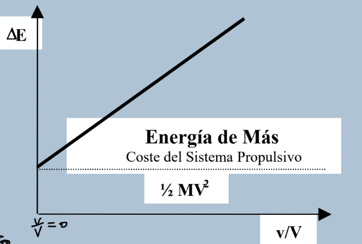

### Transformaciones energéticas

#### Sistema motopropulsor

- `MOTORES:` sistemas que producen energía mecánica a partir de un combustible.
- `PROPULSORES:` sistemas que generan una fuerza propulsiva a partir de energía mecánica.
- `MOTORES A REACCIÓN O MOTOPROPULSORES:` sistemas que generan una fuerza propulsiva a partir de un combustible.

#### Definición de rendimientos (conceptuales, en potencia)

- `Rendimiento motor:` Energía mecánica producida/ Energía del combustible.

$$
\eta_{M} = \frac{\left(\dot{M}V^2+\dot{m}v^2\right)}{2cL}
\quad c=\frac{Kg}{s}\quad  L=\frac{J}{Kg}
$$

Se emplea las expresiones de potencia cinética $\frac{1}{2} \dot{m} v^{2}$ para evitar el $\Delta t$ que aparecería empleando las energías cinéticas: $\frac{\left(MV^2+mv^2\right)}{2cL\Delta t}$

- `Rendimiento propulsivo:` Energía útil para propulsión / Energía Mecánica

$$
\eta_p=\frac{EV_0}{\left[\frac{\left(\dot{M}V^2+\dot{m}v^2\right)}{2}\right]}\approx0.25
$$

- `Rendimiento Motopropulsivo:` Energía útil para propulsión/ Energía del combustible

$$
\frac{EV_0}{\ cL}=\eta_M\eta_P
$$

### Clasificación de los motores de reacción

- `Autónomos:` Llevan consigo el segundo cuerpo. Son aquellos que no necesitan de ningún medio exterior para propulsarse, con lo cual parte de su masa es eyectada en sentido contrario al de su movimiento. Estos sistemas son los “Motores Cohete”.
- `No autónomos:` Aquellos que utilizan masas exteriores para propulsarse. Utilizan el medio ambiente (tierra, agua, aire...). Si este medio es el aire atmosférico se denominan “Aerorreactores”.

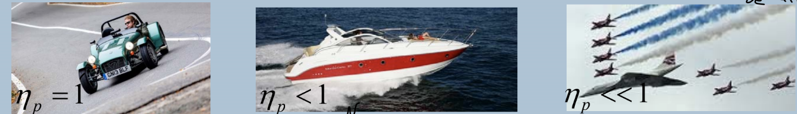

- Coche `$\eta_P = 1$`: hay contacto físico entre la rueda y el asfalto. La tierra es compacta, es decir, si queremos mover el suelo nos obligará a mover toda la tierra. En términos prácticos se dice que se apoya sobre una masa infinita que no se moverá por lo que el rendimiento propulsivo será 1

- Barco `$\eta_P <1$`: se apoya en el agua, no se mueve todo el fluido con el movimiento de la hélice por lo que el rendimiento propulsivo será menor que 1.

- Avión `$\eta_P  <<1$`: no se mueve todo el aire. Como la densidad  que es capaz de captar es menor: $\frac{\eta_{liq}}{\eta_{gas}}\approx1000$, la masa que traga el avión para el mismo volumen es 1000 veces menor:

<eq>
$$
\left\{\begin{matrix}barco:\ vel.\ chorro\ \approx1\ \frac{m}{s}\\avión:\ vel.\ chorro\ \approx1000\ \frac{m}{s}\end{matrix}\right\}
$$
</eq>

En un coche el propulsor es la rueda y el motor alternativo, en un avión a chorro es imposible distinguir el motor del propulsor, siendo el aerorreactor un sistema motopropulsor.

> El empuje se consigue con el propulsor, la potencia con el motor

La potencia interna puede ser grandísima y el empuje del motor pésimo, o viceversa esa potencia de dentro puede ser pequeña pero el empuje grandísimo. En un aerorreactor solo se puede medir el empuje. Solo podemos decir que un motor derivado (turbina de gas) la potencia sería x. Sin embargo, hay que ponerle otra turbina que saque potencia al exterior y no empuje (o menos empuje) sacándolo al exterior con un eje. Los empujes necesarios son pequeños las potencias son enormes.

¿De donde vinienen las fuerzas?:

El aire que es un fluido, las fuerzas que el fluido ejerce sobre las paredes son de presión y fricción (Fuerzas fluidodinámicas). La más importante es la de presión

### Empuje

#### Evaluación del empuje

1. Dado un cilindro cerrado y fuera un ambiente a $P_{amb}$. No existe empuje.

2. Si abrimos un lado, se descargará fluido hasta que la presión se iguale (potencial). Mientras la presión interior sea mayor, el empuje será: $E=A_i (P-P_{amb})$.

3. Para un funcionamiento indefinido, es necesario ir llenando el gasto de aire que va saliendo. La P interior entonces permanecerá cte y mayor a $P_{amb}$

La presión conlleva una fuerza, donde hay cambios de presión hay cambios en la cantidad de movimiento. De forma que fijándolos en la cantidad de movimiento de los fluidos que salen, el empuje debido a las presiones se puede cuantificar o calcular viendo únicamente el flujo de aire o cantidad de movimiento si la presión a la salida es la presión ambiente (adaptada).

> El empuje sobre el cilindro se puede evaluar tanto por resultantes de presión (no suele ser fácil) como a través de cantidades de movimiento del aire que escapa:

> $$
  E=GV_s=A_{s}(p_{0}-p_{\infty}) \quad \textrm{adaptada}
> $$

Aunque la condición de contorno teniendo una "descarga de un depósito" es que la presión de salida debe ser igual a la ambiente, no siempre se consigue. Por ejemplo en movimiento supersónico existen discontinuidades que lo impiden. En estos casos, el empuje no solo lo dará la cantidad de movimiento del aire a la salida sino el desequilibrio de las fuerzas de presión entre la salida y la entrada. Es decir, el término $A_S (P_s - P_{amb})$ se debe al área de salida y este desequilibrio de presiones.

De forma general, el empuje será:

> $$
  E=G V_{S}+A_{S}\left(P_{S}-P_{amb}\right)
> $$

#### Cohetes

El empuje está determinado por la cantidad de movimiento a la salida e independiente del flujo de cantidad de movimiento a la entrada, es decir, es `independiente de la velocidad de vuelo`. En consecuencia, un motor cohete puede alcanzar una velocidad mayor que la de salida. Otra cosa es un aerorreactor

- El sistema anterior presentado sería equivalente a la propulsión de los cohetes que fueron los primeros en utilizar la propulsión debido a un chorro.
- Se puede apreciar que, para un flujo de cantidad de movimiento de salida dado, $GV_s$, el empuje es independiente de la distribuciones de presiones internas, de las geometrías internas, y de la presión ambiente (en el caso adaptado).
- Si el cohete se moviera de forma estacionaria con una velocidad, un observador viajando con el cohete y midiendo la velocidad de salida relativa al cohete, obtendría el mismo empuje $E=GV_s$  independientemente de la velocidad de vuelo.
- Por consiguiente, con la propulsión por chorro, un vehículo puede propulsarse a velocidades mayores que la velocidad de salida del chorro.

#### Generación de empuje

Si el sistema adquiere aire con el `efecto dinámico de la velocidad de vuelo`, es decir, si el sistema en lugar de ser como un motor cohete lo que entra como oxidante es aire del exterior desde la entrada entonces existe una velocidad de vuelo y el empuje adaptado será:

> $$
  E = G(V_{s} - V_{0})
> $$

De forma que para tener empuje, la `velocidad de salida debe ser mayor que la velocidad de vuelo`. No podemos tener velocidades de vuelo mayores que la velocidad de salida. Cosa que en un motor cohete sí puede. La cantidad de movimiento tiene la dirección de la velocidad. Las fuerzas realizadas son incrementos en cantidad de movimiento, por ello hay que restar la cantidad de movimiento en la entrada. La ventaja es que la velocidad de vuelo se encarga de llenar de aire el aerorreactor

El `empuje nace como reacción` al aumento de la cantidad de movimiento que se produce en el fluido que atraviesa el motor.

Las paredes internas del sistema aerorreactor, en contacto con el fluido, producen `fuerzas fluidodinámicas` (de presión y fricción) sobre el mismo, que inducen un cambio en su cantidad de movimiento.

Como consecuencia de ello, el fluido, a su vez, produce las mismas fuerzas, pero en sentido contrario, sobre las paredes mojadas.

Un ejemplo de generación de empuje debido a fuerzas fluidodinámicas (presión y fricción) es el producido en un globo lleno de aire (a presión mayor que la atmosférica) cuando éste se deja escapar a través de un orificio. En este caso, cuando el tiempo transcurre el aire va saliendo y la presión interior en el globo va disminuyendo hasta que la presión interior se iguala a la atmosférica y el aire deja de salir (no se produce ningún cambio en su cantidad de movimiento), y por tanto, el empuje deja de existir. Se podría tener una configuración estacionaria (permanente en el tiempo) si se fuera llenando el globo de aire a la misma velocidad con que éste sale.

1. Pinchado de un globo: se produce empuje hasta que $p=p_{amb}$

2. Llenado de un globo con un compresor: produce una presión dentro mayor que la exterior por lo que se genera empuje. La presión dentro es mayor debido al compresor y la velocidad de vuelo, `la vel. de vuelo se convierte en presión`. El empuje obtenido es pequeño, ya que la energía suministrada es pequeña. La $V_s = \sqrt{\frac{2\gamma}{\gamma-1} R T_{t} (1-\frac{P_0}{P_t})^{\frac{\gamma-1}{\gamma}}}$ de un sistema lleno a una P y T dada ve que hay un desequilibrio de presiones, este es conocido como `exergía`. Este desequilibrio puede ser transformada a energía térmica o mecánica. La energía térmica viene cuantificada por la temperatura, dado que la energía mecánica lograda en la salida viene de la energía interna del fluido, `aumentar la temperatura del gas dentro consigue aumentar la velocidad de salida` y por tanto el empuje.

   > La **exergía** es una propiedad [termodinámica](https://es.wikipedia.org/wiki/Termodinámica) de una sustancia en un entorno que permite determinar el potencial de [trabajo](https://es.wikipedia.org/wiki/Trabajo_(física)) útil de una determinada cantidad de energía que se puede alcanzar por la interacción espontánea entre un sistema y su entorno. Informa de la utilidad potencial del sistema como fuente de trabajo. Es una propiedad termodinámica, por lo que es una magnitud cuya variación solo depende de los estados inicial y final del proceso y no de los detalles del mismo, pero sí depende de las condiciones del entorno (**presión y temperatura ambiente**) donde está inmersa la sustancia.
   >
   > **Definida de otra forma la exergía es la porción de la energía que puede ser transformada en trabajo mecánico.**

3. Por ello, se introduce calor al fluido con una `cámara de combustión`. Este aumentará la exergía (`P=cte`), ya que aumenta la `energía interna` que se convertirá en energía del chorro más elevada y por tanto en empuje.

4. El `compresor`, que transforma `energía mecánica` a energía en forma de `presión`) necesita una fuente de energía mecánica. Una forma es alimentar este con un motor, sin embargo, una mejor solución es el empleo de una `turbina` (extrae energía mecánica de la e. en forma de energía de presión). La turbina extrae parte de la energía del fluido para obtener e. mecánica que alimenta al compresor (da la potencia necesaria al compresor)

5. `Turborreactor (ciclo Bryton)` , un compresor movido por una turbina y una cámara de combustión que aumenta la energía interna del fluido. El compresor y la velocidad de vuelo definen la entrada y salida (el flujo del fluido)

   - `Sistema abierto`, `combustión a P cte, funcionamiento continuo`

   - `Fuerzas introducidas` (`forward, backward`): El efecto de paso del fluido por el compresor (efecto sobre las paredes que ejerce el fluido) va en dirección del empuje, lo mismo por la cámara de combustión. Por el contrario, el efecto de la turbina y la tobera va en dirección contraria al empuje.

     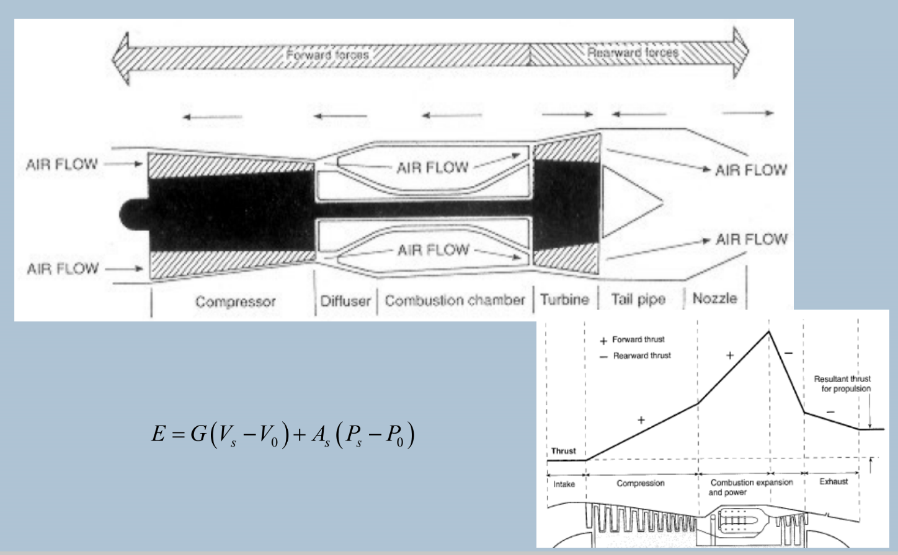

   - La misión de `llenado` , en un turborreactor, la realizada el `compresor`, mediante una aportación exterior de potencia mecánica.
   - El empuje que se obtiene de esta forma es pequeño ya que la potencia exterior aportada también es pequeña.
   - Una forma de aportar mucha potencia al sistema es mediante una combustión interna. Esa es la finalidad de la cámara de combustión de los aerorreactores.
   - Por último, como la potencia desarrollada en la combustión es muy grande, se instala una turbina, que invierte parte de la potencia interna para mover el compresor, así `se acoplan turbina compresor` a través de un eje y no se necesita aporte exterior alguno de potencia mecánica.

### Aerorreactores

> `AERORREACTORES`: `motores de reacción` (motopropulsores) `no autónomos` que utilizan el aire para propulsarse.

Los aerorreactores toman el aire exterior y después de suministrarle energía lo eyectan otra vez al exterior a más velocidad con que lo han tomado produciendo un aumento de la cantidad de movimiento del aire

El `EMPUJE` (fuerza que le hace moverse) se obtiene como reacción al aumento de la cantidad de movimiento que experimenta el aire a través del aerorreactor.

El funcionamiento de estos sistemas está influenciado por las condiciones termodinámicas (presión y temperatura) del aire que toman así como por la velocidad de vuelo.

`Los pioneros` en este tipo de propulsión fueron:

- Frank Whittle
- Hans von Ohain

#### Impacto en el transporte
La introducción de los aerorreactores en la propulsión aérea condujo a la revolución del trasporte aéreo

- Hizo posible el vuelo supersónico
- Redujo considerablemente el coste de los viajes aéreos (no hay elementos friccionantes si funcionales (rodamientos))
  - La reducción en el coste fue, parcialmente, debido al incremento de la velocidad de vuelo, y parcialmente a la construcción de aviones mucho más grandes.
  - El aerorreactor es capaz de proporciona mucho más empuje por peso y empuje por área frontal  (el motor no es un gran parásito) que su competidos el motor alternativo. También, probo tener un menor coste de mantenimiento.
  - El incremento de empuje por peso directamente conduce a una aumento de la carga de pago y del radio de acción.
  - El incremento del empuje por área frontal reduce la resistencia de la y conduce a góndola y hace posible tener motores con un gran empuje necesarios para propulsar a los modernos aviones de fuselaje ancho y gran radio de acción.
- Contribuyó de forma radical a la mejora de la seguridad de los aviones

#### Características del problema

En un aerorreactor, se consume una cantidad de combustible en la unidad de tiempo, c.

Entra una cantidad de aire en la unidad de tiempo, G, con una velocidad $V_0$.

Salen una cantidad de productos de combustión, G + c, con una velocidad de salida $V_s$.

- `Sistema de ejes`: los ejes son relativos al avión, ya que así el `flujo es estacionario`.
- `Empuje` = $(G + c) V_s – GV_0$
- `Potencia calorífica del combustible` = $cL$ (potencia térmica desarrollada)
- `Potencia mecánica` = $[(G + c)V_{s}^{2} – GV_{0}^{2}]/2$
- `Potencia útil del empuje` = $EV_0 = [(G + c)V_s ‐ GV_0]V_0$

- `Funcionamiento`:

- `CONSUME`: combustible, c, aire, G
- `PRODUCE`: empuje, E
- `Parámetros intensivos de interés`:
  - Impulso específico, $E/G$ (la capacidad de rapidez )
  - consumo específico, $c/E$. Imposibilidad de conseguir impulsos altos y consumos bajos, sí impulsos altos y consumo aceptable y viceversa según la necesidad

#### ¿Por qué se utilizan en aviación?

- `Características`:

  - La principal característica del transporte aéreo es la VELOCIDAD. Es el sistema de transporte más rápido.
  - El avión, al volar, está sometido a una resistencia aerodinámica que deben vencer los motores.

- `Dimensionado`:

  - Los motores se dimensionan para vencer esta resistencia. Para ver como incide en el diseño la velocidad de vuelo. Elijamos un avión típico y veamos, aproximadamente, cual es su resistencia en crucero, en función de la velocidad de vuelo (entre 100 y 2000 km/h).

- `Comparación`:

  - Dimensionemos un motor alternativo con su hélice, y el aerorreactor necesario para poder volar a las diferentes velocidades de vuelo.

  - `PESOS`: veamos cuanto es el peso del motor y el aerorreactor en función de la velocidad de vuelo
    - Peso Planta Motora (MAL + hélice): $\propto V_{0}^{3}$
    - Peso Aerorreactor: $\propto V_{0}^{2}$
  - `POTENCIAS`: Desarrolla potencia, el peso lo desarrolla la potencia, la potencia a vencer debe ser como la potencia $V_0D \rightarrow V_0^3$
    $$
    \text{ Potencia Planta Motora } \propto \frac{R V_{0}}{\eta_{\text {propulsivo }}} \propto R V_{0} \propto V_{0}^{3}
    $$

    $$
    \text{ Potencia Aerorreactor } \propto \frac{R V_{0}}{\eta_{\text {propulsivo }}} \propto \frac{V_{0}^{3}}{\eta_{\text {propulsivo }}}
    $$

  - `Consumos` : Por último, calculemos cuanto sería el consumo de combustible del motor y el aerorreactor

    $$
    \text { Consumo Planta Motora } \propto \text { Potencia } \propto V_{0}^{3}
    $$

    $$
      \text { Consumo Aerorreactor } \propto V_{0}^{3} \times \frac{V_{s}}{V_{0}}\left[1-\left(\frac{V_{0}}{V_{s}}\right)^{2}\right]
    $$

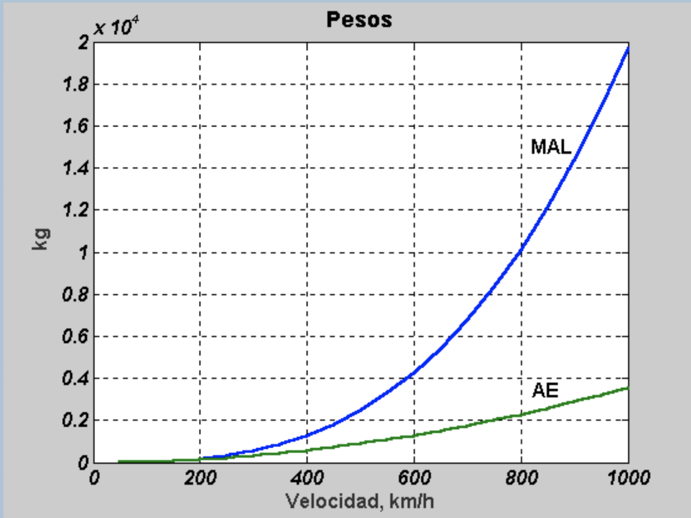 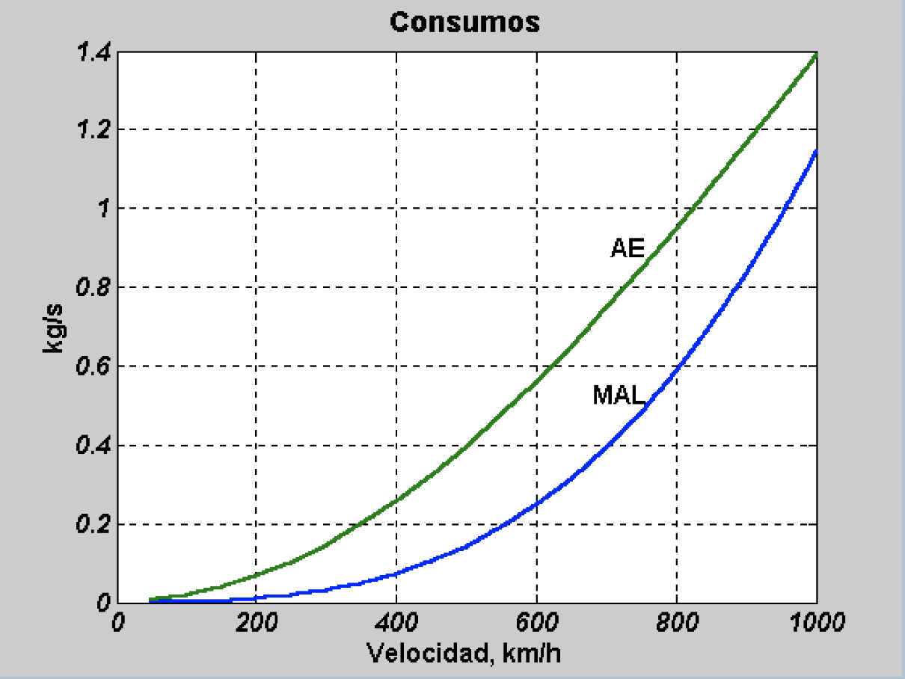

Mayor consumo pero mucho menos peso. La ventaja es que $\eta_{P}$ aumenta mucho cuando subimos $V_{0}$

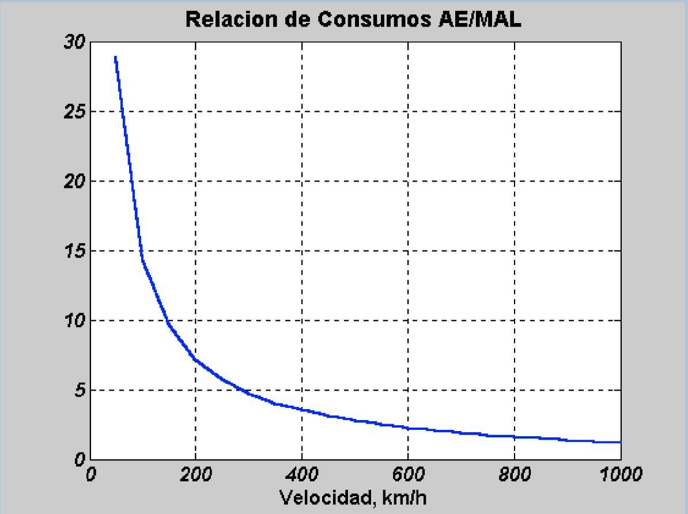

### Turborreactor de flujo único

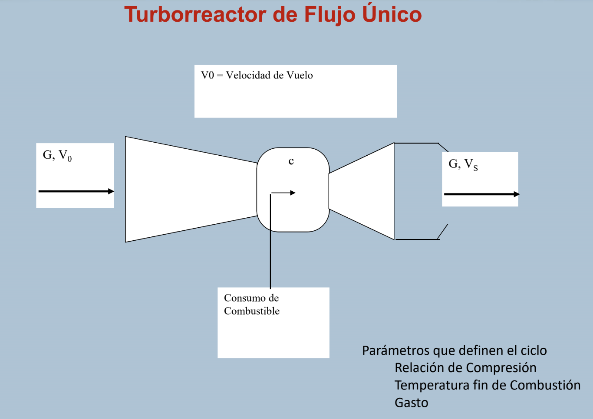

Como $c \ll G$, se suele simplificar a que $c+G$, el gasto que sale es el gasto que entra.

#### Hélices

- Para propulsión aérea, la ventaja de utilizar una hélice es que la mayoría de la masa a eyectar no hay que llevarla en el vehiculo. El flujo másico utilizado con las hélices puede ser 2 o 3 órdenes de magnitud mayor que el flujo másico de combustible utilizado (que es lo que hay que Ilevar).
- Al llevar menos masa eyectada (lo que se denomina propulsante en cohetes) se puede viajar a muchas más grandes distancias sin repostar.
- La segunda gran ventaja es que se consigue una `mayor eficiencia propulsiva`.
- La misión de una hélice es acelerar el aire que la atraviesa desde una velocidad $V_0$, hasta una velocidad $V_s$, así que la sección frontal del tubo de corriente de entrada será mayor que el de salida

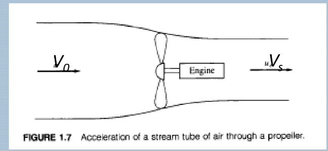

- La fuerza de tracción, T, que producirá será
$$
T=G\left(V_{S}-V_{0}\right)
$$
- donde G es el gasto másico de aire que atraviesa la hélice.
- La cantidad de energía mínima, Ė, que hay que añadir al aire para conseguir el estado de movimiento anterior será el aumento de la energía cinética. Si esa energía se obtiene de un motor, cuyo rendimiento térmico, es $\eta_M$ el consumo de energía mínimo valdrá
$$
W_{n}=\frac{G}{\eta_{M}}\left(\frac{V_{S}^{2}}{2}-\frac{V_{0}^{2}}{2}\right)
$$
- La tracción producida por unidad consumo energético es
$$
\frac{T}{W_{n}}=\frac{2 \eta_{M}}{V_{S}-V_{0}}
$$
- Un valor bueno para $\eta_{M}$ sería 2/5; $V_{S}$, como poco, tiene que ser $V_{0}$, así que el máximo valor de la tracción por unidad e consumo energético será

<eq>
$$
\left(\frac{T}{W_{n}}\right)_{\text {max,helice }} \approx \frac{\eta_{M}}{V_{0}}=\frac{2}{5 V_{0}}
$$
</eq>

$$
E_{M C}=G \cdot V_{s}
$$

#### Flujos Isentrópicos: Funciones Unidimensionales

`Movimiento unidimensional`, suponemos despreciable la variación de velocidad radial

<eq>
$$
\left\{\begin{array}{l}\frac{T_{t}}{T_{s}}=1+\frac{\gamma-1}{2} M^{2} \\\frac{P_{t}}{P_{s}}=\left(1+\frac{\gamma-1}{2} M^{2}\right)^{\frac{\gamma}{\gamma-1}} \\\frac{V}{\sqrt{R T_{t}}}=\sqrt{\gamma} M\left(1+\frac{\gamma-1}{2} M^{2}\right)^{-\frac{1}{2}} \\\frac{G \sqrt{R T_{t}}}{A P_{t}}=\sqrt{\gamma} M\left(1+\frac{\gamma-1}{2} M^{2}\right)^{-\frac{\gamma+1}{2(\gamma-1)}} \\\frac{G V+P_{s} A}{P_{t} A}=\left(1+\gamma M^{2}\right)\left(1+\frac{\gamma-1}{2} M^{2}\right)^{-\frac{\gamma}{\gamma-1}} \\\frac{F}{F_{c r}}=\frac{G V+P_{s} A}{G \sqrt{R T_{t}}}=\frac{1+\gamma M^{2}}{\sqrt{\gamma} M}\left(1+\frac{\gamma-1}{2} M^{2}\right)^{-\frac{1}{2}} \\\frac{A}{A^{*}}=\frac{\Gamma(\gamma)}{\sqrt{\gamma} M}\left(1+\frac{\gamma-1}{2} M^{2}\right)^{\frac{\gamma+1}{2(\gamma-1)}}\end{array}\right.
$$
</eq>

$T_t = cte \quad P_t = cte$

 

- Parámetro de gasto máximo $\approx 0.68$

#### Ciclo Termodinámico de los Aerorreactores

En los motores, la energía mecánica se obtiene principalmente de la `energía interna de los combustibles`, mediante un proceso de combustión. En este proceso se produce calor, que después se transforma en energía mecánica.

Esta `transformación` se realiza por medio de un `ciclo termodinámico`, en el cual una sustancia evoluciona, interaccionando con el exterior, absorbiendo y liberando calor y trabajo, según los principios de la termodinámica.

Entre los ciclos más utilizados y conocidos se encuentran los utilizados por los motores, tanto diesel, como los de gasolina (ciclo Otto) que se utilizan en vehículos, barcos y aviones.

Otro de los motores existentes es la `“TURBINA DE GAS”`. Este sistema utiliza el `ciclo termodinámico Brayton`. En él, un gas (aire) se comprime en un compresor, se mezcla con el combustible y se quema en una cámara de combustión, formándose productos de combustión que se expansionan en una turbina, y salen al exterior a través de una tobera de salida.

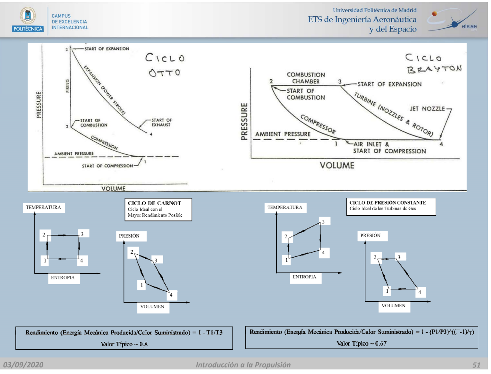

La expansión da trabajo y la compresión absorbe trabajo

El ciclo es reversible si es de Carnot, el ciclo ideal Brayton no es reversible. El ciclo ideal de Bryton tiene un rendimiento de 0.67 frente al 0.8 del ciclo de Carnot.

- Dos son las propiedades termodinámicas que definen el estado del gas que evoluciona según un ciclo termodinámico: `Presión y Temperatura`.

- Para poder proporcionar trabajo al exterior hay que aumentar la presión y la temperatura del gas, durante su evolución, `así el ciclo queda definido por la presión máxima y la temperatura máxima alcanzada`.

- En los ciclos tendremos una fase de compresión, otra de combustión y otra de expansión.

- En las turbinas de gas estas fases se realizan en distintos lugares al mismo tiempo, mientras que en los motores de gasolina y diésel se realizan en el mismo sitio pero en tiempos diferentes, de ahí que las turbinas de gas son motores de combustión continua, mientras que los diésel o gasolina son de combustión alternativa. Esto también da lugar a que en unos el ciclo sea abierto (combustión a presión constante) y en otros sea cerrado (combustión a volumen constante).

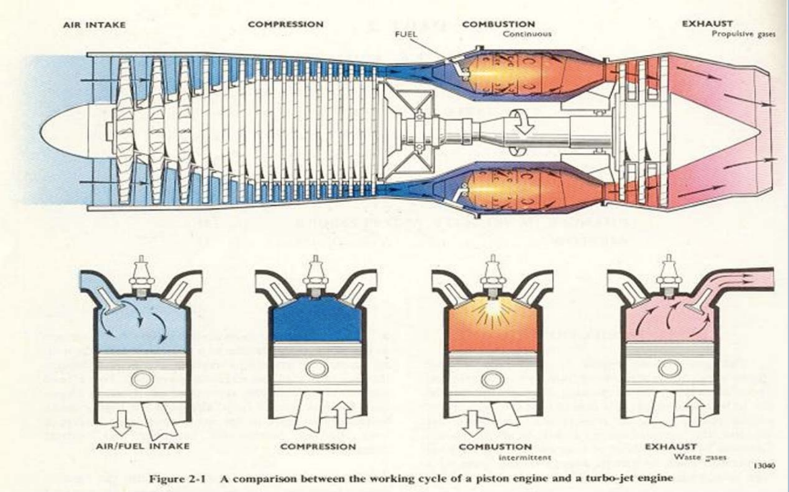 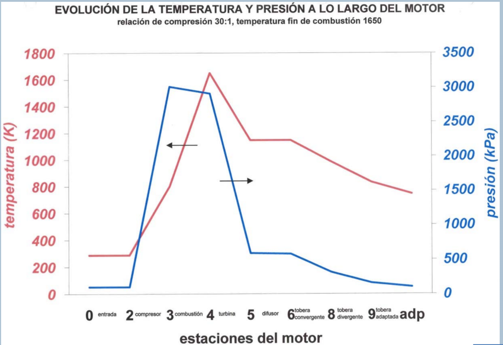

Para obtener las `variables extensivas` es necesario una dimensión, normalmente `se da con el gasto G`, además de `$T_0$, $V_0$, $P_0$ así como $\Pi_c, T_{4t}$`

`Interesa una relación de compresión más alta`, ya que es fácil comprobar que el comportamiento motor de los ciclos Otto; Diésel y Brayton es mejor cuanto mayor sea la temperatura al final del proceso de combustión.

Con los combustibles actuales, derivados del petróleo, las temperaturas máximas que se pueden obtener se corresponden con las obtenidas con `mezclas estequiométricas` `(f = 0,06)` $f=c/G$ y están alrededor de los `2400 K`. La $T_c$ crece hasta la estequiométrica, a partir de la estequiométrica baja. Las mezclas ricas no tienen ningún sentido excepto para cosas puntuales y en principio las pobres tampoco.

Los sistemas de funcionamiento alternativo pueden funcionar con temperaturas prácticamente estequiométricas. $\sim 2500K$. Los alternativos ven esta temperatura durante una fracción del ciclo, mientras que en un aerorreactor la turbina ve continuamente la temperatura de combustión, no hay material que lo aguante. `Limitante tecnológico` $(T_{4t})$.

Los sistemas de funcionamiento continuo, como los aerorreactores, `no pueden funcionar con esas temperaturas`. Para obtener temperaturas fin de combustión más bajas, se producen una combustión en exceso de aire, (`combustión diluida`) respecto a las relaciones estequiméricas `(f <≈ 0,3)`

Para conseguir ese tipo de combustión las cámaras de combustión de los aerorreactores disponen de un `“tubo de llama”` que permite realizar la combustión de forma estequiométrica, para que sea estable, y después refrigerarla con aire que no ha participado en la combustión.

Para obtener las temperaturas fin de combustión más altas posibles, se establecen `mecanismos de refrigeración de los álabes de turbina`, con aire sangrado de los compresores, extraordinariamente complejos.

 

$\sim 10º/año$. Actualmente 1800-1900 K

No todo el aire se quema, se forman relaciones estequiométricas con una fracción del aire e inyección de combustible, el resto de aire se va inyectando para refrigerar el flujo. La temperatura fin de combustión es la temperatura de entrada a la turbina. También se debe tener en cuenta las emisiones, perder algo de estabilidad a favor de una reducción de óxidos de nitrógeno por ejemplo.

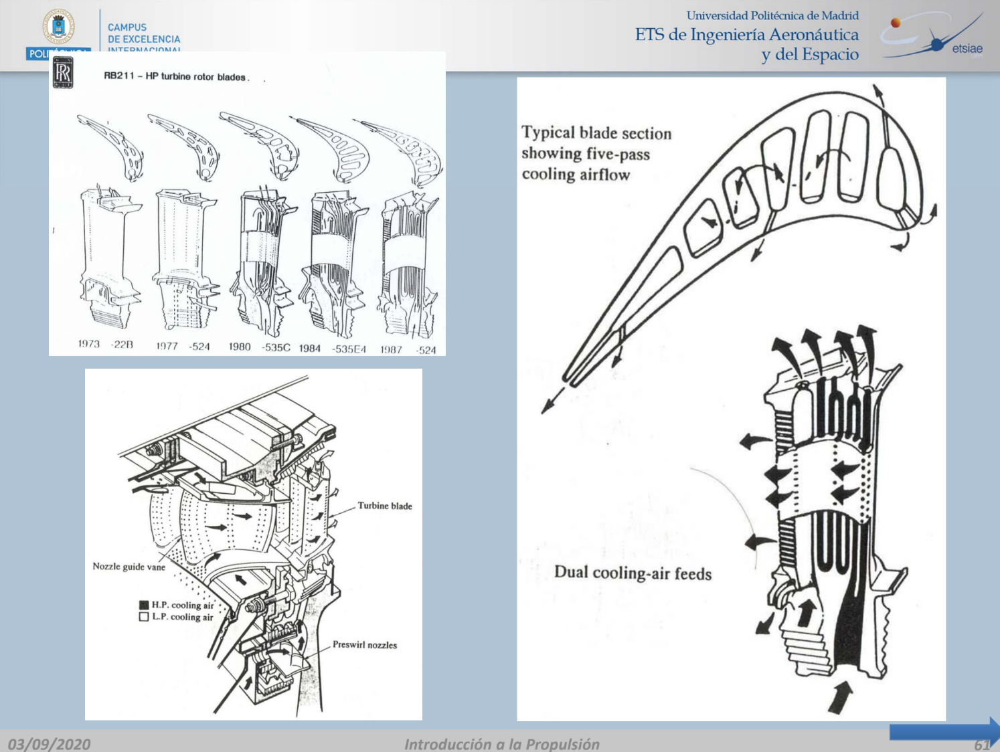

- `Técnicas muy sofisticadas de refrigeración en los álabes de turbina`. Los daños térmicos pueden ser muy graves.

- Las superaleaciones son propiedad de los fabricantes de motores.

#### Relaciones entre Rendimiento Térmico, $η_{M}$, Rendimiento de Propulsión, $η_{P}$, y Consumo Específico, $C_{E}$

Se va a ilustrar las relaciones entre estos rendimientos y el consumo específico de combustible en un turborreactor de flujo único. Considérense las velocidades relativas a un turborreactor dadas en la Fig.

- El consumo de combustible es c.

- La potencia calorífica añadida al aire es cL, donde L es el poder calorífico del combustible.

- La potencia mecánica añadida al gasto de aire, G, se invierte en aumentar su velocidad, desde la velocidad de vuelo, $V_0$, hasta la velocidad de salida, $V_s$.

- Por consiguiente, la potencia mecánica que se está suministrando al aire
  es: $\frac{1}{2}GV_s^2-\frac{1}{2}GV_0^2$

- En estos términos el $η_{M}$, se expresa como

> $$
  \eta_{M}=\frac{\text { Potencia Mecanica Neta (obtenida) }}{\text { Potencia Calorifica del Combustible (suministrada) }}=\frac{\frac{1}{2} G V_{s}^{2}-\frac{1}{2} G V_{0}^{2}}{c L} = \frac{\frac{1}{2} V_{s}^{2}-\frac{1}{2} V_{0}^{2}}{f L}
> $$

- Para tener valores aceptables del $η_M$ es necesario que la temperatura sea alta

- Ahora habría que considerar cuanta de la Energía Mecánica aparece en forma de potencia útil para propulsar el avión.

- El empuje neto es el Δ de la cantidad de movimiento; esto es

> $$
  E_{n}=G\left(V_{s}-V_{0}\right)
> $$

- La potencia útil para volar, $W_{u}$, es el E por la $V_{0}$

> $$
  W_{u}=G\left(V_{s}-V_{0}\right) V_{0}
> $$

- El rendimiento de la propulsión, $η_P$, es la relación entre la $W_u$ desarrollada para la propulsión y la potencia mecánica neta obtenida del sistema. Por definición se supone adaptado.

> $$
  \eta_{P}=\frac{\text { Potencia Util Para Volar }}{\text { Potencia Mecanica Neta (obtenida) }}=\frac{G\left(V_{s}-V_{0}\right) V_{0}}{\frac{1}{2} G V_{s}^{2}-\frac{1}{2} G V_{0}^{2}}=\frac{2}{1+V_{s} / V_{0}}=\frac{2}{2+E_{n} /\left(G V_{0}\right)}
> $$

- Es función únicamente de la relación de velocidades $V_s/V_0$. ¿PROBLEMA?

- `Cualquier cosa que aumente el empuje disminuye el rendimiento propulsor`, no podemos hacer motores buenos tanto desde el ponto de vista  tanto motor como propulsor. Sin embargo, `con altas velocidades de vuelo $V_0$ el motor es aceptable` (no M=0.8 sino supersónico).

> No comparar consumos específicos a distintas velocidades de vuelo.

- Las acciones de diseño encaminadas a subir el $η_M$, aumentarán la Vs. Por consiguiente disminuirán el $η_P$.

- Una característica importante de los motores es su $C_E$ definido como

> $$
\text { Consumo Especifico }=\frac{\text { Consumo de Combustible }}{\text { Empuje }}
  $$

- En la actualidad, esta característica se da en gramos de combustible gastado por kiloNewton de empuje y por segundo [g/(kNs)].

- Combinando las expresiones del $η_M$, $η_P$ y $C_E$ se llega

> $$
C_{E}=\frac{V_{0}}{\eta_{M} \eta_{P} L}
  $$

- ¿Cómo, desde el diseño, se puede disminuir el $C_E$, si cualquier acción de mejora sobre el $η_M$ (imprescindible), se convierte en una pérdida de $η_P$⁣?.

- De ninguna forma, en los turborreactores de flujo único.

- El rendimiento global o motopropulsivo, $η_{MP}$, es la inversa del $C_E$

> $$
  \eta_{M P}=\eta_{M} \eta_{P}=\frac{V_{0}}{C_{E} L}
> $$

- Por consiguiente, el `$C_E$ es una medida del rendimiento global del motor a una $V_{0}$ dada`. Sin embargo, la poderosa influencia de las altas velocidades de vuelo en la mejora del rendimiento global no se debe pasar por alto.

- Veamos el `efecto de la $V_0$ en los rendimientos`. De la expresión del $η_P$ se observa el rápido crecimiento de este, desde cero, con la V0 para una velocidad de salida dada.

  - El $η_M$ se puede considerar constante para temperatura a la entrada de la turbina y a la salida del compresor fijas; de esta forma la variación del $η_{MP}$ es la misma que la del $η_P$ (Ver Fig. en donde se ha supuesto que el rendimiento motor es el 47%).

  - Al mismo tiempo que el $η_{MP}$ está creciendo, el $C_E$ está aumentando (deteriorándose) con la $V_0$.

  - Para comparar motores el $C_E$ es un criterio muy útil, pero es evidente que todas las comparaciones se deben hacer a la misma $V_0$ y ésta debe ser cercana a la velocidad de crucero del avión considerado.

    

  - El rendimiento motor casi es cte con la velocidad de vuelo, pero a una cierta velocidad el motor no puede tragar aire y el rendimiento se hace 0. Para que el $\eta_P$ sea 0.8 hay que irse a velocidades supersónicas.

### Turbofanes (turborreactor de doble flujo)

Arregla el problema del rendimiento propulsivo a velocidades subsónicas

`Doble chorro propulsivo` : Flujo secundario (cold flow, temperatura de salida parecida a la ambiente) y flujo primario (hot flow, temperatura siempre superior a la ambiente).

- Unas turbinas mueven el compresor y otras se encargan de mover un flujo secundario (fan, compresor).

- En un turborreactor de flujo único cualquier mejora del rendimiento propulsivo es a costa del impulso específico, el cual es elevado

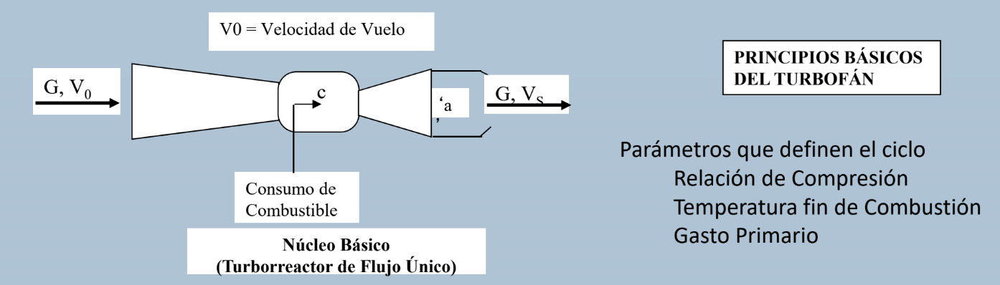 

El fan se convierte en el primer escalón de compresión del primario y el elemento principal que logra el chorro secundario.

El aire de la refrigeración proviene del primario debido a la alta presión necesaria.

Hay turbofanes trieje, en que la turbina esta dividida en 3, una para el compresor primario, otra para el fan y otra para la expansión

> Parámetro: $\Lambda=\frac{G_\sigma}{G_\pi}$: relación de gastos

El problema del flujo único es que los rendimientos motor y propulsor
  están ligados y no se puede aumentar uno sin disminuir el otro.

El turbofan es un sistema que crea dos chorros propulsivos, alimentados
  con la misma energía mecánica. La potencia mecánica que alimenta a ambos es la misma. A consumo cte se aumenta el empuje en el turborreactor de doble flujo.

> Flujo único:
  $$
  W_{\text {mecanica }}=\frac{1}{2} G\left(V_{s}^{2}-V_{0}^{2}\right)
  $$
  $$
  W_{util}=E V_{0}
> $$

> Flujo doble:
  $$
  W_{\text {mecanica }}=\frac{1}{2} G_{\pi}\left(V_{\pi}^{2}-V_{0}^{2}\right)+\frac{1}{2} G_{\sigma}\left(V_{\sigma}^{2}-V_{0}^{2}\right)
  $$
  $$
  W_{util}=E_{\pi} V_{0}+E_{\sigma} V_{0}
> $$

Si se dejan los generadores de gas iguales:

$$
G = G_{\pi} \quad W_{mecanica}=cte
$$

- Las velocidades de salida del doble flujo son más pequeñas que las del flujo único. Mejor rendimiento propulsivo a igual rendimiento motor.

- Para una cantidad de combustible dada, la potencia útil del doble flujo se
puede hacer bastante mayor que la del flujo único

- $C_E$ vs $\Lambda$

  - Ha ido aumentando con los años
  - Limitantes de la relación de derivación: Si el $\Lambda$ es grande el motor es grande

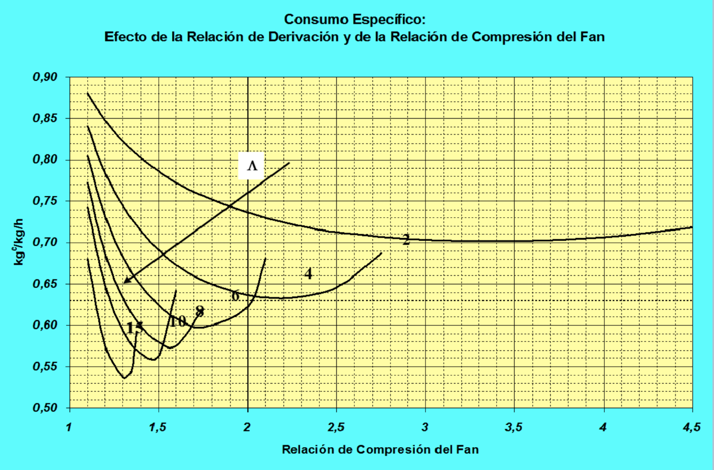

#### Clasificación de aerorreactores

Los aerorreactores sin mecanismo de compresión de aire no funcionan en el despegue

#### Rangos de utilización de vuelo

La necesidad de obtener mejores comportamientos a bajas velocidades(subsónicas) trajo la utilización de los aerorreactores: turbohélices y turbofanes.

Estos sustituyeron a los turborreactores para bajas velocidades de vuelo, pero el rango de utilización, sobretodo el de los turbofanes, aumenta de día en día.

1. `Subsónico bajo, $M<0.5$`,  mejor propulsor es la hélice (turbohélice)
    $$
    \begin{aligned}M_{0}<0,5 \rightarrow V_{s}-V_{0} \text { grande } \rightarrow & \eta_{M} \text { bueno } \\& \eta_{P} \text { muy malo }\end{aligned}
    $$

2. `Subsónico alto, $0,5<M_0<0.9$`,  (turbofan)

    $$
        \begin{aligned}0,5<M_{0}<0,9 \rightarrow V_{s}-V_{0} \text { grande } \rightarrow & \eta_{M} \text { bueno } \\& \eta_{p} \text { sigue siendo malo }\end{aligned}
    $$

   - Las hélices dejan de funcionar, las puntas ven velocidades supersónicas. El rendimiento propulsivo cae a 0

   - Existen hélices que pueden llegar a funcionar a M=0.8, pero los conceptos futuros buscan hélices que puedan funcionar a mayor velocidad (propfan)

    

    
Concepto Propfan

     
    

3. `Supersónico: $1,5<M_0<2.5$: $V_s -V_0$ no tan grande`. (turbofan bajo $\Lambda$)

    $$
    \begin{aligned}1,5<M_{0}<2,5 \rightarrow V_{s}-V_{0} \text { no tan grande } \rightarrow & \eta_{M} \text { bueno } \\& \eta_{p} \text { no tan malo }\end{aligned}
    $$

   - Turbofan con relación de derivación pequeña, ya que casi el turborreactor es el sistema ideal
   - $\pi_f$ grandes
   - Para incrementar el empuje se utiliza el postcombustor.

4. `Supersónico alto: $2,5<M_0<3,5$: $V_s -V_0$ pequeño` (turborreactor)

    $$
    \begin{array}{c}2,5<M_{0}<3,5 \rightarrow v_{s}-v_{o} \text { pequeño } \rightarrow \eta_{M} \text { bueno } \\\eta_{P} \text { bueno }\end{array}
    $$

   - Turborreactores de flujo único, ciclos con Relación de Compresión Bajas
   - Temperatura Fin de Combustión Altas
   - Para incrementar el empuje se utiliza el postcombustor

5. `Supersónico muy alto: $3,5<M_0<..$`: (estatorreactor)

    $$
    \begin{array}{c}3,5<M_{0}<-,-\rightarrow V_{s}-V_{0} \text { pequeño } \rightarrow \eta_{M} \text { bueno } \\\eta_{p} \text { bueno }\end{array}
    $$

   - Ciclos sin Sistema Compresor ‐ Turbina → estatorreactores

   - $π_f$ grandes

   - Temperatura Fin de Combustión Muy Altas

   - Estatorreactores de combustión subsónica (ramjet)

   - Estatorreactores de combustión supersónica (scramjet)

     

     $$
     \Lambda \rightarrow 0 \Rightarrow TB \rightarrow \pi_c \rightarrow 0
     $$

    > Conforme la relación de compresión baja el turborreactor soporta mayor velocidad de vuelo antes de no poder funcionar por el rendimiento motor. A velocidad de vuelo 0 no funciona, se necesita un compresor. Con estatorreactores se habla de hidrógeno no de hidrocarburos, evitando hacia el retardo de ignición.

## Tema 2: Estudio de las necesidades de propulsión de las aeronaves

### Valores típicos:

- Peso al despegue: 550 ton
- Peso de Combustible: 200 ton
- Fracción de Combustible Consumido: 0,3 (no es lo mismo un avión lleno que con una fracción del depósito)
- Altura de Crucero: 11000 m
- Velocidad de Crucero: 0,82 Mach

Tarea: dimensionar su motor

- `Vuelo equilibrado`:
- `Actuaciones del Motor`. En particular su `$T/Tsl = \alpha$` (función de condición de vuelo $M_0$,h). $\alpha$ es el comportamiento
- `Selección Aerod. / Estructural`: Carga Alar ~ 7 kPa. Como el peso va cambiando, la carga va cambiando, sin embargo se utiliza la carga alar en despegue por lo que es una cte.
- `Polar del avión`: `$C_{D} = K_{1} C_{L}^{2} + K_{2} C_{L} + C _{D_{0}}$`, (función de condición de vuelo $M_{0}$, h)

$$
K_1 = 0,056 \quad K_2 =-0,004 \quad C_{D_{0}}=0,014
$$

$$
C_{L,min} \sim 0,3 \quad C_{L,max} \sim 2
$$

$$
C_L \sim 0,5  \quad C_D \sim 0,025 \rightarrow L/D \sim 20
$$

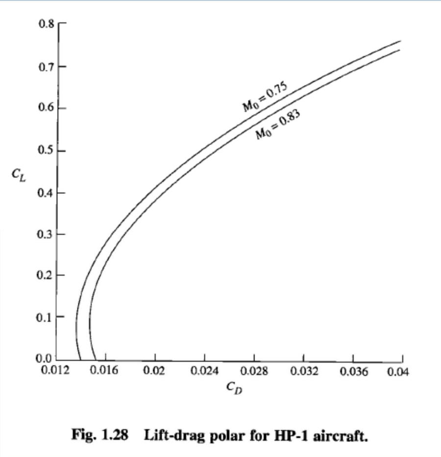 

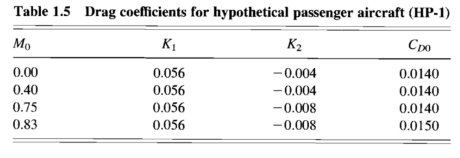

`El empuje disponible para el vuelo disminuye mucho con la altura`

### Análisis de restricciones

Una aeronave de masa M, en vuelo, con una velocidad horizontal V, está sometida a un sistema de fuerzas. Suponiendo que el vuelo se está realizando en el plano del papel, las fuerzas de dicho sistema serán:

> En un avión se habla de empuje instalado (T), mientras el fabricante de motores da el empuje no instalado, E.

- Sustentación, L ($L \gg D$)
- Peso, W
- Resistencia, D+R
- Empuje, T (instalado)
- D (resistencia de la polar parabólica)
- R (tren de aterrizaje, slats, lo que no incluye la polar parabólica)

> Leonardo da Vinci no aportó al desarrollo de la aviación, sino que el primero que establecio las bases y la forma de volar fue Sir George Cayley

- Ecuación de cantidad de movimiento proyectada sobre el “eje velocidad”

$$
T-(D+R)-W sen \gamma=M \frac{d V}{d t}=\frac{W}{g} \frac{d V}{d t}
$$

- Proyectada sobre el eje perpendicular

$$
L-W \cos \gamma=\frac{W}{g} a_{c} \quad \Rightarrow \quad L=W\left(\cos \gamma+\frac{a_{c}}{g}\right)=W(\cos \gamma+n)
$$

Si el vuelo no es rectilíneo y uniforme habrá un factor de carga.

- Se ha usado el `“factor de maniobra”`, n, que es la aceleración perpendicular a la velocidad referida a la aceleración de la gravedad.
- Multiplicando escalarmente por la velocidad, se tiene una ecuación en potencias

$$
T \cdot V-(D+R) \cdot V-W \cdot \operatorname{Vsen} \gamma=M \frac{d V}{d t} \cdot V=\frac{W}{g} \frac{d V}{d t} \cdot V=\frac{W}{g} \frac{d}{d t}\left(\frac{V^{2}}{2}\right)
$$

- Adimensionalizando con el peso y usando la `velocidad ascensional, dh/dt`

> $$
\frac{T-(D+R)}{W} \cdot V-\frac{d h}{d t}=\frac{1}{g} \frac{d}{d t}\left(\frac{V^{2}}{2}\right)
> $$

- $Vsen \gamma$: velocidad ascensional. Cambia la energía potencial por lo que debe haber un trabajo

Lo que interesa es el cambio de energía

- Finalmente, definiendo el `nivel de energía, $z_e$`, como

> Nivel de energía mecánica
> $$
  z_{e}=\left(h+\frac{V^{2}}{2 g}\right)
> $$

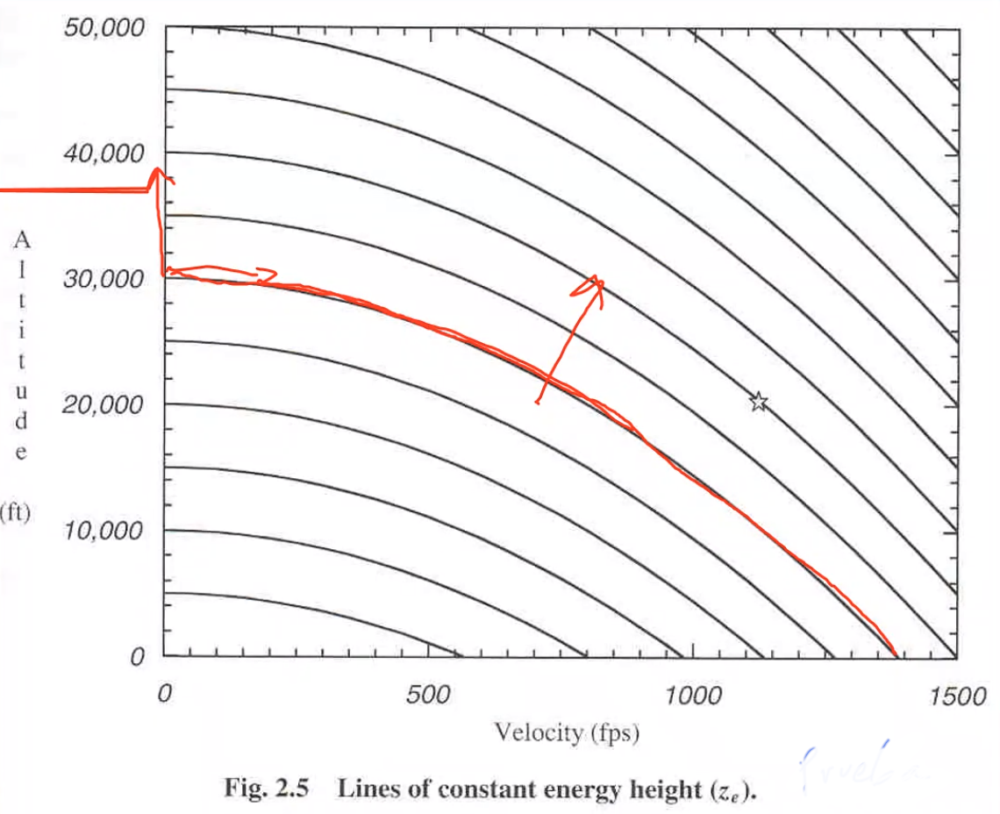

- $T>D$: aumentaré el nivel de vuelo.
- $T=D$: para moverme por la línea de energía constante.
- Se obtiene

> $$
  \frac{T-(D+R)}{W}=\frac{1}{V} \frac{d}{d t}\left(h+\frac{V^{2}}{2 g}\right)=\frac{1}{V} \frac{d z_{e}}{d t}
> $$

Volar requiere levantar el peso no solo vencer la resistencia, puede haber condiciones de vuelo en que el empuje máximo no pueda compensar la resistencia.

D depende de la condición de vuelo.

- `La derivada temporal del nivel de energía representa el exceso en potencia
específica por unidad de peso, $P_s$`,

> $$
  \begin{aligned}P_{s}=\frac{d z_{e}}{d t}=\frac{d}{d t}\left(h+\frac{V^{2}}{2 g}\right) &=0 \Rightarrow \text { vuelo equilibrado } \\& \neq 0 \Rightarrow \text { vuelo no equilibrado }\end{aligned}
> $$

Vuelo no equilibrado: $T>D$  o $T<D$

- Para `vuelo equilibrado` y resistencia de polar parabólica, el empuje/peso
necesario será la inversa de la eficiencia aerodinámica, L/D.

$$
\frac{T}{W}=\frac{1}{L / D}
$$

> Importancia de la eficiencia aerodinámica
> - L/D civil: $\sim 20$
> - L/D planeador: $\sim 40$

- Eficiencia aerodinámica de un avión de transporte subsónico.

	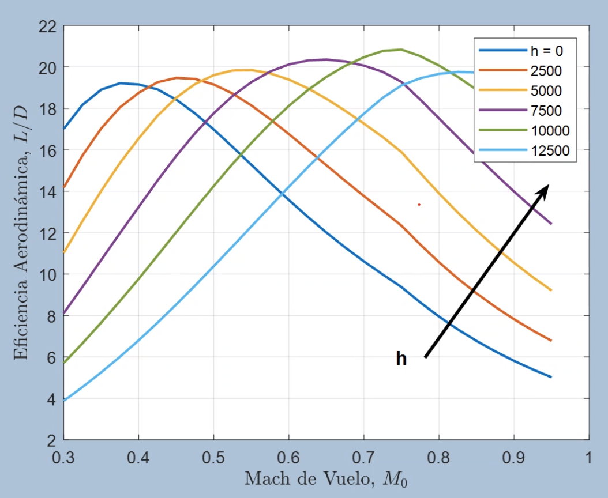

	Hay un mínimo en la polar parabólico que implica una eficiencia aerodinámica máxima. `Para una altura habrá una velocidad de vuelo óptima. Velocidad alta a mayores alturas y velocidad más baja a alturas menores`.

- Eficiencia aerodinámica de un avión militar (avión supersónico en subsónico)

	

- Empuje/Peso necesario. Avión de transporte subsónico.

  

  `El empuje/peso necesario mínimo ocurre para eficiencia máxima. Se observa que se mantiene constante en 0,05 para las distintas alturas de vuelo.`

- `$T/W \sim 0.05 = 1/E$`

- Empuje/Peso necesario. Avión militar.

	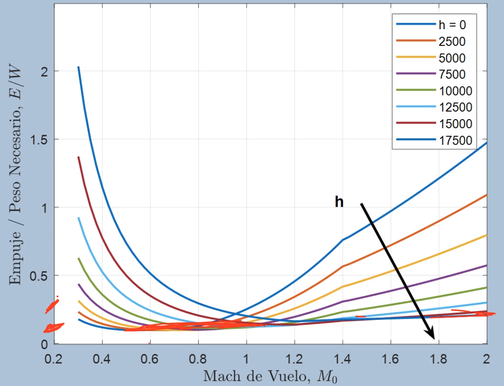

### E/W requerido mínimo

- Empuje/Peso, E/W, requerido mínimo. `A elevadas alturas el empuje/peso es menor si se vuela a velocidades elevadas. La eficiencia óptima ocurre a velocidades elevadas.`

- Utilizando la polar parabólica, la `eficiencia aerodinámica` es

$$
\frac{L}{D}=\frac{q S C_{L}}{q S C_{D}}=\frac{C_{L}}{K_{1} C_{L}^{2}+K_{2} C_{L}+C_{D 0}}
$$

- Es fácil obtener el valor de $C_{L,opt}$ que maximiza la eficiencia aerodinámica

> $$
  C_{L, opt}=\sqrt{\frac{C_{D 0}}{K_{1}}}
> $$

- El valor óptimo del $C_{L,opt}$, es independiente de dichas condiciones de vuelo, al ser independientes de dichas condiciones los coeficientes de la polar.
- El valor de la `eficiencia aerodinámica máxima` es:

<eq>
$$
\left(\frac{L}{D}\right)_{max}=\frac{1}{2 \sqrt{K_{1} C_{D0}} + K_{2}}
$$
</eq>

- Y el valor del empuje/peso requerido mínimo será su inversa

<eq>
$$
\left(\frac{T}{W}\right)_{\mathrm{req}, \min }=2 \sqrt{K_{1} C_{D 0}}+K_2
$$
</eq>

- Para `vuelo no equilibrado`, el E/W requerido es

> $$
  \frac{T}{W}=\frac{D+R}{W}+\frac{1}{V} \frac{d}{d t}\left(h+\frac{V^{2}}{2 g}\right)
> $$

El cambio es despreciable en otro tipo de vehículos, no así en el avión.

> Para comparar se refiere al empuje y peso en despegue.

- En las ecuaciones anteriores los `valores` de las variables son los `instantáneos`. `Referidos` a sus valores en `despegue`

> $$
  T=\boldsymbol{\alpha} T_{s l} \quad, \quad W=\boldsymbol{\beta} W_{t o}
> $$

- $T_{sl}$ es el empuje máximo.

- Sustituyendo

> $$
  \frac{T_{s l}}{W_{t o}}=\frac{\beta}{\alpha}\left[\frac{D+R}{\beta W_{t o}}+\frac{1}{V} \frac{d}{d t}\left(h+\frac{V^{2}}{2 g}\right)\right]
> $$

- Como se observa el empuje se invierte en vencer las resistencias (parte disipativa) y en producir un aumento de energía mecánica.
- Cuanto mayor es el empuje menor es el tiempo para cambiar el nivel de energía, $z_e$; o sea, el sistema podrá tener mayores “aceleraciones”.
- Utilizando las relaciones aerodinámicas para la sustentación y la resistencia

> La carga alar, $W_{to}/S$, en un avión militar es bastante más baja, tiene más ala en relación al peso del vehículo. En diseño de un avión civil es 7 y en avión militar es 3,5.

<eq>
$$
  \begin{array}{l}L=n W=qSC_{L} \quad \Rightarrow \quad C_{L}=\frac{nW}{q S}=\frac{n \beta}{q}\left(\frac{W_{to}}{S}\right) \\ D=qS C_{D}\end{array}
$$
</eq>

- “n” es el factor de carga, “q” es la presión dinámica, $C_L$ y $C_D$ son los coeficientes de sustentación y de resistencia respectivamente, y S es la superficie alar. El $C_L$  debe ser constante por lo que se cambia la  $\beta$ y q
- En términos de la polar del avión

> $$
  C_{D}=K_{1} C_{L}^{2}+K_{2} C_{L}+C_{D 0}
> $$

- La resistencia se puede poner de la forma

> $$
  D=q S\left[K_{1}\left(\frac{n \beta}{q} \frac{W_{T O}}{S}\right)^{2}+K_{2}\left(\frac{n \beta}{q} \frac{W_{T O}}{S}\right)+C_{D 0}\right]
> $$

- De los coeficientes de la polar, los términos más importante son $K_1$ y $C_{D0}$. $K_2$ es muy pequeño y normalmente nulo en los aviones militares.
- Usando la expresión de la resistencia, en la ecuación energética, se puede
calcular el empuje necesario para realizar un segmento de vuelo

<eq>
$$
  \begin{aligned}\frac{T_{s l}}{W_{t o}} &=\frac{\beta}{\alpha}\left\{\frac{q S}{\beta W_{t o}}\left[K_{1}\left(\frac{n \beta}{q} \frac{W_{t o}}{S}\right)^{2}+K_{2}\left(\frac{n \beta}{q} \frac{W_{t o}}{S}\right)+C_{D 0}+\frac{R}{q S}\right]+\frac{1}{V} \frac{d}{d t}\left(h+\frac{V^{2}}{2 g}\right)\right\} \\&=\frac{\beta}{\alpha}\left\{\left[K_{1} n^{2} \frac{\beta}{q} \frac{W_{t o}}{S}+K_{2} n+C_{D 0} \frac{q S}{\beta W_{t o}}+\frac{R}{\beta W_{t o}}\right]+\frac{1}{V} \frac{d}{d t}\left(h+\frac{V^{2}}{2 g}\right)\right\}\end{aligned}
$$
</eq>

- Para ver las necesidades de empuje es fundamental el papel de q, ya que su variación con las condiciones de vuelo es grande. Si baja q, alturas mayores, habrá que compensar con mayor $C_L$.

- En despegue de 0 a 6 kPa.

- En crucero subsónico algo por encima de 10 kPa.

- En supersónico alrededor de 70 y más

	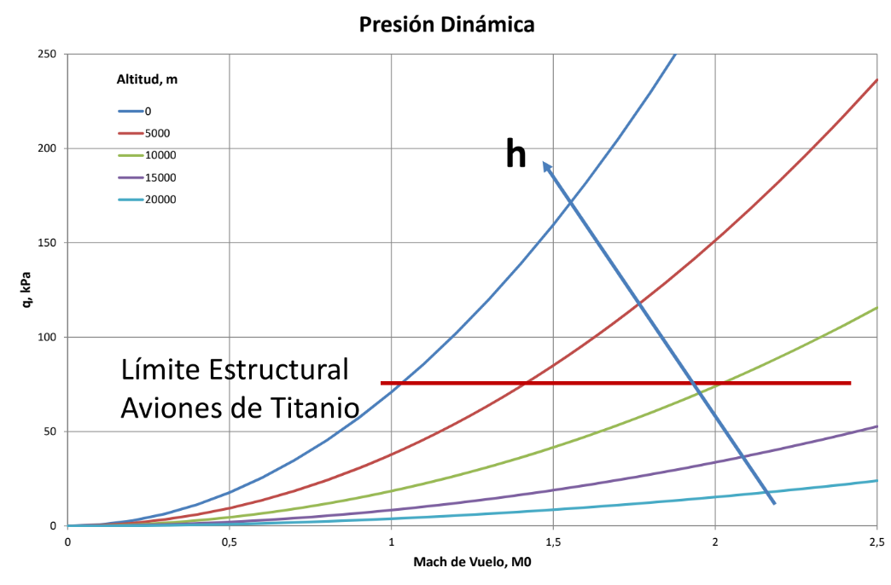

- En condiciones de `baja presión dinámica q`, como el `despegue`, el término dominante de la polar parabólica es el primero

<eq>
$$
  \frac{T_{s l}}{W_{t o}} \approx \frac{\beta}{\alpha}\left\{\left[K_{1} n^{2} \frac{\beta}{q} \frac{W_{t o}}{S}+\frac{R}{\beta W_{t o}}\right]+\frac{1}{V} \frac{d}{d t}\left(h+\frac{V^{2}}{2 g}\right)\right\}
$$
</eq>

- En condiciones de `alta presión dinámica`, como `vuelo a alta velocidad`, el término dominante de la polar parabólica es el de $C_{D0}$, además no hay R

<eq>
$$
\frac{T_{s l}}{W_{t o}} \approx \frac{\beta}{\alpha}\left\{\left[C_{D 0} \frac{q S}{\beta W_{t o}}\right]+\frac{1}{V} \frac{d}{d t}\left(h+\frac{V^{2}}{2 g}\right)\right\}
$$
</eq>

<eq>
$$
	\begin{array}{l}\frac{T-(D+R)}{W}=\frac{1}{V} \frac{d}{d t}\left(h+\frac{V^{2}}{2 g}\right)=\frac{1}{V} \frac{d z_{e}}{d t}\\D=q S\left[K_{1}\left(C_{L}\right)^{2}+K_{2}\left(C_{L}\right)+C_{D 0}\right]\\C_{L}=\frac{n}{q} \frac{W}{S}=\frac{n \beta}{q} \frac{W_{t 0}}{S}\\\frac{D}{W}=\frac{q S}{W}\left[K_{1}\left(\frac{n}{q} \frac{W}{S}\right)^{2}+K_{2}\left(\frac{n}{q} \frac{W}{S}\right)+C_{D 0}\right]=K_{1} \frac{n^{2}}{q} \frac{W}{S}+K_{2} n+C_{D 0} q \frac{S}{W}\\\frac{D}{W_{t o}}=\frac{\gamma \delta M_{0}^{2}}{2} \frac{P_{0}^{*}}{W_{t 0} / S}\left[K_{1}\left(\frac{2 n \beta}{\gamma \delta M_{0}^{2}} \frac{W_{t} / S}{P_{0}^{*}}\right)^{2}+K_{2}\left(\frac{2 n \beta}{\gamma \delta M_{0}^{2}} \frac{W_{t 0} / S}{P_{0}^{*}}\right)+C_{D 0}\right]\\\frac{T_{s}}{W_{t 0}}=\frac{\beta}{\alpha}\left[\frac{1}{\beta}\left(K_{1} \frac{n^{2} \beta^{2}}{q} \frac{W_{t o}}{S}+K_{2} n \beta+C_{D 0} q \frac{S}{W_{t 0}}\right)+\frac{R}{\beta W_{t 0}}+\frac{1}{V}_{0} \frac{d}{d t}\left(h+\frac{V_{0}^{2}}{2 g}\right)\right]=\\=\frac{\beta}{\alpha}\left[\frac{1}{\beta}\left(K_{1} \frac{2 n^{2} \beta^{2}}{\gamma \delta M_{0}^{2}} \frac{W_{t 0} / S}{P_{0}^{*}}+K_{2} n \beta+C_{D 0} \frac{\gamma}{2} \delta M_{0}^{2} \frac{P_{0}^{*}}{W_{t o} / S}\right)+\frac{R}{\beta W_{t 0}}+\frac{1}{V_{0}} \frac{d}{d t}\left(h+\frac{V_{0}^{2}}{2 g}\right)\right]\end{array}
$$
</eq>

- Necesidad de empuje en función de la carga alar:

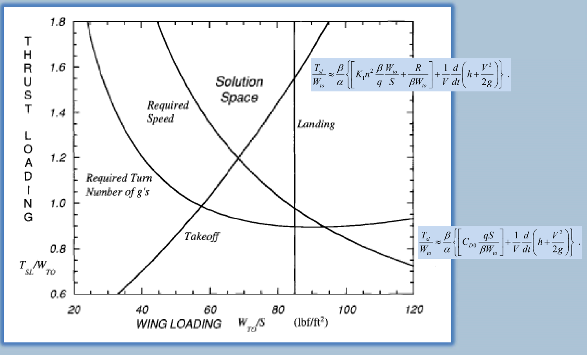

- A alta cota
- No hay necesidad propulsiva para aterrizaje, no necesita empuje solo planeo.

- Se puede poner la ecuación de empuje específico necesario en función del Mach de vuelo, M0, y de la altitud, $\delta$. Para ello basta poner la presión dinámica, q, en función de dichas variables, `$q=\gamma P_{0}^{*} \delta M_{0}^{2} / 2$`, y se obtiene

<eq>
$$
\frac{T_{s l}}{W_{t o}}=\frac{\beta}{\alpha}\left\{\left[K_{1}\left(\frac{2 \beta}{\gamma \delta M_{0}^{2}} \frac{W_{t o} / S}{P_{0}^{*}}\right) n^{2}+K_{2} n+C_{D 0}\left(\frac{\gamma \delta M_{0}^{2}}{2 \beta} \frac{P_{0}^{*}}{W_{t o} / S}\right)\right]+\frac{R}{\beta W_{t o}}+\frac{1}{V_{0}} \frac{d}{d t}\left(h+\frac{V_{0}^{2}}{2 g}\right)\right\}
$$
</eq>

$$
	\delta=\ \frac{P_0}{P_0^{\cdot}},\ \theta=\frac{T_0}{T_0^{\cdot}},\ \sigma=\frac{\rho_0}{\rho_0^{\cdot}}
$$

> $$
  q = 	\frac{1}{2}\rho v^{2}=\frac{1}{2}	\frac{P}{R_g T} v^{2}=\frac{1}{2}PM^{2}\gamma = \frac{1}{2}\delta P^*M^{2}\gamma
> $$

La ecuación representa curvas T/W vs carga alar.

- Como se puede apreciar, el empuje específico necesario es función de

- Las cargas alares típicas están comprendidas entre 2 – 6 kPa para aviones militares y entre 4 – 10 kPa para aviones civiles.
- El parámetro carga alar adimensionalizado con la presión estándar está comprendido entre 0,02 y 0,1.

- Analizando la polar parabólica, podemos sacar algunas conclusiones

- Existe un $C_L$ (óptimo) que maximiza la eficiencia aerodinámica

- Para valores típicos de aviones de transporte subsónico, se tiene $C_{L,opt}$ ≈ 0,5

- La `carga alar que produce mínima necesidad de empuje/peso` es

<eq>
$$
\left.\frac{W_{t o}}{S}\right|_{\min D / W_{t o}}=\frac{q}{n \beta} \sqrt{\frac{C_{D 0}}{K_{1}}}=\frac{\gamma P_{0}^{*}}{2} \frac{\delta M^{2}}{n \beta} \sqrt{\frac{C_{D 0}}{K_{1}}}
$$
</eq>

- Es fácil calcular dicha carga para condiciones de crucero (h = 11000; M_0 = 0,8; β = 0,85) la carga alar, para vuelo óptimo, estaría alrededor de 6,96 kPa.

- Con esa carga alar, tendríamos el empuje/peso mínimo al despegue requerido

<eq>
$$
\left.\frac{E_{s l}}{W_{t o}}\right|_{\min }=\frac{\beta}{\alpha} n\left(K_{2}+2 \sqrt{K_{1} C_{D 0}}\right), \quad(\text { para } \mathrm{n}=1, \text { no depende de la condición de vuelo, excepto } \alpha)
$$
</eq>

- Durante el vuelo, el valor de β va disminuyendo, y si se quiere volar con $C_{L,opt}$, es necesario que la presión dinámica vaya cambiando de igual forma que β, por lo que las condiciones de vuelo (altitud velocidad) deben ir cambiando adecuadamente.1

- Carga alar mín D vs $M_0$ y $E_{SL}$ vs $M_0$

	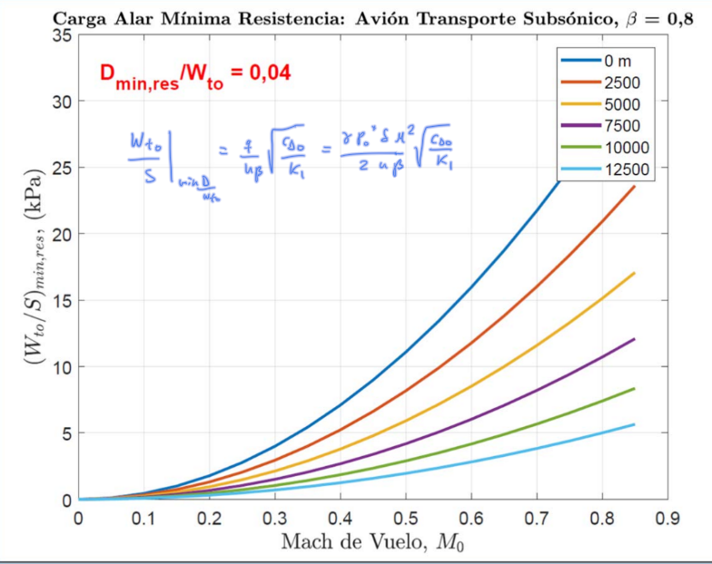  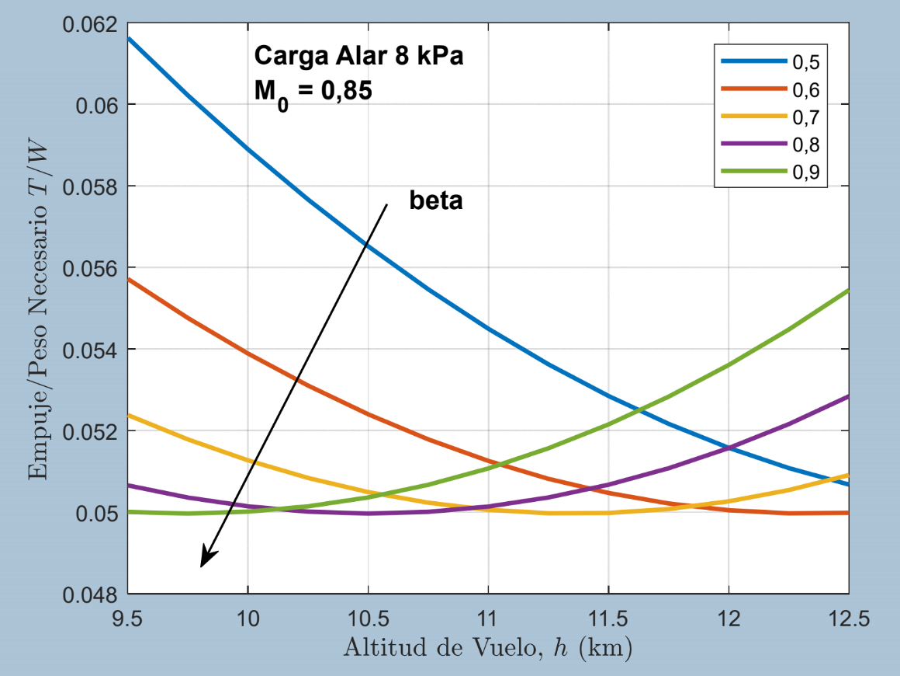

	¿Que tiene que hacer el piloto para vuelo óptimo (hay apéndice en los apuntes)?

> Hace falta motores más potentes para volar alto, la necesidad propulsiva es mayor. Esto es porque el $\alpha$ en despegue disminuye mucho. Es mejor para muchas otras cosas.

### Análisis de restricciones

- Consiste en `calcular el empuje/peso necesario en las misiones consideradas más restrictivas` (de mayor E/ W necesario, referiso a SLS).
- Para ello, se utiliza la carga alar ($W_{to}/S$) y el tipo de vuelo especificado.
- Los distintos tipos de vuelo bajo condiciones dadas a lo largo del trayecto total de la aeronave es lo que se denomina misión. Esta se divide a su vez en fases.
- Dependiendo el uso que se vaya a hacer del avión nos encontraremos con unos u otros tipos de misiones.
- Las necesidades de empuje/peso son tan diferentes, dependiendo de las misiones, que es imposible que con solo un tipo de motor se puedan realizar todas de forma satisfactoria.
- Eso ha llevado a plantearse distintos tipos de avión y distintos tipos de motores a emplear en función de las misiones a realizar.

- Motores para transporte subsónico
- Motores militares de alta actuación

> Tengo que dimensionar el motor para hacer todas las actuaciones. Para cada segmento se calcula el empuje en despegue necesario $E_{SL}$. Estudiar el crucero crítico (Mach mayor), etc...

 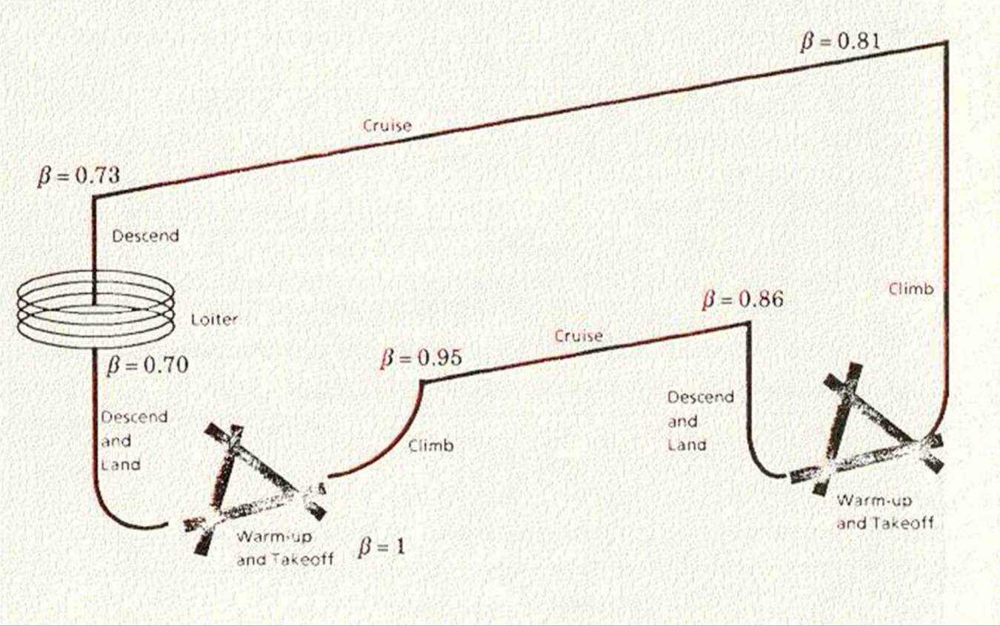

- Necesidades propulsivas

 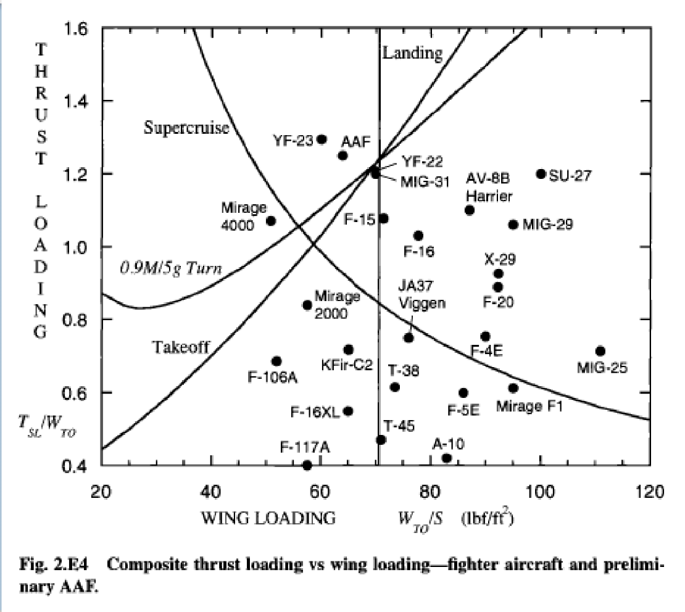 

`Necesidad propulsiva para distintos segmentos de vuelo`. `El espacio de soluciones es aquel que cumple todas las restricciones siendo capaz de realizar todo`. A nivel estructura la carga ala no podrá soportar un cierto valor (restricción vertical)

- Potencia específica en exceso
- Una vez que `seleccionado el empuje/peso necesario y la carga alar`, se puede obtener la potencia específica en exceso del motor, `Ps, en función de la condición de vuelo`.

> $$
  P_{s}= V \cdot \frac{T-(D+R)}{W}=V\left[\underbrace{\frac{\alpha}{\beta}\left(\frac{T_{s}}{W_{t 0}}\right)} \underbrace{-K_{1} \frac{\beta}{q}\left(\frac{W_{t 0}}{S}\right)-K_{2}-\frac{C_{D 0}}{\frac{\beta}{q}\left(\frac{W_{t o}}{S}\right)}}\right]
> $$

¿Cuánto más me sobra de motor respecto a la resistencia?

`Para un h (altura) y $M_0$ se tiene una potencia específica en exceso $P_s$`. `El techo del motor es aquel para $P_s = 0$`.

- Empuje necesario / Peso

	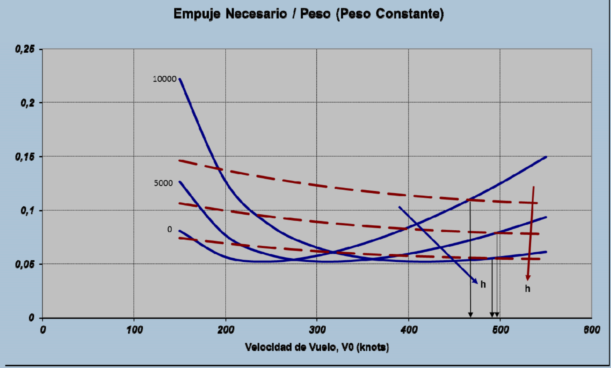

- $P_{s}$ vs $M_{0}$

	

	A partir de 10000 m ya no puedo subir, para subir lo más rápido posible se eligen los puntos de máxima capacidad ascensional: $P_s$ o $V_a$

	 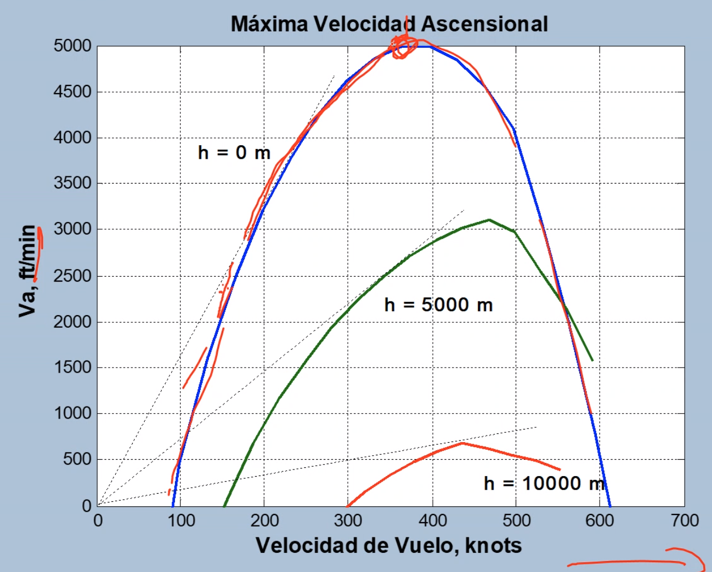

	`Las normas exigen una velocidad ascensional de 300 ft/min en crucero en techo de servicio`.

	Llega un momento en que

	- A 400 nudos y 5000 m el avión debería tener una velocidad ascensional de 2600 ft/min si la palanca está al máximo. El piloto debe bajar la palanca si no quiere ascender.

- Grados vs $M_{0}$

	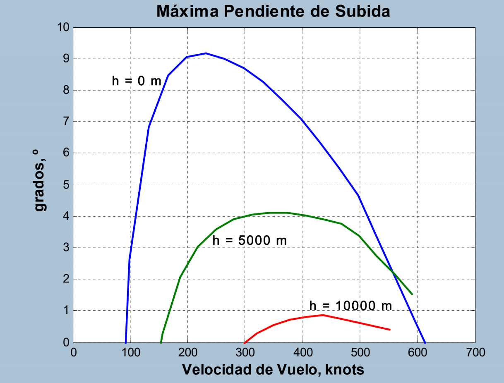

	- Los aviones suben con 9º dentro de la senda de vuelo, en vuelo máximo 4 º y por lo general 1º.

- En los aerorreactores, la máxima Ps nos la encontramos a altitudes bajas, y la Ps disminuye con la altitud, llegando a anularse a una altitud dada (techo del motor)
- La potencia específica en exceso representa la velocidad para cambiar el estado energético.
- Si nos fijamos sólo en la energía potencial, la velocidad de cambio de dicha energía es la velocidad de cambio de la altitud; o sea, la velocidad ascensional.
- La potencia específica en exceso representa también la máxima velocidad ascensional que un motor puede proporcionar.
- Si representamos la velocidad ascensional en función de la velocidad, para distintas alturas, la tangente a dichas curvas desde el origen nos dará la máxima pendiente de subida que el avión puede tener, para las distintas altitudes.

### Trayectoria de Mínimo Tiempo de Subida

- Las líneas de nivel de $P_{s}$, se pueden utilizar para obtener de forma gráfica el camino para tiempo mínimo de subida desde un nivel energético menos, $z_{e1}$, a otro nivel energético superior, $z_{e2}$.

> $$
  P_{s}=\frac{d z_{e}}{d t} \Rightarrow d t=\frac{d z_{e}}{P_{s}} \Rightarrow \Delta t=\int_{1}^{2} d t=\int_{z_{0}}^{z_{2}} \frac{d z_{e}}{P_{s}}
> $$

- El `camino para ir de un nivel energético $z_{e1}$ a otro superior $z_{e2}$ en el mínimo tiempo posible`, se corresponde con aquel en `donde el exceso en potencia específica es máximo para cada nivel de energía`.
- En la figura de $P_s$ constantes, `ese máximo se produce en los puntos de tangencia entre las líneas de nivel de energía constante con las líneas $P_s$ constante`.

### Dimensionado del Avión

- Una vez conocidas las necesidades de empuje específico (Tsl/Wto) para realizar una misión dada, se necesita conocer el peso al despegue para obtener el empuje necesario del motor.
- El peso al despegue se tiene como suma de los pesos especificados para la aeronave en función de lo que de ella se quiere (no de pasajeros, carga, munición...) más el combustible necesario para realizar la misión prevista.
- El `combustible necesario` es el que se va a consumir en los motores y será por tanto función del consumo específico de estos.
- Este se calculará como `suma del combustible gastado en los distintos tramos de la misión`.
- La velocidad con que una aeronave pierde peso debido al consumo de combustible es

> $$
 \frac{d W}{d t}=-\frac{d W_{f}}{d t}=-g \frac{d M_{f}}{d t}=-g c=-g C_{E} T
> $$

> Hablar de distancia en términos de combustible gastado
- `El combustible gastado en un intervalo de tiempo` realizando un segmento de la misión es

> $$
 \frac{d W}{W}=-g C_{E} \frac{T}{W} d t
> $$

- En la última parte de la expresión se representa el trabajo que realiza el empuje del motor por unidad de peso y velocidad, cuando se consume una cantidad de combustible dWf.

$$
\frac{T}{W} d t=\frac{T}{W} \frac{d t}{d s} d s=\frac{T}{W V} d s
$$

- Como en cualquier otra situación termodinámica ese trabajo del empuje se invertirá parcialmente en energía mecánica (cinética + potencial) de la masa del avión y parcialmente será disipada en energía no mecánica debida a la fricción entre la atmósfera y el avión.
- La relación entre energía mecánica y disipada dependerá del tipo de vuelo considerado.
- Si `llamamos u = $\frac{(D+R)}{T}$`.

$$
\frac{d W}{W}=-g C_{E} \frac{T}{W} d t
$$

- `“u” será la fracción de empuje que se disipa en fricción` (se emplea para vencer la resistencia) y `“1‐u” será la fracción del empuje que se invierte en aumentar el nivel energético`.
- Nos interesa saber el combustible que se consume en cada etapa del vuelo, para eso habrá que integrar la ecuación, lo que `requiere` el conocimiento de `$T / W=(\alpha / \beta)(T s l / W t o)$ como función del tiempo`.
- Para integrar la ecuación es conveniente utilizar distintos métodos según Ps sea > ó = a cero.

#### Caso $P_{s} > 0$

- En estos casos se conoce el empuje aplicado, así como los cambios en la altitud, h, y velocidad, V, que se producen, pero ni la distancia ni el tiempo están involucrados.

- `Normalmente el empuje aplicado será el máximo $T = αT_{sl}$`.

- La ecuación de potencias nos dará el valor de $T/W$

$$
\frac{T-D}{W}=\frac{1}{V} \frac{d}{d t}\left(h+\frac{V^{2}}{2 g}\right)=\frac{1}{V} \frac{d z_{e}}{d t}=0
$$

$$
\frac{d W}{W}=-g C_{E} \frac{T}{W} d t
$$

<eq>
$$
  \frac{T}{W}=\frac{d\left(h+\frac{V^{2}}{2 g}\right)}{dt V} + \underbrace{\frac{D+R}{T}}_{u} \frac{T}{W} \rightarrow \frac{T}{W}= \frac{dz_{e}}{(1-u)\cdot V \cdot dt}
$$
</eq>

- El combustible empleado en aumentar el nivel energético $dz_e$ será

> $$
  \frac{d W}{W}=-\frac{g C_{E}}{V(1-u)} d\left(h+\frac{V^{2}}{2 g}\right)=-\frac{g C_{E}}{V(1-u)} d z_{e}
> $$

- Para un segmento de vuelo se puede suponer $C_E/V(1-u)$ constante. Integrando

> $$
\frac{W_{f}}{W_{i}}=\exp \left[-\frac{g C_{E}}{V(1-u)} \Delta\left(h+\frac{V^{2}}{2 g}\right)\right]=\exp \left(-\frac{g C_{E}}{V(1-u)} \Delta z_{e}\right)
> $$

#### Caso $P_{s} = 0$

- En estos casos `$z_e$ es constante y u = 1`, por lo que la expresión anterior está indeterminada y el combustible consumido habrá que obtenerlo por el conocimiento del espacio o del tiempo involucrados en la misión. En estos casos `el empuje es totalmente disipado` no se conoce a priori y se regula para igualarlo a la resistencia, así que `T = D+R`.
- De la ecuación del empuje se sigue inmediatamente que

> $$
  \frac{T}{W} V d t=\frac{D}{W} d s
> $$

- El combustible empleado en estar volando un tiempo dt será

> $$
  \frac{d W}{W}=-g C_{E} \frac{D}{W} d t
> $$

- Integrando para un segmento de vuelo [$C_E/V(1-u)$ constante].

> Se supone un peso medio

$$
\frac{W_{f}}{W_{i}}=\exp \left[-g C_{E} \frac{D+R}{W} \Delta t\right]=\exp \left[-g \frac{C_{E}}{V} \frac{D+R}{W} \Delta s\right]
$$

- En este tipo de vuelo se especifica, bien el tiempo del mismo (autonomía), o bien, la distancia recorrida (radio de acción).

- `Peso Vacío de la Aeronave`
	- Además, para conocer el peso total del avión al despegue, se necesita conocer el peso vacío del avión.
	- Existen correlaciones que muestran dicho peso en función del peso total al despegue de distintos aviones de carga y militares.
	- Peso vacío dividido por el peso al despegue, $\Gamma$, en función del peso al despegue

	- Peso en vacío / Peso al despegue

		

	- Proporción de pesos

		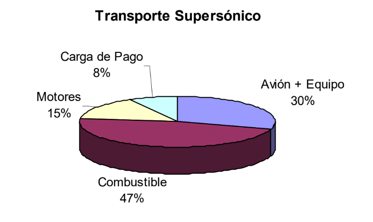

		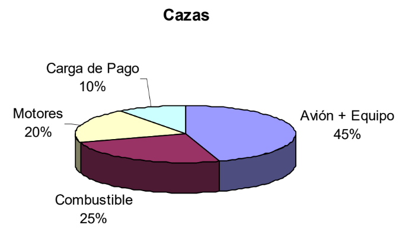

		

### Trayectoria de Consumo de Combustible Mínimo
- El consumo de combustible se puede poner en función de la potencia específica en exceso, Ps.

> $$
  d W_{f}=g \cdot T \cdot C_{E} \cdot d t=g T_{s l} \frac{\alpha C_{E}}{P_{s}} d z_{e}=g T_{s l} \frac{d z_{e}}{f_{s}}
> $$

- Donde $f_{s}=\frac{P_{s}}{\alpha C_{E}}$
- Integrando se puede obtener el consumo de combustible $W_{f,1‐2}$ necesario para ir de un nivel de energía $z_{e1}$ a otro nivel superior $z_{e2}$.

> $$
  W_{f_{1-2}}=\int_{1}^{2} d W_{f}=g T_{s l} \int_{z_{e_{1}}}^{z_{2}} \frac{d z_{e}}{f_{s}}
> $$

- Para obtener la `trayectoria de mínimo consumo de combustible` habrá que ir por `donde $f_s$ sea máximo`. En la figura de $f_s$  constantes eso se consigue en los puntos de tangencia entre las líneas de nivel de energía constante con las líneas $f_s$  constante.

### Autonomía, $\Delta t$

- Considerando el caso de `vuelo equilibrado L = W`, el consumo diferencial de combustible es

> $$
  \frac{d W}{W}=-g C_{E} \frac{D}{L} d t=-g C_{E} \frac{C_{D}}{C_{L}} d t
> $$

- El término  `$\frac{1}{g C_{E}} \frac{C_{L}}{C_{D}}$ es el “Factor de Autonomía”, FA`. Es el tiempo característico que un avión puede estar volando. Un tiempo característico está en un rango de valores característico `$\sim 20 h$`.
- También se deduce que el consumo mínimo de combustible para un tiempo “t” se produce en la con vuelo donde el FA es máximo.
- Para el `caso de FA = cte se puede integrar la expresión` y obtener la “autonomía”, $\Delta$t de un avión con su carga de combustible; W_{fuel} , típicamente (≈ 30 ‐ 40% de su peso).

$$
\frac{W_{f}}{W_{i}}=\exp \left(-\frac{\Delta t}{F A}\right)=\exp \left(-g C_{E} \frac{C_{D}}{C_{L}} \Delta t\right) \Rightarrow \Delta t=\frac{1}{g C_{E}} \frac{C_{L}}{C_{D}} \ln \left(\frac{W_{T O}}{W_{T O}-W_{f u e l}}\right)
$$

$$
\frac{W_{f}}{W_{i}}=\exp \left(-\frac{\Delta t}{F A}\right)=\exp \left(-g C_{E} \frac{C_{D}}{C_{L}} \Delta t\right) \Rightarrow \Delta t=\frac{1}{g C_{E}} \frac{C_{L}}{C_{D}} \ln \left(\frac{W_{T O}}{W_{T O}-W_{f u e l}}\right)
$$

> La fase de despegue es despreciable en tiempo respecto al crucero.

> Valores de calidad: $C_E$ (inversamente proporcional) y $E/W$.  En aviones civiles mejorar el empuje específico no logra gran mejores  mientras que mejorar el consumo específico es fundamental. En aviones militares mejorar el consumo específico no aumenta prácticamente la autonomía mientras que el peso específico es fundamental.

### Radio de acción
- Considerando, otra vez, el caso de `vuelo equilibrado L = W`, el consumo diferencial de combustible es

> $$
  \frac{d W}{W}=-g C_{E} \frac{D}{L} \frac{d s}{V_{0}}=-g \frac{C_{E}}{V_{0}} \frac{C_{D}}{C_{L}} ds
> $$

- El término `$\frac{V_{0}}{g C_{E}} \frac{C_{L}}{C_{D}}$` es el `“Factor de Radio de Acción”, FR`.
- Es la longitud característica que un avión puede recorrer. con la carga de combustible típica (≈ 30 ‐ 40% de su peso).
- También se deduce que el consumo mínimo de combustible para una distancia “s” se produce en la con.vue. donde el FR es máximo.
- Para el caso de `FR = cte se puede integrar la expresión y obtener el “radio de acción”, $\Delta$s de un avión` con una su carga de combustible; Wfuel , típicamente (≈ 30 ‐ 40% de su peso).

$$
\frac{W_{f}}{W_{i}}=\exp \left(-\frac{\Delta S}{F R}\right)=\exp \left(-g \frac{C_{E}}{V_{0}} \frac{C_{D}}{C_{L}} \Delta s\right) \Rightarrow \Delta S=\frac{V_{0}}{g C_{E}} \frac{C_{L}}{C_{D}} \ln \left(\frac{W_{T O}}{W_{T O}-W_{\text {fud }}}\right)
$$

> El punto de máximo radio de acción y máxima autonomía no es el mismo.

## Tema 3: Aplicación de las Ecuaciones Integrales de la Mecánica de Fluidos a los Aerorreactores

### Ecuación de Conservación

- Si X es la cantidad que se conserva por unidad de masa, la ecuación de conservación de la cantidad es:

<eq>
$$
\begin{array}{ll}\frac{d}{d t} \iiint_{\Omega} \rho \mathrm{X} d \omega & +\iint_{\Sigma_{i} e, s} \rho \mathrm{X}(\vec{v} \cdot \vec{n}) d \sigma= \\\mathrm{Si} \quad \mathrm{X}=1 & =0 \text { (Continuidad) } \\\mathrm{Si} \quad \mathrm{X}=\mathbf{v} & =\Sigma \mathrm{F}_{\mathrm{ext}} \text { (Cantidad de movimiento) } \\\mathrm{Si} \quad \mathrm{X}=\mathrm{u}+\mathrm{v}^{2} / 2 & =\text { Trabajo (Energia) }\end{array}
$$
</eq>

> La cantidad que entra o sale a través de una superficie se puede calcular a partir de la integral convectiva.

> Ec. de continuidad: la variación de la masa se corresponde con la masa que entra y la masa que sale.

### Ecuaciones Integrales de la MF

<eq>
$$
\begin{aligned}&\frac{d}{d t} \iiint_{\Omega} \rho d \omega+\iint_{\Sigma_{i} e, s} \rho(\vec{v} \cdot \vec{n}) d \sigma=0 \\&\frac{d}{d t} \iiint_{\Omega} \rho \vec{v} d \omega+\iint_{\Sigma_{i} e, s} \rho \vec{v}(\vec{v} \cdot \vec{n}) d \sigma=\sum \vec{F}_{e x t} \\&\frac{d}{d t} \iiint_{\Omega} \rho\left(u+\frac{v^{2}}{2}\right) d \omega+\iint_{\Sigma_{i}, e, s} \rho\left(h+\frac{v^{2}}{2}\right)(\vec{v} \cdot \vec{n}) d \sigma=\iint_{\Sigma_{i} e, s}(\overline{\bar{T}} \cdot \vec{v}-\vec{q}) \cdot \vec{n} d \sigma\end{aligned}
$$
</eq>

<eq>
$$
\begin{matrix} \textrm{Términos no estacionarios} \approx \mathbf{A}_{\mathrm{c}} \mathbf{L}_{\mathrm{c}} / \mathrm{t}_{\mathrm{c}} \\ \textrm{Términos convectivos} \approx \mathbf{A}_{\mathrm{c}} \mathbf{V}_{\mathrm{c}}=\mathbf{A}_{\mathrm{c}} \mathrm{L}_{\mathrm{c}} / \mathrm{t}_{\mathrm{r}} \\ \textrm{relación Número de Strouhal},  \mathrm{St} \approx \mathrm{t}_{\mathrm{r}} / \mathrm{t}_{\mathrm{c}} \end{matrix}
$$
</eq>

> Interesa ver los flujos de entalpía, la temperatura de remanso ve la temperatura estática y la energía cinética. $h_0 = h + \frac{v^2}{2} \rightarrow(h=C_P T) \rightarrow  T_0 = T + \frac{v^2}{2C_P}$

> Supondremos viscosidad despreciable ($Re \gg 1$):  $\iint_{\Sigma_{i} e, s}(\overline{\bar{T}} \cdot \vec{v}-\vec{q}) \cdot \vec{n} d\sigma = 0$

> Hay una velocidad característica y un tiempo asociado al movimiento (residencia, que no tiene que ver con que hayan cambiado las cosas).

- $t_c$: tiempo característico de cambio ($\sim 1s$). En un segundo no ha cambiado la altura, condición de vuelo, régimen del motor.

- $t_r:$ tiempo de residencia ($\sim 10^{-2}s$)

- $St \sim t_r/t_c$ . Si el del orden unidad los dos son importantes.

#### Ecuaciones cuasi-estacionarias

- Si `$St<<1$ → Términos no estacionarios despreciables Ecuaciones cuasi – estacionarias` (el tiempo es un parámetro)

---
<eq>
$$
\begin{aligned}&\iint_{\Sigma_{i} e, s} \rho(\vec{v} \cdot \vec{n}) d \sigma=0, \\&\iint_{\Sigma_{i}, e, s} \rho \vec{v}(\vec{v} \cdot \vec{n}) d \sigma=\sum \vec{F}_{e x t}, \\&\iint_{\Sigma_{i} e, s} \rho\left(h+\frac{v^{2}}{2}\right)(\vec{v} \cdot \vec{n}) d \sigma=\iint_{\Sigma_{i}, e, s}(\overline{\bar{T}} \cdot \vec{v}-\vec{q}) \cdot \vec{n} d \sigma\end{aligned}
$$
</eq>

---

Quedan los efectos convectivos tras haber despreciado los efectos temporales.

Despreciar los procesos de cambio de calor se referirán a un trasvase de calor en el tiempo de residencia de una partícula fluida.

La ecuación de energía será tan sencillo como que nada cambia.

- Volumen de control

	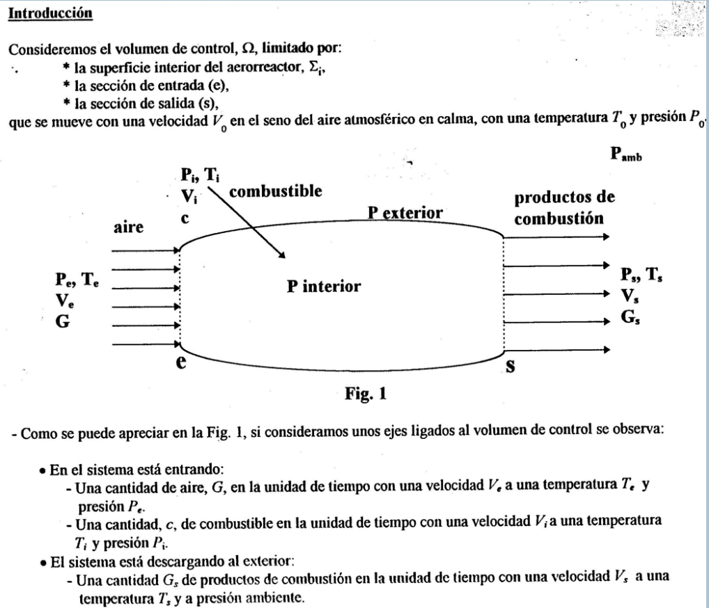

### Ecuación de continuidad

---
<eq>
$$
\iint_{\Sigma_{i}, e, s} \rho(\vec{v} \cdot \vec{n}) d \sigma=0 \Rightarrow\left\{\begin{array}{l}\iint_{\Sigma_{i}} \rho(\vec{v} \cdot \vec{n}) d \sigma=0 \\\iint_{e} \rho(\vec{v} \cdot \vec{n}) d \sigma=- \overbrace{\left\langle\rho_{e} V_{e}\right\rangle A_{e}}^G -\overbrace{\left(\rho_{i} V_{i} A_{i}\right)_{f}}^c =- \overbrace{(G+c)}^{G_s} \\\iint_{s} \rho(\vec{v} \cdot \vec{n}) d \sigma=\left\langle\rho_{s} V_{s}\right\rangle A_{s}=G_{s}\end{array}\right.
$$
</eq>

---

$$
G_{s}=G+c=G(1+f) \quad f=c/G
$$

Es conveniente fijarse como la definición del gasto representa un cálculo de valores medios

### Ecuación de cantidad de movimiento

<eq>
$$
\iint_{\Sigma_{i} e, s} \rho \vec{v}(\vec{v} \cdot \vec{n}) d \sigma=\Sigma \vec{F}_{e x t} \Rightarrow\left\{\begin{array}{l}\iint_{\Sigma_{i}} \rho \vec{v}(\vec{v} \cdot \vec{n}) d \sigma=0 \\\iint_{e} \rho \vec{v}(\vec{v} \cdot \vec{n}) d \sigma=-\left\langle\rho_{e} V_{e} \vec{V}_{e}\right\rangle A_{e}=-G_e\left\langle\vec{V}_{e}\right\rangle \\\iint_{s} \rho \vec{v}(\vec{v} \cdot \vec{n}) d \sigma=\left\langle\rho_{s} V_{s} \vec{V}_{s}\right\rangle A_{s}=G_{s}\left\langle\vec{V}_{s}\right\rangle\end{array}\right.
$$
</eq>

> El flujo de cantidad de movimiento al no ser un sistema aislado, lo que hay en exterior puede ejercer fuerzas. En la pared interna no se

<eq>
$$
-G\left\langle\vec{V}_{e}\right\rangle+(G+c)\left\langle\vec{V}_{s}\right\rangle=\Sigma \vec{F}_{e x t}
$$
</eq>

### Fuerzas Exteriores (sobre el fluido)

`Las fuerzas másicas o de volumen son despreciables` y por tanto solo `quedan las fuerzas de presión y fricción` sobre la superficie del volumen de control:

<eq>
$$
\begin{array}{c} \sum \vec{F}_{ext} = \iint_{\Sigma_{i}, e, s}(-p \bar{I} + \bar{T}) \cdot \vec{n} d \sigma = \iint_{\Sigma_{i}}(-p \bar{I} + \bar{T}) \cdot \vec{n} d \sigma - \langle P_{e} \rangle \vec{n}_{e} A_{e} - \langle P_{s} \rangle \vec{n}_{s} A_{s} \\ -G \langle \vec{V}_{e} \rangle + (G+c) \langle \vec{V}_{s} \rangle = \iint_{\Sigma_{i}}(-p \bar{I} + \bar{T}) \cdot \vec{n} d \sigma - \langle P_{e} \rangle \vec{n}_{e} A_{e} - \langle P_{s} \rangle \vec{n}_{s} A_{s}\end{array}
$$
</eq>

> Evaluar la superficie interior (tensor viscoso, presión, diferencial sigma, normal, ...) es complejo. Sin embargo, si suponemos fuerzas de fricción a la entrada y salida despreciables. Son despreciables porque aunque la corriente no sea uniforme no va a haber mucho gradiente y por la baja viscosidad  los esfuerzos viscosos sean despreciables.

> En las paredes sí que se tienen en cuenta, ya que la velocidad se hace 0 y existe capa límite.

> Se supone que el "empuje" es un empuje medido en banco no instalado

### Empuje Instalado (sobre las paredes) (Mattingly)

`La resultante de las fuerzas de presión y fricción que el fluido ejerce sobre las paredes internas y externas del motor menos las fuerzas de fricción sobre la externa`

> En la ecuación de cantidad de movimiento solo aparece las internas
>
> Se restan las fuerzas viscosas externas. Los efectos de presión por fuera se sabe que son despreciables. Es decir, la forma de la góndola que tiene que ver con esto se asume como resistencia del avión. Se asume que estas fuerzas de presión sobre la carcasa son del avión. Por ejemplo al hacer un ensayo en túnel se pone todo el avión (con la góndola).
>
> Fuerzas del fluido sobre las paredes (signo -), $\vec{n}$ apunta al culpable.

<eq>
$$
\begin{matrix}
\vec{E}_{i n s}=-\left[\iint_{\Sigma_{i}, \Sigma_{e}}(-p \overline{\bar{I}}+\overline{\bar{T}}) \cdot \vec{n} d \sigma-\iint_{\Sigma_{e}}(\bar{T}) \cdot \vec{n} d \sigma\right] \quad \Rightarrow \\ \iint_{\Sigma_{i}}(-p \bar{I}+\bar{T}) \cdot \vec{n} d \sigma=-\vec{E}_{\text {ins }}-\iint_{\Sigma_{e}}(-p \bar{I}) \cdot \vec{n} d \sigma
\end{matrix}
$$
</eq>

### Empujes y Resistencias (Kerrebrock)

- Convencionalmente, las fuerzas actuando sobre un avión en su dirección de movimiento se dividen en empuje y resistencia.

- El empuje se define como la parte de la fuerza que resulta de cambios decantidad de movimiento o presión de los gases que fluyen por el interior de motor.

- La debida al flujo por el exterior es la resistencia.

- Hay que hacer notar que ambas están influenciadas una por otra; especialmente en vuelo supersónico.

- Considere el volumen de control de la figura, para flujo estacionario

  
$$
F-D_{e}-A_{e}\left(P_{e}-P_{0}\right)-\int_{S_{b}}\left(P-P_{0}\right) d S=\int_{S} \rho u(\vec{u} \cdot \vec{n}) d S
$$

- Dividiendo la ecuación anterior en dos:

<eq>
$$
\begin{array}{l}F-A_{e}\left(P_{e}-P_{0}\right)=\int_{A_{e}} \rho u(\vec{u} \cdot \vec{n}) d S+\int_{A_{0}} \rho u(\vec{u} \cdot \vec{n}) d S \\ D_{e}+\int_{S_{b}}\left(P-P_{0}\right) d S=-\int_{S-A_{e}-A_{0}} \rho u(\vec{u} \cdot \vec{n}) d S\end{array}
$$
</eq>

- Si la densidad y la velocidad son uniformes en el plano de salida “e”
$$
F=G_{s} u_{e}-G_{0} u_{0}+A_{e}\left(P_{e}-P_{0}\right)
$$
- Si el plano de salida se hubiera puesto muy aguas abajo donde la presión hubiera sido la presión ambiente, el término de presiones hubiera sido cero, pero se hubiera tenido que tener en cuenta la mezcla del chorro con el aire exterior para conocer la velocidad en ese plano.
- Para vuelo subsónico, la teoría de flujo potencial nos dice que la fuerza de presión sobre la góndola es nula. La resistencia es debida por entero a las fuerzas debido a los esfuerzos viscosos sobre la superficie externa de la góndola, siempre que los diseños respondan a “aerodinámica ideal”
- En vuelo supersónico, la presencia de ondas de choque en el flujo externo conduce a incrementos de entropía, que aparecen, en parte, como un “defecto” de presión en el plano de salida y, en parte, como un “defecto” de velocidad en el mismo plano. Ambos efectos producen un incremento de resistencia.
- Parte de las deflexiones de la corriente exterior son causadas por el motor.
- Así que, parte del aumento de la resistencia, en supersónico, es debida al motor.
- Los ingenieros de la célula y del motor son reacios a aceptar las responsabilidades de esta “interface” (interconexión) de ahí la necesidad 
de dejar las cosas claras.
- La resistencia de rebosamiento (“spillage”) en la entrada y la resistencia base en la salida son ejemplos de este problema de interacción.

**Sustituyendo en la ecuación de cantidad de movimiento y arreglándola queda una expresión para el empuje** en función de las condiciones del flujo a la entrada y salida:

<eq>
$$
\vec{E}_{ins} = G \langle \vec{V}_{e} \rangle - (G+c) \langle \vec{V}_{s} \rangle - \langle P_{e} \rangle \vec{n}_{e} A_{e} - \langle P_{s} \rangle \vec{n}_{s} A_{s}- \int_{\Sigma_{e}}(-p) \overline{\bar{I}} \cdot \vec{n} d \sigma
$$
</eq>

> No me gusta que dependa de la entrada, de la instalación sino que sea a través de conceptos universales. El fluido que entra viene de una región con aire en calma (condiciones sin perturbar). El camino viene definido por el tubo de corriente.

**La sección “entrada” del motor es poco útil, ya que las variables en esa sección no son “universales” y están determinados por la “instalación”**, que será distintas según el avión a propulsar por el motor.

Si se quieren condiciones que no dependan de la instalación habrá que **recurrir a las condiciones sin perturbar del fluido aguas arriba del motor “sección 0”.**

En la sección “0” se tienen las condiciones ambientales y la velocidad de vuelo (T0, P0, V0)

**Para relacionar las estaciones entrada “e” y “0”, tomaremos un nuevo volumen de control que consiste en el tubo de corriente limitado por las estaciones mencionadas y aplicaremos la ecuación integral de cantidad de movimiento a dicho volumen.**

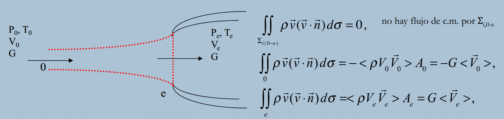

> Aplicamos la ec. de cantidad de movimiento al volumen de control del tubo de corriente. Por continuidad el tubo de corriente no es trasvasado pese a no haber velocidad nula.

- Se define el área de captura, $A_0$, cuyo vector normal es $\vec{n}_e^{'}$

<eq>
$$
\sum \vec{F}_{ext}=\iint_{\Sigma_{i(0-e)}, 0, e} (-p \overline{\bar{I}} + \overline{\bar{T}}) \cdot \vec{n} d \sigma = \iint_{\Sigma_{i(0-e)}}(-p \overline{\bar{I}} + \overline{\bar{T}}) \cdot \vec{n} d \sigma - \langle P_{0} \rangle \vec{n}_{0} A_{0} - \langle P_{e}\rangle \vec{n}_{e}^{\prime} A_{e}
$$
</eq>

El flujo de cantidad de movimiento es igual a las fuerzas exteriores

**Sumando a la ecuación anterior, la del empuje instalado** obtenida del análisis del volumen de control interior del motor queda:

<eq>
$$
\begin{aligned}\vec{E}_{\text {ins }} & = G \langle \vec{V}_{e} \rangle -(G+c) \langle \vec{V}_{s}\rangle - \langle P_{e} \rangle \vec{n}_{e} A_{e} - \langle P_{s}\rangle \vec{n}_{s} A_{s} - \int_{\Sigma_{e}}(-p) \overline{\bar{I}} \cdot \vec{n} d \sigma + G \langle \vec{V}_{0} \rangle -G \langle \vec{V}_{e} \rangle + \\ & + \int_{\Sigma_{i(0-e)}}(-p) \overline{\bar{I}} \cdot \vec{n} d \sigma - \langle P_{0} \rangle \vec{n}_{0} A_{0} - \langle P_{e} \rangle \vec{n}_{e}^{\prime} A_{e}\end{aligned}
$$
</eq>

> Aparece un término de fuerzas de presión dentro del tubo de corriente y el área del tubo de corriente $A_0$ que no se conoce. Todo el gasto que va a entrar al motor queda contenido en un tubo de corriente que se proyecta hasta el infinito sin perturbar. Buscamos relacionar las variables e o entrada con las variables 0.

> El empuje instalado es la fuerza propulsiva menos los esfuerzos de fricción.

> Refiriendo las presiones respecto la atmosférica, presión manométricas $P- P_0$. Dinámicamente no hace nada, ya que todo el volumen es cerrado, pero el término `$\langle P_{0} \rangle \vec{n}_{0} A_{0}$` se anula. Esto permite que la formulación no dependa de la instalación y régimen (el área de captura cambia).

Se puede comprobar que los términos referidos a la condición “e” se anulan, pero aparece un término que contiene el área de captura, A0. Que es la que proporciona el gasto de aire al motor en las condiciones de vuelo dadas.

Este término, también es incómodo para trabajar, ya que es un valor que depende de la condición de vuelo y habría que calcularlo para cada condición. No obstante, si referimos las fuerzas de presión a la presión ambiente, este término se anula y el empuje instalado quedaría:

<eq>
$$
\begin{aligned}\vec{E}_{\text {ins }} = & G \langle \vec{V}_{0} \rangle - (G+c) \langle \vec{V}_{s} \rangle - (\langle P_{s} \rangle - P_{0}) \vec{n}_{s} A_{s} - \\ &-\int_{\Sigma_{e}} - (p - P_{0}) \overline{\bar{I}} \cdot \vec{n} d \sigma - \int_{\Sigma_{e(0-e})}-(p - P_{0}) \overline{\bar{I}} \cdot \vec{n} d \sigma\end{aligned}
$$
</eq>

> En vez de ver la presión desde dentro, mirando desde fuera el versor tiene sentido contrario $\int_{\sum_{i}} \rightarrow -\int_{\sum_{e}}$

### Resistencias

- Los últimos términos de la expresión del empuje instalado son resultantes de fuerzas de presión sobre la góndola (carcasa exterior) del motor y sobre la parte exterior del tubo de corriente.
- Estos términos se denominan **“resistencias” externa y adicional** respectivamente.

<eq>
$$
\vec{D}_{\text {externa }}=-\int_{\Sigma_{e}}-\left(p-P_{0}\right) \overline{\bar{I}} \cdot \vec{n} d \sigma \quad \vec{D}_{a d c}=-\int_{\Sigma_{e(0-e)}}-\left(p-P_{0}\right) \overline{\bar{I}} \cdot \vec{n} d \sigma
$$
</eq>

> Son fuerzas sobre las paredes.
> La resistencia adicional es una introducción espuria, ocurre por ir a las condiciones sin perturbar.

- Como tales son fuerzas sobre las paredes (iguales y contrarias que las fuerzas sobre el fluido).
- Son los únicos términos que tienen que ver con la instalación.
- Si no se tienen en cuenta, se obtiene el empuje “no instalado”.

<eq>
$$
\vec{E}_{\text {no-instalado }} = \vec{E}_{\text {ins }}-\vec{D}_{ext}-\vec{D}_{adc} = G \langle \vec{V}_{0} \rangle - (G+c) \langle \vec{V}_{s} \rangle - \left(\langle P_{s} \rangle - P_{0}\right) \vec{n}_{s} A_{s}
$$
</eq>

> Este último empuje es el que se utiliza para caracterizar a los aerorreactores (empuje de catálogo). Es una mayorante del empuje instalado, es más grande de 0-s que de e-s.

### Expresiones del empuje

En su forma vectorial las expresiones del empuje son. En bruto se quita el efecto de la velocidad de vuelo:

- Empuje Neto Instalado

<eq>
$$
\vec{E}_{\text {ins }}=G \vec{V}_{0}-(G+c) \vec{V}_{s}-\left(P_{s}-P_{0}\right) \vec{n}_{s} A_{s}+\vec{D}_{e x t}+\vec{D}_{a d c}
$$
</eq>

- Empuje Neto no Instalado (normalmente empuje)

<eq>
$$
\vec{E}_{n o \text { ins }}=\vec{E}=G \vec{V}_{0}-(G+c) \vec{V}_{s}-\left(P_{s}-P_{0}\right) \vec{n}_{s} A_{s}
$$
</eq>

- Empuje Bruto Instalado

<eq>
$$
\left(\vec{E}_{b}\right)_{\text {ins }}=-(G+c) \vec{V}_{s}-\left(P_{s}-P_{0}\right) \vec{n}_{s} A_{s}+\vec{D}_{e x t}+\vec{D}_{a d c}
$$
</eq>

- Empuje Bruto no Instalado

<eq>
$$
\left(\vec{E}_{b}\right)_{n o \text { ins }}= - (G+c) \vec{V}_{s}-\left(P_{s}-P_{0}\right) \vec{n}_{s} A_{s}
$$
</eq>

> La resistencia adicional siempre va en contra del empuje, mientras la resistencia exterior al considerar solo efecto de presión (no fricción) puede ser a favor del empuje.

### Utilización Vectorial del Empuje

-  Hasta no hace mucho tiempo, el empuje se utilizaba como una cantidad escalar, ya que sólo se utilizaba para propulsar a las aeronaves y estaba asumida su dirección y sentido (de avance) por lo que únicamente su magnitud era lo definitorio (con la excepción de su aplicación para despegue vertical en donde también se sabía su sentido)
- **En la actualidad, se está utilizando el vector empuje, además de para propulsarse, para crear momentos** que puedan controlar el avión.
- La ventaja principal es que no entran en pérdida, como puede suceder con el control aerodinámico que ha sido el utilizado hasta ahora.
- Los fuerzas utilizadas para el control no son muy significativas por lo que la pérdida de fuerza propulsiva es asumible. Control → M = F x d
- Las fuerzas se producen con pequeñas deflexiones del área de salida, consiguiendo que el vector “velocidad de salida” y el vector “área de salida” tenga componentes distintas al eje del motor.

#### Componentes del Empuje Vectorial

- Aunque la vectorización del empuje se puede hacer tridimensional, vamos a calcular, por simplicidad, las componentes que aparecen con una deflexión del área de salida solamente en el plano del papel. El área de entrada sigue siendo perpendicular al eje del motor (dirección i)

<eq>
$$
\begin{aligned}&\vec{V}_{0}=V_{0} \vec{i} \\&\vec{V}_{s}=V_{s}(\cos \varphi \vec{i}+\operatorname{sen} \varphi \vec{j}) \\&\vec{n}_{s}=\cos \varphi \vec{i}+\operatorname{sen} \varphi \vec{j}\end{aligned}
$$
</eq>

> Empuje contrario a la velocidad de salida.

<eq>
$$
\begin{aligned}&\left(\vec{E}_{\text {ins }}\right)_{i}=\left[(G+c) V_{s} \cos \varphi-G V_{0}+\left(p_{s}-p_{0}\right) A_{s} \cos \varphi-\left(D_{e x t}\right)_{i}-\left(D_{a d c}\right)_{i}\right](-\vec{i}) \\&\left(\vec{E}_{i n s}\right)_{j}=\left[(G+c) V_{s} \operatorname{sen} \varphi+\left(P_{s}-P_{0}\right) A_{s} \operatorname{sen} \varphi-\left(D_{e x t}\right)_{j}-\left(D_{a d c}\right)_{j}\right](-\vec{j})\end{aligned}
$$
</eq>

Módulo del Empuje no instalado, o simplemente EMPUJE

$$
\begin{aligned}&\left(E_{i}\right)=(G+c) V_{s} \cos \varphi-G V_{0}+\left(P_{s}-P_{0}\right) A_{s} \cos \varphi \\&\left(E_{j}\right)=(G+c) V_{s} \operatorname{sen} \varphi+\left(p_{s}-p_{0}\right) A_{s} \operatorname{sen} \varphi\end{aligned}
$$

Ejemplo

Al vectorizar el empuje variando la dirección de salida se produce un momento → para evitar ese momento se debe poner algo que compense este si no se quiere girar.

### Resistencia exterior y adicional

- La ecuación de la Cantidad de Movimiento al volumen de control exterior al motor y al tubo de corriente que encierra el gasto que lo atraviesa, suponiendo fluido ideal ($\mu =0$), es

<eq>
$$
\vec{D}_{a d c}+\vec{D}_{e x t}+\int_{\Sigma_{e(s-\infty)}}\left(p-P_{0}\right) \overline{\bar{I}} \cdot \vec{n} d \sigma=0
$$
</eq>

- Si la tobera expande al fluido de forma correcta, $P_s = P_0$, (adaptado) entonces

<eq>
$$
\int_{\Sigma_{e(s-\infty)}}\left(p-P_{0}\right) \overline{\bar{I}} \cdot \vec{n} d \sigma=0
$$
</eq>

- Por tanto se cumple que `$\vec{D}_{adc}= - \vec{D}_{ext}$`
- Como consecuencia de ello: `$\vec{E}_{ins}=\vec{E}_{\text{no inst}}$`

> El empuje instalado es el no instalado en un mundo ideal: $\mu=0$  y adaptado.

-  Aplicando la ecuación de CM a un volumen de entrada axilsimétrico, con condiciones uniformes a la entrada, se obtiene, para el módulo de la resistencia adicional

$$
D_{\text {adc}}=G\left(V_{e}-V_{0}\right)+A_{e}\left(P_{e}-P_{0}\right)
$$

- Usando la ecuación de continuidad $G=\rho_eV_eA_e$

$$
  D_{a d c}=A_{e} P_{e} \cdot\left[\frac{\rho_{e} V_{e}^{2}}{P_{e}}\left(1-\frac{V_{0}}{V_{e}}\right)+\left(1-\frac{P_{0}}{P_{e}}\right)\right]
$$

- Adimensionalizando

$$
\frac{D_{a d c}}{A_{e} P_{0}}=\frac{P_{e}}{P_{0}} \cdot\left[\gamma M_{e}^{2}\left(1-\frac{V_{0}}{V_{e}}\right)+\left(1-\frac{P_{0}}{P_{e}}\right)\right]=\frac{P_{e}}{P_{0}} \cdot\left[\gamma M_{e}^{2}\left(1-\frac{M_{0}}{M_{e}} \sqrt{\frac{T_{0}}{T_{e}}}\right)+\left(1-\frac{P_{0}}{P_{e}}\right)\right]
$$

- Para vuelo subsónico, la corriente aguas arriba del motor es isentrópica y para vuelo supersónico aparecen las no isentropías asociadas a las ondas de choque
- Para corriente isentrópica

<eq>
$$
\left\{\begin{array}{l}T_{0t}=T_{et} \\ P_{0t}=P_{et}\end{array}\right.
$$
</eq>

- Poniendo las expresiones anteriores en función del número de Mach

    $$
    \begin{aligned}&T_{0}\left(1+\frac{\gamma-1}{2} M_{0}^{2}\right)=T_{e}\left(1+\frac{\gamma-1}{2} M_{e}^{2}\right) \Rightarrow \quad \frac{T_{0}}{T_{e}}=\frac{1+\frac{\gamma-1}{2} M_{e}^{2}}{1+\frac{\gamma-1}{2} M_{0}^{2}} \\&P_{0}\left(1+\frac{\gamma-1}{2} M_{0}^{2}\right)^{\frac{\gamma}{\gamma-1}}=P_{e}\left(1+\frac{\gamma-1}{2} M_{e}^{2}\right)^{\frac{\gamma}{\gamma-1}} \quad \Rightarrow \quad \frac{P_{0}}{P_{e}}=\left(\frac{1+\frac{\gamma-1}{2} M_{e}^{2}}{1+\frac{\gamma-1}{2} M_{0}^{2}}\right)^{\frac{\gamma}{\gamma-1}}\end{aligned}
    $$

    - Se puede apreciar que si: $M_0>M_e$ → $P_0<P_e$ (crucero)
    - Y viceversa: $M_0<M_e$ → $P_0>P_e$ (despegue)

- En movimiento subsónico es isentrópico: $T_{0t}=T_{et}$ y $P_{0t}=P_{et}$
- El motor puede pedir más o menos gasto según la condición de vuelo (es función de $M_0$ y $M_e$)
- Si se está acelerando el área de captura es más grande que el área de entrada.
- Si se está desacelerando el área de captura es más pequeña que el área de entrada.
- Al cambiar el régimen de vuelo el área de captura va cambiando. En el despegue el área de captura es enorme y en condiciones de crucero son más pequeñas

- Sustituyendo en la resistencia adicional

$$
\frac{D_{a d c}}{A_{e} P_{0}}=\left[1+\gamma M_{e}^{2}\left(1-\frac{M_{0}}{M_{e}} \sqrt{\frac{1+\frac{\gamma-1}{2} M_{e}^{2}}{1+\frac{\gamma-1}{2} M_{0}^{2}}}\right)\right]\left(\frac{1+\frac{\gamma-1}{2} M_{0}^{2}}{1+\frac{\gamma-1}{2} M_{e}^{2}}\right)^{\frac{\gamma}{\gamma-1}}-1
$$

- Se puede obtener una expresión para el área de captura relativa al área de entrada, $A_0/A_e$

$$
\frac{A_{0}}{A_{e}}=\frac{M_{e}}{M_{0}}\left(\frac{1+\frac{\gamma-1}{2} M_{0}^{2}}{1+\frac{\gamma-1}{2} M_{e}^{2}}\right)^{\frac{2 \gamma-1}{2(\gamma-1)}}
$$

- Resistencia adicional adimensional

    

    - La $D_{adc}$ es nula para $M=0.5$
    - Se podría hacer que en crucero ($M=0.8$) la $D_{adc}=0$, pero en despegue la resistencia adicional sería muy grande. Por tanto en diseño se toma una solución de compromiso.
    - ¿Por qué a veces la $D_{adc}$ no apoya al empuje en el caso de área de captura mayor?

    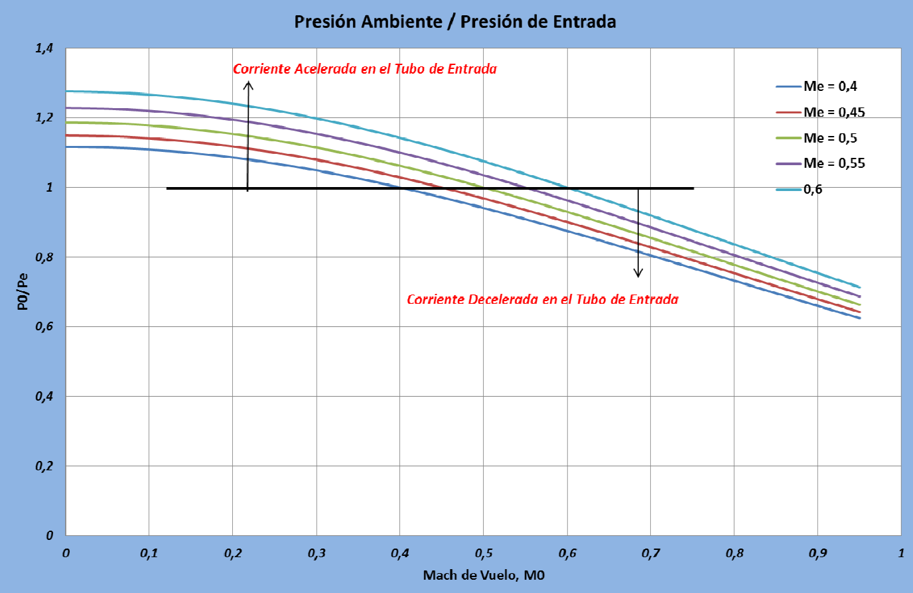

### Ecuación de la energía

- Trabajo de las fuerzas de viscosidad ≈ $M^2/R_e$ (despreciable)
- Calor evacuado por conducción ≈ 1/RePr (despreciable)

> u (energía interna), $v^2/2$  (energía cinética), h (entalpía). Empleando el concepto de entalpía la formulación es más simple.

> Desde el punto energético es imprescindible considerar la entalpía de combustible. La ecuación queda como la entalpía de remanso a la entrada + entalpía de combustible = entalpía de combustible (conservación de la entalpía de remanso). No hay intercambios energéticos con el exterior del sistema. Ha habido una transformación energética. Debido a que hay degradación energética la $T_s > T_e$

<eq>
$$
\iint_{\Sigma_{i} e, s} \rho\left(h+1 / 2 v^{2}\right)(\vec{v} \cdot \vec{n}) d \sigma=0 \Rightarrow\left\{\begin{array}{l}\iint_{\Sigma_{i}} \rho\left(h+1 / 2 v^{2}\right)(\vec{v} \cdot \vec{n}) d \sigma=0 \\\iint_{e} \rho\left(h+1 / 2 v^{2}\right)(\vec{v} \cdot \vec{n}) d \sigma=-\left\langle\rho_{e} V_{e} h_{e}\right\rangle A_{e}-1 / 2<\rho_{e} V_{e} V_{e}^{2}>A_{e}-c \cdot h_{c} \\\iint_{s} \rho\left(h+1 / 2 v^{2}\right)(\vec{v} \cdot \vec{n}) d \sigma=\left\langle\rho_{s} V_{s} h_{s}\right\rangle A_{s}+1 / 2<\rho_{s} V_{s} V_{s}^{2}>A_{s}\end{array}\right.
$$
</eq>

$$
\begin{aligned}&G \cdot [\langle h_{e} \rangle + 1 / 2 \langle V_{e}^{2} \rangle ] + c \cdot h_{c}= G_{s} [\langle h_{s} \rangle + 1 / 2 \langle V_{s}^{2} \rangle ] \\ & G \langle h_{te} \rangle + c \cdot h_{f} = (G+c) \langle h_{ts} \rangle \end{aligned}
$$

- Como $G \langle h_{t0} \rangle = G \langle h_{te} \rangle$

$$
G \cdot h_{t 0}+c \cdot h_{c}=(G+c) \cdot h_{ts}
$$

PROBLEMA-Ecuación de la energía en el tubo de corriente 0-e

PROBLEMA-Ecuación de la energía en el tubo de corriente 0-e:

- Aplicación en ejes motor: movimiento estacionario

- Aplicación en ejes absolutos: movimiento no estacionario

La $T_e$ parece ser distintas con el sistema de referencia! No!

Esto no puede suceder, la temperatura estática no puede depender del sistema de referencia

Explicación:

Si el movimiento no es estacionario la entalpía de remanso no se conserva, no se anula el término no estacionario.

$$
\frac{Dh_{0t}}{Dt}=\frac{\partial P}{\partial t}
$$

---

**La principal diferencia de esta ecuación, respecto a las anteriores, es que es función de las sustancias intervinientes**, ya que las entalpías lo son

<eq>
$$
G\left[h_{a}\left(T_{0}\right)+\frac{V_{0}^{2}}{2}\right]+\operatorname{ch}_{c}\left(T_{i}\right)=(G+c)\left[h_{p}\left(T_{s}\right)+\frac{V_{s}^{2}}{2}\right]
$$
</eq>

> Tenemos que definir la reacción de combustión, de oxidación a partir del aire y combustible a $H_{2}0$ + $CO_{2}$ + ... Lo que haremos es asociar la reacción perfecta con la reacción real a través de un rendimiento.

- Normalmente, **la capacidad energética de los combustibles se caracteriza por su poder calorífico** y no por su entalpía.

- Poder calorífico inferior del combustible, L

    Es un valor para los hidrocarburos 42 MJ/Kg y muy constante. No se utiliza la entalpía porque no es práctico y muy variable

    - Es el calor generado al quemar la unidad de masa del combustible con aire en relación estequiométrica (k=1/f masa de aire), a la presión de una 1 atm y temperatura de referencia de 25 ºC (Tº), cuando el agua formada queda en estado vapor

    <eq>
    $$
    L=h_{c}^{*}+\frac{\left(1+\frac{\lambda}{4}\right) M_{m}^{o_{2}} h_{O_{2}}^{*}-M_{m}^{C O_{2}} h_{C O_{2}}^{*}-\frac{\lambda}{2} M_{m}^{H_{2} O} h_{H_{2} O}^{*}}{M_{m}^{C}+\lambda M_{m}^{H}}= h_{c}^{*}+ \frac{(1+\lambda / 4) M_{m}^{O_{2}}}{M_{m}^{C}+\lambda M_{m}^{H}} h_{O_{2}}^{*}-\frac{M_{m}^{C O_{2}}}{M_{m}^{C}+\lambda M_{m}^{H}} h_{C O_{2}}^{*}-\frac{\lambda / 2 M_{m}^{H_{2} O}}{M_{m}^{C}+\lambda M_{m}^{H}} h_{H_{2} O}^{*}
    $$
    </eq>

    > Tendremos p productos de combustión. Si la combustión es completa solo aparece $CO_{2}$ y $H_{2}O$. Se maneja unidades de mol.

- **Proceso de combustión completa de un hidrocarburo**

    Es aquel proceso en donde se quema (oxida) completamente un combustible basado en hidrocaburos para obtener dióxido de carbono y agua.

    > $\lambda$ : Átomos de hidrógeno / átomos de carbono (m/n)
    > El combustible se puede dar como $C_nH_m$ → $CH_\lambda$

    <eq>
    $$
    \text { Combustión }\left\{\begin{array}{l}\text { Hidrocarburo } \quad C_{n} H_{m} \\\text { Aire }:\left(\alpha_{0} O_{2}+\alpha_{i} R_{i}\right)\end{array} \quad \lambda=m / n\right.
    $$
    </eq>

    - Reacción química: por unidad de mol de combustible, dividimos entre n

    $$
    C_{n} H_{m}+\frac{1}{\alpha_{0}}\left(n+\frac{m}{4}\right)\left(\alpha_{0} O_{2}+\alpha_{i} R_{i}\right)=n C O_{2}+\frac{m}{2} H_{2} O+\left(n+\frac{m}{4}\right) \frac{\alpha_{i}}{\alpha_{0}} R_{i}
    $$

    - Relación Estequiométrica: $k=1/f$

    $$
    k=\frac{\frac{1}{\alpha_{0}}\left(n+\frac{m}{4}\right) M_{m}^{a}}{M_{m}^{comb}}=\frac{\frac{1}{\alpha_{0}}\left(1+\frac{\lambda}{4}\right) n M_{m}^{a}}{n M_{m}^{C}+m M_{m}^{H}}=\frac{\frac{1}{\alpha_{0}}\left(1+\frac{\lambda}{4}\right) M_{m}^{a}}{M_{m}^{C}+\lambda M_{m}^{H}}
    $$

    - Poder calorífico:

    <eq>
    $$
    \begin{aligned}L=& \frac{H_{c}^{*}+\left(1+\frac{\lambda}{4}\right) H_{a}^{*}-H_{C O_{2}}^{*}-\frac{\lambda}{2} H_{H_{2} O}^{*}-\left(1+\frac{\lambda}{4}\right) \alpha_{i} H_{R_{i}}^{*}}{M_{m}^{C}+\lambda M_{m}^{H}} \\=&\frac{{H_{c}^{*}+\left(1+\frac{\lambda}{4}\right) H_{O_{2}}^{*}-H_{C O_{2}}^{*}-\frac{\lambda}{2} H_{H_{2} O}^{*}}}{M_{m}^{C}+\lambda M_{m}^{H}}\end{aligned}
    $$
    </eq>

    <eq>
    $$
    H_{O_{2}}^{*}=0, \quad H_{C O_{2}}^{*}=-94,054 \mathrm{kcal} / \mathrm{mol}, \quad H_{H_{2} O}^{*}=-57,798 \mathrm{kcal} / \mathrm{mol}
    $$
    </eq>

    <eq>
    $$
    G h_{a}\left(T_{0}\right)+\left.c \Delta h_{c}\right|_{*} ^{i}+c L-\underbrace{c\left[\frac{(1+\lambda / 4) M_{m}^{O_{2}}}{M_{m}^{C}+\lambda M_{m}^{H}} h_{O_{2}}^{*}-\frac{M_{m}^{C O_{2}}}{M_{m}^{C}+\lambda M_{m}^{H}} h_{c O_{2}}^{*}-\frac{\lambda / 2 M_{m}^{H_{2} O}}{M_{m}^{C}+\lambda M_{m}^{H}} h_{H_{2} O}^{*}\right]}_{\textrm{Error al suponer } ch_{c} = cL} = (G+c) h_{p}\left(T_{s}\right)+(G+c) \frac{V_{s}^{2}}{2}-G \frac{V_{0}^{2}}{2}
    $$
    </eq>

    > parte de la entalpía es por lo que es y otra por la temperatura a la que se encuentra
    > - L = entalpía que hay en la parte derecha / entalpía parte izda
    > - La entalpía que aparece es por átomo de carbono $\rightarrow n=1$

    - $c\Delta h_c| = C_p \Delta(T_i-T^*)$ entalpía sensible, no tiene que ver con la química.

    Usando:

    <eq>
    $$
    (G+c) h_{\mathrm{pcc}}^{*}=G h_{a}^{*}-c \frac{(1+\lambda / 4) M_{m}^{O_{2}}}{M_{m}^{C}+\lambda M_{m}^{H}} h_{O_{2}}^{*}+c \frac{M_{m}^{C O_{2}}}{M_{m}^{C}+\lambda M_{m}^{H}} h_{C O_{2}}^{*}+c \frac{\lambda / 2 M_{m}^{H_{2} O}}{M_{m}^{C}+\lambda M_{m}^{H}} h_{H_{2} O}^{*}
    $$
    </eq>

    > Entalpía de productos de combustión completa = Aire - $0_2$ utilizado para reaccionar + $C0_2$ + $H_20$

    <eq>
    $$
    \left.G \Delta h_{a}\right|_{*} ^{0}+\left.c \Delta h_{c}\right|_{*} ^{i}+c L= \underbrace{(G+c) h_{p}\left(T_{s}\right)-(G+c) h_{p c c}^{*}}_{(G+c)\left[h_{p}\left(T_{s}\right)-h_{p c c}^{*}\right]=(G+c)\left\{\begin{array}{l}
    {\left[h_{p}\left(T_{s}\right)-h_{p c c}\left(T_{s}\right)\right]} \\
    {\left[h_{p c c}\left(T_{s}\right)-h_{p c c}\left(T_{0}\right)\right]} \\
    {\left[h_{p c c}\left(T_{0}\right)-h_{p c c}^{*}\right]}
    \end{array}\right.}+ \underbrace{(G+c) \frac{V_{s}^{2}}{2}-G \frac{V_{0}^{2}}{2}}_{\textrm{cinemática, por aumentar V}}
    $$
    </eq>

    > Se quiere separar el concepto de química con la termodinámica, por eso se desarrolla $(G+c) h_{p}\left(T_{s}\right)-(G+c) h_{p c c}^{*}$:

    1. $p→ pcc (T_{s})$ (lo que debería haber habido en combustión completa) → $\eta_{q}$

    2. $T_{s} → T_{0} (pcc)$

    3. $T_{0} → T^{*} (pcc)$

    <eq>
    $$
    \begin{matrix}
    (G+c) h_{p}\left(T_{s}\right)-(G+c) h_{p c c}^{*}= \\ \left.(G+c) \Delta h_{p c c}\right|_{*} ^{0}+(G+c)\left[h_{p c c}\left(T_{s}\right)-h_{p c c}\left(T_{0}\right)\right]+(G+c) \underbrace{\left[h_{p}\left(T_{s}\right)-h_{pcc}\left(T_{s}\right)\right]}_{\eta_q}
    \end{matrix}
    $$
    </eq>

- Rendimiento de la combustión

  El término subrayado del lado derecho representan un incremento de entalpía química ya que están a la misma temperatura, y son debidos a que la combustión no ha sido completa; y permiten definir un rendimiento de la combustión, $η_{q}$

  $$
  \eta_{q} c L=c L-(G+c)\left[h_{p}\left(T_{s}\right)-h_{p c c}\left(T_{s}\right)\right] \rightarrow \quad \eta_{q}=1-\frac{(G+c)\left[h_{p}\left(T_{s}\right)-h_{p c c}\left(T_{s}\right)\right]}{c L}
  $$

  > El análisis de gases permite obtener $\eta_{q}$

  Introduciendo el concepto de rendimiento de la combustión, la ecuación de la energía queda

  <eq>
  $$
  \begin{matrix}
  \underbrace{\left.G \Delta h_{a}\right|_{*} ^{0}+\left.c \Delta h_{c}\right|_{*} ^{i}-\left.(G+c) \Delta h_{p c c}\right|_{*} ^{0}}_{3\%}+\eta_{q} c L= \\ (G+c) \underbrace{\left[h_{p c c}\left(T_{s}\right)-h_{p c c}\left(T_{0}\right)\right]}_{\Delta S}+(G+c) \frac{V_{s}^{2}}{2}-G \frac{V_{0}^{2}}{2}
  \end{matrix}
  $$
  </eq>

  Los términos subrayados del lado izquierdo se corresponden con un incremento de entalpía sensible de reactantes y productos de una combustión completa, en relación estequiométrica, para llevarlos desde la temperatura de entrada a la temperatura de referencia $\Delta h|_{e}^{*}$ este término puede suponer, en casos extremos, del orden del 3%.

- Combustión diluida

  En el caso de una combustión en exceso de aire (combustión diluida), se pueden realizar las siguientes aproximaciones

  - Respecto a las masas

    $$
    k c<G \Rightarrow k f<1 \Rightarrow f<\frac{1}{k}=f_{e s t} \Rightarrow c \ll G \Rightarrow f \cong 1
    $$

  - Respecto a las entalpías de los productos de combustión

    $$
    (G+c)\left[h_{p c c}\left(T_{s}\right)-h_{p c c}\left(T_{0}\right)\right] \approx G\left[h_{a}\left(T_{s}\right)-h_{a}\left(T_{0}\right)\right]
    $$

  - La ecuación queda como un aporte de calor, $Q_{añadido}$, desde el exterior:

    <eq>
    $$
    Q_{\text {añadido }}=\eta_{q} c L+\left.c \Delta h\right|_{e} ^{*}=G\left[h_{a}\left(T_{s}\right)-h_{a}\left(T_{0}\right)\right]+G\left(\frac{V_{s}^{2}}{2}-\frac{V_{0}^{2}}{2}\right)
    $$
    </eq>

  > Combustión diluida → flujo congelado→$\eta_q = GC_P(T_{4t}-T_{3t})$

  - Por tanto, para combustiones diluidas se puede suponer que el proceso de 
  combustión y el de añadir calor son cuantitativamente equivalentes. No así 
  cualitativamente. De forma intensiva quedaría

  <eq>
  $$
  f\left(\eta_{q} L+\left.\Delta h\right|_{e} ^{*}\right)=\left[h_{a}\left(T_{s}\right)-h_{a}\left(T_{0}\right)\right]+\frac{V_{s}^{2}-V_{0}^{2}}{2}=C_{p a}\left(T_{s}-T_{0}\right)+\frac{V_{s}^{2}-V_{0}^{2}}{2}
  $$
  </eq>

  

- Rendimiento de la combustión (caso práctico)

  - Como queda de manifiesto en la expresión de la ecuación de la energía, los únicos productos que se deberían obtener después de una combustión diluida son aire, CO2 y H2O
  - No obstante, aparece una gran cantidad de productos distintos a los anteriores.
  - Estos son los responsables del rendimiento de la combustión como se observa en la ecuación del rendimiento de la combustión.
  - Sin embargo, analizando los productos de una combustión real, solo el CO, H2 y los hidrocarburos sin quemar son los que tiene efectos energéticos (o sea, “su Δ de entalpía al oxidarse es muy superior al resto”) y por tanto son los causantes de que el rendimiento de la combustión no sea uno
  - El calor por unidad de tiempo, Q, que dichos productos aportarían si se transformaran completamente en CO2 y H2O, sería el incremento de entalpías entre los productos de la combustión y los de una combustión completa; por consiguiente, la expresión del rendimiento de combustión se puede poner como

  $$
  \eta_{q}=1-Q / c L
  $$

  > Los incrementos de entalpía en la formación del NOx son despreciables

  - Si $m_{CO}, m_{H2} , m_{HC}$ se corresponden con los gastos másicos obtenidos de CO, H2 y HC respectivamente, y $Q_{CO}$ , $Q_{H2}$ y $Q_{HC}$ son sus respectivos poderes caloríficos, se tiene

    $$
    \begin{matrix}
    \eta_{q}=1-\frac{m_{C O} Q_{C O}+m_{H_{2}} Q_{H_{2}}+m_{H C} Q_{H C}}{c L}= \\ 1-\frac{E I_{C O} Q_{C O}+E I_{H_{2}} Q_{H_{2}}+E I_{H C} Q_{H C}}{1000 L}
    \end{matrix}
    $$

    > Incluso en el equilibrio a alta temperatura se da disociación por lo que existe H2, C0, etc.

    - En la última expresión se ha utilizado el índice de emisión El que se define como los gramos del producto por kilogramo de combustible.
    - CO → 50 unidades de IE equivalen a ≈ 1 % en rendimiento
    - HC → 10 unidades de IE equivalen a ≈ 1 % en rendimiento

    - Para temperaturas cercanas a la estequiométrica, por encima de unos 1900 K), existen en el equilibrio cantidades de los productos que intervienen en la expresión del rendimiento.
    - En este caso, para calcular el rendimiento de la combustión, habría que restar las cantidades del equilibrio a las cantidades que aparezcan de los productos anteriormente mencionados.

    

    - Unidades: ppm, ppmv

### Balance energético

- Combinando la ecuación de la energía y la de la cantidad de movimiento multiplicada por $V_0$ y sumando $cV_0^2/2$

<eq>
$$
\left.\begin{array}{l}\eta_{q} c L=(G+c)\left[h_{a}\left(T_{s}\right)-h_{a}\left(T_{0}\right)\right]+1 / 2\left[(G+c) V_{s}^{2}-G V_{0}^{2}\right] \\\left.E V_{0}=(G+c) V_{s} V_{0}-G V_{0}^{2} \quad \text { (Sistema Adaptado } P_{s}=P_{0}\right)\end{array}\right\}
$$
</eq>

> En ejes relativos no veo la potencia útil $EV_0$, por tanto utilizo la ecuación de cantidad de movimiento multiplicando por $V_0$. Sumo las dos ecs. para que aparezca la potencia útil:

$$
\eta_{q} c L+\frac{c V_{0}^{2}}{2}=E V_{0}+1 / 2\left[(G+c) V_{s}^{2}-G V_{s} V_{0}\right]+G V_{0}^{2}+(G+c)\left[h_{a}\left(T_{s}\right)-h_{a}\left(T_{0}\right)\right]+\frac{c V_{0}^{2}}{2}
$$

> Ecuación de la energía en ejes absolutos:

<eq>
$$
\underbrace{\eta_{q} c L+\frac{c V_{0}^{2}}{2}}_{\textrm{Potencia consumida}}= \underbrace{\underbrace{E V_{0}}_{\textrm{P. útil}}+ \underbrace{1 / 2(G+c)\left(V_{s}-V_{0}\right)^{2}}_{\textrm{Potencia mecánica perdida}}}_{\textrm{Potencia mecánica obtenida}}+\underbrace{(G+c)\left[h_{a}\left(T_{s}\right)-h_{a}\left(T_{0}\right)\right]}_{\textrm{Potencia térmica perdida}}
$$
</eq>

- Rendimientos
  - Rendimiento motor:

    > Se quiere ver solo el ciclo Brayton. Solo interesa la potencialidad del ciclo para pasar Q a $E_m$. Se hace los cálculos con tobera adaptada (no se pone la velocidad de salida real, sino la adaptada), se exige que el ciclo de la mayor energía mecánica

    <eq>
    $$
    \begin{matrix}\eta_{M}=\frac{\text { Potencia Mecanica Neta }}{\text { Potencia Combustible }}=\frac{E V_{0}+1 / 2(G+c)\left(V_{s}-V_{0}\right)^{2}-1 / 2 c V_{0}^{2}}{c L}= \\ =\frac{1 / 2(G+c) V_{s}^{2}-1 / 2 G V_{0}^{2}}{c L}=\frac{1}{2} \frac{(1+f) V_{s}^{2}-V_{0}^{2}}{f L}\end{matrix}
    $$
    </eq>

  - Rendimiento de propulsión:

    <eq>
    $$
    \begin{matrix}\eta_{P}=\frac{\text { Potencia Util }}{\text { Potencia Mecanica Neta }}=\frac{E V_{0}}{E V_{0}+1 / 2(G+c)\left(V_{s}-V_{0}\right)^{2}-1 / 2 c V_{0}^{2}}= \\ =\frac{E V_{0}}{1 / 2(G+c) V_{s}^{2}-1 / 2 G V_{0}^{2}}=\frac{2 I_{s p} V_{0}}{(1+f) V_{s}^{2}-V_{0}^{2}} \approx \frac{2 V_{0}}{V_{s}+V_{0}}\end{matrix}
    $$
    </eq>

  - Rendimiento motopropulsivo o global

    <eq>
    $$
    \eta_{\mathrm{MP}}=\frac{\text { Potencia Util }}{\text { Potencia Combustible }}=\eta_{M} \eta_{P}=\frac{E V_{0}}{c L}=\frac{I_{s p} V_{0}}{f L}=\frac{V_{0}}{C_{E} L}
    $$
    </eq>

## Tema 4: Comportamiento Motor y Propulsor de los Turborreactores

### Nomenclatura del ciclo e hipótesis

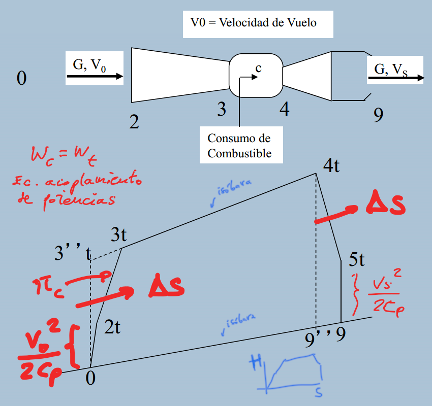

<eq>
$$
\begin{aligned} & c \ll G \\ & C_{p} \approx \text { Cte } ; \gamma \approx Cte \\ & P_{0} = P_{9 "}=P_{9} \textrm{  adaptado} \\ & P_{3^{\prime \prime} t}=P_{3t}=P_{4t} \\ & \frac{T_{3^{\prime \prime} t}}{T_{0}}=\frac{T_{4t}}{T_{9^{\prime}}} \\&\eta_{c}^{\prime}=\frac{T_{3^{\prime \prime} t}-T_{0}}{T_{3 t}-T_{0}} \textrm{  Rendimiento global del compresor} \\ & \eta_{e}^{\prime}=\frac{T_{4 t}-T_{9}}{T_{4 t}-T_{9 "}}\end{aligned}
$$
</eq>

En un ciclo ideal, `al ser líneas isoentrópicas` se cumple `$\frac{T_{3^{\prime \prime} t}}{T_{0}}=\frac{T_{4 t}}{T_{9^{\prime}}}$`
En cualquier rama isoentrópica se cumple que la relación de temperaturas entre sus extremos es cte. Necesario para un estudio analítico.

Para poder evaluar analíticamente el ciclo real:

- $V_s = 5t-9=(4t-9) - (4t-5t)$

En vez de hablar del rendimiento del compresor y turbina hablo del rendimiento de la etapa de compresión (rendimiento de compresión global) añadiendo elementos espurios. Es muy aproximadamente el del compresor, ya que la toma dinámica aporta poco.

Quiero relacionar cosas del final de la evolución con cosas al principio de la evolución.

$$
T_{5t}-T_{9"} = T_{4t}-T_{}
$$

### Comportamiento Motor: Potencia Neta

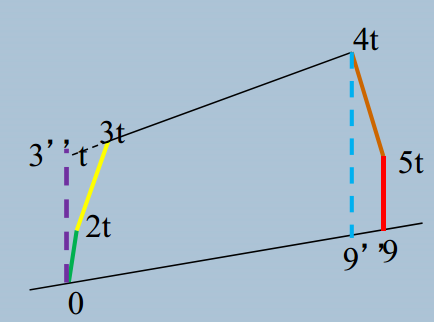

La potencia neta es: $W_{n}=G \frac{V_{s}^{2}-V_{0}^{2}}{2}$

$$
T_{5t}=T_{9t}=T_{9}+\frac{V_{9}^{2}}{2C_{p}}
$$

- La velocidad de salida es:
	- $T_{5t}=T_{9t}$
	- Por la ecuación de acoplamiento simplificada: $T_{4t}-T_{5t}=T_{3t}-T_{2t}$

  $$
  V_{s}^{2}=2 C_{p}\left(T_{5 t}-T_{9}\right)=2 C_{p}\left[\left(T_{4 t}-T_{9}\right)-\left(T_{4 t}-T_{5 t}\right)\right]=2 C_{p}\left[\left(T_{4 t}-T_{9}\right)-\left(T_{3 t}-T_{2 t}\right)\right]
  $$

- La velocidad de vuelo es:
	- $T_{2t}=T_{0t}$
  - $V_{0}^{2}=2 C_{p}\left(T_{2 t}-T_{0}\right)$

  Sustituyendo queda:

  <eq>
	$$
	W_{n}=\frac{G}{2}\left\{2C_{p}\left[\left(T_{4 t}-T_{9}\right)-\left(T_{3 t}-T_{2 t}\right)\right]-2C_{p}\left(T_{2 t}-T_{0}\right)\right\}
	$$
  </eq>

-  La potencia neta específica es la potencia por unidad de gasto, $W_{n}/G$
-  Adimensionalizando con la velocidad del sonido al cuadrado correspondiente a $T_{0}$ se llega a la potencia específica adimensional, $\omega_{n}$.

	> Al adimensionalizar las unidades lo pone el problema, no podemos adimencionalizar con V0 porque puede ser 0, por lo que adimensionalizamos con a0. Recordar que $C_{p}=\frac{\gamma}{\gamma -1} R$

	$$
	\omega_{n}=\frac{W_{n}}{G a_{0}^{2}}=\frac{1}{\gamma-1} \frac{1}{T_{0}}\left[\left(T_{4t}-T_{9}\right)-\left(T_{3 t}-T_{0}\right)\right]
	$$

-  Utilizando los rendimientos globales de compresión y expansión, $\eta_{c}^{'}$ y $\eta_{e}^{'}$
	> Con los rendimientos paso de $T_{4t}-T_{9t}$ a $T_{4t}-T_{9"}$ y $T_{3t}-T_{2t}$ a $T_{3"t}-T_{0}$. Paso del mundo real al ideal (el compresor quita más de lo que quita en el ideal y la expansión da menos de los que da en ideal).

  <eq>
	$$
	\begin{aligned}
	\omega_{n} &=\frac{W_{n}}{G a_{0}^{2}}=\frac{1}{\gamma-1} \frac{1}{T_{0}}\left[\eta_{e}^{\prime}\left(T_{4 t}-T_{9^{\prime}}\right)-\frac{\left(T_{3^{\prime \prime} t}-T_{0}\right)}{\eta_{c}^{\prime}}\right]= \\
	\quad &=\frac{1}{\gamma-1}\left[\eta_{e}^{\prime} \frac{T_{4 t}}{T_{0}}\left(1-\frac{T_{9^{\prime}}}{T_{4 t}}\right)-\frac{1}{\eta_{c}^{\prime}} \frac{T_{3^{\prime t}}}{T_{0}}\left(1-\frac{T_{0}}{T_{3^{\prime \prime} t}}\right)\right]=\frac{1}{\gamma-1}\left(\eta_{e}^{\prime} \frac{T_{4 t}}{T_{0}}-\frac{1}{\eta_{c}^{\prime}} \frac{T_{3^{\prime \prime} t}}{T_{0}}\right)\left(1-\frac{T_{0}}{T_{3^{\prime t}}}\right)
	\end{aligned}
	$$
  </eq>

  - $\frac{T_{9"}}{T_{4t}} =  \frac{T_{0}}{T_{3"t}}$

Se observa, que aparte de los parámetros de calidad (rendimientos), la potencia específica adimensional es, sólo, función de dos parámetros adimensionales del ciclo, $T_{4t}/T_{0}$ y $T_{3’’t}/T_{0}$, que son dos relaciones de temperaturas, correspondientes a las fases de expansión y compresión.

<eq>
$$
 \left\{\begin{array}{l} \textcolor{red}{\theta_{t} \equiv \frac{T_{4 t}}{T_{0}}} \\ \textcolor{red}{\theta_{0} \sigma_{c} \equiv \frac{T_{3^{\prime} t}}{T_{0}}}=\left(\frac{P_{3 t}}{P_{0}}\right)^{\frac{\gamma-1}{\gamma}}=\frac{T_{2 t}}{T_{0}} \frac{T_{3^{\prime} t}}{T_{2 t}}=\frac{T_{2 t}}{T_{0}}\left(\frac{P_{3 t}}{P_{2 t}}\right)^{\frac{\gamma-1}{\gamma}}\end{array}\right. \quad donde \quad \theta_{0}=T_{2 t} / T_{0}
$$
</eq>

 

La segunda imagen es el ciclo correspondiente al cero `$\eta_{c}^{\prime} \eta_{e}^{\prime} \theta_{t} / \theta_{0} \sigma_{c}=1$`

- Se obtiene finalmente
  $$
  \begin{matrix}
  \omega_{n} &=\frac{W_{n}}{G a_{0}^{2}}=\frac{1}{\gamma-1}\left(\eta_{e}^{\prime} \theta_{t}-\frac{\theta_{0} \sigma_{c}}{\eta_{c}^{\prime}}\right)\left(1-\frac{1}{\theta_{0} \sigma_{c}}\right) \\
  &=\frac{1}{\gamma-1} \frac{1}{\textcolor{blue}{\eta_{c}^{\prime}}}\left(\textcolor{blue}{\eta_{e}^{\prime} \eta_{c}^{\prime}} \frac{\textcolor{red}{\theta_{t}}}{\textcolor{red}{\theta_{0} \sigma_{c}}}-1\right)\left(\textcolor{red}{\theta_{0} \sigma_{c}}-1\right)
  \end{matrix}
  $$

  - $T_{3t} < T_{4t}$ ya que sino no produce calor, no es un motor

- La potencia neta se anula para

  $$
  \eta_{c}^{\prime} \eta_{e}^{\prime} \theta_{t} / \theta_{0} \sigma_{c}=1
  $$

  Esto ocurre cuando $T_{4t}=T_{3t}/(\eta_{c}^{'}\eta_{e}^{'})$

  - $\theta_{0}\sigma_{c}=1$,  esto ocurre **cuando no hay ningún mecanismo de compresión y por tanto la exergía es nula** y no se puede extraer trabajo mecánico del ciclo.
  - Ambos ciclos absorben calor y no dan potencia mecánica alguna.

- La potencia neta tiene un máximo para:

  <eq>
  $$
  \left.\theta_{0} \sigma_{c}\right|_{\omega_{n, \max }}=\sqrt{\eta_{e}^{\prime} \eta_{c}^{\prime} \theta_{t}}
  $$
  </eq>

  Se obtiene al hacer $\frac{\partial \omega_{n}}{\partial \theta_{0}\sigma_{c}}=0$

  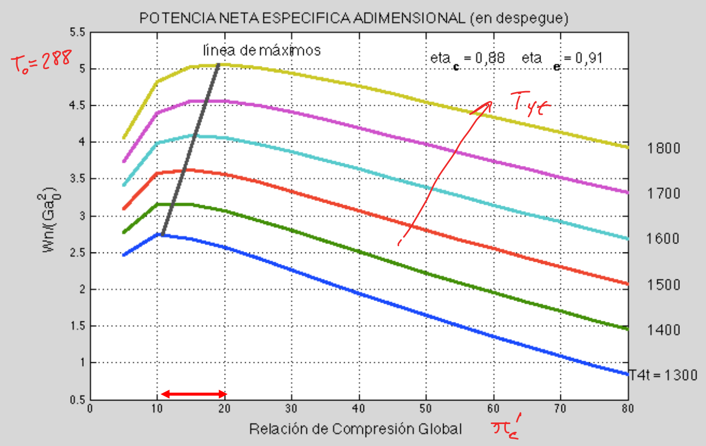

  > Interesa aumentar la $T_{4t}$. No estamos ahí ya que no se busca sola la potencia máxima.

  ​	

> El sistema motopropulsor no se puede físicamente dividir en propulsor y motor pero sí se puede clasificar las variables que producen según la funcionalidad.

- La potencia mecánica neta específica máxima vale

$$
\omega_{n, \max }=\frac{1}{\gamma-1} \frac{1}{\eta_{c}^{\prime}}\left(\sqrt{\eta_{e}^{\prime} \eta_{c}^{\prime} \theta_{t}}-1\right)^{2}
$$

### Comportamiento Motor: Calor Aportado

- Suponiendo que el calor es aportado desde el exterior y se corresponde con la cantidad $\eta_qcL$, la ecuación de la energía sería:

  > Se supone combustión diluida

  $$
  Q=\eta_{q} c L=G C_{p}\left(T_{4 t}-T_{3 t}\right)
  $$

- El calor por unidad de gasto y adimensionalizado, como antes la potencia neta específica, con la velocidad del sonido al cuadrado, q sería:

$$
q=\frac{Q}{G a_{0}^{2}}=\frac{\eta_{q} c L}{G a_{0}^{2}}=\frac{1}{\gamma-1}\left(\frac{T_{4 t}}{T_{0}}-\frac{T_{3 t}}{T_{0}}\right)
$$

- Utilizando el rendimiento global de compresión:

<eq>
$$
q=\frac{1}{\gamma-1}\left\{\frac{T_{4 t}}{T_{0}}-\left[1+\eta_{c}^{\prime}\left(\frac{T_{3^{\prime} t}}{T_{0}}-1\right)\right]\right\}=\frac{\textcolor{red}{\theta_{0} \sigma_{c}}}{\gamma-1}\left[\frac{\textcolor{red}{\theta_{t}}}{\textcolor{red}{\theta_{0} \sigma_{c}}}-\textcolor{blue}{\eta_{c}^{\prime}}-\frac{1-\textcolor{blue}{{\eta_{c}^{\prime}}}}{\textcolor{red}{\theta_{0} \sigma_{c}}}\right]
$$
</eq>

> Tenemos $\theta_t$ y $\theta_{0} \sigma_{c}$, la cámara de combustión solo ve la calidad del compresor, la expansión viene después.

- Que es función de los mismos dos parámetros adimensionales del ciclo que la potencia neta específica adimensional.

- El calor aportado decrece continuamente con la relación de compresión global.
- Como no podía ser de otra forma, es una cantidad mayor que la potencia neta obtenida.
- La relación entre ambas es el rendimiento motor.

### Comportamiento Motor: Rendimiento Motor

- Se define como rendimiento motor a la relación entre la potencia mecánica neta y el calor ideal, asociado con el consumo de combustible, cL.

  $$
  \eta_{M}=\frac{W_{n}}{c L}
  $$

- En función de los valores específicos obtenidos anteriormente sería:

  $$
  \eta_{M}=\eta_{q} \frac{\omega_{n}}{q}=\textcolor{blue}{\eta_{q}} \frac{\textcolor{blue}{\eta_{c}^{\prime} \eta_{e}^{\prime}} \textcolor{red}{\theta_{t}-\theta_{0} \sigma_{c}}}{\textcolor{blue}{\eta_{c}^{\prime}} \textcolor{red}{\theta_{t}-\theta_{0} \sigma_{c}} +1-\textcolor{blue}{\eta_{c}^{\prime}}}\left(1-\frac{1}{\textcolor{red}{\theta_{0} \sigma_{c}}}\right)
  $$

  > El numerador viene de la potencia específica, por lo que los valores que hacen cero el sistema son los mismos que los que hacen cero la potencia específica neta. El denominador viene del calor.
  > El primer término empequeñece al rendimiento motor ideal que es el segundo término.

- Otra vez se comprueba que es función de los dos parámetros adimensionales que caracterizan el ciclo y de las calidades.

- Se compone de dos términos. El último, como se verá, es el rendimiento motor de un ciclo ideal. El primero es un término que siempre vale menos (o igual) que la unidad, y se puede entender como un rendimiento de calidad del ciclo.

- El rendimiento motor se anula cuando lo hace la potencia específica.

- Como la potencia específica, el rendimiento motor presenta un máximo para una relación de compresión global determinada.

> Mucho mayor que lo que maximiza la potencia neta

<eq>
$$
\left.\theta_{0} \sigma_{c}\right|_{\eta_{M}, \max }=\frac{1-\sqrt{1-\left[\eta_{c}^{\prime}\left(\theta_{t}-1\right)+1\right]\left(1-\frac{\theta_{t}-1}{\eta^{\prime}_e \theta_{t}}\right)}}{1-\frac{\theta_{t}-1}{\eta^{\prime}_e \theta_{t}}}
$$
</eq>

- Esta `relación de compresión`, que maximiza el rendimiento motor, es `bastante mayor que la que maximiza la potencia neta`.

- Se tendrán dos tipos de ciclos extremos

  - aquellos que buscarán `maximizar la potencia específica`, y con ello el impulso específico , como los utilizados para aviación militar de alta actuación.
  - aquellos que busquen `mayores rendimientos motor`, para obtener un consumo específico menor, como los utilizados para el transporte aéreo.

  > A un avión civil se le exige 3000h/año mientras que para un avión millitar la vida es mas pequeña 300h/año, y por tanto puede funcionar con temperaturas más elevadas debido a la menor vida.

  

Relaciones de compresión 30-60. `Si aumenta la temperatura aumenta la potencia neta y el rendimiento motor. Es la variable potencial de mejora del ciclo y está limitada por limitaciones metalúrgicas.`

### Comportamiento Motor: Ciclo Ideal

-  Para obtener el comportamiento de un ciclo ideal basta con igualar todos los rendimientos, de combustión, de compresión global y de expansión global, a la unidad.

- La potencia mecánica neta específica sería
  $$
  \omega_{n, \text { ideal }}=\frac{1}{\gamma-1}\left(\frac{\textcolor{red}{\theta_{t}}}{\textcolor{red}{\theta_{0} \sigma_{c}}}-1\right)\left(\textcolor{red}{\theta_{0} \sigma_{c}} -1\right)
  $$

  Tendría un `valor máximo` para

  <eq>
  $$
  \left.\theta_{0} \sigma_{c}\right|_{\omega_{n, \max }}=\sqrt{\theta_{t}}
  $$
  </eq>

  que se correspondería con un ciclo tal que la temperatura de salida fuese igual a la temperatura de entrada a la cámara de combustión, $T_{9} = T’’_{3t}$

- La potencia calorífica suministrada sería
  $$
  q=\frac{1}{\gamma-1}\left[\textcolor{red}{\theta_{t}-\theta_{0} \sigma_{c}} \right]
  $$

- Por último, el rendimiento motor sería:

  $$
  \eta_{M}=\left(1-\frac{1}{\textcolor{red}{\theta_{0} \sigma_{c}}}\right) \quad \theta_{0} \sigma_{c} \sim (\frac{P_{3t}}{P_0})^{\frac{\gamma-1}{\gamma}}
  $$

  - Es solo función de la relación de compresión global, creciendo indefinidamente con ella.

  - Pero la `temperatura fin de combustión tiene su influencia ya que, para una temperatura fin de combustión dada, la temperatura a la salida del compresor no puede ser mayor` , lo que `limita` la `relación de compresión global` que se puede obtener, y con ella, el valor del `rendimiento motor`.

  - La `máxima relación de compresión global` que puede tener un ciclo es
    $$
    \theta_{0} \sigma_{c}=\theta_{t}
    $$

  - El `máximo valor de rendimiento motor` que se puede obtener es
    $$
    \eta_{M}=\left(1-\frac{1}{\textcolor{red}{\theta_{t}}}\right)
    $$

  - A la vista del anterior resultado, se puede ver el significado que tiene el “poder calorífico” del combustible

  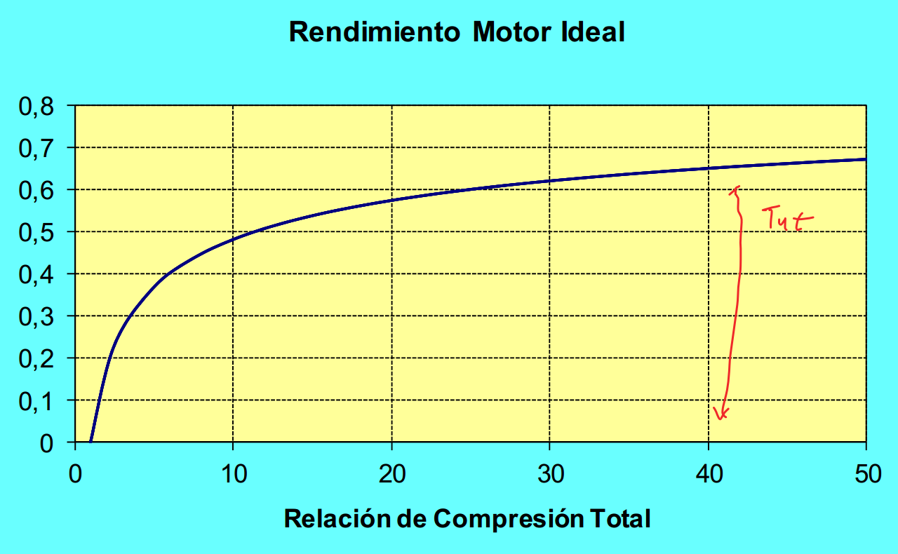

- La máxima cantidad de combustible que se puede consumir se corresponde con la relación estequiométrica, fest.

- Para un ciclo ideal y una temperatura dada, la máxima potencia específica vale

  <eq>
  $$
  \omega_{n, \max }=\frac{1}{\gamma-1}\left(\sqrt{\theta_{t}}-1\right)^{2}=\frac{\left(V_{s}^{2}-V_{0}^{2}\right)_{\max }}{2 a_{0}^{2}}
  $$
  </eq>

- El rendimiento motor correspondiente será:

  <eq>
  $$
  \eta_{M}=\left(1-\frac{1}{\sqrt{\theta_{t}}}\right)=\frac{\left(V_{s}^{2}-V_{0}^{2}\right)_{\max }}{2 f_{est} L}
  $$
  </eq>

- Eliminando de ambas ecuaciones $\sqrt{\theta_{t}}$ y teniendo en cuenta que
  $$
  f_{s t} L / a_{0}^{2}<<1
  $$

- Se llega a que el `máximo incremento de velocidad que se puede tener es proporcional al poder calorífico del combustible` (define la máxima energía cinética respecto a la entrada)

  <eq>
  $$
  V_{s}^{2}-\left.V_{0}^{2}\right|_{\max } \propto f_{est} L
  $$
  </eq>

### Representación Global del Ciclo

- Debido a que las variables adimensionales que caracterizan el ciclo Brayton, para una calidad del mismo dada, son solamente dos, se pueden integrar en una misma representación los valores de la potencia neta específica adimensional y del rendimiento motor en función de los dos parámetros del ciclo; su r`elación de temperatura`, $T_{4t}/T_{0}$ y su `relación de compresión global`, $P_{3t}/P_{0}$
- En esta representación se encuentran todos los ciclos Brayton que se pueden seleccionar para cumplir con lo especificado.
- Para obtener buenas características de potencia y de rendimiento `interesan ciclos con la mayor relación de temperatura posible`.
- Los motores para aviación militar de alta actuación, que primarán la potencia específica, tendrán que trabajar con relaciones de compresión más bajas que los motores usados en aviación de transporte subsónica, que primarán el rendimiento motor.

> Gráfica universal, podemos ver todos los ciclos a partir de los dos parámetros del ciclo y mostrando sus dos varaibles de calidad: rendimiento motor y potencia neta. Estan todos los ciclos Bryton que puede seleccionar.

 

### Sensibilidad del Ciclo a los Rendimientos

- Con las fórmulas analíticas es fácil obtener la sensibilidad de las características del motor a los parámetros de calidad: rendimientos.

  $$
  \begin{aligned}
  &\frac{\partial \omega_{n}}{\partial \eta_{c}^{\prime}}=\frac{1}{\gamma-1} \frac{\theta_{0} \sigma_{c}-1}{\eta_{c}^{\prime 2}} \\
  &\frac{\partial \omega_{n}}{\partial \eta_{e}^{\prime}}=\frac{1}{\gamma-1} \theta_{t}\left(\theta_{0} \sigma_{c}-1\right)
  \end{aligned}
  $$

- Se aprecia que la `sensibilidad al rendimiento de expansión` es $\theta_{t}\eta^{'2}_{c}$ veces `mayor que la sensibilidad al rendimiento de compresión`.

  <eq>
  $$
  \begin{aligned}
  &\frac{\partial \eta_{M}}{\partial \eta_{e}^{\prime}}=\eta_{q} \frac{\eta_{c}^{\prime} \theta_{t}}{\eta_{c}^{\prime} \theta_{t}-\theta_{0} \sigma_{c}+1-\eta_{c}^{\prime}}\left(1-\frac{1}{\theta_{0} \sigma_{c}}\right) \\
  &\frac{\partial \eta_{M}}{\partial \eta_{c}^{\prime}}=\eta_{q} \frac{\eta_{c}^{\prime} \theta_{t}\left(\eta_{c}^{\prime} \theta_{t}-\theta_{0} \sigma_{c}+1-\eta_{c}^{\prime}\right)-\left(\eta_{c}^{\prime} \eta_{e}^{\prime} \theta_{t}-\theta_{0} \sigma_{c}\right)\left(\theta_{t}-1\right)}{\left(\eta_{c}^{\prime} \theta_{t}-\theta_{0} \sigma_{c}+1-\eta_{c}^{\prime}\right)}
  \end{aligned}
  $$
  </eq>

- `La sensibilidad al rendimiento de expansión vuelve a ser mayor que la sensibilidad al rendimiento de compresión`; basta ver el cociente entre ambas expresiones

> El comportamiento motor: potencia mecánica neta y rendimiento motor dependen en forma adimensional de solo dos parámetros. En estos parámetros estan metidos la temperatura, presión, etc. Paricipan la toma dinámica y el compresor.  Interesa aumentar $T_{4t}-T_{0}$, es decir aumentar $T_{4t}$ o volar más alto → $T_{0}$

- **Resultados del Estudio de Sensibilidad de los Parámetros del Ciclo** (Variación del 1% del valor del parámetro)

| Avión Militar        | eta_q | eta_c | eta_e | T4t/T0 | P3t/PO |
| :------------------- | :---: | :---: | :---: | :----: | :----: |
| Potencia, %          |   0   | 1,01  | 2,02  |  2,03  | -0,37  |
| Rendimiento Motor, % |   1   | 0,52  | 2,02  |  0,24  |  0,44  |

| Avión Civil          | eta_q | eta_c | eta_e | T4t/T0 | P3t/PO |
| :------------------- | :---: | :---: | :---: | :----: | :----: |
| Potencia, %          |   0   | 1,63  | 2,65  |  2,62  | -1,13  |
| Rendimiento Motor, % |   1   | 0,83  | 2,65  |  0,46  |  0,1   |

- $\eta_M \sim \eta_q$

> Los valores de relación de compresión que maximizan la potencia mecánica son mucho menores ($\sim 24$) que los que maximizan el rendimiento motor ($\sim 40$).
> - $\eta_c$:  tiene mayor efecto sobre la potencia

> Tanto en aviones militares como civiles la relación de compresión se encontrará en la parte derecha de la curva $\omega-\pi$  tras el máximo.

> El rendimiento de expansión, $\eta_e$, tiene más efecto tanto en aviones militares como civiles que $\eta_c$

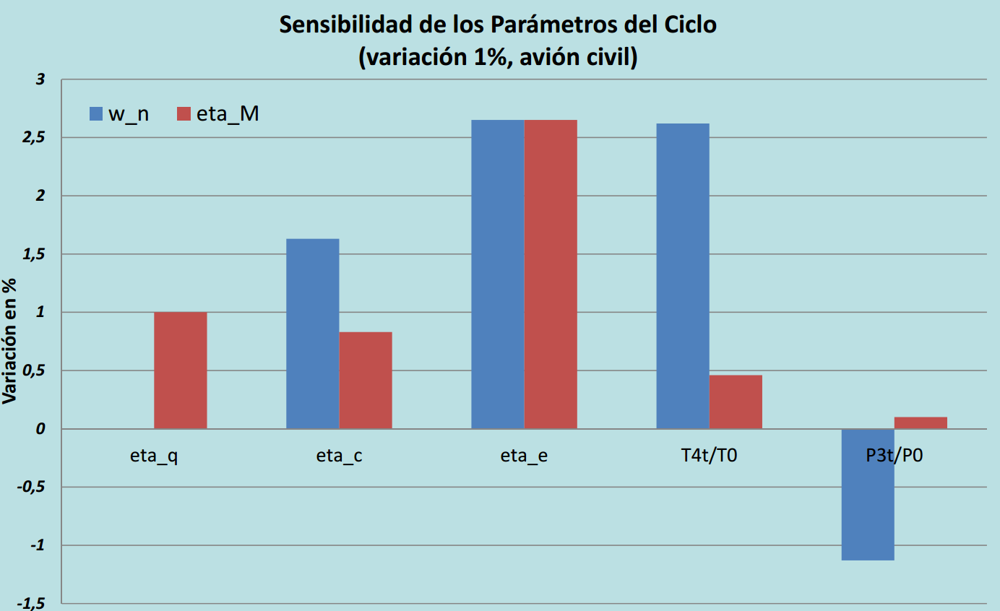 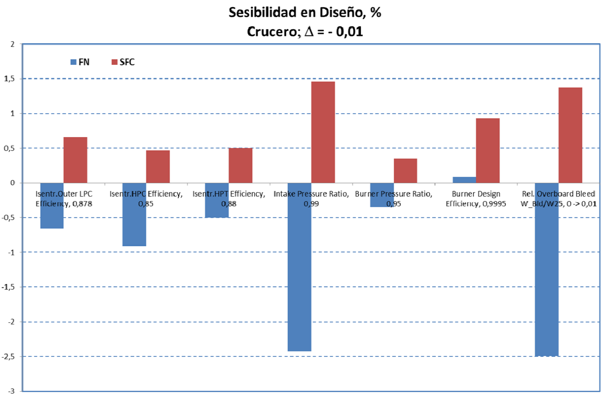

### Velocidad de Salida

- En nuestros sistemas motopropulsores, que producen un incremento de cantidad de movimiento al fluido que lo atraviesa, la variable fundamental a obtener será la velocidad de salida.

- En función de las características calculadas anteriormente es fácil llegar a:

  <eq>
  $$
  V_{s}=\sqrt{V_{0}^{2}+\frac{2 a_{0}^{2}}{\gamma-1} \frac{1}{\textcolor{blue}{\eta_{c}^{\prime}}}\left(\textcolor{blue}{\eta_{e}^{\prime} \eta_{c}^{\prime}} \frac{\textcolor{red}{\theta_{t}}}{\textcolor{red}{\theta_{0} \sigma_{c}}}-1\right)\left(\textcolor{red}{\theta_{0} \sigma_{c}} -1\right)}
  $$
  </eq>

  Los parámetros son : $T, P, M_{0}$

- Adimensionalizando con el cuadrado de la velocidad del sonido a la temperatura ambiente queda:

  <eq>
  $$
  \frac{V_{s}}{a_{0}}=\sqrt{\textcolor{red}{M_{0}^{2}} + \frac{2}{\gamma-1} \frac{1}{\textcolor{blue}{\eta_{c}^{\prime}}}\left(\textcolor{blue}{\eta_{e}^{\prime} \eta^{\prime}_{c}} \frac{\textcolor{red}{\theta_{t}}}{\textcolor{red}{\theta_{0} \sigma_{c}}}-1\right)\left(\textcolor{red}{\theta_{0} \sigma_{c}} -1\right)}=\sqrt{\textcolor{red}{M_{0}^{2}} +2 \omega_{n}}
  $$
  </eq>

  > El ciclo a una velocidad de vuelo le mete potencia mecánica

- En este caso aparece un nuevo parámetro adimensional: el Mach de vuelo

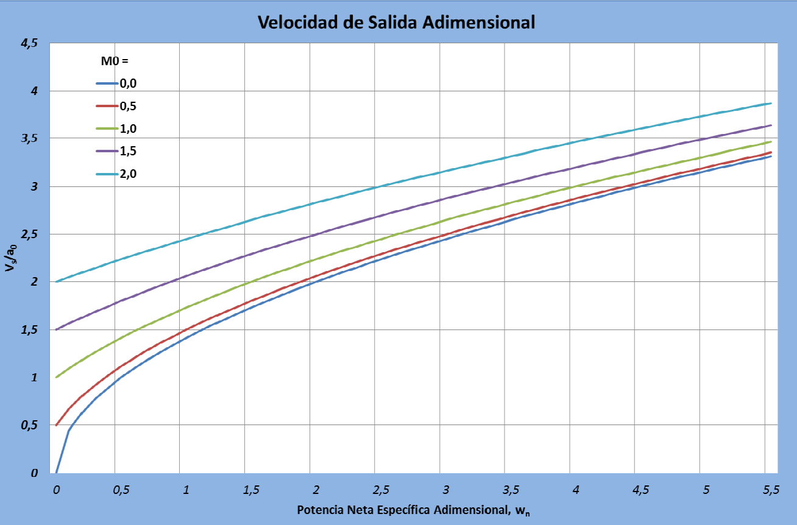

### Comportamiento Propulsor: Rendimiento de Propulsión

- El parámetro que caracteriza el comportamiento propulsivo es el rendimiento de la propulsión

  $$
  \eta_{P}=\frac{2 V_{0}}{V_{s}+V_{0}}=\frac{2}{V_{s} / V_{0}+1}
  $$

- Es función, como se había visto anteriormente, de la relación entre las velocidades de salida y de vuelo:

  <eq>
  $$
  \frac{V_{s}}{V_{0}}=\sqrt{1+\frac{1}{\textcolor{red}{M_{0}^{2}}}\left[\frac{2}{\gamma-1} \frac{1}{\textcolor{blue}{\eta_{c}^{\prime}}}\left(\textcolor{blue}{\eta^{\prime}_{e} \eta^{\prime}_{c}} \frac{\textcolor{red}{\theta_{t}}}{\textcolor{red}{\theta_{0} \sigma_{c}}}-1\right)\left(\textcolor{red}{\theta_{0} \sigma_{c}} -1\right)\right]}=\sqrt{1+\frac{2 \omega_{n}}{\textcolor{red}{M_{0}^{2}}}}
  $$
  </eq>

  > Cuando la potencia mecánica es 0 colapsa a 1 -> $V_s=V_0$

- Sustituyendo, se llega al rendimiento de la propulsión como función de la potencia específica adimensional y el Mach de vuelo:

  $$
  \eta_{P}=\frac{2}{\sqrt{1+\frac{2 \omega_{n}}{\textcolor{red}{M_{0}^{2}}}}+1}
  $$

  > Cualquier cosa que haga que la potencia neta adimensional suba hace que el rendimiento propulsivo baje. El Mach de vuelo sin embargo ayuda. Si el Mach de vuelo es suficientemente elevado puede ser compensado.

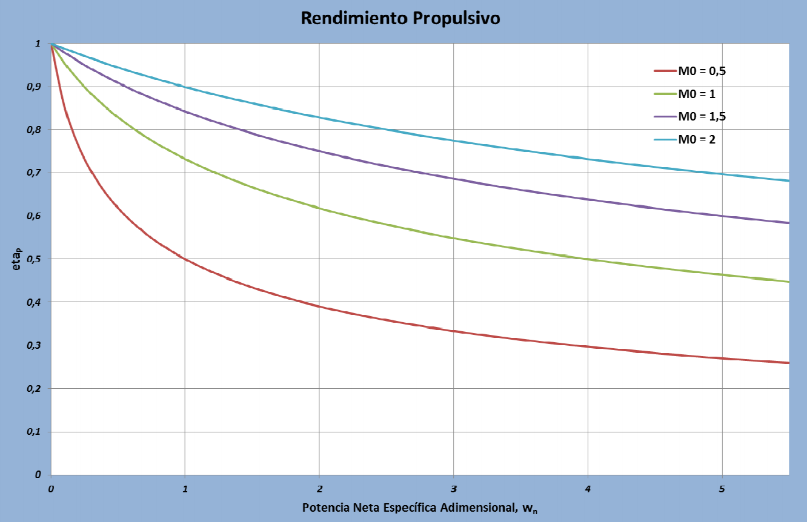

### Comportamiento Motopropulsor

- El empuje y el consumo son las característica motopropulsoras

- Como estás variables dependen del gasto (tamaño), para obtener características que dependan de la calidad del sistema, se definen variables intensivas relacionadas: Impulso y Consumo Específicos

- El Impulso Específico, Isp, es el empuje por unidad de gasto:

  $$
  I_{sp}=\frac{E}{G}=\frac{G\left(V_{s}-V_{0}\right)}{G}=V_{s}-V_{0}
  $$

- Tiene dimensiones de velocidad.

- En otro tipo de aplicaciones propulsivas, como en Motores Cohete donde el peso es una variable fundamental, se pueden dar los impulsos específicos como empuje por unidad de peso; en estos casos, el impulso específico tiene dimensiones de tiempo.

- Se puede obtener un Impulso Específico adimensional

  $$
  \frac{I_{sp}}{V_{0}}=\frac{V_{s}}{V_{0}}-1
  $$

-  Como el rendimiento propulsivo adimensional, es también sólo función de la relación entre las velocidades de salida y de vuelo.

- En función de las características del ciclo, quedaría

  > Impulso específico adimensional en función de $\omega_{n}$ y $M_{0}$

  $$
  \frac{I_{sp}}{V_{0}}=\sqrt{1+\frac{1}{\textcolor{red}{M_{0}^{2}}}\left[\frac{2}{\gamma-1} \frac{1}{\textcolor{blue}{\eta_{c}^{\prime}}}\left(\textcolor{blue}{\eta_{e}^{\prime} \eta_{c}^{\prime}} \frac{\textcolor{red}{\theta_{t}}}{\textcolor{red}{\theta_{0} \sigma_{c}}}-1\right)\left(\textcolor{red}{\theta_{0} \sigma_{c}}-1\right)\right]}-1=\sqrt{1+\frac{2 \omega_{n}}{\textcolor{red}{M_{0}^{2}}}}-1
  $$

- Otra variable de interés es la Potencia Útil por unidad de gasto:

  $$
  \frac{W_{u}}{G}=\frac{E V_{0}}{G}=\frac{G\left(V_{s}-V_{0}\right) V_{0}}{G}=V_{0}^{2}\left(\frac{V_{s}}{V_{0}}-1\right)
  $$

- Se aprecia, que si adimensionalizamos esta potencia específica con la velocidad de vuelo al cuadrado

  > La potencia útil adimensionaliza es función de la adimensionalización del impulso.

  $$
  \frac{W_{u}}{G V_{0}^{2}}=\left(\frac{V_{s}}{V_{0}}-1\right) \equiv \frac{I_{s p}}{V_{0}}
  $$

- El resultado es el Impulso Específico adimensionalizado con la velocidad de vuelo.

  > Un motor parado da mucho impulso, mal rendimiento motor pero mejor rendimiento propulsivo.

 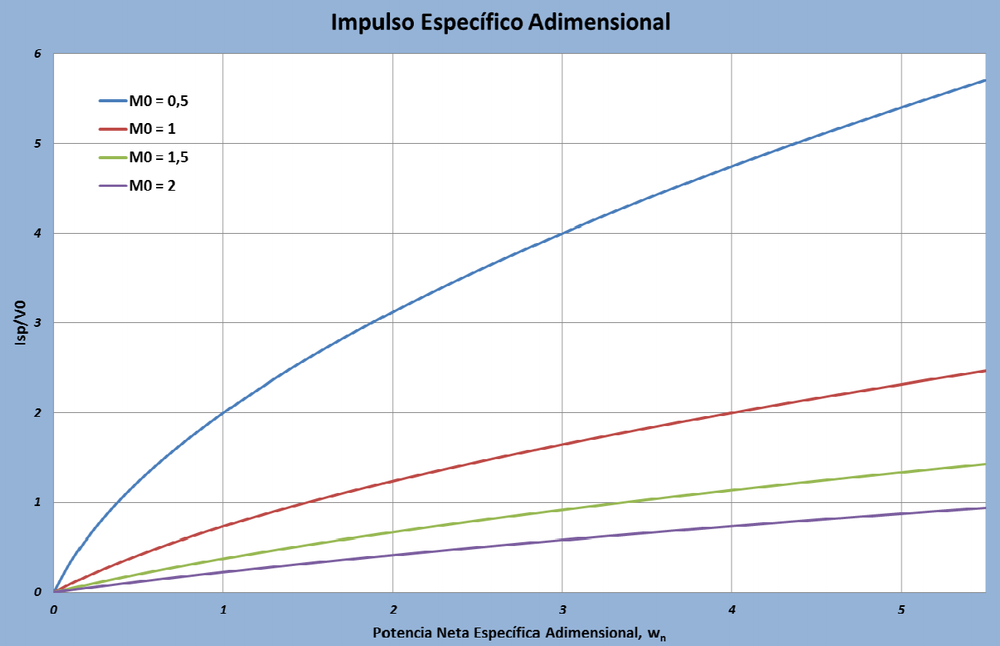

### Velocidad de Vuelo Distinta de Cero

> Adimensionalizar con algo que puede ser 0 es un problema. Cuando hablamos del mundo de la propulsión o motopropulsión si está permitido adimensionalizar con $V_0$ porque $V_0 \neq 0$ ya que si no no existe propulsión.

- Cuando existe velocidad de vuelo, se puede adimensionalizar todas las potencias mecánicas con el valor $GV_{0}^{2}$

  <eq>
  $$
  \begin{matrix}
  &W_{n}=\frac{G\left(V_{s}^{2}-V_{0}^{2}\right)}{2}=\frac{G V_{0}^{2}}{2}\left(\frac{V_{s}^{2}}{V_{0}^{2}}-1\right) \Rightarrow \quad \frac{W_{n}}{G V_{0}^{2}}=\frac{1}{2}\left(\frac{V_{s}^{2}}{V_{0}^{2}}-1\right) \\
  &W_{u}=E V_{0}=G\left(V_{s}-V_{0}\right) V_{0}=G V_{0}^{2}\left(\frac{V_{s}}{V_{0}}-1\right) \quad \Rightarrow \quad \frac{W_{u}}{G V_{0}^{2}}=\left(\frac{V_{s}}{V_{0}}-1\right)
  \end{matrix}
  $$
  </eq>

- Dividiendo ambas, se obtendría el rendimiento propulsivo

  $$
  \eta_{P}=\frac{2 V_{0}}{V_{s}+V_{0}}=\frac{2}{V_{s} / V_{0}+1}
  $$

- Eliminando $V_{s}/V_{0}$, se podría obtener una expresión $\eta_{P} = f(W_{u}/GV_{0}^{2})$

  $$
  \eta_{P}=\frac{2}{\frac{W_{u}}{G V_{0}^{2}}+2}=\frac{2}{\frac{I_{s p}}{V_{0}}+2}
  $$

  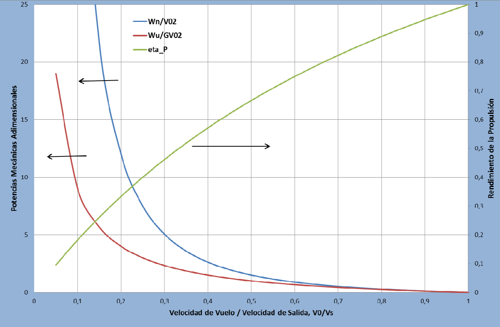 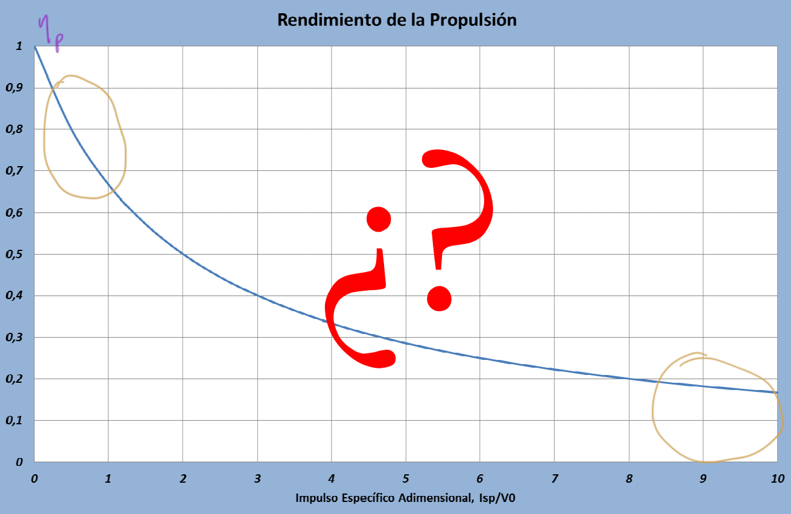

> Cosas que tienden a aumentar el impulso disminuyen el rendimiento propulsivo. Cualquier cosa que haga aumentar $\eta_{M}$ empeorará $\eta_{P}$

### Consumo específico

- Se define como el consumo de combustible por unidad de empuje.

  $$
  C_{E}=\frac{c}{E}=\frac{c L}{E V_{0}} \frac{V_{0}}{L}=\frac{1}{\eta_{M P}} \frac{V_{0}}{L}=\frac{1}{\eta_{M} \eta_{P}} \frac{V_{0}}{L}
  $$

- Es una medida de la bondad de los rendimientos motor y de propulsión, por lo que es una variable del comportamiento motopropulsivo del sistema.

- No obstante, cuando la velocidad de vuelo, $V_{0}$, tiende a cero, el rendimiento propulsivo tiende a cero como $V_{0}$:

  $$
  \lim_{V_{0} \rightarrow 0} C_{E}=\frac{1}{\eta_{M} L}
  $$

  > En el límite $V_{0} \rightarrow 0$, el consumo específico está viendo únicamente el rendimiento motor. En un banco estamos viendo el rendimiento motor.

- El consumo específico, en este caso, da una medida del comportamiento motor del sistema. O sea, en banco, el consumo específico de los motores es la inversa del rendimiento motor, mientras que en vuelo es la inversa de rendimiento motopropulsivo.

 

 

> Los aviones militares trabajan con relación de compresión algo mayor que el máximo para no castigar el rendimiento motor y los civiles algo menos del máximo de rendimiento motor.

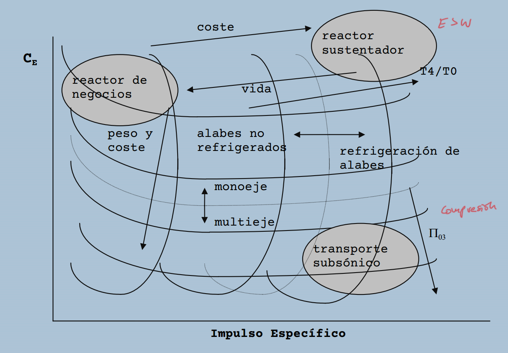

### Impacto del Consumo Específico en los Costes

- La importancia relativa del Consumo Específico respecto a otras características de los aerorreactores, para un avión civil queda reflejado en la siguiente tabla, donde se representa la equivalencia de la mejora de un 1% en el Consumo Específico

  |                     | Radio de Acción Bajo | Radio de Acción Medio | Radio de Acción Alto |
  | :------------------ | :------------------: | :-------------------: | :------------------: |
  | CE                  |         1,0%         |         1,0%          |         1,0%         |
  | Peso                |         6,5%         |          8%           |         11%          |
  | Precio              |          4%          |          5%           |          7%          |
  | Coste mantenimiento |         3,3%         |         5,7%          |        10,5%         |

> Es lo mismo cambiar un 1% el consumo que reuducir un 6% el peso.

A partir de un determiando ciclo Bryton queremos mejorar el rendimiento propulsivo

### Comportamiento a T4t Constante: Efecto de la Altura y Velocidad de Vuelo

> El problema de para un motor dado ver el efecto de la altura y velocidad de vuelo es un problema de actuaciones, de fuera de diseño. Las ecuaciones son las mismas pero la selección de parámetros es diferente.

> Tenemos $W_n = f(h, V, \pi_c, T_{4t}, \eta)$. Cuando cambiamos h, V y dejamos lo demás no estamos resolviendo un motor dado y ver que pasa cuando cambia la altura y velocidad sino que que le pasa a un motor con esa $T_{4t}$ y $\pi_c$ a distintas h, V. Un motor a h=0, V=0 y otro a h=11 V=0.8 al mismo $\pi_c$ ya que estamos viendo motores que tienen esa $\pi_c$ en distintas etapas: crucero, despegue. No se mantiene constante la $\pi_c$ ni las calidades al cambiar la condición de vuelo. Elige el comportamiento del compresor de un sistema ya construido.

> Un motor fuera de diseño no tiene libre $\eta, T_{4t}, \pi_c$ pero responde a la condición de vuelo.

- Los parámetros, que definen el comportamiento del ciclo son: $\theta_t$, $\theta_0 \sigma_c$

$$
\begin{aligned}
&\theta_{0} \sigma_{c}=\left(1+\frac{\gamma-1}{2} M_{0}^{2}\right) \pi_{d}^{\frac{\gamma-1}{\gamma}} \pi_{c}^{\frac{\gamma-1}{\gamma}}=1+\eta_{c}^{\prime}\left(\frac{V_{0}^{2}}{2 C_{p} T_{0}}+\frac{\tau_{c}}{C_{p} T_{0}}\right) \\
&\theta_{t}=\frac{T_{4 t}}{T_{0}}
\end{aligned}
$$

- En Diseño, es fácil ver el efecto que la altura ($P_{0}$ y $T_{0}$) y velocidad de vuelo, $V_{0}$ , producen; esto se denomina “cálculos del motor chicle” porque físicamente hay que ir cambiando de compresor para cada condición de vuelo.
- Si lo que se quiere es, para un motor dado, obtener el efecto de la altura y velocidad de vuelo, hay que calcular los efectos que dichas condiciones tienen sobre los rendimientos y relación de compresión del compresor. Estos cálculos se denominan “Fuera de Diseño”

- Ecuaciones del ciclo:

  <eq>
  $$
  \left.\begin{array}{l}
  W_{n} \\
  \eta_{M}
  \end{array}\right\} f\left(\theta_{t}, \theta_{0} \sigma_{c}, \eta_{j}\right)
  $$
  </eq>

  $$
  \theta_{0} \sigma_{c}=f\left(M_{0}, \pi_{c}, \eta_{j}\right)
  $$

- `Diseño` $\pi_c$, $T_{4t}$ y $\eta_{j}$ para una condición de vuelo
- `Fuera de Diseño`

  - Se fija $T_{0}$, $M_{0}$ y control ($T_{4t}, T_{4t}/T_{2t}, N...$)

    $$
    \begin{aligned}
    \pi_{c} &=f_{1}\left(T_{0}, M_{0}, \text { control }\right) \\
    \eta_{j} &=f_{2}\left(T_{0}, M_{0}, \text { control }\right)
    \end{aligned}
    $$

  - Hipótesis de funcionamiento

    <eq>
    $$
    \begin{aligned}
    &\eta_{j} \approx \text { Ctes, } \\
    &\tau_{c} \propto T_{4 t} \\
    &T_{4 t}=C t e \Rightarrow \textcolor{green}{\tau_{c} \approx Cte} \textrm{ en lugar de } \pi_c \approx cte
    \end{aligned}
    $$
    </eq>

  Al cálculo de las funciones anteriores y sus efectos se llama `ACTUACIONES`

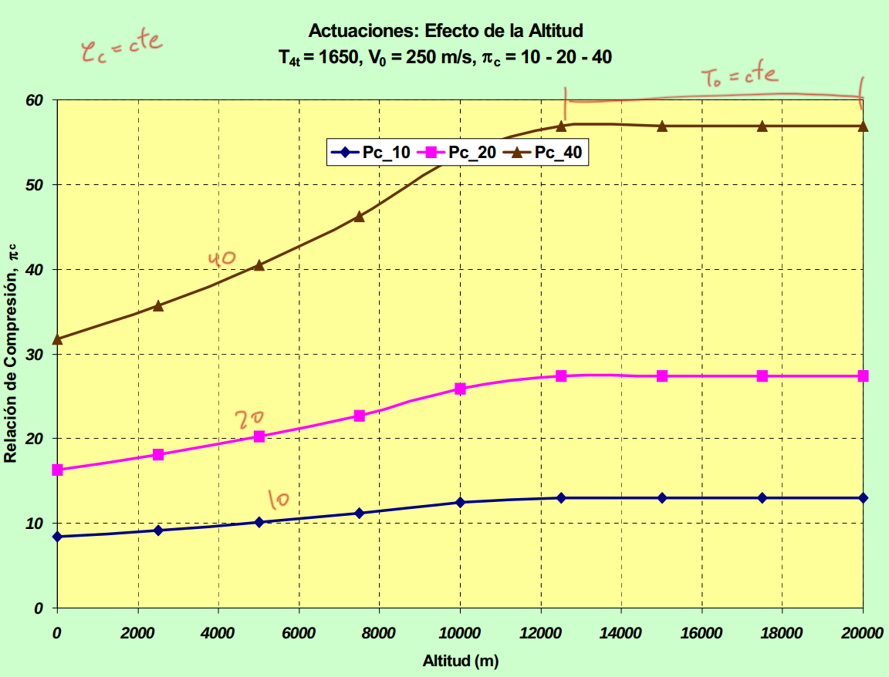 

 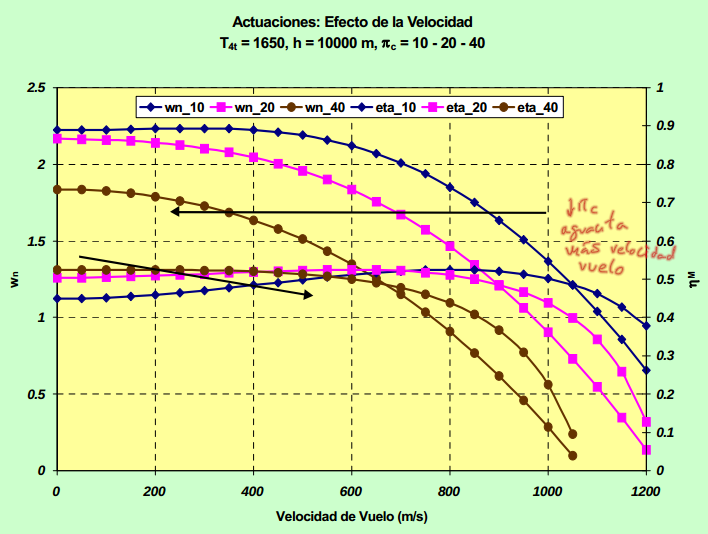

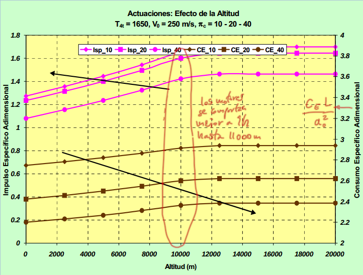 

- Las relaciones de compresión para trabajo específico $\tau_c \propto T_{4t}$ y rendimiento adiabático del compresor constantes deben cumplir:

  <eq>
  $$
  \frac{\pi_{c}^{\frac{\gamma-1}{\gamma}}-1}{\left(\pi_{c}^{*}\right)^{\frac{\gamma-1}{\gamma}}-1}=\frac{T_{2 t}^{*}}{T_{2 t}} \frac{\tau_{c}}{\tau_{c}^{*}}=\frac{T_{2 t}^{*}}{T_{2 t}} \frac{T_{4 t}}{T_{4 t}^{*}}=\frac{1}{\theta\left(1+\frac{\gamma-1}{2} M_{0}^{2}\right)} \frac{T_{4 t}}{T_{4 t}^{*}}
  $$
  </eq>

  <eq>
  $$
  \pi_{c}=\left[1+\frac{\left(\pi_{c}^{*}\right)^{\frac{\gamma-1}{\gamma}}-1}{\theta\left(1+\frac{\gamma-1}{2} M_{0}^{2}\right)} \frac{T_{4 t}}{T_{4 t}^{*}}\right]^{\frac{\gamma}{\gamma-1}}
  $$
  </eq>

  $$
  \eta= \frac{(\pi_c ^{\frac{\gamma-1}{\gamma}}-1 )T_{2t}}{\tau_c /c_p}
  $$

> La relación de compresión es inversamente proporcional a la temperatura de entrada y directamente proporcional a la temperatura fin de combustión.

### Cálculo del Gasto de aire

- Una vez conocido el comportamiento intensivo, es necesario calcular la variación del gasto para obtener las variables extensivas.

- Este cálculo se basa en que la geometría de la tobera no ha cambiado (el área de salida es constante, o conocida).

- Con los parámetros típicos de diseño, los turborreactores de flujo único funcionan con la tobera de salida en condiciones críticas (tobera bloqueada).

- El gasto crítico es  $G=f(\gamma) \frac{P_{5 t} A_{8}}{\sqrt{R T_{5 t}}}$

	- donde $f(\gamma)=\sqrt{\gamma}\left(\frac{2}{\gamma+1}\right)^{\frac{\gamma+1}{2(\gamma-1)}}$

- El trabajo específico del compresor es proporcional a la T4t.

  - $T_{5 t} \approx T_{4 t}-\tau_{c} / C_{p} \propto T_{4 t}$

- O sea, la temperatura de salida de la turbina, T5t, será proporcional a T4t y por consiguiente T5t/T4t debe permanecer constante.

- Suponiendo constante el rendimiento de la turbina. P5t/P4t , también permanecerá constante.

- El gasto critico se puede poner:

  $$
  G \propto f(\gamma) \frac{P_{4 t} A_{8}}{\sqrt{R T_{4 t}}}
  $$

- Usando de referencia los “valores nominales” (*), que son los valores en SLS y con la relación de compresión y temperatura fin de combustión de diseño:

  <eq>
  $$
  \begin{aligned}
  &\frac{G}{G^{*}}=\frac{P_{4 t}}{P_{4 t}^{*}} \sqrt{\frac{T_{4 t}^{*}}{T_{4 t}}}=\frac{P_{0}}{P_{0}^{*}} \frac{\pi_{c}^{\prime}}{\pi_{c}^{*}} \sqrt{\frac{T_{4 t}^{*}}{T_{4 t}}}=\delta \frac{\left(1+\frac{\gamma-1}{2} M_{0}^{2}\right)^{\frac{\gamma}{\gamma-1}} \pi_{d} \pi_{c}}{\pi_{d}^{*} \pi_{c}^{*}} \sqrt{\frac{T_{4 t}^{*}}{T_{4 t}}} \approx \\
  &\approx \delta\left(1+\frac{\gamma-1}{2} M_{0}^{2}\right)^{\frac{\gamma}{\gamma-1}}\left[1-0,076\left(M_{0}-1\right)^{1,35}\right] \frac{\pi_{c}}{\pi_{c}^{*}} \sqrt{\frac{T_{4 t}^{*}}{T_{4 t}}}
  \end{aligned}
  $$
  </eq>

- Las relaciones de compresión para trabajo específico y rendimiento adiabático del compresor constantes deben cumplir:

  <eq>
  $$
  \frac{\pi_{c}^{\gamma-1}}{\left(\pi_{c}^{*}\right)^{\frac{\gamma-1}{\gamma}}-1}=\frac{T_{2 t}^{*}}{T_{2 t}} \frac{\tau_{c}}{\tau_{c}^{*}}=\frac{T_{2 t}^{*}}{T_{2 t}} \frac{T_{4 t}}{T_{4 t}^{*}}=\frac{1}{\theta\left(1+\frac{\gamma-1}{2} M_{0}^{2}\right)} \frac{T_{4 t}}{T_{4 t}^{*}}
  $$
  </eq>

  <eq>
  $$
  \pi_{c}=\left[1+\frac{\left(\pi_{c}^{*}\right)^{\frac{\gamma-1}{\gamma}}-1}{\theta\left(1+\frac{\gamma-1}{2} M_{0}^{2}\right)} \frac{T_{4 t}}{T_{4 t}^{*}}\right]^{\frac{\gamma}{\gamma-1}}
  $$
  </eq>

- Sustituyendo en el gasto, se llega a:

  <eq>
  $$
  \frac{G}{G^{*}} \approx \frac{\textcolor{blue}{\delta}}{\textcolor{red}{\pi_{c}^{*}}}\left[1-0,076\left(\textcolor{blue}{M_{0}}-1\right)^{1,35}\right]\left[1+\frac{\gamma-1}{2} \textcolor{blue}{M_{0}^{2}}+\frac{\left(\textcolor{red}{\pi_{c}^{*}}\right)^{\frac{\gamma-1}{\gamma}}-1}{\theta} \frac{T_{4 t}}{\textcolor{red}{T_{4 t}^{*}}}\right]^{\frac{\gamma}{y-1}} \sqrt{\frac{T_{4 t}^{*}}{T_{4 t}}}
  $$
  </eq>

  - Para subsónico y a régimen constante

    <eq>
    $$
    \frac{G}{G^{*}} \approx \frac{\textcolor{blue}{\delta}}{\textcolor{red}{\pi_{c}^{*}}}\left[1+\frac{\gamma-1}{2} M_{0}^{2}+\frac{\left(\textcolor{red}{\pi_{c}^{*}}\right)^{\frac{\gamma-1}{\gamma}}-1}{\textcolor{blue}{\theta}}\right]^{\frac{\gamma}{\gamma-1}}
    $$
    </eq>

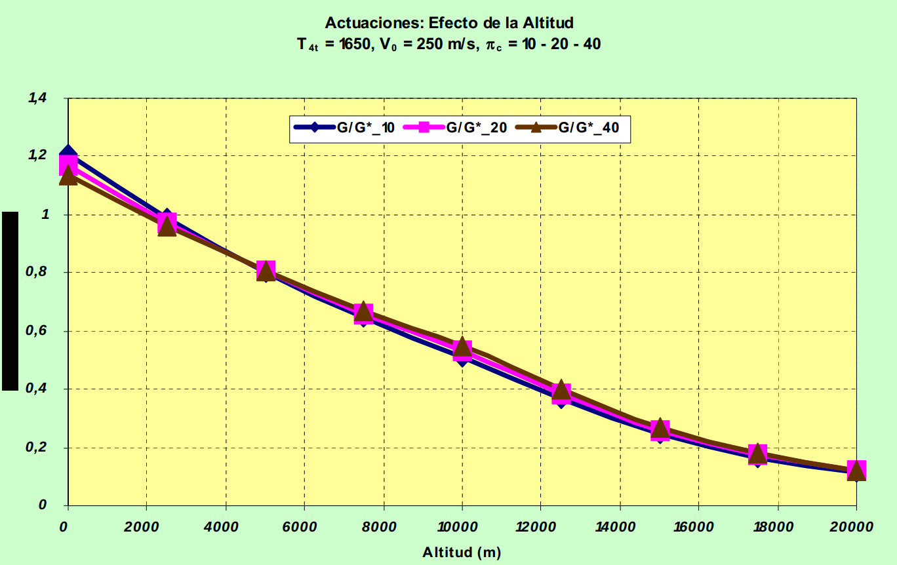 

<eq>
$$
\mathrm{M}_{0}<1 \quad \eta_{p} \downarrow \quad \eta_{M} \sim \quad \eta_{M p} \downarrow \quad \text { desacoplar } \eta_{p} \text { у } \eta_{M}
$$
</eq>

<eq>
$$
\begin{aligned}
\mathrm{M}_{0}>>1 & \pi_{23} \downarrow \quad \mathrm{T}_{4 \mathrm{t}} \uparrow \quad \text { limite } \pi_{23} &=1 \quad \mathrm{~T}_{4 \mathrm{t}}=\left(\mathrm{T}_{44}\right)_{\text {fest }} \\
&  \sigma_{c} =1
\end{aligned} \rightarrow Estatorreactor
$$
</eq>

### Comportamiento ideal del estatorreactor

$$
\omega_{n, \text { ideal }}=\frac{1}{\gamma-1}\left(\frac{\textcolor{red}{\theta_{t}}}{\textcolor{red}{\theta_{0}}}-1\right)\left(\textcolor{red}{\theta_{0}}-1\right) \quad \eta_{M, i}=\left(1-\frac{1}{\textcolor{red}{\theta_{0}}}\right)
$$

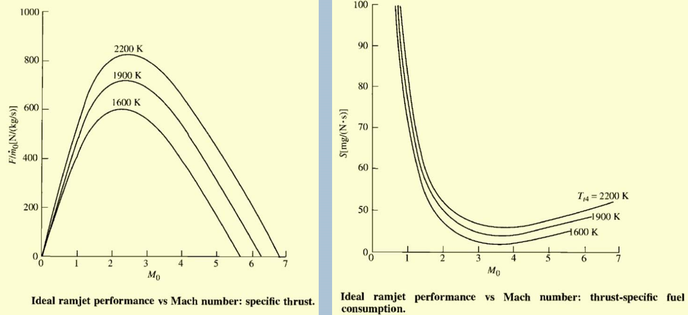

- Impulso específico

  <eq>
  $$
  I_{s p}=\sqrt{\gamma R T_{0}}\left\{\sqrt{1+\frac{1}{\textcolor{red}{M_{0}^{2}}}\left[\frac{2}{\gamma-1}\left(\frac{\textcolor{red}{\theta_{t}}}{\textcolor{red}{\theta_{0}}}-1\right)\left(\textcolor{red}{\theta_{0}}-1\right)\right]}-1\right\} \textcolor{red}{M_{0}} = \sqrt{\gamma R T_{0}}\left(\sqrt{\textcolor{red}{\frac{\theta_{t}}{\theta_{0}}}}-1\right) \textcolor{red}{M_{0}}=\sqrt{\gamma R T_{0}}\left(\sqrt{\frac{T_{4 t}}{T_{0}\left(1+\frac{\gamma-1}{2} M_{0}^{2}\right)}}-1\right) \textcolor{red}{M_{0}}
  $$
  </eq>

  $$
  \eta_{p}=\frac{2}{2+I_{s p} / V_{0}}=\frac{2}{2+\left(\sqrt{\textcolor{red}{\frac{\theta_{t}}{\theta_{0}}}}-1\right)}=\frac{2}{1+\sqrt{\textcolor{red}{\frac{\theta_{t}}{\theta_{0}}}}}=\frac{2}{1+} \sqrt{\frac{T_{4 t}}{T_{0}\left(1+\frac{\gamma-1}{2} M\right.}}
  $$

  

- Consumo específico

  $$
  C_{E}=\frac{\sqrt{\gamma R T_{0}}}{L} \frac{\sqrt{1+\frac{1}{\textcolor{red}{M_{0}^{2}}}\left[\frac{2}{\gamma-1}\left(\frac{\textcolor{red}{\theta_{t}}}{\textcolor{red}{\theta_{0}}}-1\right)\left(\textcolor{red}{\theta_{0}}-1\right)\right]}+1}{2\left(1-\frac{1}{\textcolor{red}{\theta_{0}}}\right)} M_{0}= \frac{\sqrt{\gamma R T_{0}}}{L} \frac{\textcolor{red}{\theta_{0}}}{\textcolor{red}{M_{0}}}\left(\sqrt{\frac{\textcolor{red}{\theta_{t}}}{\textcolor{red}{\theta_{0}}}}+1\right)
  $$

  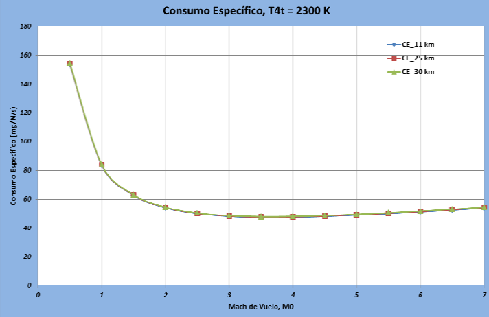

 

 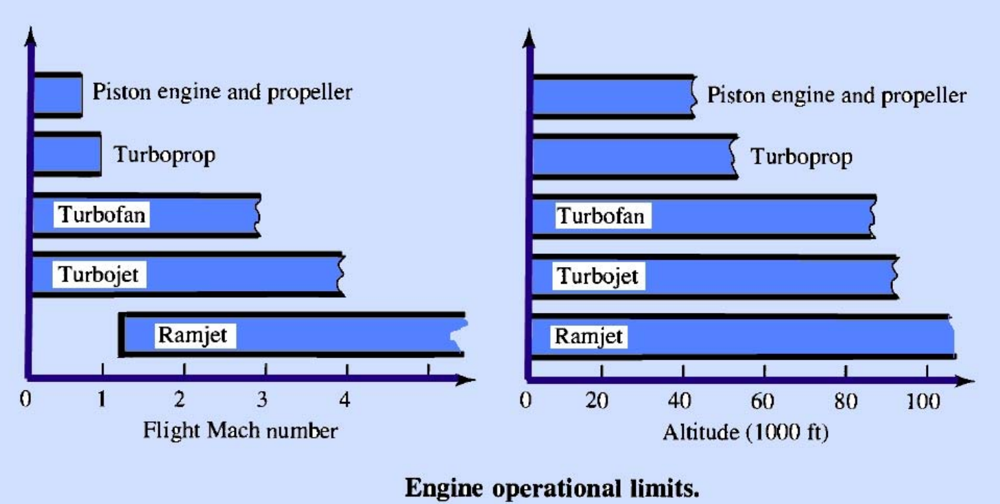

## Tema 5: Turbohélices y su optimización

### Introducción

- Los **aerorreactores** en vuelo subsónico tienen un rendimiento muy bajo.
- El rendimiento motor tiene valores aceptables en todo el rango de velocidades de funcionamiento del aerorreactor.
- En **vuelo subsónico, la velocidad de salida que producen es mucho mayor que la velocidad de vuelo**, obteniéndose un rendimiento propulsivo muy bajo.
- Esto se refleja en un **consumo específico de combustible alto**.
- Para resolver ese problema es necesario quitar potencia a los gases generados en el turborreactor.
- Se instala una turbina antes de la expansión en la tobera de salida, de esta forma la velocidad de salida de dichos gases disminuirá, produciéndose una propulsión más eficiente.
- Esto producirá una disminución de impulso y la consiguiente pérdida de empuje para un gasto dado.

- En la nueva turbina instalada, se tiene una potencia mecánica disponible que **se invierte en un sistema propulsivo de mejor rendimiento que el “chorro”.**
- **El sistema es una hélice propulsora** que recibe la potencia mecánica extraída de la turbina y proporciona una fuerza propulsora adicional: la tracción.
- Así aparece el turbohélice, TH, un sistema mixto de propulsión, ya que propulsa utilizando un “chorro” y una hélice.
- Se obtiene un empuje sobre las paredes internas del turborreactor y una tracción en las palas de la hélice.

- La hélice es un sistema propulsor de gran **rendimiento, alrededor de 0,8, e independiente de la velocidad de vuelo**.
- La velocidad que ve la pala de hélice es la debida a la composición del movimiento de avance del avión y la de giro.
- Para obtener una tracción elevada, son necesarias grandes longitudes de pala, esto produce grandes velocidades lineales en la punta de las palas.
- Con pequeñas velocidades de vuelo (≈ 400 km/h), las velocidades relativas hélice-aire en la punta de la pala son supersónicas y el rendimiento de la hélice cae.
- **Los turbohélices sólo son utilizables en el rango de velocidades de vuelo subsónicas bajas** (hasta M0 ≈ 0,6)

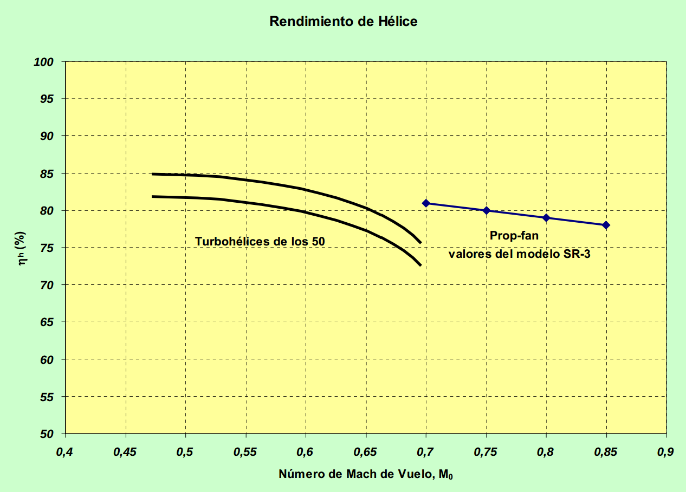 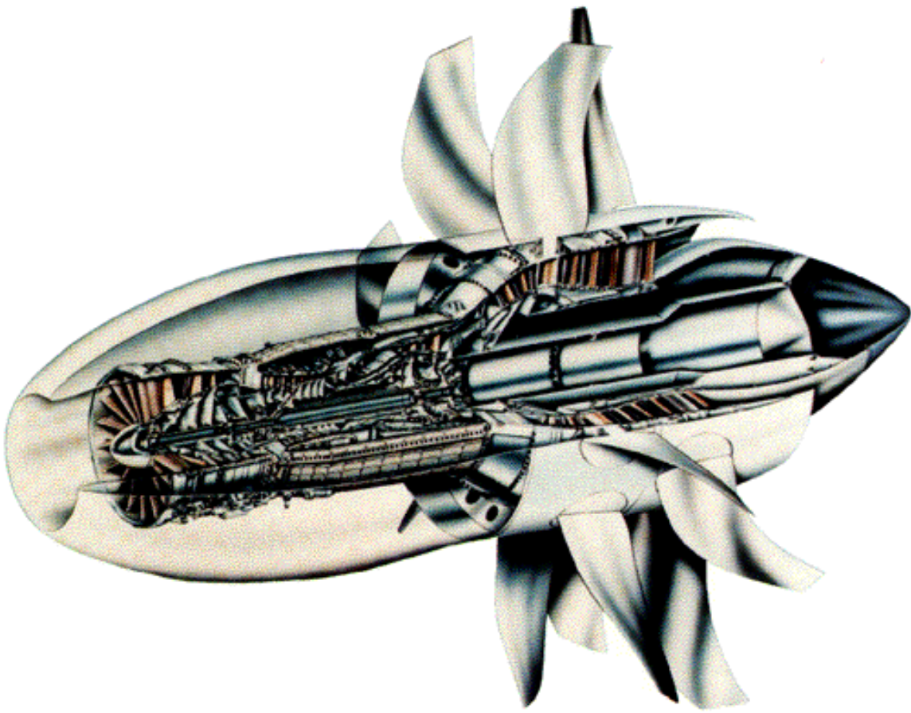

### Configuraciones de los TH

- Las revoluciones de trabajo de las hélices son bastante más bajas que las de las turbinas de los turborreactores.
- Hay que instalar un reductor entre ambas, a pesar del incremento de peso que adquiere el sistema.
- El margen de variación de las revoluciones de la hélice es muy pequeño, más que el de las turbinas; así que hay que instalar un sistema de control que actúe sobre el paso de la hélice para conseguir que la hélice trabaje prácticamente a vueltas constantes.

- Como se puede apreciar, el TH es un sistema más complejo y delicado que el turborreactor dado que:
	- aumenta el número de escalones de la turbina,
	- necesita un reductor,
	- el sistema de control es más complicado.
- Los TH suelen ser biejes y es posible encontrarnos las siguientes configuraciones:
	- Con una turbina para el compresor de alta, y la otra para el compresor de baja y la hélice.
	- Con una turbina para el compresor y otra para la hélice; en este caso, se llama de turbina libre . Típico de Turboejes.

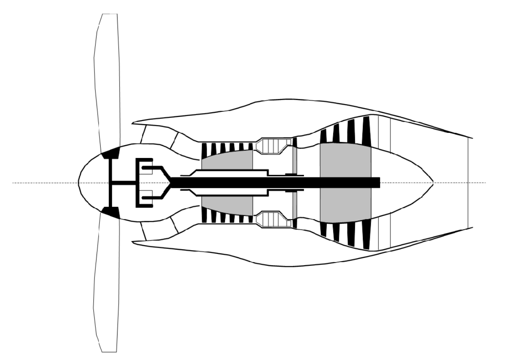

### Rendimientos Motor, Propulsor y Global

- Aplicando la ecuación de la energía entre la corriente sin perturbar, “estación 0”, y la sección de salida, “estación 9”, se obtiene:

  $$
  c L=G\left(\frac{V_{9}^{2}-V_{0}^{2}}{2}\right)+G\left(h_{9}-h_{0}\right)+P_{h}
  $$

- Ph es la potencia que se extrae de la turbina para la hélice. El rendimiento motor se expresa, en este caso, como:

  $$
  \eta_{M}^{T H}=\frac{\text { Potencia Mecánica Producida }}{\text { Potencia Calorífica Consumica }}=\frac{P_{h}+\frac{G}{2}\left(V_{9}^{2}-V_{0}^{2}\right)}{c L}
  $$

- Si se trata de un turboeje, TE, se tiene: $\eta_{M}^{T E} \cong \frac{P_{h}}{c L}$

- Llamando E al empuje y T a la tracción, la potencia útil que se obtiene del turbohélice es:

  $$
  P_{u}=E V_{0}+T V_{0}
  $$

- El rendimiento propulsivo de la hélice es lo que se conoce como rendimiento de la hélice, ηh:

  $$
  \eta_{h}=\frac{T V_{0}}{P_{h}}
  $$

- El rendimiento global o motopropulsor será:

  $$
  \eta_{M P}=\frac{\text { Potencia Útil }}{\text { Potencia Calorífica Consumida }}=\frac{E V_{0}+T V_{0}}{c L}=\frac{E V_{0}+P_{h} \eta_{h}}{c L}
  $$

- El rendimiento propulsivo será:

  $$
  \eta_{P}=\frac{\eta_{M P}}{\eta_{M}}=\frac{E V_{0}+T V_{0}}{P_{h}+\frac{G}{2}\left(V_{9}^{2}-V_{0}^{2}\right)}=\frac{E V_{0}+P_{h} \eta_{h}}{P_{h}+\frac{G}{2}\left(V_{9}^{2}-V_{0}^{2}\right)}
  $$

- Como se puede comprobar, para un turboeje, el rendimiento propulsivo es el rendimiento de la hélice.

### Caracterización del ciclo

- Para una $T_{4t}$ y $\pi_{23}$ dados, el ciclo de un turbohélice es similar al del turborreactor hasta el punto “45t ” que es el de salida de la turbina que mueve el compresor.

- A partir de aquí es necesario conocer la potencia que se emplea en mover la hélice para obtener las condiciones a la salida de las turbinas y conocer la características propulsivas del chorro.

- La temperatura de remanso en la “estación 5t ”, salida de turbinas, se obtiene mediante la potencia de la hélice:

  $$
  P_{h}=G C_{p e}\left(T_{45 t}-T_{5 t}\right) \eta_{m}
  $$

- En un turbohélice, cada kg/s de aire que pasa por el motor proporciona del orden de 300 CV.

- Si se transforma en turborreactor se obtendrían unos 600 N de empuje.

- Los TH derivan de TB pequeños que tienen que funcionar a altas revoluciones, del orden de 20000-30000 rpm.

- Es necesario la utilización de grandes reductores (~ 10:1) para bajar al régimen de las hélices, alrededor de 1500 rpm.

- Se producen unas pérdidas mecánicas del orden del 3
	- 4%, siendo entonces $\eta_{m}$ del orden de 0,97

- También es normal utilizar compresores centrífugos sobre todo en el eje de alta.

- Igual que en un turborreactor, la Vs de los gases es:

  $$
  \left.V_{9}=\sqrt{2 C_{p e}\left(T_{5 t}-T_{9}\right)}=\sqrt{2 C_{p e} T_{5 t}\left[1-\left(\frac{P_{0}}{P_{5 t}}\right)^{\frac{\gamma_{e}-1}{\gamma_{e}}}\right.}\right]
  $$

- En este caso, debido a la potencia que se extrae para la hélice, la expansión en la tobera de salida suele ser subcrítica y la velocidad de salida, por tanto, subsónica.

- El empuje será: $E=G\left(V_{9}-V_{0}\right)$

### Optimización

- En función de la potencia que se emplee para la hélice, se obtendrán diferentes valores de potencias útiles.
- La pregunta que podría hacerse es ¿para una condición de vuelo (altitud y velocidad) y un ciclo (T4t y π23 conocidos) dados, habrá una potencia, $P_h^*$, que maximice la potencia útil por unidad de gasto?.
- De existir, como es en este caso, se obtendrá un consumo específico mínimo ya que el consumo de combustible por unidad de gasto es independiente de la potencia extraída del ciclo.
- La potencia útil por unidad de gasto, se puede poner en función de los parámetros del ciclo de la forma siguiente:

<eq>
$$
\begin{aligned}
\frac{P_{u}}{G} &=\frac{T V_{0}+E V_{0}}{G}=\frac{P_{h} \eta_{h}}{G}+\left(V_{9}-V_{0}\right) V_{0}= \\
&=C_{p e}\left(T_{4 t}-T_{5 t}\right) \eta_{m} \eta_{h}+\left(\sqrt{2 C_{p e}\left(T_{5 t}-T_{9}\right)}-V_{0}\right) V_{0}
\end{aligned}
$$
</eq>

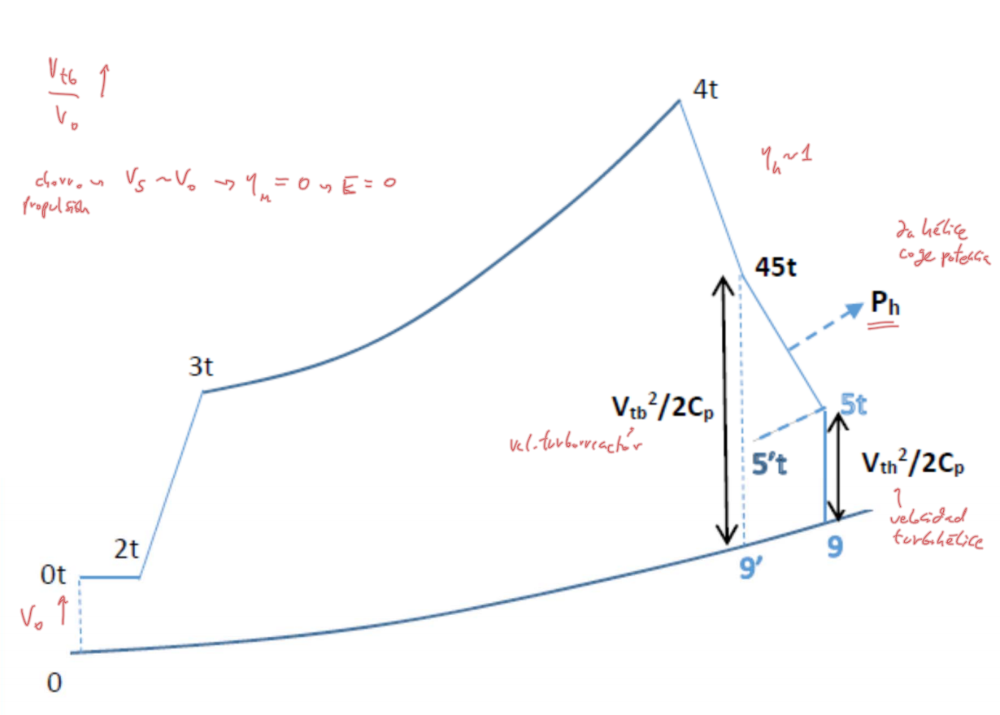

- Utilizando el rendimiento de la turbina que mueve la hélice, η_t y suponiendo que , la expresión anterior queda:

  <eq>
  $$
  \begin{aligned}
  \frac{P_{u}}{G} &=C_{p e}\left(T_{4 t}-T_{5^{\prime} t}\right) \eta_{t} \eta_{m} \eta_{h}+\left(\sqrt{2 C_{p e}\left(T_{5 t}-T_{9}\right)}-V_{0}\right) V_{0} \\
  & \approx C_{p e}\left(T_{4 t}-T_{5^{\prime} t}\right) \eta_{t} \eta_{m} \eta_{h}+\left(\sqrt{2 C_{p e}\left(T_{5^{\prime} t}-T_{9 "}\right)}-V_{0}\right) V_{0} \\
  &=f\left(V_{0}, T_{4 t}, \pi_{23}, \eta_{i}, \pi_{i}, T_{5^{\prime} t}\right)
  \end{aligned}
  $$
  </eq>

- Tal y como se enunció el problema, el único parámetro libre que me da la potencia de la hélice por unidad de gasto es la temperatura $T_{5’t}$.

- El valor $T_{5’t}^{*}$ que maximiza la potencia útil por unidad de gasto, se obtiene de la ecuación:

  $$
  \frac{d\left(P_{u} / G\right)}{d T_{5^{\prime} t}}=0
  $$

> La parte del chorro también puede tener rendimeinto propulsivo 1 sí $V_{tb}=V_0$. La solución óptimo por tanto será dejar al chorro con la velocidad de vuelo y pasar la potencia sobrante a la hélice. Conforme el rendimiento de transferencia sea peor el chorro puede ser mejor y coger algo de protagonismo respecto a la velocidad de vuelo. El óptimo de la velocidad de salida será mayor de la velocidad de vuelo en tanto la transferencia a la hélice sea peor: $V_9=V_0/\eta$.  Habrá ciclos en los que el chorro será mejor y no tenga sentido tener una hélice.

### Valores óptimos

$$
\frac{d\left(P_{u} / G\right)}{d T_{5^{\prime} t}}=0 \Rightarrow-\eta_{t} \eta_{m} \eta_{h}+\frac{2 V_{0}}{\sqrt{2 C_{p e}\left(T_{5^{\prime} t}-T_{9 "}\right)}}=0 \Rightarrow \quad T_{5^{\prime} t}^{*}=T_{9^{\prime}}+\frac{V_{0}^{2}}{2 C_{p e} \eta_{t}^{2} \eta_{m}^{2} \eta_{h}^{2}}
$$

<eq>
$$
\begin{aligned}
&V_{9}^{*}=\frac{V_{0}}{\eta_{t} \eta_{m} \eta_{h}} \Rightarrow \frac{E^{*} V_{0}}{G}=\left(\frac{1}{\eta_{t} \eta_{m} \eta_{h}}-1\right) V_{0}^{2} \\
&\frac{P_{h}^{*}}{G}=\frac{\eta_{t} \eta_{m}}{2}\left(V_{t b}^{2}-\frac{V_{0}^{2}}{\eta_{t}^{2} \eta_{m}^{2} \eta_{h}^{2}}\right)=\frac{\eta_{t} \eta_{m}}{2}\left(\frac{V_{t b}^{2}}{V_{0}^{2}}-\frac{1}{\eta_{t}^{2} \eta_{m}^{2} \eta_{h}^{2}}\right) V_{0}^{2} \\
&\frac{P_{i t i l}^{*}}{G}=\left[1-\eta_{t} \eta_{m} \eta_{h}+\frac{1}{2}\left(\eta_{t}^{2} \eta_{m}^{2} \eta_{h}^{2} \frac{V_{t b}^{2}}{V_{0}^{2}}-1\right)\right] \frac{V_{0}^{2}}{\eta_{t} \eta_{m} \eta_{h}}
\end{aligned}
$$
</eq>

> Si quitamos energía la chorro y se la damos a otro sistema propulsivo. EL chorro tiene menos capacidad de producir fuerza pero hay otro sistema que producirá otro empuje, habrá perdidas en la transmisión.
>
> Tenemos un motor dado su $T_{4t}, \pi_c$ que prduce $W_m$ . Esta potencia puede ir al chorro o a otran cosa que tendrá calidades y pérdidas ($\eta_h, \eta_t, \eta_m$)
>
> El rendimiento de la hélice, $\eta_h$, se supone constante.
>
> En el óptimo cual es la participación del chorro y de la hélice. Los valores óptimos definen la potencia útil del chorro y de la hélice así como la velocidad de salida

Es función de tres parámetros: $V_{tb}, V_0, \eta$, adimensionalizando será de dos: $\eta, V_{tb}/V_0$. Es lo mismo $V_0 \uparrow V_{tb} \downarrow $ que  $V_0 \downarrow V_{tb} \uparrow$

> $V_9^*$ es el valor de la velocidad del chorro incorporando la hélice. Es solo función de la velocidad de vuelo, no del turborreactor.

### Valores Óptimos Adimensionales con $V_{0}$

<eq>
$$
\frac{V_{9}^{*}}{V_{0}}=\frac{1}{\eta_{t r} \eta_{h}} \quad \Rightarrow \quad \frac{E^{*} V_{0}}{\left(G V_{0}^{2} / 2\right)}=2\left(\frac{1}{\eta_{t r} \eta_{h}}-1\right)
$$
</eq>

- Velocidad y empuje adimensional constantes

<eq>
$$
\begin{aligned}
&\frac{W_{h}^{*}}{\left(G V_{0}^{2} / 2\right)}=\eta_{t r}\left(\frac{V_{t b}^{2}}{V_{0}^{2}}-\frac{1}{\eta_{t r}^{2} \eta_{h}^{2}}\right) \\
&\frac{W_{u}^{*}}{\left(G V_{0}^{2} / 2\right)}=2\left(\frac{1}{\eta_{t r} \eta_{h}}-1\right)+\eta_{t r}\left(\frac{V_{t b}^{2}}{V_{0}^{2}}-\frac{1}{\eta_{t r}^{2} \eta_{h}^{2}}\right)
\end{aligned}
$$
</eq>

<eq>
$$
\frac{W_{\text {mecánica }}^{*}}{\left(G V_{0}^{2} / 2\right)}=\frac{W_{h}^{*}}{\left(G V_{0}^{2} / 2\right)}+\left[\left(\frac{V_{9}^{*}}{V_{0}^{2}}\right)^{2}-1\right]=\eta_{t r}\left(\frac{V_{t b}^{2}}{V_{0}^{2}}-\frac{1}{\eta_{t}^{2} \eta_{m}^{2} \eta_{h}^{2}}\right)+\frac{1}{\eta_{t r}^{2} \eta_{h}^{2}}-1
$$
</eq>

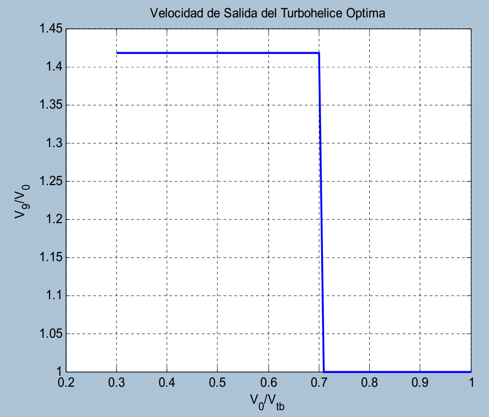 

> A partir de la velocidad de vuelo, la hélice no es competitiva con el chorro.
>
> Como estamos haciendo actualmente sistemas con rendimientos motores mayores y por tanto mayor potencia del turborreactor habrá que dar mayor potencia a la hélice para tener un rendimeinto propulsivo aceptable.

### Valores Óptimos Adimensionales con $V_{tb}$

> $V_{tb}$ es un parámetro, no como $V_0$  que es una variable.

<eq>
$$
\frac{V_{9}^{*}}{V_{t b}}=\frac{1}{\eta_{t} \eta_{m} \eta_{h}} \frac{V_{0}}{V_{t b}} \Rightarrow \frac{E^{*} V_{0}}{\left(G V_{t b}^{2} / 2\right)}=2\left(\frac{1}{\eta_{t} \eta_{m} \eta_{h}}-1\right) \frac{V_{0}^{2}}{V_{t b}^{2}}
$$
</eq>

> Si los rendimeintos son 1 ocurre que $W_u=W_m$ y tenemos $\eta_P=1$. Algo impensable con turborreactor.

<eq>
$$
\begin{aligned}
&\frac{W_{h}^{*}}{\left(G V_{t b}^{2} / 2\right)}=\eta_{t} \eta_{m}\left(1-\frac{1}{\eta_{t}^{2} \eta_{m}^{2} \eta_{h}^{2}} \frac{V_{0}^{2}}{V_{t b}^{2}}\right) \\
&\frac{W_{u}^{*}}{\left(G V_{t b}^{2} / 2\right)}=2\left(\frac{1}{\eta_{t} \eta_{m} \eta_{h}}-1\right) \frac{V_{0}^{2}}{V_{t b}^{2}}+\eta_{t} \eta_{m}\left(1-\frac{1}{\eta_{t}^{2} \eta_{m}^{2} \eta_{h}^{2}} \frac{V_{0}^{2}}{V_{t b}^{2}}\right)
\end{aligned}
$$
</eq>

<eq>
$$
\frac{W_{\text {mecánica }}}{\left(G V_{t b}^{2} / 2\right)}=\frac{W_{h}^{*}}{\left(G V_{t b}^{2} / 2\right)}+\left[\left(\frac{V_{9}^{*}}{V_{t b}^{2}}\right)^{2}-1\right]=\eta_{t} \eta_{m}\left(1-\frac{1}{\eta_{t}^{2} \eta_{m}^{2} \eta_{h}^{2}} \frac{V_{0}^{2}}{V_{t b}^{2}}\right)+\frac{1}{\eta_{t}^{2} \eta_{m}^{2} \eta_{h}^{2}} \frac{V_{0}^{2}}{V_{t b}^{2}}-1
$$
</eq>

$$
\eta_{P}=\frac{2\left(\frac{1}{\eta_{t r} \eta_{h}}-1\right)+\eta_{t r}\left(\frac{V_{t b}^{2}}{V_{0}^{2}}-\frac{1}{\eta_{t r}^{2} \eta_{h}^{2}}\right)}{\eta_{t r}\left(\frac{V_{t b}^{2}}{V_{0}^{2}}-\frac{1}{\eta_{t r}^{2} \eta_{h}^{2}}\right)+\frac{1}{\eta_{t r}^{2} \eta_{h}^{2}}-1}
$$

> $\lambda=\frac{T_{5t}-T_9}{T_{45t}-T_9}$ representa cuanto va al chorro respecto a la hélice. $\lambda = 1$ es chorro puro y $\lambda=0$ es hélice pura.

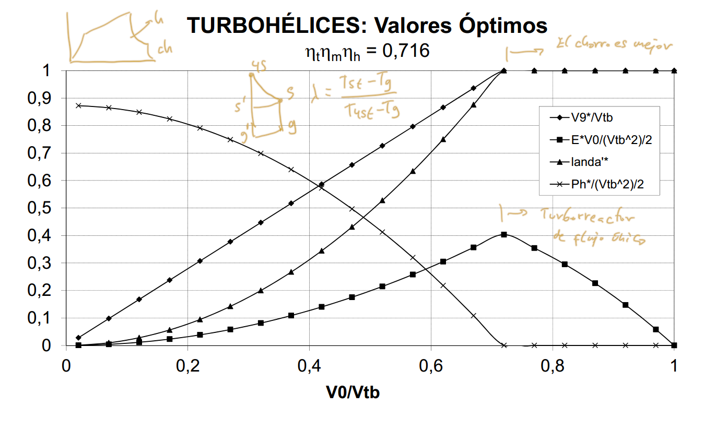 

 

 

 

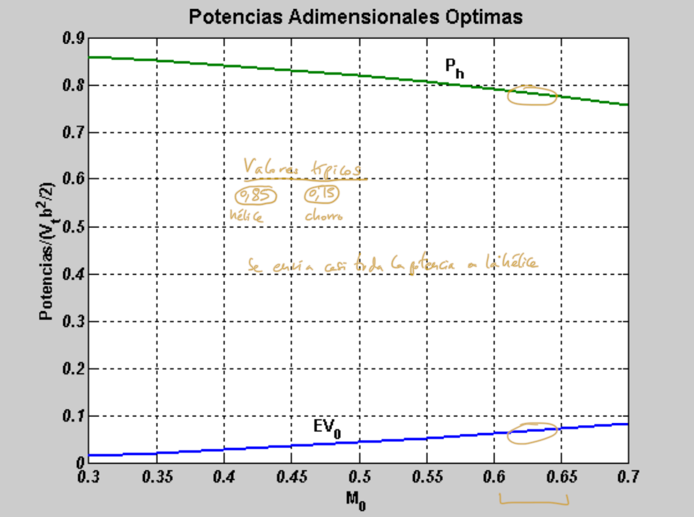 

 

### Valores Óptimos para el Caso Ideal

 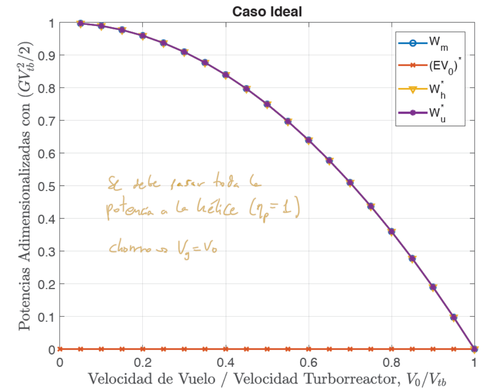

 

### Discusión de los Valores Óptimos

- La optimización aparece porque `al quitar energía del chorro su comportamiento propulsivo mejora y llega un momento que su rendimiento propulsivo es mejor que el de la hélice (sistema real)`. De ahí que no merezca la pena quitar toda la energía del chorro para conseguir un funcionamiento óptimo.
- `La potencia que hay que enviar a la hélice para optimizar el sistema es menor cuanto mayor sea la velocidad de vuelo y menor la $V_{tb}$`. Cuando $V_{tb}-V_0$ es menor
- Cuanto mayor es la velocidad de vuelo, mas pequeña es la diferencia entre $V_{tb}$ y $V_0$, y mejor es el comportamiento propulsivo del aerorreactor.
- Del mismo modo cuanto mayor sea Vtb mayor será la diferencia entre ella y la $V_0$, y mayor la energía que habrá que transferir.
- La energía a transferir esta gobernada por la velocidad de salida necesaria, $V_9^ *$, para obtener un chorro de rendimiento propulsivo comparable al de la hélice.

- Cuanto mayor sea el rendimiento de la hélice y los rendimientos que participan en la transferencia de potencia, $η_t$ y $η_m$, tanto menor tendrá que ser la velocidad de salida óptima.
- En el `límite de que todo el proceso sea ideal y el rendimiento de la hélice la unidad, la velocidad de salida óptima tendrá que ser la velocidad de vuelo y toda la propulsión por hélice ya que solo un chorro con velocidad de salida igual a la de vuelo es capaz de proporcionar un rendimiento propulsivo unidad` como la hélice de este caso. Si pasa esto no hay empuje por parte del chorro.

<eq>
$$
\left.\begin{array}{l}
V_{t b} \uparrow \\
\eta_{t} \uparrow, \eta_{m} \uparrow, \eta_{h} \uparrow \\
V_{0} \downarrow
\end{array}\right\} \lambda^{*} \downarrow, P_{h}^{*} \uparrow, T^{*} \uparrow, E^{*} \downarrow
$$
</eq>

- Como interesa volar a las velocidades más altas posibles, los turbohélices volaran a las máximas velocidades que le permitan sus hélices y, como estas son pequeñas, la potencia a transferir para obtener una propulsión óptima es muy grande.
- `Con velocidades de vuelo del orden de 550 km/h el valor óptimo del parámetro λ es del orden de 0,1`.

- Esto indica que, de toda la potencia disponible para propulsión, el 10 % debe ir al chorro y el 90 % a la hélice para obtener una propulsión óptima.
- Aparte de la optimización propulsiva del sistema, `intereses económicos y de mercado han dictado los tipos de TH que existen` en el mercado.
- Antiguamente, se utilizaban TH de mayor relación de λ (del orden de 0,2) esto se debió a que la propulsión por hélice es más cara, necesita más turbina y mayor reductor, y como la cura $P_{util}(\lambda)$ es bastante plana casi no se pierde potencia al pasar de 0,1 a 0,2. El chorro era importante, se veía la hélice y el chorro. Se potenciaba más el chorro porque había que añadir más potencias, pérdidas y todo el proceso de transferencia tenía un coste muy elevado por lo que era peferible hacer sistemas más baratos.

- `En la actualidad, debido al aumento de demanda de TE ( λ = 0) para helicópteros, se tiende a utilizar estos sistemas también para los aviones y así tener solo una cadena de montaje`. Casi toda la potencia a la hélice. No se ve el chorro.

### Definiciones

- Empuje: $E=G\left(V_{9}-V_{0}\right)$
- Potencia del chorro:  $P_{c h}=E V_{0}=G\left(V_{9}-V_{0}\right) V_{0}$
- Potencia total:  $P_{\text {total }}=P_{\text {helice }}+P_{c h}$
- Potencia útil:  $P_{\text {util }}=T V_{0}+E V_{0}=P_{h} \eta_{h}+G\left(V_{9}-V_{0}\right) V_{0}$
- Potencia equivalente (ESHP):  $P_{e q}=\frac{P_{u t i l}}{\eta_{h}}=P_{h}+\frac{G\left(V_{9}-V_{0}\right) V_{0}}{\eta_{h}}$   (utilizada para definir el consumo específico) . Equivalent sau horse power.
- Consumo específico: $C_{E}=\frac{c}{P_{e q}}$

- Recordando el rendimiento motor de un TH
  $$
  \eta_{M}^{T H}=\frac{P_{h}+\frac{G}{2}\left(V_{9}^{2}-V_{0}^{2}\right)}{C L}=\frac{\frac{P_{h}}{G}+\frac{V_{9}^{2}-V_{0}^{2}}{2}}{f L}
  $$

- En un caso típico, donde el chorro se lleva el 15% de la potencia y la hélice el 85% restante (valor óptimo), se tiene:
  $$
  \begin{aligned}
  &\frac{P_{e q}}{G} \approx \frac{P_{h}}{G} \approx \eta_{M}^{T H} f L \\
  &C_{E}=\frac{c / G}{P_{e q} / G}=\frac{f}{P_{e q} / G} \approx \frac{1}{\eta_{M}^{T H} L}
  \end{aligned}
  $$

> Conseguimos lo que queríamos, mejoras en el rendimeinto motor produce mejoras en el consumo específico.

- El rendimiento motor varía con los parámetros del ciclo de la misma forma que el del turborreactor, por tanto aumenta con $T_{4t}$.

- El `consumo específico es, entonces, una función decreciente de $T_{4t}$.`

- En contraste con el turborreactor donde el $C_{E}$ tenía un mínimo con la temperatura fin de combustión, ya que era inversamente proporcional al rendimiento motopropulsor en lugar de al rendimiento motor:

  $$
  C_{E}^{t b}=\frac{C}{E}=\frac{c L}{E V_{0}} \frac{V_{0}}{L}=\frac{V_{0}}{\eta_{M P}^{t b} L}
  $$

## Tema 6: Turbofanes y su Optimización

### Introducción

- Los `aerorreactores en vuelo subsónico tienen un rendimiento muy bajo`.
- El rendimiento motor tiene valores aceptables en todo el rango de velocidades de funcionamiento del aerorreactor.
- En vuelo subsónico, la velocidad de salida que producen es mucho mayor que la velocidad de vuelo, obteniéndose un rendimiento propulsivo muy bajo.
- Esto se refleja en un consumo específico de combustible alto.

- Para `velocidades subsónicas bajas (< 0,6), el problema se arregla con las hélices, pero éstas no funcionan a velocidades subsónicas altas.`
- En este caso, por efectos de compresibilidad, la hélice comprime poco el aire y obtiene una baja aceleración del mismo, con la subsecuente pérdida de tracción.
- Los usuarios demandan altas velocidades de vuelo.
- Desde el punto de visto aerodinámico, el $C_D$ es prácticamente constante hasta llegar al Mach de divergencia, entre 0,8 y 0,85.
- A mayores velocidades, el $C_D$ experimenta una fuerte subida.

- Sería interesante el vuelo cerca del Mach de divergencia donde los TB no son eficientes y los TH no son practicables.
- El `TB de doble flujo aparece para resolver este problema`, mejorando el $\eta_{P}$ de los aerorreactores, sobretodo en la zona de velocidades de vuelo subsónicas altas, alrededor de Mach 0,85.

> La optimización se puede hacer para cada Mach de vuelo. Aviones civiles $M\sim 0.8$
>
> En un sistema de doble flujo real, el chorro se pone a una velocidad un poco mayor a la velocidad de vuelo.

- La filosofía de funcionamiento es similar a la del TH, se quita potencia a los gases instalando una turbina antes de la expansión en la tobera, así se disminuye la velocidad de salida, produciéndose un propulsión más eficiente

- Esto producirá, una `disminución de impulso y pérdida de empuje, para un gasto dado, pero se tiene una potencia mecánica disponible en la nueva turbina instalada, que se invierte para producir un segundo “chorro propulsivo ” de baja velocidad y de alto rendimiento propulsivo`.
- El elemento que se utiliza para producir ese `nuevo flujo de aire` es lo que, en nomenclatura anglosajona, `se denomina “fan ”` y consiste en un compresor de baja relación de compresión por lo que al sistema se le conoce con el nombre de “turbofan ”, TF.

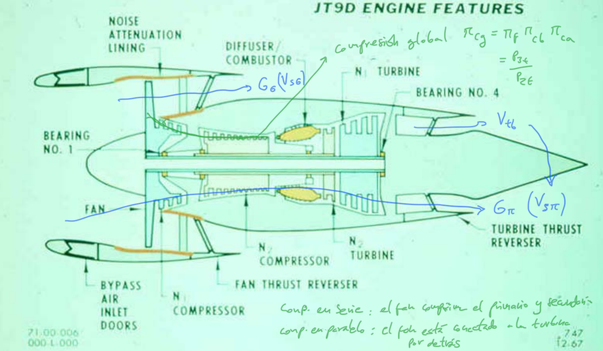

- Un nombre más apropiado sería turborreactor de doble flujo.
- La ventaja de este sistema es que, consumiendo la misma cantidad de combustible del turborreactor de flujo único del que deriva, se puede obtener más empuje.
- En el TF se tiene:
	- un gasto másico de aire primario, $G_{\pi}$, que realiza el mismo ciclo que un TB de flujo único (entrada, compresor, cámara de combustión, turbina y tobera de salida)
	- gasto de aire secundario, $G_{\sigma}$, que evoluciona a través de una entrada, fan y tobera de salida.

> $E_{tb} < E_{\pi} + E_{\sigma}$
>
> Aunque la finalidad no es aumentar empuje, sino disminuir el consumo específico $C_{E} = c/E \rightarrow$  aumentar empuje a consumo constante. El coste es una disminución del $I_{sp}$. En aviones civiles queda impulso suficiente y el $C_{E}$ disminuye mucho.

- `De una forma generalizada se puede pensar en un TF como en un TH de hélice carenada`. En el siguiente cuadro se esquematizan las diferencias que se encuentran entre TB y TF .

> Aerodinámica interna (confinamiento, ve $M \sim 0.4$) vs Aerodinámica externa. Aunque el Mach fuera sea supersónica debido al efecto del difusor el fan ve flujo subsónico.

| Turborreactor Flujo único    | Turborreactor de Doble Flujo                                 |
| ---------------------------- | ------------------------------------------------------------ |
| un "chorro propulsivo"       | dos "chorros propulsivos"                                    |
| Gasto de aire, G             | Dos gastos de aire, $G_{\pi}$ y $G_{\sigma}$                 |
| Velocidad de salida, $V_{s}$ | Dos velocidades de salida, $V_{s \pi}$, $V_{s \sigma}$       |
| Empuje, $E=G(V_{s} - V_{0})$ | Dos empujes, $E_{\pi}=G_{\pi}(V_{s \pi}-V_{0})$, $E_{\sigma}=G_{\sigma}(V_{s \sigma}-V_{0})$ |

mismo consumo de combustible si $G=G_{\pi}$ y mismos parámetros del ciclo

### Definición del ciclo

- Si la temperatura fin de combustión, $T_{4t}$, y la relación de compresión del ciclo, $\pi_{23}$, son la misma, y el gasto primario del fan son el mismo, el ciclo del TB de flujo único hasta la salida de la turbina que mueve el compresor es el mismo.
- Por consiguiente, las condiciones en los puntos del ciclo 2t, 3t y 45t (siendo el punto 45t el de salida de la turbina que mueve el compresor) son conocidas, y con ellos la relación combustible aire en la cámara de combustión, f, en función de los parámetros $T_{4t}$ y $\pi_{23}$.

> La potencia para el compresor del ciclo Bryton la da la turbina hasta la estación 45t
>
> 45t es aquel punto tal que da toda la potencia que necesita el primario: desde el punto 2 al 3
>
> En una configuración en paralelo es una estación real, mientras que en una configuración en serie siempre es una estación ficticia.
>
> $G C_{pc} (T_{3t}-T_{2t})=G_c C_{pc} T_{2t} \frac{\pi_c^{\frac{\gamma-1}{\gamma}}-1}{\eta_c}=G_{t} C_{pc} (T_{4t}-T_{45t})$
>
> $\pi_c$ es la compresión global
>
> Potencia que chupa el compresor = Estación de 4-5

- La temperatura de remanso a la salida de la turbina que mueve el fan, $T_{5t}$, se obtiene utilizando la ecuación de acoplamiento con el fan.

- Igualando la potencia de la turbina con la del fan se tiene
- La temperatura $T_{5t}$ es función de la relación de gastos secundario / primario, Λ, y del trabajo específico del fan, $\tau_{f}$ .
- La presión a la salida de la turbinas se obtendría conociendo el rendimiento adiabático de la evolución, $\eta_{t}$.

- Una vez conocidas las condiciones a la salida de las turbinas, se puede calcular la velocidad de salida del flujo primario
- Las condiciones del flujo secundario a la salida del fan, se obtienen mediante el trabajo específico del fan y el rendimiento adiabático del mismo, $\eta_f$. Con ellas se calcula la velocidad de salida de dicho flujo.

- Los TF actuales carecen de reductor son en serie y las configuraciones usadas suelen ser:
	- biejes con el fan y el compresor de baja unidos a un eje y el compresor de alta a otro;
	- triejes con un eje dedicado al fan y los otros al compresor de baja y alta receptivamente.
- La nomenclatura que se va a utilizar es la presentada en lecciones anteriores de forma general.
- Conviene recordar que las estaciones del flujo secundario se denominan con dos dígitos, el primero es un “ 1 ” y el segundo sigue el mismo criterio que las del flujo primario.

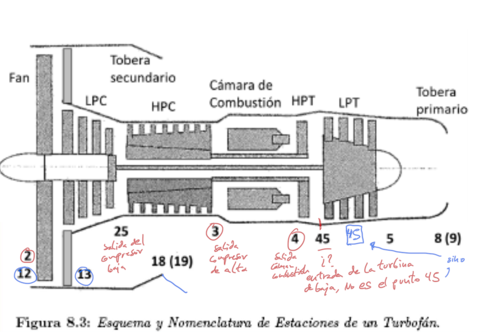

> Grupo de baja (Compresor de baja y fan) : $(G_{\pi}+G_{\sigma}) \tau_{f} + G_{\pi} \tau_{cb} = G_{\pi} (T_{45t}-T_{5t})$
>
> Grupo de alta: $G_{\pi} \tau_{ca} = G_{\pi} (T_{4t-T_{45t}})$
>
> Definición del punto 45t: $G_{\pi}\tau_{f} + G_{\pi} \tau_{cb} + G_{\pi} \tau_{ca} = G_{\pi} C_{p} (T_{4t}-T_{45t})$
>
> $\tau_f$: trabajo específico del fan que se da a la corriente secundaria $\Lambda \tau_f = C_{p} (T_{45t}- T_{5t})$ turbina que únicamente mueve al fan

> Las estaciones del fan se nombran de manera análoga según la funcionalidad pero con un 1 delante: salida del compresor 3, etc.

- Igualando la potencia de la turbina con la del fan se tiene:

$$
G_{\pi} C_{p e}\left(T_{45 t}-T_{5 t}\right)=G_{\sigma} \tau_{f} \Rightarrow T_{5 t}=T_{45 t}-\frac{G_{\sigma}}{C_{p e} G_{\pi}} \tau_{f}=T_{45 t}-\frac{\Lambda \tau_{f}}{C_{p e}}
$$

- La temperatura $T_{5t}$ es función de la relación de gastos secundario / primario, $\Lambda$, y del trabajo específico del fan, $\tau_f$.
- La presión a la salida de la turbinas se obtendría conociendo el rendimeinto adiabático de la evolución, $\eta_t$.

- En resumen, el ciclo de un TF estará caracterizado por:
  - los mismos valores que el de turborreactor de flujo único ( $T_{4t}$ , $\pi_{23}$ y calidades de las evoluciones)
  - la relación de gastos secundario / primario, o relación de derivación, Λ,
  - el trabajo específico del fan, $\tau_{f}$, y los rendimientos de la nueva turbina y del fan, $\eta_{t}$ y $\eta_{f}$
- Los TF se pueden dividir en dos grandes tipos según se instalen en la parte delantera o trasera del motor.
- Los `instalados delante`, se llaman `“en serie”` ya que `el fan es un elemento más de compresión del flujo primario`.

- Los `instalados detrás` se denominan `“en paralelo”` ya que `el fan sólo actúa sobre el flujo secundario`.
- El TF al producir velocidades de los “chorros” más pequeñas que las `del TB disminuye el nivel del ruido` respecto a éstos. `No es la razón de ser del turbofan sino reducir el $C_{E}$`.
- Si la razón de derivación es muy grande, el fan es muy grande respecto a la turbina que lo mueve y se podrían tener problemas en acoplar las revoluciones de ambos componentes. En este caso, habría que utilizar un reductor entre ambos.

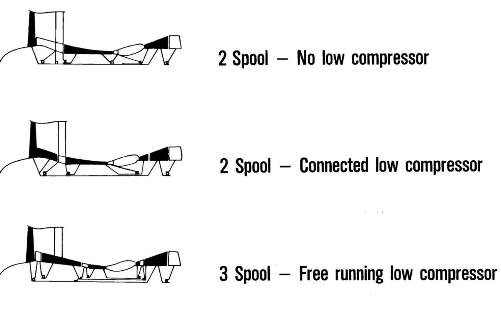 

> La ventaja del turbofan es poder tener características óptimas, que nos hablan de como será el reparto de velocidades. Habrá valores $\Lambda, \tau_f$ que gan que el empuje del sistema doble flujo sea máximo $E_{df}$.

- Como ocurre en el caso de los TH, la gran ventaja del sistema TF es la posibilidad de obtener unas características propulsivas “óptimas” para un ciclo motor dado.
- Esto es posible por la mejora del rendimiento de la propulsión que se puede obtener al seleccionar apropiadamente los valores característicos del TF, Λ y $\tau_{f}$ , para un ciclo motor, $T_{4t}$ y $\pi_{23}$ y unas condiciones de vuelo dadas.

> El problema será para $T_{4t}$ y $\pi_{23}$ dado calcular $\Lambda, \tau_f$ que haga que el sistema sea óptimo respecto al $C_E$ o impulso del primario óptimo $I_{sp_{\pi}}$

### Optimización del sistema

- El problema que se plantea es el siguiente: `“Dado un ciclo motor caracterizado por los parámetros $T_{4t}$ y $\pi_{23}$, y una condición de vuelo (altitud, a, y $V_0$), ¿existirán algunos valores de Λ y $\tau_{f}$, para los cuales el impulso específico, referido al gasto primario, $I_{sp}$ tendrá un valor máximo o, lo que es lo mismo, el consumo específico un valor mínimo?`.

- Solución: Planteemos una expresión que de el $I_{s\pi}$ como función de Λ y $\tau_{f}$ y constantes que dependan del ciclo motor y las condiciones de vuelo seleccionadas.

  > $I_{sp}=E/G \quad I_{sp_{\pi}}=E/G_{\pi} \rightarrow C_{E_{opt}}$

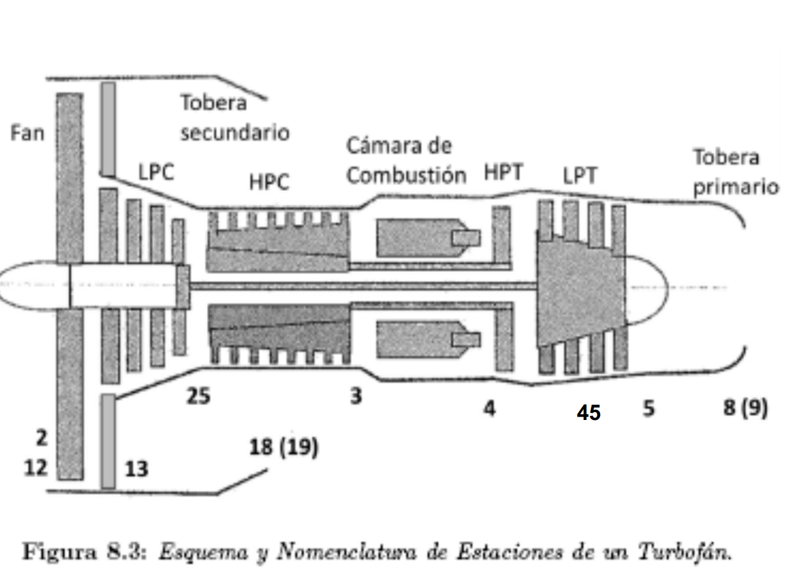

Posteriormente, utilizando técnicas de derivación, se encontrarán los valores Λ** y $\tau_{f}^{**}$. que optimizarán el TF.  Dos veces porque se ha optimizado respecto a dos parámetros: $\Lambda, \tau_f$.

- La `estación 45t es una cte del ciclo, función exclusivamente de las condiciones de vuelo y las características motoras del ciclo, $T_{4t}$ y $\pi_{23}$, e independientes, por tanto, de los valores Λ y $\tau_{f}$`
- El punto 45t se define de forma tal que, para TF en serie, la anterior definición del punto 45t requiere que:

	- $\tau_{f}+\tau_{\text {compresor }}=\tau_{c}=\text { Cte. }$
	- La entrada de ambos flujos es la misma: 2t ≈ 12t

- En el caso de toberas adaptadas, el $I_{s\pi}$ es:

  $$
  I_{s, \pi}=\frac{E_{\pi}+E_{\sigma}}{G_{\pi}}=V_{9}-V_{0}+\Lambda\left(V_{19}-V_{0}\right)
  $$

- Las expresiones que dan los rendimientos motor, de propulsión y global son:

  <eq>
  $$
  \begin{aligned}
  &\eta_{M P}=\frac{\left(E_{\pi}+E_{\sigma}\right) V_{0}}{c L} \\
  &\eta_{M}=\frac{G_{\pi} \frac{V_{s \pi}^{2}-V_{o}^{2}}{2}+G_{\sigma} \frac{V_{s \sigma}^{2}-V_{o}^{2}}{2}}{c L} \\
  &\eta_{P}=\frac{\eta_{M P}}{\eta_{M}}=\frac{\left(E_{\pi}+E_{\sigma}\right) V_{0}}{G_{\pi} \frac{V_{s \pi}^{2}-V_{o}^{2}}{2}+G_{\sigma} \frac{V_{s \sigma}^{2}-V_{o}^{2}}{2}}
  \end{aligned}
  $$
  </eq>

### Desarrollo de $V_9$

Quremos $V_{9}(\Lambda, \tau_f, V_{tb})$

> $T_{5't}-T_{9'} \neq T_{5t} -T_9 $
>
> $\frac{T_{5't}}{T_{9'}}=\frac{T_{5t}}{T_9}$

$$
\frac{V_{9}^{2}}{2}=C_{p e}\left(T_{5 t}-T_{9}\right)=C_{p e} \frac{T_{5 t}}{T_{5^{\prime} t}}\left(T_{5^{\prime} t}-T_{9^{\prime}}\right)=C_{p e} \frac{T_{5 t}}{T_{5^{\prime} t}}\left[\left(T_{45 t}-T_{9^{\prime}}\right)-\left(T_{45 t}-T_{5^{\prime} t}\right)\right]
$$

<eq>
$$
\tau_{45}=\Lambda \tau_{f}=C_{p e}\left(T_{45 t}-T_{5 t}\right)=\eta_{t} C_{p e}\left(T_{45 t}^{\prime}-T_{5 t}\right) \Rightarrow\left\{\begin{array}{l}
T_{5 t}=T_{45 t}-\frac{\Lambda \tau_{f}}{C_{p e}} \\
T_{5 t}^{\prime}=T_{45 t}-\frac{\Lambda \tau_{f}}{C_{p e} \eta_{t}}
\end{array}\right.
$$
</eq>

<eq>
$$
\frac{V_{9}^{2}}{2}=C_{p e} \frac{T_{45 t}-\frac{\Lambda \tau_{f}}{C_{p e}}}{T_{45 t}-\frac{\Lambda \tau_{f}}{C_{p e} \eta_{t}}}\left[\left(T_{45 t}-T_{9^{\prime}}\right)-\frac{\Lambda \tau_{f}}{C_{p e} \eta_{t}}\right] \approx C_{p e}\left(T_{45 t}-T_{9^{\prime}}\right)-\frac{\Lambda \tau_{f}}{\eta_{t}}
$$
</eq>

> El término despreciado vale alrededor de 1,05 $\sim 1$ y es una función monótona continua.
>
> Velocidad del turborreactor original menos la potencia que le quitamos para el fan. Expresión simplificada de la velocidad del primario y secundario:

$$
V_{9} \approx \sqrt{2\left[C_{p e}\left(T_{45 t}-T_{9^{\prime}}\right)-\frac{\Lambda \tau_{f}}{\eta_{t}}\right]}=\sqrt{V_{t b}^{2}-2 \frac{\Lambda \tau_{f}}{\eta_{t}}} \equiv f\left(\text { comp. motor }, \Lambda, \tau_{f}, \eta_{t}\right)
$$

- Se puede observar que la velocidad de salida del turbofán es la velocidad de salida del “turborreactor asociado” disminuida en la potencia que se transmite al fan

### Desarrollo de $V_{19}$

$$
\frac{V_{19}^{2}}{2}=C_{p c}\left(T_{13 t}-T_{19}\right)=C_{p c} T_{13 t}\left(1-\frac{T_{19}}{T_{13 t}}\right)=C_{p c} T_{13 t}\left[1-\left(\frac{P_{0}}{P_{13 t}}\right)^{\frac{\gamma_{c}-1}{\gamma_{c}}}\right]=C_{p c} T_{13 t}\left[1-\left(\frac{P_{0}}{P_{12 t}} \frac{P_{12 t}}{P_{13 t}}\right)^{\frac{\gamma_{c-1}}{\gamma_{c}}}\right]
$$

$$
\frac{P_{13 t}}{P_{12 t}}=\left(1+\frac{\tau_{f} \eta_{f}}{C_{p c} T_{12 t}}\right)^{\frac{\gamma_{c}}{\gamma_{c}-1}}=\left(\frac{C_{p c} T_{12 t}+\tau_{f} \eta_{f}}{C_{p c} T_{12 t}}\right)^{\frac{\gamma_{c}}{\gamma_{c}-1}}
$$

$$
\eta_f = \frac{(\pi_f^{\frac{\gamma -1}{\gamma}}-1)T_{12t}}{\tau_f/C_P}
$$

<eq>
$$
\begin{aligned}
&\frac{V_{19}^{2}}{2}=C_{p e} T_{13 t}\left[1-\frac{C_{p c} T_{12 t}}{C_{p c} T_{12 t}+\tau_{f} \eta_{f}}\left(\frac{P_{0}}{P_{12 t}}\right)^{\frac{\gamma_{c}-1}{\gamma_{c}}}\right]=\frac{C_{p e} T_{13 t}}{C_{p c} T_{12 t}+\tau_{f} \eta_{f}}\left\{C_{p c} T_{12 t}\left[1-\left(\frac{P_{0}}{P_{12 t}}\right)^{\frac{\gamma_{c}-1}{\gamma_{c}}}\right]+\tau_{f} \eta_{f}\right\}= \\
&=\frac{C_{p c} T_{12 t}+\tau_{f}}{C_{p c} T_{12 t}+\tau_{f} \eta_{f}}\left\{C_{p c} T_{12 t}\left[1-\left(\frac{P_{0}}{P_{12 t}}\right)^{\frac{\gamma_{c}-1}{\gamma_{c}}}\right]+\tau_{f} \eta_{f}\right\} \approx C_{p c} T_{12 t}\left[1-\left(\frac{P_{0}}{P_{12 t}}\right)^{\frac{\gamma_{c}-1}{\gamma_{c}}}\right]+\tau_{f} \eta_{f}
\end{aligned}
$$
</eq>

> El término despreciado vale alrededor de 1,02 $\sim 1$

<eq>
$$
V_{19} \approx \sqrt{2\left\{C_{p c} T_{12 t}\left[1-\left(\frac{P_{0}}{P_{12 t}}\right)^{\frac{\gamma_{c-1}}{\gamma_{c}}}\right]+\tau_{f} \eta_{f}\right\}} \equiv f\left(\text { condición de vuelo } \Lambda, \tau_{f}, \eta_{f}\right)
$$
</eq>

- operando un poco más el término que depende de la condición de vuelo queda

$$
\frac{P_{0}}{P_{12 t}}=\frac{P_{0}}{P_{2 t}}=\frac{P_{0}}{P_{0 t}} \frac{P_{0}}{P_{1 t}} \frac{P_{1 t}}{P_{2 t}}=\left(\frac{T_{0}}{T_{0 t}}\right)^{\frac{\gamma_{c}}{\gamma_{c}-1}} \frac{1}{f\left(M_{0}\right)} \frac{1}{\pi_{d}}
$$

<eq>
$$
\left[f\left(M_{0}\right)\right. \text { se corresponde con MIL-E-5007D] }
$$
</eq>

<eq>
$$
V_{19} \approx \sqrt{\left\{V_{0}^{2}+2 C_{p c} T_{0}\left[1-\left(\frac{1}{f\left(M_{0}\right) \pi_{d}}\right)^{\frac{\gamma_{c}-1}{\gamma_{c}}}\right]+2 \tau_{f} \eta_{f}\right\}}=\sqrt{\left\{\eta_{d} V_{0}^{2}+2 \tau_{f} \eta_{f}\right\}}
$$
</eq>

$$
\frac{V_{19}^{2}}{2}=\frac{V_0^{2}}{2} + \tau_f \eta_f
$$

$$
\frac{V_{9}^{2}}{2}=\frac{V_{tb}^{2}}{2} - \frac{\Lambda \tau_f}{\eta_t}
$$

### Obtención de los valores óptimos

> Optimizamos el impulso primario que equivale a optimizar el $C_E$, no el impulso

<eq>
$$
I_{s, \pi} \approx \sqrt{V_{t b}^{2}-2 \frac{\Lambda \tau_{f}}{\eta_{t}}}-V_{0}+\Lambda\left\{\sqrt{\eta_{d} V_{0}^{2}+2 \tau_{f} \eta_{f}}-V_{0}\right\}
$$
</eq>

- Los valores óptimos `$\Lambda^{**}$` y `$\tau_{f}^{**}$` se obtienen resolviendo el siguiente sistema de ecuaciones

$$
\begin{aligned}
&\frac{\partial I_{s \pi}}{\partial \tau_{f}}=0 \\
&\frac{\partial I_{s \pi}}{\partial \Lambda}=0
\end{aligned}
$$

<eq>
$$
\left.\left.\begin{array}{l}
\frac{\partial V_{9}}{\partial \tau_{f}}+\Lambda^{* *} \frac{\partial V_{19}}{\partial \tau_{f}}=0 \\
\frac{\partial V_{9}}{\partial \Lambda}+\left(V_{19}^{* *}-V_{0}\right)+\Lambda^{* *} \frac{\partial V_{19}}{\partial \Lambda}=0
\end{array}\right\} \begin{array}{c}
-\frac{\Lambda^{* *}}{V_{9}^{* *} \eta_{t}}+\Lambda^{* *} \frac{\eta_{f}}{V_{19}^{* *}}=0 \\
-\frac{\tau_{f}^{* *}}{V_{9}^{* *} \eta_{t}}+\left(V_{19}^{* *}-V_{0}\right)=0
\end{array}\right\} \begin{gathered}
\frac{V_{19}^{* *}}{V_{9}^{* *}}=\eta_{t} \eta_{f} \\
\left(V_{19}^{* *}-V_{0}\right) V_{9}^{* *}=\frac{\tau_{f}^{* *}}{\eta_{t}}
\end{gathered}
$$
</eq>

> - La optimización de un ciclo a $\Lambda$ cte: `$V_{19}^{**}= \eta_t \eta_f V_{9}^{**}$`. Cuando más parecida son $V_{19}, V_{9}$ mejor es el turbofan. $V_{19} <\sim V_9$. $V_{19}$ no es $V_9$ por las pérdidas
> - Con $\Lambda $ no cte : `$(V_{19}^{* *}-V_{0}) V_{9}^{**}=\frac{\tau_{f}^{**}}{\eta_{t}}$`

- Multiplicando las expresiones anteriores se tiene:

  <eq>
  $$
  V_{19}^{**}\left(V_{19}^{* *}-V_{0}\right)=\eta_{f} \tau_{f}^{* *}
  $$
  </eq>

- Poniendo `$\tau_{f}^{**}$` en función de `$V_{19}^{**}$`:

  <eq>
  $$
  V_{19} \approx \sqrt{\left\{\eta_{d} V_{0}^{2}+2 \tau_{f} \eta_{f}\right\}}
  $$
  </eq>

  <eq>
  $$
  V_{19}^{* *}\left(V_{19}^{* *}-V_{0}\right)=\frac{V_{19}^{* * 2}-\eta_{d} V_{0}^{2}}{2}
  $$
  </eq>

- Resolviendo la ecuación de segundo grado:

  <eq>
  $$
  V_{19}^{* *}=V_{0}\left[1+\sqrt{1-\eta_{d}}\right]
  $$
  </eq>

  > El chorro ve $V_{0}$

- Sustituyendo el anterior valor en expresiones anteriores se obtienen los siguientes valores óptimos

  > La gran diferencia es que el rendimeinto de la hélice era fijo mientras que aquí el chorro se enfrenta a otro chorro y los dos pueden llegar a tener rendimiento propulsivo unidad. El valor óptimo del chorro primario solo ve la velocidad de vuelo -> $\eta_{p}=1$. El chorro secundario idealmente ve también solo la velocidad de vuelo. En el mundo real se acerca pero es un poco mayor que $V_0$ debido a las pérdidas.
  >
  > `$\frac{V_{19}^{**}}{V_{9}^{**}}=\eta_t \eta_f$`
  >
  > La potencia que se saca del primario es trabajo específico, $\tau_f$,  y $\Lambda$ para alimentar al chorro secundario. La potencia que se extrae, equiavlente a un turbohélice, es por tanto el producto $\Lambda \tau_f$. Por tanto si para optimizar el segundo chorro $\tau_f \rightarrow 0$ , $\Lambda \rightarrow \infty$.  En el mundo real los valores son finitos
  >
  > $\Lambda ^{**}(\frac{V_{t b}^{2}}{V_{0}^{2}})$. Ve $T_{4t}, \pi_{23}$.

  <eq>
  $$
  \tau_{f}^{* *}=\frac{V_{19}^{* *}\left(V_{19}^{* *}-V_{0}\right)}{\eta_{f}}=\frac{\left(1-\eta_{d}+\sqrt{1-\eta_{d}}\right)}{\eta_{f}} V_{0}^{2}
  $$
  </eq>

  <eq>
  $$
  V_{9}^{* *}=\frac{1}{\eta_{f} \eta_{t}} V_{19}^{* *}=\frac{1}{\eta_{f} \eta_{t}}\left[1+\sqrt{1-\eta_{d}}\right] V_{0}
  $$
  </eq>

  <eq>
  $$
  \begin{aligned}
  \Lambda^{* *} &=\frac{\eta_{t}}{2} \frac{V_{t b}^{2}-V_{9}^{* * 2}}{\tau_{f}^{* *}}=\frac{\eta_{t}}{2} \frac{\eta_{f}}{\left(1-\eta_{d}+\sqrt{1-\eta_{d}}\right)} \frac{V_{t b}^{2}-V_{9}^{* * 2}}{V_{0}^{2}}=\\
  &=\frac{\eta_{t}}{2} \frac{\eta_{f}}{\left(1-\eta_{d}+\sqrt{1-\eta_{d}}\right)}\left[\frac{V_{t b}^{2}}{V_{0}^{2}}-\left(\frac{1+\sqrt{1-\eta_{d}}}{\eta_{f} \eta_{t}}\right)^{2}\right]
  \end{aligned}
  $$
  </eq>

 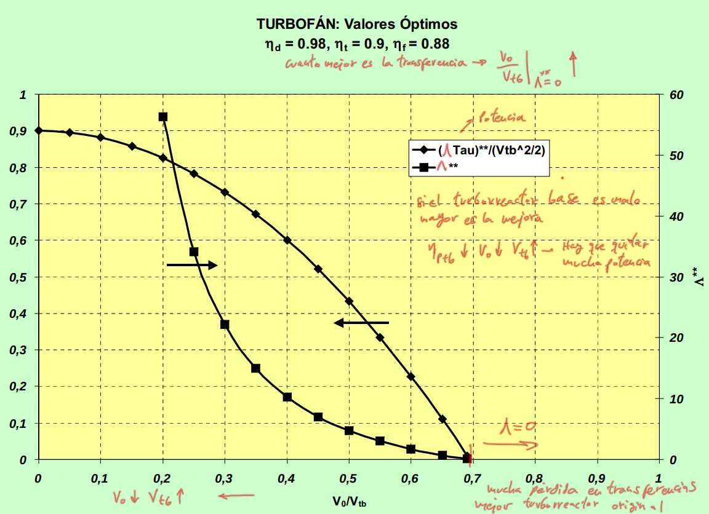

- El impulso específico referido al gasto primario óptimo:

  <eq>
  $$
  I_{s, \pi}^{* *}=V_{9}^{* *}-V_{0}+\Lambda^{* *}\left(V_{19}^{* *}-V_{0}\right)
  $$
  </eq>

- Si las `evoluciones fueran ideales` $\left(\eta_{\mathrm{t}}=\eta_{\mathrm{f}}=\eta_{\mathrm{d}}=1\right)$ `las soluciones obtenidas serían las conocidas de que la propulsión más eficiente es la que se consigue cuando a una masa infinita de aire se la deja con la misma velocidad de salida que la de vuelo`

> $G \rightarrow \infty$   $\Delta V \rightarrow 0$
>
> En una hélice para $\eta_{h}=1$ también supone  $G \rightarrow \infty, \Delta V \rightarrow 0$

<eq>
$$
\begin{aligned}
&V_{19 i d}^{* *}=V_{0} \\
&\tau_{f i d}^{* *}=0 \\
&V_{9 i d}^{* *}=V_{0} \\
&\Lambda_{i d}^{* *}=\infty
\end{aligned}
$$
</eq>

 

- Los valores anteriores son tales que el trabajo específico de la turbina que hay que extraer del flujo primario para el fan tiene un valor finito, tanto mayor cuanto mayor sea la velocidad de salida como turborreactor, $V_{tb}$ o menor sea la velocidad de vuelo:

  <eq>
  $$
  \tau_{45 i d}^{* *}=\Lambda_{i d}^{* *} \tau_{f i d}^{* *}=\frac{1}{2}\left(V_{tb}^{2}-V_{0}^{2}\right)
  $$
  </eq>

- El Impulso específico referido al gasto primario, también en el caso ideal, sería:

$$
  I_{s \pi id}^{* *}=\left(\frac{C_{p c}}{2 C_{p e}}-1+\frac{C_{p e}}{2 C_{p c}} \frac{V_{t b}^{2}}{V_{0}^{2}}\right) V_{0}
$$

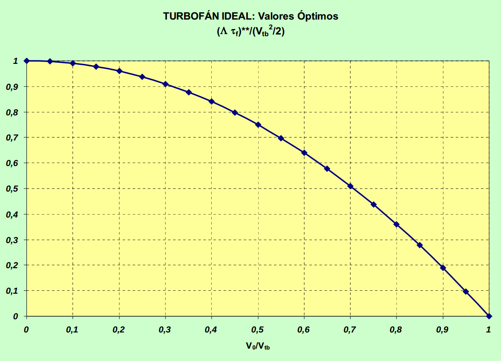

- Se puede apreciar que los valores óptimos obtenidos son funciones de la $V_0$ ya que ésta afecta al comportamiento propulsor del sistema.
- Además, tanto Λ como la potencia a extraer de la turbina para el fan, dependen de la velocidad de salida cuando el sistema funciona como flujo único, $V_{tb}$.
- Para $V_0$ bajas (subsónicas), la $V_{tb}$ es excesivamente alta respecto a $V_0$; por consiguiente, para tener valores del flujo primario propulsivamente aceptables, la potencia que hay que quitarle debe ser elevada ($\Lambda\uparrow$).
- El `$\tau_{f}^{**}$` debe ser bajo ya que es directamente proporcional a la `$V_{0} \rightarrow \Lambda^{**}$` debe ser alta

- Para $V_0$ altas (supersónicas), el comportamiento propulsivo del reactor mejora.
- Esto es debido a que la Vtb no es muy superior a la V0; por consiguiente, la potencia que hay que extraer del flujo primario para optimizar su funcionamiento es baja.
- Además el `$\boldsymbol{\tau}_{f}^{**}$` en estos casos es elevado (proporcional a la velocidad de vuelo) `$\rightarrow \boldsymbol{\Lambda}^{**}$` es baja.
- Tanto `$\boldsymbol{\Lambda}$`, como la potencia que se extrae para el fan, crecen cuando lo hace $V_{tb}$. Esta es la razón por la que se pueden encontrar aviones con velocidades de vuelo similares propulsados por turbofanes con distinto `$\boldsymbol{\Lambda}$`

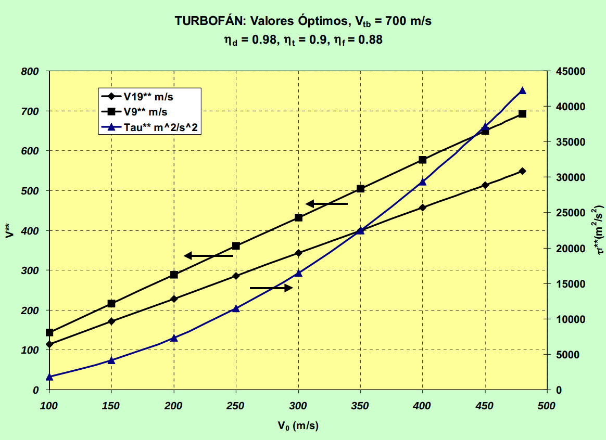 

| VALORES TÍPICOS                           | $M_{0} \approx 0.8$ | $M_{0} \approx 2.5$ |
| ----------------------------------------- | ------------------- | ------------------- |
| Relación de Derivación, $\Lambda$         | 6-8                 | 0.2-0.8             |
| Relación de Compresión del Fan, $\pi_{f}$ | 1.8-2.0             | 3.5-4               |

> Actualmente $\pi_{f}$ se relaja a 1,4 1,5 para conseguir $\eta_f \uparrow$, y cada vez $\Lambda \uparrow$

- Para ver si merece la pena instalar un turbofán, se debe mirar cual es el aumento del impulso específico que se produciría.
- Para una $V_0$ dada, el impulso específico por unidad de gasto primario de un turbofán optimizado a dicha velocidad de vuelo es mayor cuanto mayor sea la velocidad de salida del sistema como turborreactor de flujo único.
- Por consiguiente, se obtienen mejores resultados al instalar turbofanes a sistemas de flujo único con grandes $V_{tb}$, lo que quiere decir grandes $T_{4t}$ y $\pi_{c}$

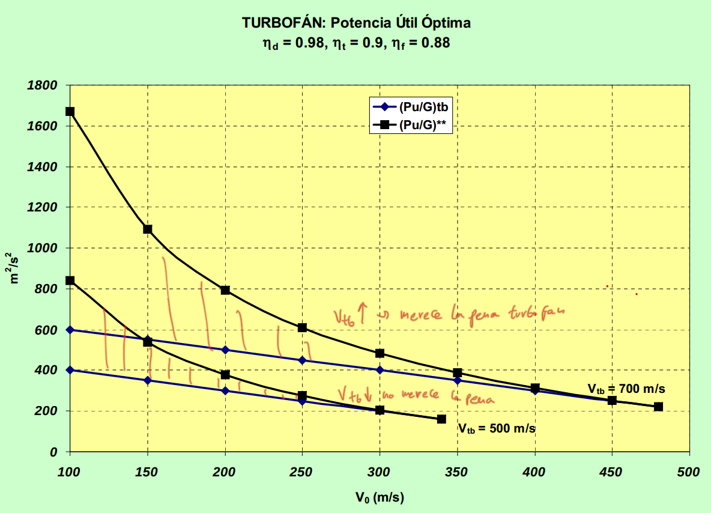

> El quitador de potencia principal en un turbofan es el parámetro $\Lambda$

- A veces no es posible construir sistemas con los valores de $\boldsymbol{\Lambda}$ requeridos en la optimización (doblemente paramétrica).

- En este caso, conviene optimizar el trabajo específico del fan para una relación de derivación dada.

  $\frac{\partial I}{\partial \tau_{f}}=0$

- El trabajo específico del fan óptimo, `$\boldsymbol{\tau}_{f}^{*}$`, obtenido, en este caso, es:

  <eq>
  $$
  \tau_{f}^{*}=\frac{\eta_{f}^{2} \eta_{t}^{2} V_{t b}^{2}-\eta_{d} V_{0}^{2}}{2 \eta_{f}\left(1+\eta_{f} \eta_{t} \Lambda\right)}
  $$
  </eq>

  > Con transmisión ideal $V_{9}=\sqrt{V_{tb}^2-2\Lambda \tau_f}$ y $V_{19}=\sqrt{V_0^2 + 2 \tau_f } \quad \tau_f^{*}\rightarrow V_{19}=V_9$

- $\boldsymbol{\tau}_{f}^{*}$, crece cuanto
  - decrece la relación de derivación,
  - crece la velocidad $V_{tb}$,
  - decrece la velocidad $V_0$

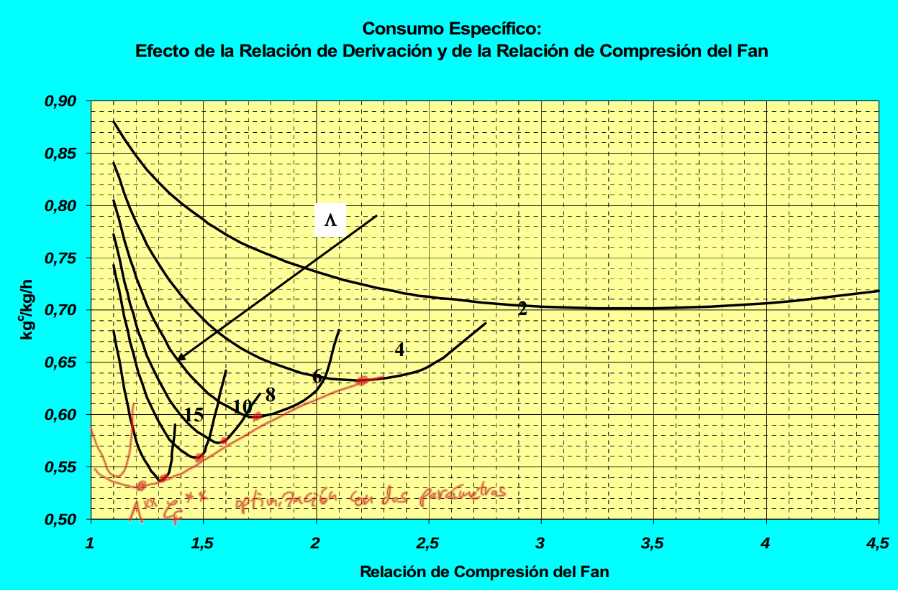

> Por problemas de instalación la relación de derivación, $\Lambda$ no alncanza el óptimo. Hay un gran margen de mejora.

 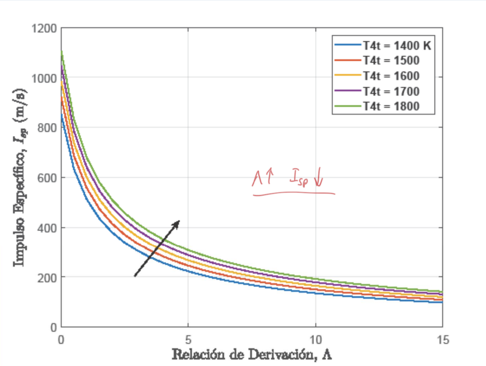

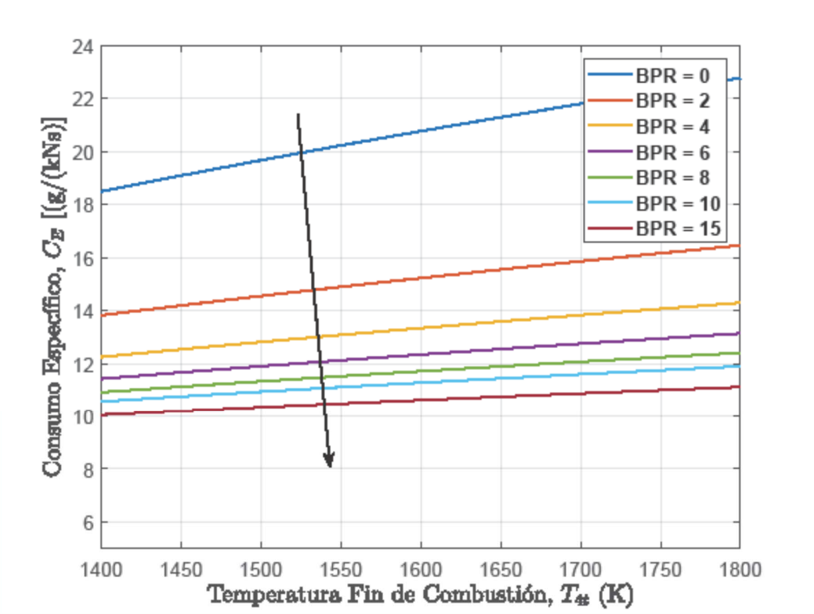 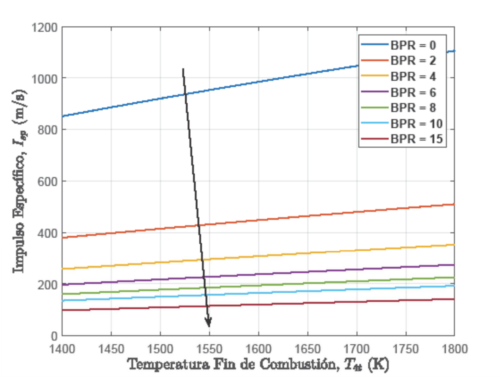

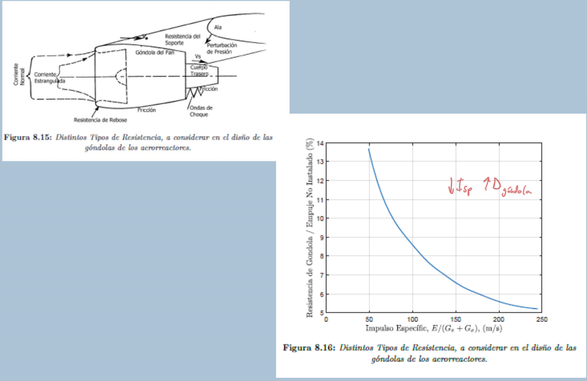

> Bajar mucho $I_{sp}$ es malo porque conforme disminuye $I_{sp}$, la resistencia de instalación es más grande (resistencia de la góndola, etc.)

 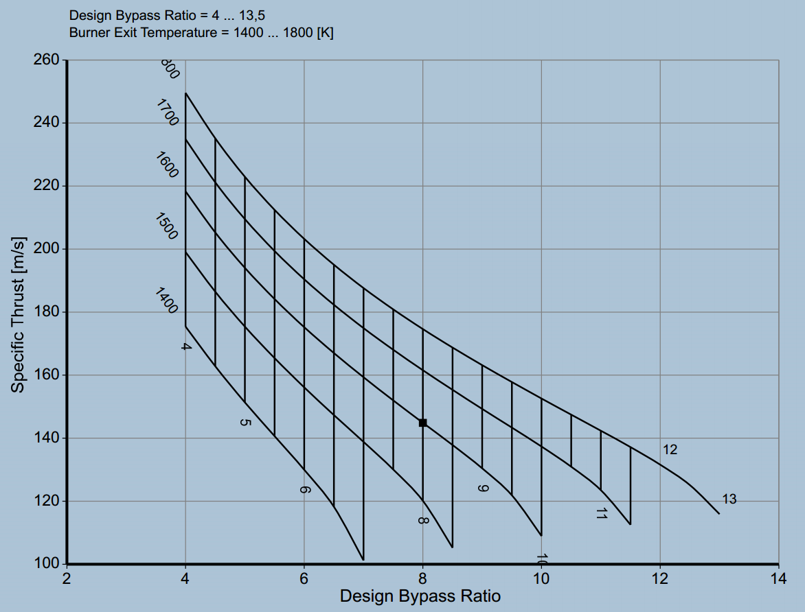

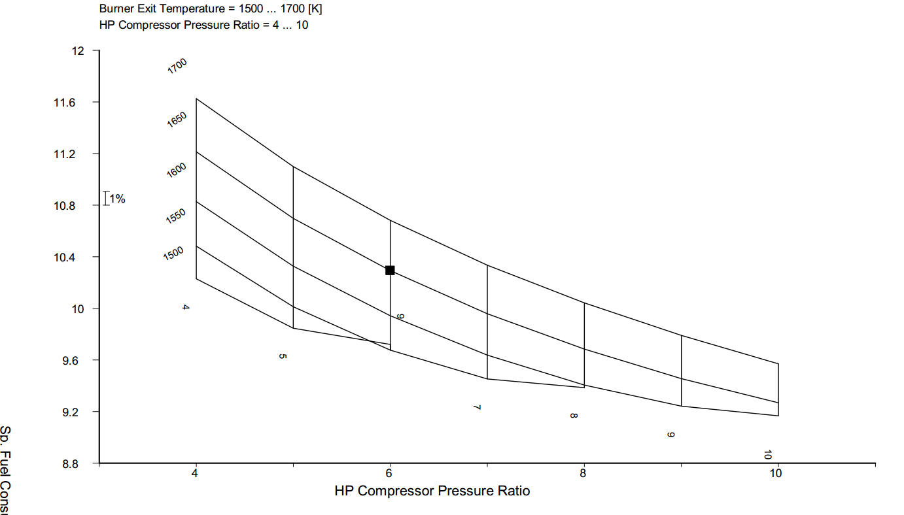 

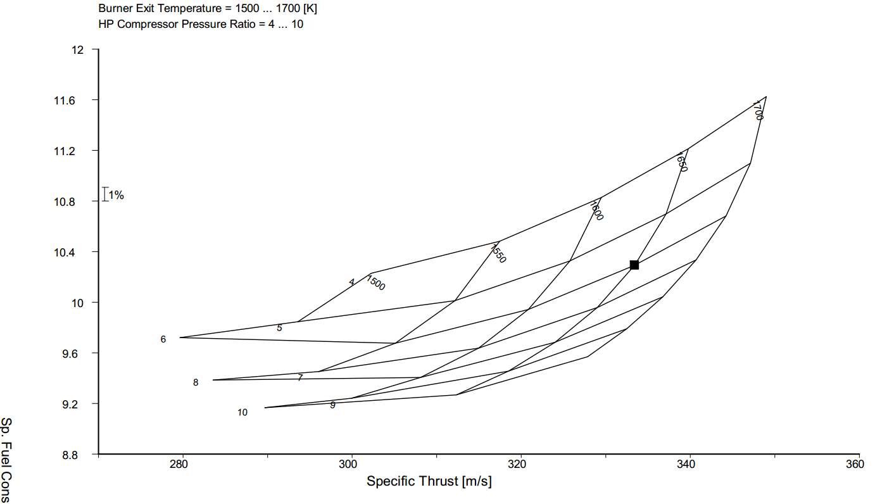 

 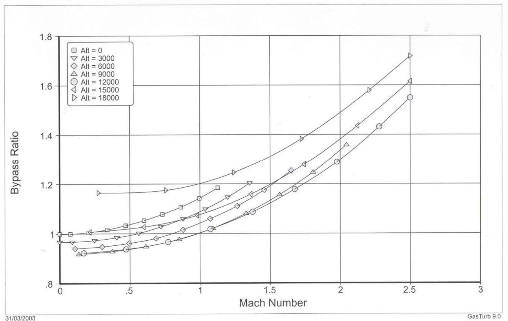