# Apuntes
> **Fuente:**
> - Diapositivas y notas de la asignatura "Aerorreactores" del Grado en Ingeniería Aeroespacial impartida por la E.T.S.I.Aeronaútica y del Espacio (UPM).
> - Wikipedia

## Tema 7: Turbofanes de Flujo Mezclado

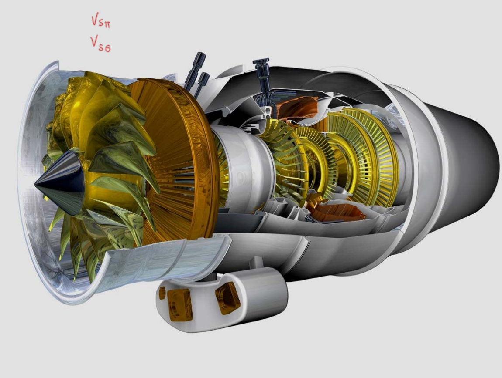 

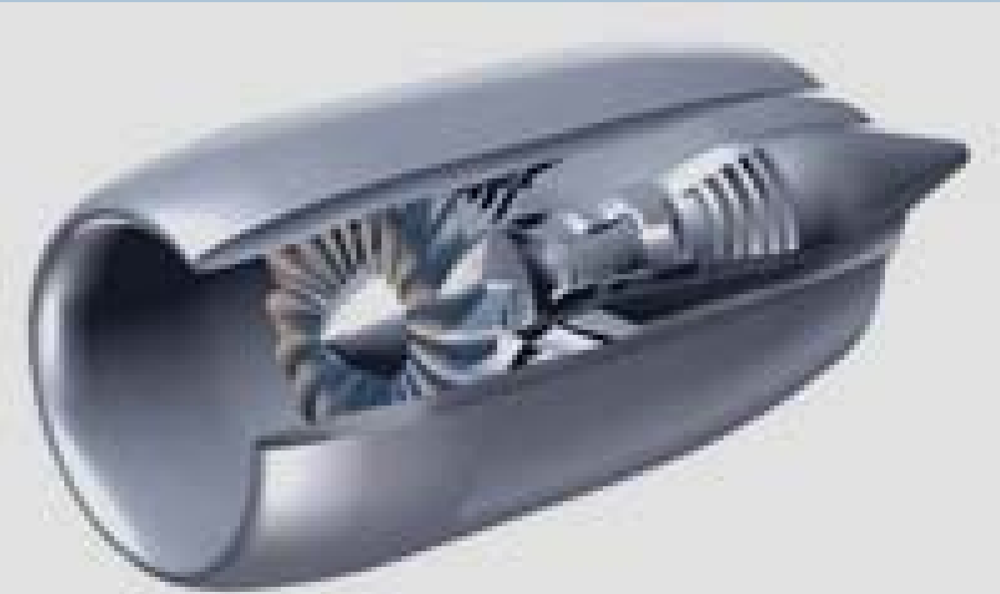 

> - Antes de salir del motor los flujos primario y secundario (bypass) se mezclan
> - En aviones militares es lo normal

### Mezclador por inyección

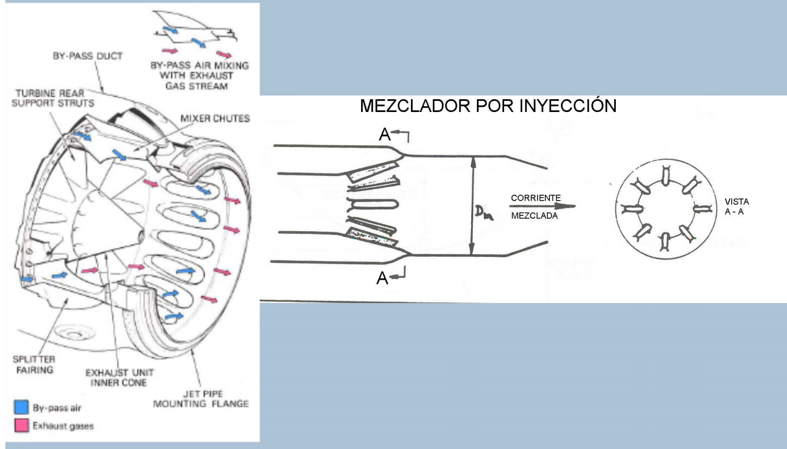

> Mezcla rápida a través de lóbulos. Baja pérdidas de presión de remanso pero requiere gran espacio de mezcla. Si se tiene postcomubstor no es un problema.  Mezclas grandes conllevan pérdidas mayores de presión de remanso.

> La estación 6 se supone como una mezcla completamente mezclada.
>
> En los militares se mezla por necesidad, es una exigencia del postcombustor para obtener las temperaturas que necesita.  El único motivo de aplicarlo a un avión civil es que $E_{FM}> E_{DF}$. Si esto fuese una regla general todos lo llevarían pero en la realidad es que la mejora es pequeña, nula o incluso genera pérdida.
>
> A consumo de combustible dado un aumento del empuje conlleva un consumo específico menor.
>
> Se optimiza primero el turbofan de doble flujo para no perder soluciones óptimas. Una vez seleccionado se analiza el efecto de añadir flujo mezclado frente a sus costes asociados y se decide si mantener el doble flujo o cambiar a flujo mezclado.

- Datos
  - Corriente Primaria (caliente)
    - $G_5 = G_\pi$
    - $T_{5t}$
    - $P_{5t}$
  - Corriente Secundaria (fría)
    - $G_{15} = G_\sigma $
    - $T_{15t}$
    - $P_{15t}$

- Ecuaciones
  - Continuidad

    > Cada ecuación de continuidad lleva parejo una ecuación de continuidad para cada flujo
    >
    > - Se supone que área constante: $A_6 = A_5 + A_{15}$
    > - Condición de Kutta, las presiones estáticas en la mezcla son iguales: $P_{s5}=P_{s15}$

    $$
    G_{6}=G_{5}+G_{15}=(1+\Lambda) G_{5}
    $$

    $$
    \frac{G_{i} \sqrt{R T_{it}}}{A_{i} P_{it}}=\sqrt{\gamma_{i}} M_{i}\left(1+\frac{\gamma_{i}-1}{2} M_{i}^{2}\right)^{-\frac{\gamma_{i}+1}{2\left(\gamma_{i}-1\right)}} \quad \text { para i }=5,15, \text { y } 6
    $$

  - Cantidad de movimiento

    > Ps: presión estática. No conocemos en nuestro problema de ciclo las presiones estáticas.

    $$
    G_{6} V_{6}+A_{6} P s_{6}=G_{5} V_{5}+A_{5} P s_{5}+G_{15} V_{15}+A_{15} P s_{15}
    $$

  - Energía

    $$
    G_{6} C_{p 6} T_{6t}=G_{5} C_{p 5t} T_{5}+G_{15} C_{p 15} T_{15t}
    $$

- Condiciones

  $$
  \begin{aligned}
  &A_{6}=A_{5}+A_{15} \\
  &P_{s 5}=P_{s 15}
  \end{aligned}
  $$

- Relaciones

  <eq>
  $$
  \left.\begin{array}{l}
  \frac{P_{it}}{P_{s}}=\left(1+\frac{\gamma_{i}-1}{2} M_{i}^{2}\right)^{\frac{\gamma_{i}}{\gamma_{i}-1}} \\
  \frac{T_{it}}{T_{s i}}=\left(1+\frac{\gamma_{i}-1}{2} M_{i}^{2}\right) \\
  V_{i}=M_{i} \sqrt{\gamma R T_{si}}
  \end{array}\right\} \quad \text { para i= } 5,15, \mathrm{y} 6
  $$
  </eq>

- Incógnitas

  $$
  G_{6}, T_{6t}, P_{6t}, A_{5}, A_{15}, A_{6}, P_{s 5}, P_{s 15}, P_{s 6}, T_{s 5}, T_{s 15}, T_{s 6}, M_{5}, M_{15}, M_{6}, V_{5}, V_{15}, V_{6}
  $$

  - Además de los $C_{p}$ y $\gamma$

- Número de Ecuaciones: 17

  > Si se plantea el flujo mezclado hay un grado de libertad. Con $T_{4t}, \Lambda, \pi_c, \pi_f$ se resuelve un turbofan de doble flujo pero no de flujo mezclado. Se debe realizar por ejemplo eligiendo $M_5$ o $M_{15}$ -> Estudio paramétrico. El flujo mezclado impone restricciones, si estas impiden las soluciones óptimas de turbofan saldrá mejor quedarse con la solución óptima de doble flujo.

- Grados de Libertad: 1

`El problema se puede presentar y resolver de forma adimensional con las siguientes variables`

$$
\Lambda=\frac{G_{15}}{G_{5}}, \quad p=\frac{P_{15t}}{P_{5t}}, \quad t=\frac{T_{15t}}{T_{5t}}, \quad t_{6}=\frac{T_{6}}{T_{5}}, \quad p_{6}=\frac{P_{6}}{P_{5}}
$$

> Puede no tener soluciones por estar el problema mal planteado. No con todos los parámetros de diseño del fan porque el problema de la mezcla de flujo requiere más información. Se escoge como grado de libertad $M_5$

Por conveniencia, seleccionamos como `grado de libertad $M_{5}$`

- Se obtienen A5 y Ps5
- Se obtiene Ps15
- Se obtiene A15 y M15

> Resolución:
> $$
> \frac{P_{5t}}{P_{s5}}= (1+ \frac{\gamma-1}{2} M_{5}^{\frac{\gamma}{\gamma-1}}) \rightarrow P_{s5} \rightarrow P_{s15}
> $$
>
> $$
> \frac{P_{15t}}{P_{s15}}= (1+ \frac{\gamma-1}{2} M_{15}^{\frac{\gamma}{\gamma-1}}) \rightarrow M_{15} = \sqrt{(\frac{P_{15t}}{P_{s15}}-1) \cdot \frac{2}{\gamma -1}}
> $$
>
> No hay soluciones para ciertos valores de $p=\frac{P_{15t}}{P_{5t}}$
> $$
> \frac{G_{5}\sqrt{R T_{5t}}}{A_{5} P_{5t}} = f(\gamma, M_{5}) \rightarrow A_{5}
> $$
>
> $$
> \frac{G_{15}\sqrt{R T_{15t}}}{A_{15} P_{15t}} = f(\gamma, M_{15}) \rightarrow A_{15}
> $$
>

### Soluciones

 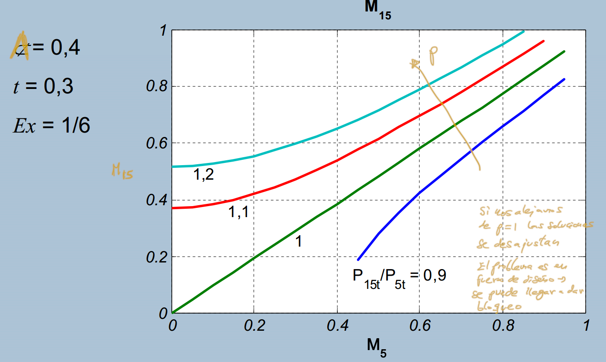

> De presentares e alguna mejora con flujo mezclado es a $P_{5t} \sim P_{15t}$ (cercana). Si por el contrario $P_{5t}$ está muy alejado de $P_{15t}$ no convendrá el flujo mezclado.

> Problemas de sangrado, mezcla
> $$
> G_{1} C_{P1} T_{1t} + G_{2} C_{P2} T_{2t} = (G_{1}+G_{2}) C_{Pm} T_{m}
> $$

Con la ecuación de la energía, se obtiene $T_{6}$

Se utiliza la relación adimensional:

$$
G_{i} V_{i}+A_{i} P_{s i}=G \sqrt{R T_{i}} \underbrace{\frac{1+\gamma M_{i}^{2}}{\sqrt{\gamma} M_{i}}\left(1+\frac{\gamma-1}{2} M_{i}^{2}\right)^{-\frac{1}{2}}}_{F}
$$

En la ecuación de Cantidad de Movimiento para obtener M6:

$$
F\left(\gamma_{6}, M_{6}\right)=\frac{F\left(\gamma_{5}, M_{5}\right)+\Lambda \sqrt{t} F\left(\gamma_{15}, M_{15}\right)}{(1+\Lambda) \sqrt{t_{6}}}
$$

Donde, la función F es:

$$
F(\gamma, M)=\frac{1+\gamma M^{2}}{\sqrt{\gamma} M \sqrt{1+\frac{\gamma-1}{2} M^{2}}}
$$

> $$
> \frac{G_{6}\sqrt{R T_{6t}}}{A_{6} P_{6t}} = f(M_{6}) \rightarrow P_{6t}
> $$

Ahora, se puede obtener P6 y Ps6

> No queremos que $M_{6}$ sea muy grande ya que tiene que ver con pérdidas.

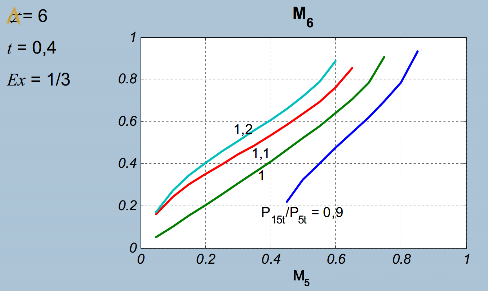 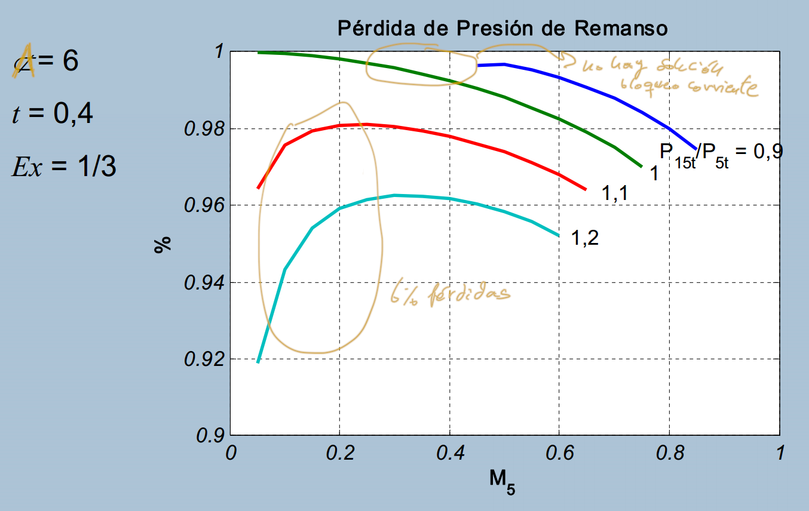

### Turbofan militar

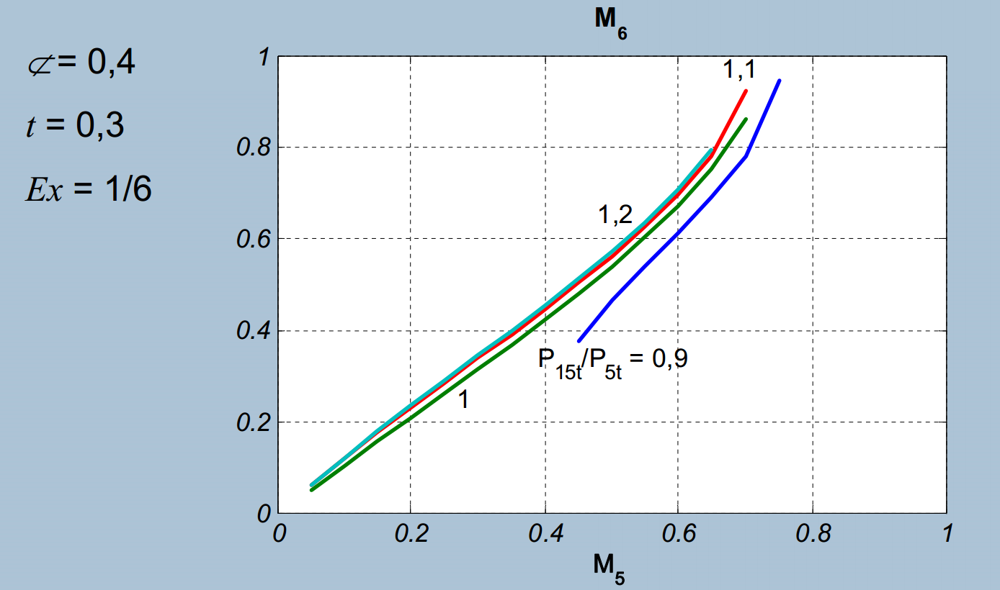 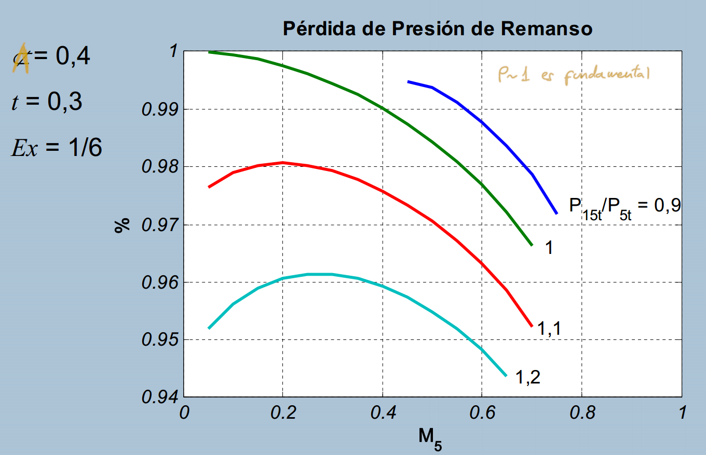

> Las pérdidas en turbofan militar es menor ($\sim 4$)%
>
> Para no resolver la mezcla normalmente suponemos $P_{5t}=P_{15t}$ para poder resolver el ciclo.

Finalmente, se puede encontrar el empuje del TF don doble flujo y con flujo mezclado

> Ex = $\frac{P_{amb}}{P_5}$ (expansión)

<eq>
$$
\begin{gathered}
E_{D F}=G_{5} V_{5}+G_{15} V_{15}=G_{5}\left\{\sqrt{\frac{2 \gamma_{5}}{\gamma_{5}-1} R T_{5}\left[1-\left(\frac{P_{\text {amb }}}{P_{5}}\right)^{\frac{\gamma_{5}-1}{\gamma_{5}}}\right]+\Lambda \sqrt{\left.\frac{2 \gamma_{15}}{\gamma_{15}-1} R T_{5}\left[1-\left(\frac{P_{\text {amb }}}{p P_{5}}\right)^{\frac{\gamma_{5}-1}{\gamma_{15}}}\right]\right\}}}\right. \\
E_{F M}=G_{6} V_{6}=(1+\Lambda) G_{5}\left\{\sqrt{\left.\frac{2 \gamma_{6}}{\gamma_{6}-1} R t_{6} T_{5}\left[1-\left(\frac{P_{\text {amb }}}{P_{6}}\right)^{\frac{\gamma_{6}-1}{\gamma_{6}}}\right]\right\}}\right.
\end{gathered}
$$
</eq>

La ganancia de empuje sería:

$$
\Delta E=\frac{E_{F M}-E_{D F}}{E_{D F}}
$$

### Mejora de Empuje en turbofanes de flujo mezclado

 

### CONSIDERACIONES EN EL DISEÑO DEL CICLO DE TURBOFANES MEZCLADOS

- `Para que un TF de flujo mezclado no tenga elevadas pérdidas las presiones de remansa de las corrientes antes de la mezcla deben ser parecidas.`
- Este hecho nos restringiría el espectro de soluciones posibles para el ciclo de diseño, ya que se introduce una relación entre los parámetros que definen el turbofan
- Si se exige algún tipo de condiciones a las presiones a la salida del fan y a la salida de la turbina, se dispondría de una relación

$$
p=1 (P_{5t}=P_{15t}) \rightarrow f\left(\pi_{c}, T_{4 t}, \pi_{f}, \Lambda\right)=0
$$

> En el mundo civil no se hace esto, se diseña pensado en turbofan ($\Lambda, \pi_f, \pi_c, T_{4t}$). Imponiendo $P_{5t}=P_{15t}$ tendriamos una restricción de $\Lambda$

- Para el caso de un sistema con un ciclo primario definido, la anterior relación nos daría la relación de derivación aconsejable, Λ, en función de la relación de compresión del fan, $\pi_f$.
- `La restricción anunciada anteriormente puede ser muy restrictiva y conducir a ciclos de diseño alejados a los óptimos propulsivos`, por lo que sólo se considera el sistema de flujo mezclado en motores militares con postcombustor (por necesidad) o en motores civiles, cuando al mezclar un ciclo diseñado bajo consideraciones propulsivas se obtienen beneficios.

- Usando la ecuación de acoplamiento

  > En todo turbofan una turbina que expansiona de 4 a 5 esta alimentando a la parte primaria del compresor (compresión global) y a un fan:

  <eq>
  $$
  \begin{aligned}
  &G_{\pi} C_{p c}\left(T_{3 t}-T_{2 t}\right)+G_{\sigma} C_{p c}\left(T_{13 t}-T_{2 t}\right)=G_{\pi} C_{p e}\left(T_{4 t}-T_{5 t}\right) \\
  &C_{p c} T_{2 t} \frac{\pi_{c}^{\frac{\gamma-1}{\gamma}}-1}{\eta_{c}}+\Lambda C_{p c} T_{2 t} \frac{\pi_{f}^{\frac{\gamma-1}{\gamma}}-1}{\eta_{f}}=C_{p e} T_{4 t} \eta_{t}\left[1-\left(\frac{P_{5 t}}{P_{4 t}}\right)^{\frac{\gamma-1}{\gamma}}\right] \\
  &\frac{\pi_{c}^{\frac{\gamma-1}{\gamma}}-1}{\eta_{c}}+\Lambda \frac{\pi_{f}^{\frac{\gamma-1}{\gamma}}-1}{\eta_{f}}=\frac{C_{p e} T_{4 t}}{C_{p e} T_{2 t}} \eta_{t}\left[1-\left(\frac{P_{5 t}}{P_{4 t}}\right)^{\frac{\gamma-1}{\gamma}}\right]
  \end{aligned}
  $$
  </eq>

- Estableciendo ahora la `igualdad de presiones` antes mencionada:

  > Para conseguir $P_{5t}=P_{15t} \rightarrow \frac{P_{5t}}{P_{4t}}=\frac{\pi_f}{\pi_{cc} \pi_c}$

  $$
  P_{5 t}=P_{13 t} \equiv P_{25 t} \Rightarrow \frac{P_{5 t}}{P_{4 t}} \frac{P_{4 t}}{P_{3 t}} \frac{P_{3 t}}{P_{25 t}}=1 \Rightarrow \frac{P_{5 t}}{P_{4 t}} \pi_{c c} \frac{\pi_{c}}{\pi_{f}}=1 \Rightarrow \frac{P_{5 t}}{P_{4 t}}=\frac{\pi_{f}}{\pi_{c c} \pi_{c}}
  $$

-  Usando la ecuación anterior, se llega a:

  <eq>
  $$
  \begin{aligned}
  &\frac{\pi_{c}^{\frac{\gamma-1}{\gamma}}-1}{\eta_{c}}+\Lambda \frac{\pi_{f}^{\frac{\gamma-1}{\gamma}}-1}{\eta_{f}}=\frac{C_{p e} T_{4 t}}{C_{p e} T_{2 t}} \eta_{t}\left[1-\left(\frac{\pi_{f}}{\pi_{c c} \pi_{c}}\right)^{\frac{\gamma-1}{\gamma}}\right] \\
  &\Lambda=\frac{\frac{C_{p e} T_{4 t}}{C_{p e} T_{2 t}} \eta_{t}\left[1-\left(\frac{\pi_{f}}{\pi_{c c} \pi_{c}}\right)^{\frac{\gamma-1}{\gamma}}\right]-\frac{\pi_{c}^{\frac{\gamma-1}{\gamma}}-1}{\eta_{c}}}{\frac{\pi_{f}^{\frac{\gamma-1}{\gamma}}-1}{\eta_{f}}}
  \end{aligned}
  $$
  </eq>

 

 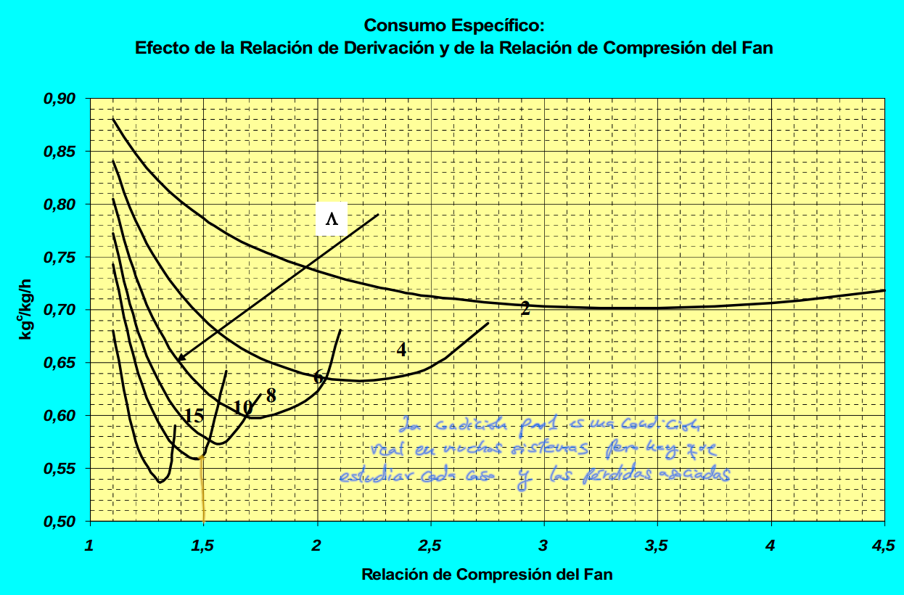

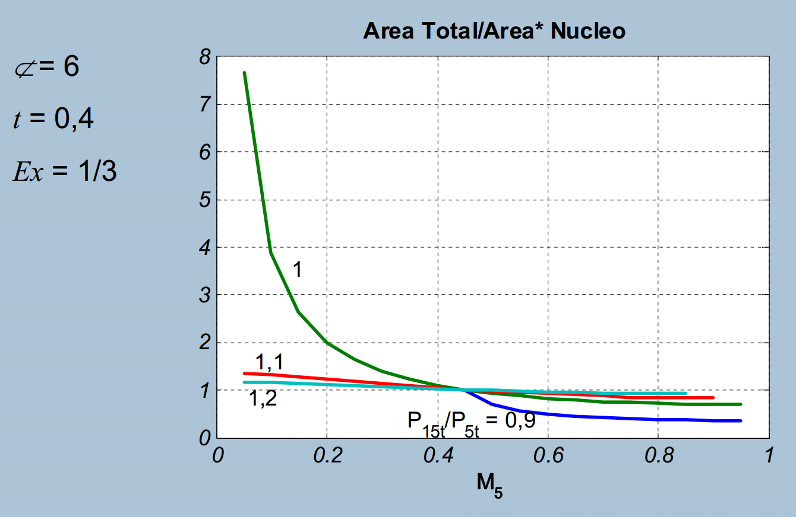 

## Tema 8: Sistemas Incrementadores de Empuje: Postcombustores

### Introducción

- Hay `segmentos de misiones donde las necesidades de Empuje son mucho mayores que los restantes`.
	- Se dimensiona el motor para esa demanda
	- Se dota al motor de sistemas que ofrezcan un empuje extra “incrementadores de empuje ”

> Durante una hora se exige $\frac{E}{W}=0.6$ y durante 1 min se requiere $E/W = 0.8$. Lo que permiten los sistemas incrementaros de empuje permitirían diseñar con $E/W=0.6$ y en momentos puntuales poder aumentar el empuje.

- Si se opta por los sistemas incrementadores, `el impacto de los mismos en el funcionamiento “normal ” del motor debe ser mínimo`.
- El empuje se debe a un cambio de la `cantidad de movimiento` del aire que atraviesa el motor
	- Masa (inyección de agua)
	- Velocidad (postcombustores)

- `Los sistemas que actúan sobre la velocidad son los denominados “Postcombustores ”`. La velocidad de salida de un flujo con unas condiciones $P_t$ y $T_t$, que se expansiona a una $P_{amb}$, es:

  $$
  V_{s}=\sqrt{\frac{2 \gamma}{\gamma-1} R T_{7 t}\left[1-\left(\frac{P_{a m b}}{P_{7 t}}\right)^{\frac{\gamma-1}{\gamma}}\right]}
  $$

> En un turborreactor se tiene la misma expresión pero con $P_{5t}, T_{5t}$ en lugar de $P_{7t}, T_{7t}$

- `La velocidad se aumenta si se aumenta la $T_t$ o la relación de expansión`.

- La $T_{t}$ puede aumentar con una segunda combustión.

 

> Si tuvieramos una cámara de combustión estequimétrica el concepto de postcombustor no tendría sentido ya que no quedaría oxígeno.
>
> Los postcombustores funcionan con relación estequiométrica finales.

- La segunda combustión sería posible, en TB de flujo único, si no se ha consumido todo el oxígeno en la combustión principal; o en TF de flujo mezclado.
- `Al no existir, detrás del PC, ninguna turbina que limite la temperatura del flujo; en los PC es posible realizar una combustión estequiométrica y alcanzar temperaturas del orden de 2100 K`.
- `La V a la salida de la turbina es ≈ 500 m/s` (M ≈ 0,5).
- Las V de llama son del orden de m/s.
- `Para evitar el apagado y anclar la llama debe existir un difusor y unos estabilizadores`.

 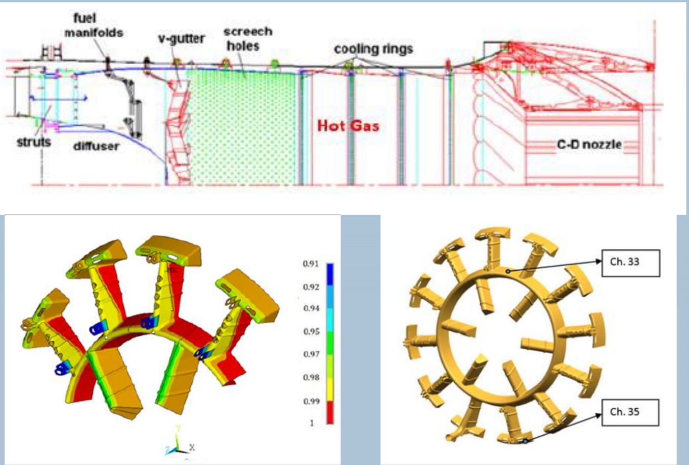

### Toberas Variables

- `El funcionamiento del PC debe ser tal que no altere el funcionamiento del motor`.

- El gasto, G, que pasa por la tobera de salida, cuando el postcombustor está apagado, es:

  $$
  G=\Gamma(\gamma) \frac{P_{5 t} A_{8}}{\sqrt{R T_{5 t}}}
  $$

  > El área 9 no afecta en nada

- Cuando se enciende, manteniendo el área de la garganta constante, valdrá, $G_{pc}$:

  $$
  G_{p c}=\Gamma\left(\gamma_{p c}\right) \frac{P_{7 t p c} A_{8}}{\sqrt{R T_{7 t}}}
  $$

  > Es exigible que todo sistema postcombutor tenga una tobera variable que aumente $A_8$ conforme aumenta $\sqrt{T_{7t}}$

- $P_{5t} ≈ P_{7t}$ pero como $T_{7t} > T_{5t}$ se tendrá que $G_{pc} < G$.

- Esta disminución de gasto (bloqueo), cuando se enciende el PC la ve todo el motor y por consiguiente, afecta su funcionamiento, cosa que no es deseable.

- `La forma de evitarlo es dotar al sistema de una tobera de área de garganta variable.`

> La temperatura es tan alta que no es necesario una chispa o se enciende en la cámara de combustión

- En particular, el área de la garganta, $A_8$, debe ser diferente según el PC esté encendido o apagado, de forma que $G = G_{pc}$. Para ello,
  $$
  \frac{A_{8 p c}}{A_{8}}=\frac{\Gamma(\gamma)}{\Gamma\left(\gamma_{p c}\right)} \frac{P_{7 t}}{P_{7 t p c}} \sqrt{\frac{T_{7 t}}{T_{5 t}}} \approx \sqrt{\frac{T_{7 t}}{T_{5 t}}}
  $$

 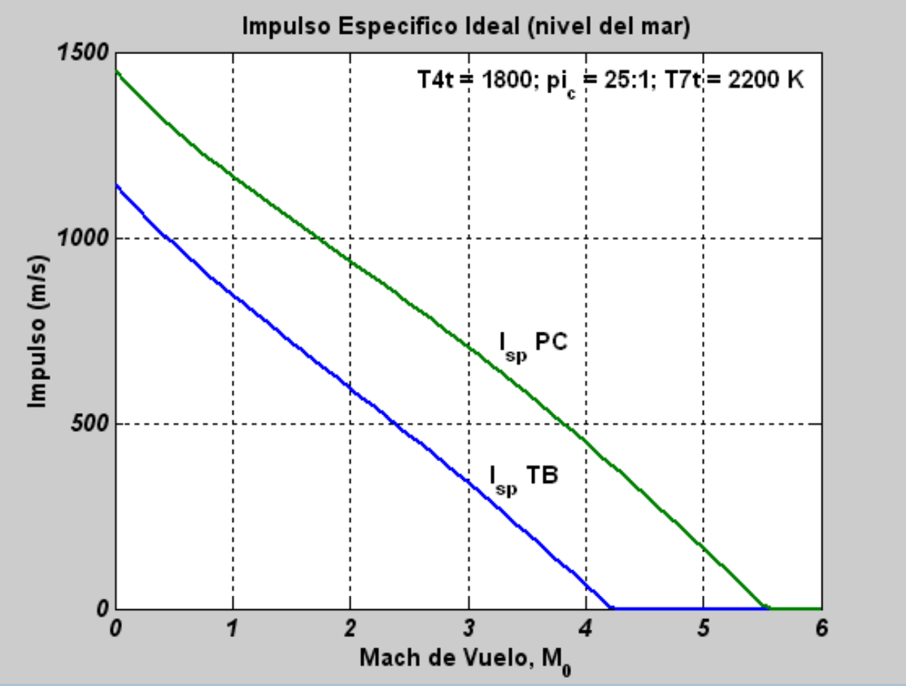

> Puede haber sistemas con modulación del postcombustor, entre no tener postcombustor y el máximo -> $T_{7t}$

$$
\begin{aligned}
E_{p c} &=G\left(V_{9 p c}-V_{0}\right) \\
E &=G\left(V_{9}-V_{0}\right)
\end{aligned}
$$

$$
\frac{\Delta E}{E}=\frac{V_{9 p c}-V_{9}}{V_{9}-V_{0}}=\frac{V_{9 p c} / V_{9}-1}{1-V_{0} / V_{9}}=\frac{\frac{\sqrt{2 C_{p}\left(T_{7 t}-T_{9 p c}\right)}}{\sqrt{2 C_{p}\left(T_{5 t}-T_{9}\right)}}-1}{1-V_{0} / V_{9}}
$$

$$
=\frac{\sqrt{\frac{T_{7 t}\left(1-T_{9 p c} / T_{7 t}\right)}{T_{5 t}\left(1-T_{9} / T_{5 t}\right)}}-1}{1-V_{0} / V_{9}}=\frac{\sqrt{T_{7 t} / T_{5 t}}-1}{1-V_{0} / V_{9}}
$$

<eq>
$$
\left.\frac{\Delta E}{E}\right|_{V_{0}=0}=\sqrt{\frac{T_{7 t}}{T_{5 t}}}-1
$$
</eq>

<eq>
$$
\frac{T_{7 t}}{T_{5 t}}=\left(1+\left.\frac{\Delta E}{E}\right|_{V_{0}=0}\right)^{2}
$$
</eq>

> Incremento de empuje en banco o cuando esta apunto de despegar.

  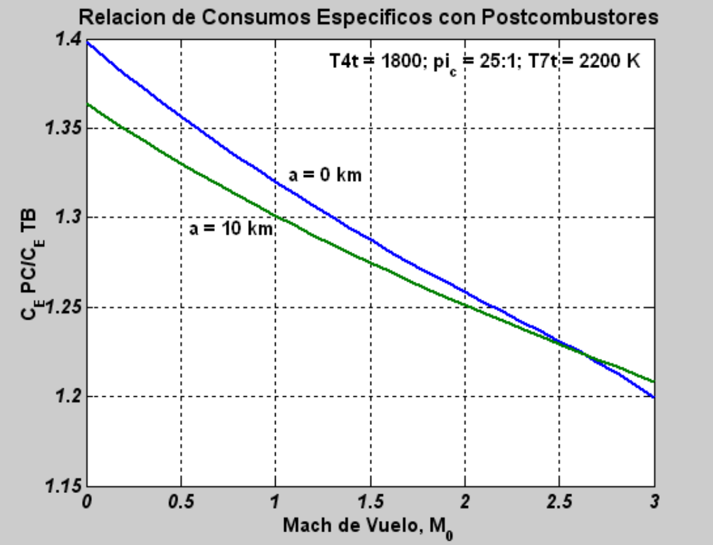

### Consumo

$$
\left(\frac{\Delta c}{c}\right)=\frac{c_{p c}}{c}=\frac{T_{7 t}-T_{5 t}}{T_{4 t}-T_{3 t}}=\frac{T_{7 t} / T_{5 t}-1}{\frac{T_{4 t}-T_{3 t}}{T_{5 t}}}=\frac{T_{7 t} / T_{5 t}-1}{\frac{T_{5 t}-T_{2 t}}{T_{5 t}}}=\frac{T_{7 t} / T_{5 t}-1}{1-T_{2 t} / T_{5 t}}
$$

<eq>
$$
\frac{\Delta c}{c}=\frac{\left(1+\left.\frac{\Delta E}{E}\right|_{V_{0}=0}\right)^{2}-1}{1-T_{2 t} / T_{5 t}}
$$
</eq>

$$
\frac{C_{E, p c}}{C_{E}}=\frac{1+\Delta E}{1+\Delta c}
$$

> Ecuación de acoplamiento: $T_{4t}-T_{5t} = T_{3t}-T_{2t}$

Como $T_{2t}=T_{0}+V_0^{2}/2C_P$ De forma que al aumentar la velocidad es mejor (menos oneroso)

> Increment el consumo como $T_{7t}/T_{5t}$, mientras que el empuje aumenta como la raiz. EL sistema es mejor a velocidades elevadas ya que el consumo específico disminuye con la velocidad de vuelo aunque siempre será mayor que sin postcombustor.

### Efectos reales

- Pérdidas de Presión de Remanso: $P_{7t} < P_{5t}$

- Temperatura de Combustión Adiabática
  $$
  C_{p, p c} T_{6 t}+\xi \eta_{q} f L=C_{p, p c} T_{7 t} \quad \frac{T_{7 t}}{T_{6 t}}=1+\xi \frac{\eta_{q} f L}{C_{p, p c} T_{6 t}}=1+\mathrm{P}_{f}
  $$

  > La combustión no es diluida por lo que suponer c << G supone mucho error.
  >
  > Para un caso podemos ver la temperatura de combustión adiabática e introducir un coeficiente $\xi$ para que se pueda aplicar la ec diluida. (chapuza mejor que suponer comb. diluida)

- Bloqueo Térmico

  > Al añadir calor la corriente se acelera, el Mach de salida es mucho mayor que el M de entrada. El problema es que se puede bloquear el postcombustor. No podrá aumentar el parámetro de gasto pero debido a la temperatura el gasto disminuirá
  >
  > - 6 es entrada del postcombustor y 7 la salida

  > En vez de viscosidad supnemos una resistencia global D (chapuza 2)

  <eq>
  $$
  \begin{aligned}
  &\rho_{6} V_{6}=\rho_{7} V_{7} \\
  &P_{6}+\rho_{6} V_{6}^{2}=P_{7}+\rho_{7} V_{7}^{2}+D=P_{7}+\rho_{7} V_{7}^{2}+\frac{1}{2} \rho_{6} V_{6}^{2} C_{D}
  \end{aligned}
  $$
  </eq>

  Se obtiene $P_{7}/P_{6} \rightarrow F(M_{7})$:

  <eq>
  $$
  F\left(M_{7}\right)=\sqrt{1+\mathrm{P}_{f}} \frac{1+\gamma M_{6}^{2}}{1+\gamma M_{6}^{2}\left(1-C_{D} / 2\right)} F\left(M_{6}\right)
  $$
  </eq>

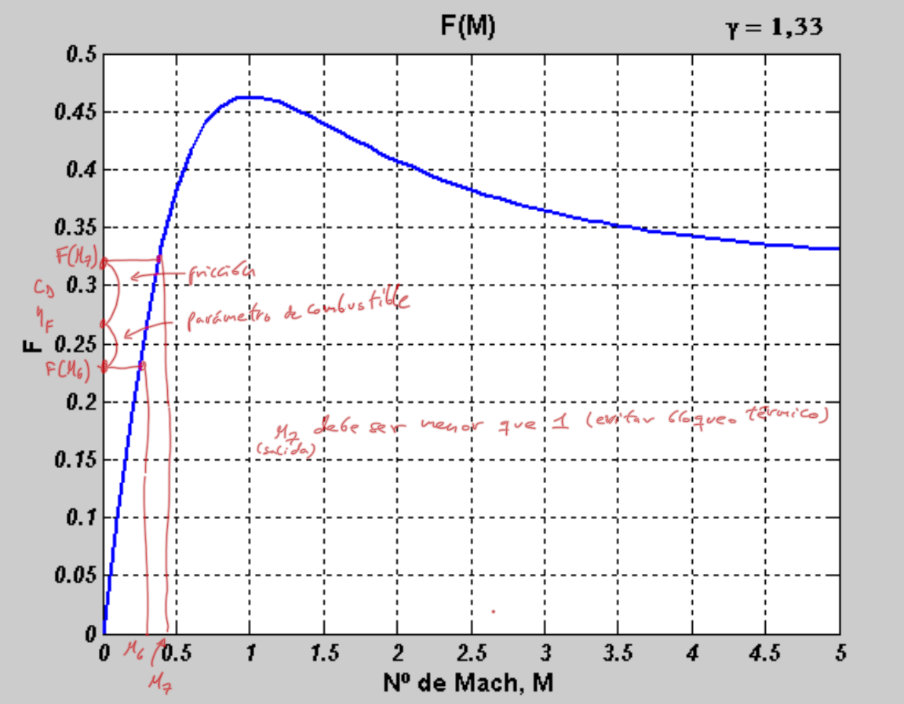

> La corriente se acelera en subsónico y se desecelera en supersónico. Esto supone el límite de funcionamiento -> $M_{7}=1$

### Límites de funcionamiento

- Parámetro de Combustible Máximo:

  <eq>
  $$
  \mathrm{P}_{f, \mathrm{lim}}=\left[\frac{F(1)}{F\left(M_{6}\right)} \frac{1+\gamma M_{6}^{2}\left(1-C_{D} / 2\right)}{1+\gamma M_{6}^{2}}\right]^{2}-1
  $$
  </eq>

- Temperatura Máxima por Bloqueo Térmico

  > Esta condicionada por $C_D, M_6$. Si $\uparrow C_D, \uparrow M_6 \rightarrow \downarrow T_{7t}/T_{6t}$

  <eq>
  $$
  \left(\frac{T_{7 t}}{T_{6 t}}\right)_{\max }=1+\mathrm{P}_{f, \lim }=\left[\frac{F(1)}{F\left(M_{6}\right)} \frac{1+\gamma M_{6}^{2}\left(1-C_{D} / 2\right)}{1+\gamma M_{6}^{2}}\right]^{2}
  $$
  </eq>

  $$
  \text { Valores típicos } P_{f} \approx 2,4 \text { y } C_{D} \approx 1 \div 2 \text {. }
  $$

 

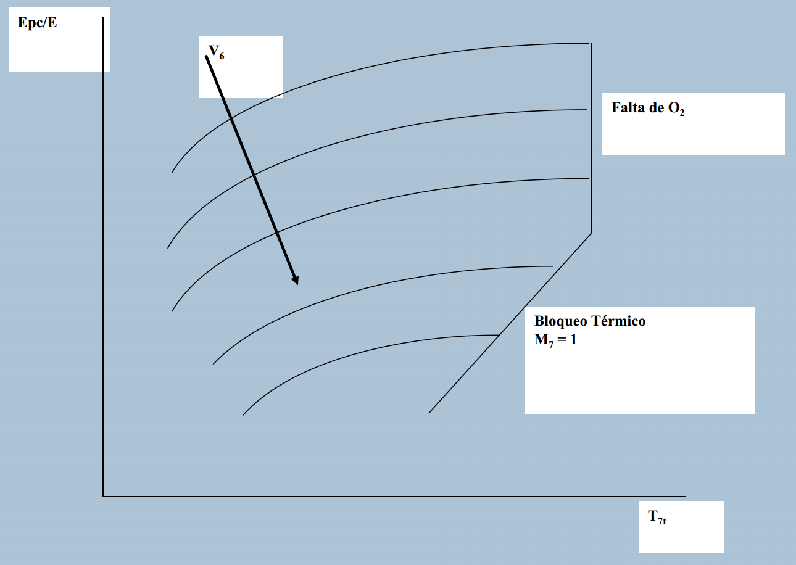 

## Tema 9: SISTEMAS INCREMENTADORES DE EMPUJE: INYECCIÓN DE AGUA

> Tema fenomenológico

- Introducción
- Inyección de agua en el compresor
- Inyección de agua en cámara de combustión

### Introducción

> Al echar agua aumenta el gasto → aumenta el empuje
>
> Se usaba para compenzar las caidas de empuje con la temperatura en despegue

 La inyección de agua fue usada por primera vez hace 49 años en el motor JT3C_6 de Pratt & Whitney instalado en un Boeing 707-120 Stratoliner . El agua inyectada en la entrada del motor proporcionaba un `aumento de empuje del 35%` en un dia con $t_0 = 90 F$

> Aumentaba el empuje del orden del postcombustor, pero tiene muchos costes asociados y el agua utilizada es de casi el precio del combustible. Aumenta la dependencia en tierra.

 El último sistema de inyección de agua como sistema incrementador de empuje fue usado en los primero Boeing, 747-100 y 747-200 con motores Pratt & Whitney JT9D-3AW y -7AW. En esta aplicación el agua fue inyectada en la salida del compresor de alta (HPC) por medio de pulverizadores localizados a la entrada de la cámara de combustión Los sistemas para incrementar el empuje mediante la inyección de agua utilizados en los aviones B-707 y B-747 fueron impopulares para las líneas aéreas debido al poco beneficio observado y los inconvenientes de servicio del sistema.

En la actualidad la inyección de agua se utiliza en turbinas de gas industriales y se ha evaluadado la posibilidad de utilización en motores de aviación para reducir las emisiones de NOx

La inyección de agua se puede realizar en el compresor (alta, HPC o baja LPC), ó a la entrada de la cámara de combustión

> El sistema de inyección de agua reduce sustancialmente los NOx. No se descarta la posible utilización a futuro no para aumentar el empuje sino para reducir los NOx.

### Inyección de agua en el compresor

<eq>
$$
\begin{aligned}
&E=G\left(V_{s}-V_{0}\right) \\
&V_{s}=\sqrt{2 c_{P} T_{t}\left[1-\left(\frac{P_{s}}{P_{t}}\right)^{\frac{\gamma-1}{\gamma}}\right]}
\end{aligned}
$$
</eq>

<eq>
$$
\Rightarrow\left\{\begin{array}{l}
G \uparrow \\
c_{P} \uparrow \\
T_{t} \uparrow \\
\frac{P_{s}}{P_{t}} \downarrow
\end{array}\right.
$$
</eq>

La inyección de agua tanto en compresor como en cámara de combustión es un sistema que aumenta el empuje debido al aumento de gasto a través del motor

Pero a ese efecto se suman también ligeros aumentos de $C_{P}$ y relación de expansión

Cuando se inyecta agua a la entrada del compresor, disminuye la temperatura a la entrada del compresor y consecuentemente la densidad. Al evaporarse las gotas de agua, el aire cede una cantidad de calor igual al calor de vaporización del agua.

> Como es un problema fuera de diseño no por echar agua se aumenta el gasto, sino que gastaría un gasto de aire menor para compensar el gasto de agua.

Condiciones de funcionamiento : suponemos T4t constante y turbina crítica:

<eq>
$$
\left.\left.\begin{array}{l}
\text { Turbina critica } \frac{G \sqrt{T_{4 t}}}{P_{4 t}}=\text { constante } \\
T_{4 t}=\text { constante }
\end{array}\right\} \Rightarrow \tau_{23} \simeq \text { cte. } \quad \begin{array}{l}
\text { temperatura de entrada } \downarrow \\
\tau_{23}=\text { cte } .
\end{array}\right\} \Rightarrow P_{3 t} \uparrow \Rightarrow
$$
</eq>

> Las turbinas trabajn en condiciones críticas (bloqueadas M=1). Tiene una restricción de paso. La única maner a de que $G\uparrow$ es $P_{4t}\uparrow$ $\pi_c \uparrow$. Hay que ver como echar agua convence al compresor para que aumente la presión. El gasto lo impone el motor. El vapor de agua tiene un $C_P$ mayor por lo que la velocidad también aumenta.
>
> El fenómeno de inyección de agua es a groso modo como disminuir la temperatura de entrada

<eq>
$$
\Rightarrow \begin{aligned}
&P_{3 t} \uparrow \Rightarrow P_{4 t} \uparrow \\
&\frac{P_{5 t}}{P_{4 t}} \simeq c t e \Rightarrow P_{5 t} \uparrow \Rightarrow V_{s} \uparrow
\end{aligned}
$$
</eq>

Además $\frac{G \sqrt{T_{4t}}}{P_{4t}} = cte \Rightarrow P_{4t} \uparrow y T_{4t}= cte \Rightarrow G \uparrow$

A estos dos efectos de aumento de gasto y de velocidad de salida se suma el efecto de aumento de $C_{P}$ debido al agua

Al disminuir $T_{3t}$, si se quiere mantener $T_{4t}$ constante hay que aumentar el gasto de combustible, y además el gasto que atraviesa la cámara es mayor

> De alguna manera este vapor debe estar quitando potencia al motor (a la turbina)

- La ecuación de acoplamiento de potencias $W_{t}=W_{c} + Q$:

  <eq>
  $$
  \left(G+G_{H2O}\right) \bar{C}_{p}\left(T_{3 t}-T_{2 t}\right)=\left(G+G_{H 2 O}+C\right) \bar{C}_{p}\left(T_{4 t}-T_{5 t}\right)-G_{H 2 O} q_{v}
  $$
  </eq>

- `Al trabajar turbina y tobera en condiciones críticas`:

  <eq>
  $$
  \left\{\begin{array}{l}
  T_{5 t} / T_{4 t}=c t e=\alpha \\
  P_{5 t} / P_{4 t}=c t e=\alpha_{p}
  \end{array}\right.
  $$
  </eq>

  > Al funcionar así el cálculo es más simple, la relación de temperaturas es independiente de todo, es una constante.

- Sustituyendo queda la ecuación de acoplamiento de la forma:

  <eq>
  $$
  (1+g) \bar{C}_{p}\left(T_{3 t}-T_{2 t}\right)=(1+g+f) \bar{C}_{p} T_{4 t}(1-\alpha)-g q_{v}
  $$
  </eq>

- La relación de temperaturas en el compresor con inyección ee H2O queda:

  <eq>
  $$
  \left(\frac{T_{3 t}}{T_{2 t}}\right)_{H 2 O}=1+\frac{(1+g+f) \bar{C}_{p}(1-\alpha)}{(1+g)} \frac{T_{4 t}}{T_{2 t}}-\frac{g q_{v}}{(1+g) \bar{C}_{p} T_{2 t}}
  $$
  </eq>

  $g=G/G_{H20}$

- Menor que sin inyección, debido al calor cedido al agua

  > Es un fenómeno que va acompañado por una disminución de entropía

- El incremento de presión lo conoceremos a través del cambio de entropía:

  $$
  \Delta s=C_{p} \ln \left(\frac{T_{3 t}}{T_{2 t}}\right)-R \ln \left(\frac{P_{3 t}}{P_{2 t}}\right) \Rightarrow \frac{P_{3 t}}{P_{2 t}}=\exp \left[\frac{\gamma}{\gamma-1} \ln \left(\frac{T_{3 t}}{T_{2 t}}\right)-\frac{\Delta s}{R}\right]
  $$

- El incremento de entropía del proceso de cesión de calor será

  > Se esta cediendo calor

  $$
  \Delta S_{H 2 O}=-G_{H 2 O} \frac{q_{v}}{T_{e}} \Rightarrow \Delta s_{H 2 O}=-g \frac{q_{v}}{T_{e}}
  $$

- Suponiendo que sin inyección el proceso es isentrópico (ηc = 1), la relación de compresión para el caso de inyección de H2O es:

  <eq>
  $$
  \left(\pi_{c}\right)_{H 2 O}=\exp \left[\frac{\gamma}{\gamma-1} \ln \left(\frac{T_{3 t}}{T_{2 t}}\right)_{H 2 O}+\frac{g}{(1+g)} \frac{q_{v}}{R T_{e}}\right]
  $$
  </eq>

  > La única forma de aumentar el gasto es dar más presión -> $G \sqrt{RT_{4t}}/AP_{4t}|_{M=1}=cte$
  >
  > Al perder calor el aire y darselo al agua, la entropía disminuía -> sube la relación de compresión

- Mayor que sin inyección

- Al aumentar la relación de compresión aumenta el gasto a traves de la turbina

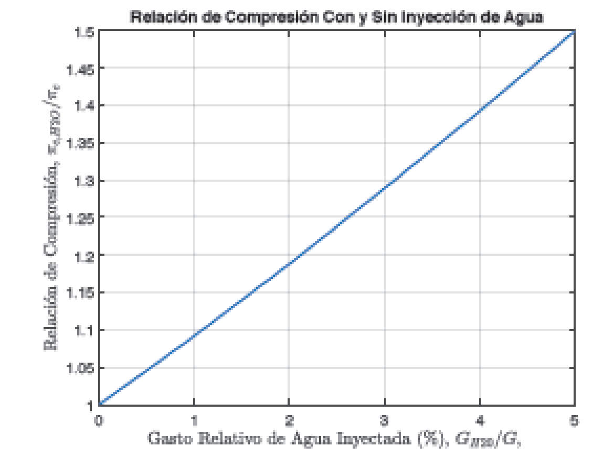  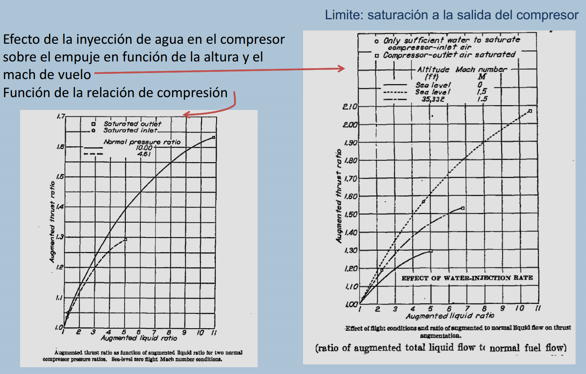

> Aumento de empuje del orden de postcombustores $\sim 30%$. Para cada relación de compresión hay un límite (las curvas se acaban). Conforme el compresor es más grande acepta más agua. El límite es el límite de saturación del aire, no es capaz de disolverse en el aire. No se puede trabajara con agua líquida. El límite está muy por encima de lo que se necesita. Además el problema del agua es un gran oxidantes, la vida del compresor puede reducirse drasticamente.

 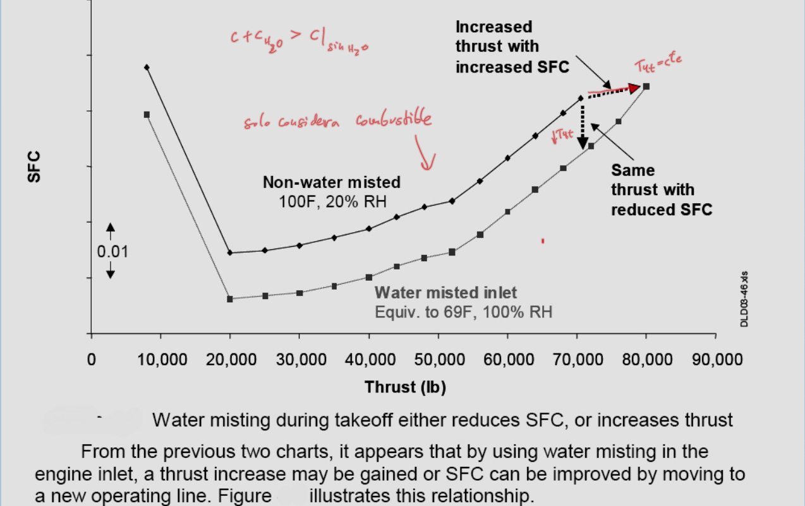

### Inyección de agua en cámara de combustión

Hipótesis de funcionamiento: T4t constante y turbina crítica

- Se inyecta agua $\left(c_{\text {agua }}\right)$

$$
\frac{G \sqrt{T_{4 t}}}{P_{4 t}} \text { cte y } T_{4 t}=\text { cte y } P_{4 t}=\text { cte } \Rightarrow \text { gasto a través de la turbina } G=\text { cte. }
$$

$$
G_{\text {aire }}+c_{\text {fuel }}=G_{\text {are }}^{\prime}+c_{\text {fuel }}^{\prime}+c_{\text {agua }} \Rightarrow G_{\text {aire }}^{\prime}<G
$$

$$
\frac{G_{\text {aire }}^{\prime} \sqrt{T_{2 t}}}{P_{2 t}}<\frac{G_{\text {aire }} \sqrt{T_{2 t}}}{P_{2 t}}
$$

>  El gasto de aire disminuye al echar agua, que el gasto dismiya implica que la relación de compresión aumente -> aumenta la capacidad de gasto

Debido a la inercia del grupo rotatorio, la primera repuesta del sistema es desplazarse por una línea de vueltas constantes hacia valores menores del parámetro del gasto y mayores de presión

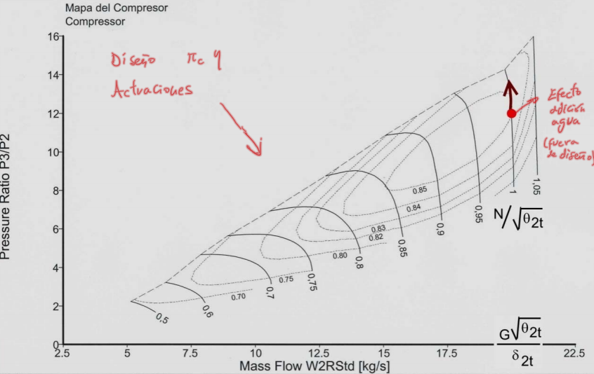

$$
P_{3 t} \uparrow \Rightarrow P_{4 t} \uparrow \quad P_{3 t} \uparrow \Rightarrow P_{4 t} \uparrow \Rightarrow P_{5 t} \uparrow \Rightarrow V_{s} \uparrow
$$

$$
\frac{G \uparrow \sqrt{T_{4 t}}}{P_{4 t} \uparrow}= cte \Rightarrow \textrm{gasto turbina aumenta} \quad
\textrm{Gasto a través de la tobera aumenta}
$$

El aumento del gasto es inferior que en el caso de inyección en el compresor, además el punto de funcionamiento se desplaza hacia la línea del surge, pero evita las complicaciones asociadas con la inyección de agua en el compresor

Solución analítica de la inyección de agua en cámara de combustión:

<eq>
$$
\left.\begin{array}{l}
\frac{G \sqrt{T_{4 t}}}{P_{4 t}}=K_{1} \\
\frac{G \sqrt{T_{5 t}}}{P_{5 t}}=K_{2}
\end{array}\right\}\left\{\begin{array}{l}
\eta_{45} \simeq c t e \\
\frac{T_{5 t}}{T_{4 t}}=\alpha=c t e \\
\frac{P_{5 t}}{P_{4 t}}=\beta=c t e \\
T_{4 t}=c t e \Rightarrow \tau_{45}=c_{P} T_{4 t}(1-\alpha)=c t e
\end{array}\right.
$$
</eq>

- Sin inyección de agua

  - Ecuación de acoplamiento de potencia

  <eq>
  $$
  G c_{P} T_{2 t} \frac{\pi_{c}^{\frac{\gamma-1}{\gamma}}-1}{\eta_{c}}=(1+f) G \tau_{t} \quad \text{donde} \quad f=\frac{c}{G}
  $$
  </eq>

  <eq>
  $$
  \pi_{c}=\left[1+(1+f) \eta_{c} \frac{\tau_{t}}{c_{P} T_{2 t}}\right]^{\frac{\gamma}{\gamma-1}}
  $$
  </eq>

- Con inyección de agua

  > La relación combustible aire aumenta

    <eq>
  $$
    \begin{aligned}
    &G c_{P} T_{2 t}\left(\pi_{c}^{\prime}\right)^{\frac{\gamma-1}{\gamma}}-1=\left(1+f^{\prime}+g\right) G \tau_{t} \text { donde } f^{\prime}=\frac{c^{\prime}}{G} \text { y } g=\frac{G_{\text {agua }}}{G} \\
    &\pi_{c}^{\prime}=\left[1+\left(1+f^{\prime}+g\right) \eta_{c} \frac{\tau_{t}}{c_{P} T_{2 t}}\right]^{\frac{\gamma}{\gamma-1}}
    \end{aligned}
  $$
    </eq>

- Cámara de combustión sin inyección de agua:

$$
  f=\frac{C_{P}\left(T_{4t}-T_{3t}\right)}{\eta_{q} L}
$$

- Con inyección de agua:

  $$
  f^{\prime}=\frac{c_{P}\left(T_{4 t}-T_{3^{\prime}}\right)+g q}{\eta_{q} L} \text { donde } q=c_{l}\left(T_{e}-T_{i}\right)+L+c_{P}\left(T_{4 t}-T_{e}\right)
  $$

Suponiendo → $T_{4t}-T_{3t} \simeq T_{4t}-T_{3't}$:

<eq>
$$
\begin{aligned}
&f^{\prime}=f+g \frac{q}{\eta_{q} L_{\text {fuel }}} \\
&\pi_{c}^{\prime}=\left\{1+\left[1+\frac{g}{1+f}\left(1+\frac{q}{\eta_{q} L_{\text {fuel }}}\right)\right]\left(\pi_{c}^{\frac{\gamma-1}{\gamma}}-1\right)\right\}^{\frac{\gamma}{\gamma-1}}
\end{aligned}
$$
</eq>

> Aunque el gasto de aire al prinicpio disminuye, en realidad aumenta ya que aumenta el número de vueltas
>
> El peligro no es la saturación sino que no podemos acercarnos mucho a ala línea de estabilidad, el motor dejaría de ser estable. Hay inyectar agua el motor se acerca a la línea de estabilidad.
>
> Hay que convencer al motor que admita más gasto, a que ttrabaje con mayor relación de compresión.

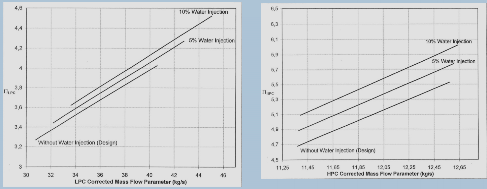 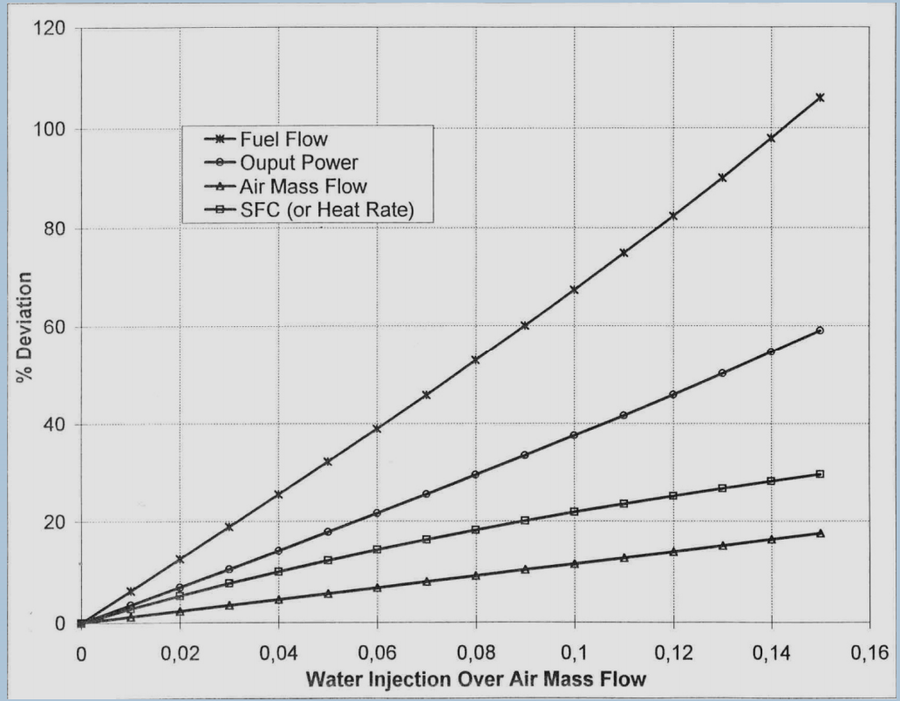

 

 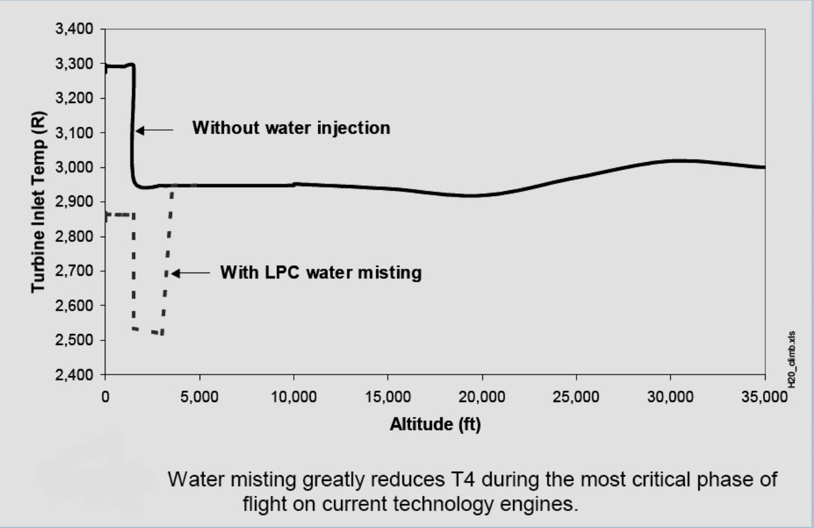

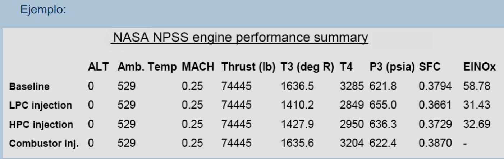 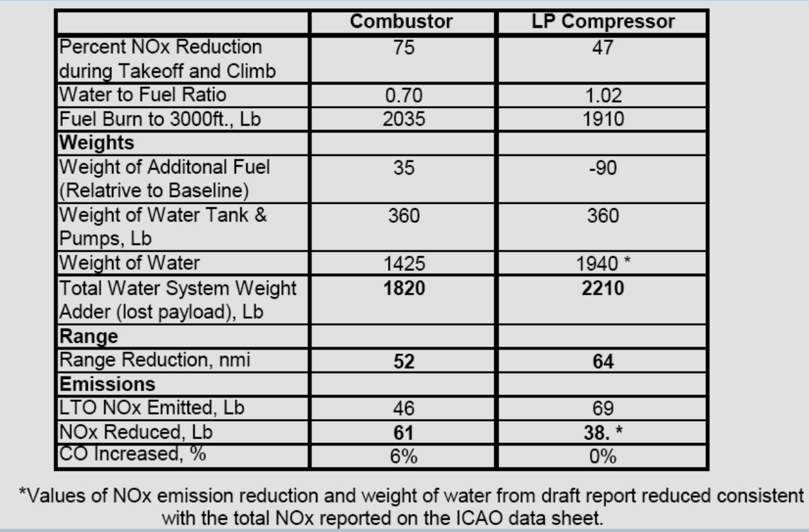 

## Tema 10: Actuaciones de Reactores

### Introducción

- Se entiende por actuaciones el comportamiento de un motor particular dentro de su envuelta de vuelo y bajo toda condición de funcionamiento que permitan sus controles.
- Las principales características que definen las actuaciones de un aerorreactor son: el empuje, E, el gasto de aire, G, el consumo de combustible, c, y las características de calidad asociadas: el consumo específico, $C_{E}$, el impulso específico, $I_{sp}$, y la relación combustible/aire, f.

> Queremos las variables específicas en función del posicionamienro de los controles y la envuelta de vuelo.

- Por consiguiente, las actuaciones del aerorreactor son las definidas por las características antes citadas en función de las condiciones de vuelo, y de los parámetros de control o posicionamiento de los controles según unas leyes de control.

> Aunque hay muchas varaibales solo existe un grado de libertad, que lo asociaremos al régimen.

- Leyes de control son aquellas funciones que definen el posicionamiento de los controles para obtener un funcionamiento dado del motor en función de las condiciones de vuelo y de cualquier otra consideración que se estime oportuna bien para salvaguardar la seguridad y estabilidad de funcionamiento del sistema bien para garantizar un funcionamiento óptimo de cualquier tipo.

### Curvas Características

- Son las relaciones funcionales que dan las actuaciones del sistema:
- $E, G, c, C_{E}, I_{sp} = f_{i} (T_{0}, P_{0}, V_{0}, R, C_{p}, D, diseño, controles)$
- Aplicando el teorema $\Pi$ de Vaschy-Buckingham, se pasa a las siguientes variables adimensionales

<eq>
$$
\left.\begin{array}{l}
\frac{E}{P_{0} D^{2}} \\
\frac{G \sqrt{R T_{0}}}{P_{0} D^{2}} \\
\frac{C L}{P_{0} D^{2} \sqrt{R T_{0}}} \\
\frac{C_{E} L}{\sqrt{R T_{0}}} \\
\frac{I_{s p}}{\sqrt{R T_{0}}}
\end{array}\right\}=\varphi_{i}\left(\frac{V_{0}}{\sqrt{R T_{0}}}, \frac{\mu \sqrt{R T_{0}}}{P_{0} D}, \gamma, \text { diseño, controles }\right)
$$
</eq>

- Independientemente de los dispositivos variables que tenga el aerorreactor (tobera de salida variable, difusor variable, estátores variables...), en la practica, el control de la totalidad de los aerorreactores queda determinado por la posición de un único elemento sobre el que se actúa: la palanca, que determina lo que se conoce como régimen de motor (o punto de funcionamiento definido por una posición de la palanca), todos los demás dispositivos variables se posicionan como función de la posición de la palanca y de las condiciones de vuelo o de maniobra del avión.
- La ecuación que liga la posición de la palanca en función del régimen o requisito particular de funcionamiento del motor, así como las ecuaciones que ligan la posición de los sistemas variables se conoce como leyes de control y se establecen como requisitos a cumplir en el funcionamiento del aerorreactor.
- Normalmente, como ha sido habitual, en las actuaciones de los componentes, se utilizan variables y características (seudo-adimensionales) derivadas de las anteriores, pero sin las constantes. Para sistemas fijos el tamaño (D) también es una constante, así las leyes de control y las características y variables que se manejan en las actuaciones de los aerorreactores son:

<eq>
$$
\left.\begin{array}{l}
\frac{E}{P_{0}} \\
\frac{G \sqrt{T_{0}}}{P_{0}} \\
\frac{c}{P_{0} \sqrt{T_{0}}} \\
\frac{C_{E}}{\sqrt{T_{0}}} \\
\frac{I_{s p}}{\sqrt{T_{0}}} \\
f
\end{array}\right\}=\varphi_{i}\left(\begin{array}{l}
M_{0}, Regimen\left\{\begin{array}{c}
N \\
\sqrt{T_{0}} \\
\frac{T_{4 t}}{T_{2 t}} \\
\cdots \cdots
\end{array}\right\} \text {, correcciones de Reynolds }
\end{array}\right\}
$$
</eq>

### Metodología de Cálculo

> Dado un compresor, turbina, tobera y sus comportamientos e| c | cc | t | tob. Los motores se venden antes de hacerlos, basados en los componentes. El conocimiento es muy profundo a nivel de ensayo.
>
> Se sustituye un ensayo del turborreactor completo por ensayos precisos de sus componentes. En actuaciones se acoplan

- La metodología de síntesis consiste en obtener las actuaciones del aerorreactor basándose en el conocimiento o comportamiento de sus componentes.
- Para ello, se parte de las curvas características de los componentes y se añaden las ecuaciones de acoplamiento (o de compatibilidad) que son las que nos informan de que dichos componentes no están aislados, forman parte del sistema aerorreactor.
- Existen distintos tipos de ecuaciones de acoplamiento: unas describen que el gasto másico, que atraviesa los distintos componentes, es el mismo; otras deben reflejan el hecho de que las revoluciones del compresor y turbina del mismo eje son iguales; así como que, en estado estacionario y para cada eje, la potencia que suministra la turbina es igual a la que absorbe el correspondiente compresor, fan o ambos.
- A continuación, y como aplicación, se va a plantear el problema para un turborreactor monoeje de flujo único.

### Actuaciones de Compresores

- Se quiere conocer el comportamiento de la relación de compresión de un compresor, $\pi_c = P_{3t}/P_{2t}$, y del rendimiento adiabático del mismo, $\eta_c$.
- La presión y temperatura, ambas de remanso, a la salida del compresor serán función de las variables siguientes:
	- Condiciones de entrada, P2t, T2t
	- Condiciones de funcionamiento: Gasto másico, G, y Potencia suministrada, W
	- Características del gas, R, Cp, $\mu$, k (ec.estado y ec.transporte)
	- Diseño, caracterizado por una longitud característica, D

$$
P_{3t}, T_{3t}=f\left(P_{2 t}, T_{2 t}, G, N, R, C_{p}, \mu, k, \text { diseño, } D\right)
$$

### Ecuaciones de Componentes

- Entrada (0-2):

  ​	4 variables, 2 ecuaciones

  - Variables: $\frac{P_{2 t}}{P_{0}} ; \frac{T_{2 t}}{T_{0}} ; \frac{G \sqrt{T_{0}}}{P_{0}} ; \frac{V_{0}}{\sqrt{T_{0}}}$
  - Ecuaciones:

    <eq>
    $$
    \begin{aligned}
    &\frac{P_{2 t}}{P_{0}}=f_{1}\left(\frac{G \sqrt{T_{0}}}{P_{0}}, \frac{V_{0}}{\sqrt{T_{0}}}\right) \\
    &\frac{T_{2 t}}{T_{0}}=f_{2}\left(\frac{G \sqrt{T_{0}}}{P_{0}}, \frac{V_{0}}{\sqrt{T_{0}}}\right)
    \end{aligned}
    $$
    </eq>

    $$
    \frac{T_{2 t}}{T_{0}}=1+\frac{1}{2 C_{p}}\left(\frac{V_{0}}{\sqrt{T_{0}}}\right)^{2}=1+\frac{\gamma-1}{2} M_{0}^{2}
    $$

- Compresor (2-3)

  ​	4 variables, 2 ecuaciones

  - Variables: $\frac{P_{3 t}}{P_{2 t}} ; \frac{T_{3 t}}{T_{2 t}} ; \frac{G \sqrt{T_{2 t}}}{P_{2 t}} ; \frac{N}{\sqrt{T_{2 t}}}$
  - Ecuaciones:

    <eq>
    $$
    \begin{aligned}
    &\frac{P_{3 t}}{P_{2 t}}=\pi_{c}=f_{3}\left(\frac{G \sqrt{T_{2 t}}}{P_{2 t}}, \frac{N}{\sqrt{T_{2 t}}}\right) \\
    &\frac{T_{3 t}}{T_{2 t}}=1+\frac{\tau_{c}}{C_{p} T_{2 t}}=f_{4}\left(\frac{G \sqrt{T_{2 t}}}{P_{2 t}}, \frac{N}{\sqrt{T_{2 t}}}\right)
    \end{aligned}
    $$
    </eq>

- Cámara de Combustión (3-4)

  ​	4 variables, 2 ecuaciones

  - Variables: $\frac{P_{4 t}}{P_{3 t}} ; \frac{T_{4 t}}{T_{3 t}} ; \frac{G \sqrt{T_{3 t}}}{P_{3 t}} ; \frac{\eta_{q} c L}{P_{3 t} \sqrt{T_{3 t}}}\left(0 \frac{\eta_{q} f L}{T_{3 t}}\right)$

  - Ecuaciones:

    <eq>
    $$
    \begin{aligned}
    &\frac{P_{4 t}}{P_{3 t}}=f_{5}\left(\frac{G \sqrt{T_{3 t}}}{P_{3 t}}, \frac{\eta_{q} c L}{P_{3 t} \sqrt{T_{3 t}}}\right) \\
    &\frac{T_{4 t}}{T_{3 t}}=f_{6}\left(\frac{G \sqrt{T_{3 t}}}{P_{3 t}}, \frac{\eta_{q} c L}{P_{3 t} \sqrt{T_{3 t}}}\right)\left\{o \quad f_{6}\left(\frac{\eta_{q} f L}{T_{3 t}}\right)\right\}
    \end{aligned}
    $$
    </eq>

    ---

    $$
    \frac{T_{4 t}}{T_{3 t}}=1+\frac{1}{C_{p}} \frac{\eta_{q} f L}{T_{3 t}}
    $$

    $$
    \frac{P_{4 t}}{P_{3 t}}=1-\left[K_{\mu}+K\left(\frac{T_{4 t}}{T_{3 t}}-1\right)\right] \frac{1}{2}\left(\frac{G \sqrt{R T_{3 t}}}{P_{3 t} A_{r e f}}\right)^{2}
    $$

- Turbina (4-5)

  ​	4 variables, 2 ecuaciones

  - Variables: $\frac{P_{5 t}}{P_{4 t}} ; \frac{T_{5 t}}{T_{4 t}} ; \frac{G \sqrt{T_{4 t}}}{P_{4 t}} ; \frac{N}{\sqrt{T_{4 t}}}$

  - Ecuaciones:

    <eq>
    $$
    \begin{aligned}
    &\frac{P_{5 t}}{P_{4 t}}=f_{7}\left(\frac{G \sqrt{T_{4 t}}}{P_{4 t}}, \frac{N}{\sqrt{T_{4 t}}}\right) \\
    &\frac{T_{5 t}}{T_{4 t}}=f_{8}\left(\frac{G \sqrt{T_{4 t}}}{P_{4 t}}, \frac{N}{\sqrt{T_{4 t}}}\right)
    \end{aligned}
    $$
    </eq>

    ---

    $$
    \frac{G \sqrt{T_{4 t}}}{P_{4 t}}=\Gamma(\gamma) \frac{A_{\text {directriz }}}{\sqrt{R}}
    $$

- Tobera de salida (5-s)

  ​	4 variables, 3 ecuaciones

  - Variables: $\frac{P_{s}}{P_{5 t}} ; \frac{T_{s}}{T_{5}} ; \frac{G \sqrt{T_{5 t}}}{P_{5 t}} ; \frac{V_{s}}{\sqrt{T_{5 t}}}$

  - Ecuaciones:

    <eq>
    $$
    \begin{aligned}
    &\frac{P_{s}}{P_{5 t}}=f_{9}\left(\frac{G \sqrt{T_{5 t}}}{P_{5 t}}\right) \\
    &\frac{T_{s}}{T_{5 t}}=f_{10}\left(\frac{G \sqrt{T_{5 t}}}{P_{5 t}}\right) \\
    &\frac{V_{s}}{\sqrt{T_{5 t}}}=f_{11}\left(\frac{G \sqrt{T_{5 t}}}{P_{5 t}}\right)
    \end{aligned}
    $$
    </eq>

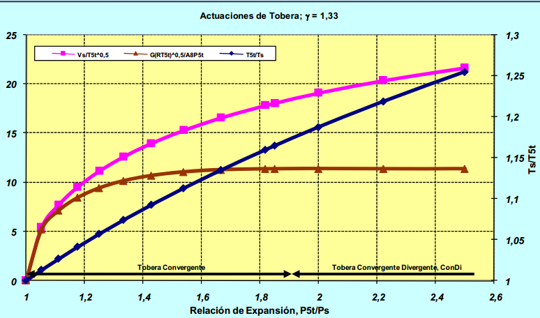

### Ecuaciones de Acoplamiento

- Gasto (continuidad):

  <eq>
  $$
  \begin{gathered}
  \frac{G \sqrt{T_{2 t}}}{P_{2 t}}=\frac{G \sqrt{T_{0}}}{P_{0}} \frac{P_{0}}{P_{2 t}} \sqrt{\frac{T_{2 t}}{T_{0}}} \\
  \frac{G \sqrt{T_{3 t}}}{P_{3 t}}=\frac{G \sqrt{T_{2 t}}}{P_{2 t}} \frac{P_{2 t}}{P_{3 t}} \sqrt{\frac{T_{3 t}}{T_{2 t}}} \\
  \frac{G \sqrt{T_{4 t}}}{P_{4 t}}=\frac{G \sqrt{T_{3 t}}}{P_{3 t}} \frac{P_{3 t}}{P_{4 t}} \sqrt{\frac{T_{4 t}}{T_{3 t}}} \\
  \frac{G \sqrt{T_{5 t}}}{P_{5 t}}=\frac{G \sqrt{T_{4 t}}}{P_{4 t}} \frac{P_{4 t}}{P_{5 t}} \sqrt{\frac{T_{5 t}}{T_{4 t}}}
  \end{gathered}
  $$
  </eq>

- Vueltas:

  $$
  \frac{N}{\sqrt{T_{4 t}}}=\frac{N}{\sqrt{T_{2 t}}} \sqrt{\frac{T_{2 t}}{T_{3 t}}} \sqrt{\frac{T_{3 t}}{T_{4 t}}}
  $$

- Potencia:

  $$
  \left(T_{4 t}-T_{5 t}\right)=\left(T_{3 t}-T_{2 t}\right) \Rightarrow \frac{T_{4 t}}{T_{3 t}} \frac{T_{3 t}}{T_{2 t}}\left(1-\frac{T_{5 t}}{T_{4 t}}\right)=\left(\frac{T_{3 t}}{T_{2 t}}-1\right)
  $$

0 variables, 6 ecuaciones ->  $\frac{T_{4 t}}{T_{2 t}}=\frac{T_{4 t}}{T_{3 t}} \frac{T_{3 t}}{T_{2 t}}$ → 1 varaible, 7 ecuaciones

- Recapitulando:
  - 21 variable
  - 18 ecuaciones
  - \+ Condición de Salida: $P_{s} = P_{0} \rightarrow \frac{P_{s}}{P_{5t}} \frac{P_{5t}}{P_{4t}} \frac{P_{4t}}{P_{3t}} \frac{P_{3t}}{P_{2t}} \frac{P_{2t}}{P_{0}}=1$

- Finalmente queda
	- 21 variable
	- 19 ecuaciones
- Sistema con dos grados de libertad: $M_{0}$ y Régimen ($T_{4t}/T_{2t}$)

### Acoplamiento Interno: Generador de Gas

- Se conoce como generador de gas el sistema formado por el compresor, cámara de combustión y turbina. Es el “núcleo ” del turborreactor.
- Su misión consiste en proporcionar un gas a una temperatura y presión elevada (sobre la atmosférica) del que se pueda extraer potencia mecánica.
- Observando las curvas características de dichos componentes, se observa que se disponen de 6 ecuaciones que relacionan 12 variables
- Además, están las ecuaciones de acoplamiento: 2 de Gasto, una de vueltas y una de potencias (que genera una variable y una ecuación más)
- En total: 13 variables y 11 ecuaciones → 2 grados de libertad

### Resolución del Acoplamiento Interno

- Se “elige” un punto del compresor (dos g. l.); a saber:  $\frac{G \sqrt{T_{2 t}}}{P2t}, \frac{N}{\sqrt{T_{2 t}}}$

- De las curvas del compresor se obtienen:  $\frac{P_{3 t}}{P_{2 t}}, \frac{T_{3 t}}{T_{2 t}}$

- De una de las ecuación de continuidad:  $\frac{G \sqrt{T_{3 t}}}{P_{3 t}}=\frac{G \sqrt{T_{2 t}} P_{2 t}}{P_{2 t}} \frac{T_{3 t}}{P_{3 t}} \sqrt{\frac{T_{2 t}}{2 t_{2 t}}}$

- Para continuar, se “supone” un valor para: $T_{4 t} / T_{2 t}$

- Se calcula:  $T_{3t} / T_{2t}$

- De la ecuación de la energía de la cámara de combustión, se obtiene el parámetro de combustible: $\eta_{q} c L / P_{3 t} \sqrt{T_{3t}}$

- De la ecuación de pérdidas de la cámara se obtiene $P_{4t} / T_{3t}$

- De la segunda ecuación de continuidad: $\frac{G \sqrt{T_{4t}}}{P_{4 t}}=\frac{G \sqrt{T_{3t}}}{P_{3 t}} \frac{P_{3 t}}{P_{4 t}} \sqrt{\frac{T_{4 t}}{T_{3 t}}}$
- De la ecuación de vueltas $\frac{N}{\sqrt{T_{4 t}}}=\frac{N}{\sqrt{T_{2 t}}} \sqrt{\frac{T_{2t}}{T_{4t}}}$
- Con las dos variables anteriores, se puede entrar en las curvas características de la turbina para obtener finalmente: $\frac{P_{4t}}{P_{5t}}, \frac{T_{4t}}{T_{5t}}$
- En este momento, se tienen calculadas todas la variables del generador de gas (13)
- Pero no se ha utilizado todavía la ecuación del acoplamiento de potencias. Esa ecuación servirá para obtener el “verdadero valor” de la variable supuesta $T_{4t} / T_{2t}$

- Las soluciones encontradas de los diferentes valores de $T_{4 t} / T_{2 t}$ se pueden representar en el mapa del compresor

  

   Las líneas ($T_{4t}/T_{2t}$) = cte. Son posibles líneas de funcionamiento en equilibrio del generador de gas y tienen que cumplir la solución:

- Además, finalmente, se puede representar el funcionamiento del generador de gas de forma gráfica

## Tema 11: Actuaciones de Componentes

Un motor dado volará a $M_{0}, h$ y tiene una palanca de gas. Lo que queremos es ver como cambia.

### Actuaciones de Compresores

- Se quiere conocer el comportamiento de la relación de compresión de un compresor, $\pi_{c} = P_{3t}/P_{2t}$, y del rendimiento adiabático del mismo, $\eta_{c}$.
- La presión y temperatura, ambas de remanso, a la salida del compresor serán función de las variables siguientes:
	- Condiciones de entrada, $P_{2t}$, $T_{2t}$
	- Condiciones de funcionamiento: Gasto másico, G, y Potencia suministrada, W
	- Características del gas, R, Cp, , k
	- Diseño, caracterizado por una longitud característica, D

$$
P_{3 t}, T_{3 t}=f\left(P_{2 t}, T_{2 t}, G, N, R, C_{p}, \mu, k, \text { diseño, } D\right)
$$

- Se va a utilizar, como condición de funcionamiento, las revoluciones del compresor, N, en lugar de la potencia suministrada, ya que la medición de las revoluciones es mucho más sencilla.
- Usando variables adimensionales. Se obtienen los comportamientos de forma experimental con una cantidad baja de ensayos. Aplicando el teorema de $\Pi$- Buckinham se pueden obtener características adimensionales en función del número de variables físicas anteriores menos cuatro (que son las magnitudes fundamentales que entran en el problema); o sea, utilizando $P_{2t}$, $T_{2t}$, R y D para adimensionalizar, queda:

$$
\frac{P_{3 t}}{P_{2 t}}, \frac{T_{3 t}}{T_{2 t}}=\varphi\left(\frac{G \sqrt{R T_{2 t}}}{P_{2 t} D^{2}}, \frac{N D}{\sqrt{R T_{2 t}}}, \gamma, \frac{\mu \sqrt{R T_{2 t}}}{P_{2 t} D}, \frac{k \sqrt{R T_{2 t}}}{P_{2 t} R D}\right)
$$

- El número de Prandtl, $Pr = \mu C_{p}/k$, del aire es del orden de la unidad, o sea: $\mu ≈ k/Cp ≈ k/R$.
- Los efectos de las dos últimas variables adimensionales son del mismo orden, y en la mayoría de los casos despreciables, ya que son inversamente proporcional al número de Reynolds, y cuando este es mayor que el crítico los coeficientes de pérdidas son constantes y no influyen en las funciones $\varphi$.

- En la mayoría de los casos, la relación de presiones y temperaturas entre salida y entrada serán función de las variables adimensionales relacionadas con el gasto y las vueltas

$$
\frac{P_{3 t}}{P_{2 t}}, \frac{T_{3 t}}{T_{2 t}}=\varphi\left(\frac{G \sqrt{R T_{2 t}}}{P_{2 t} D^{2}}, \frac{N D}{\sqrt{R T_{2 t}}}\right)
$$

- Cuando sólo se está interesado en el comportamiento del compresor funcionando con un único fluido, como es nuestro caso, donde sólo nos interesa el comportamiento con aire, la relación de calores específicos, c, no cambia y no aparece en las funciones.

- Con el fin de no operar con cantidades que son constantes, para un compresor dado, funcionando con aire, en vez de utilizar las anteriores variables adimensionales, se utilizan unas proporcionales a ellas, en donde no aparece las cantidades constantes $R$ y $D$.

$$
\frac{P_{3 t}}{P_{2 t}}, \frac{T_{3 t}}{T_{2 t}}=\varphi\left(\frac{G_{2 t}}{P_{2 t}}, \frac{N}{\sqrt{T_{2 t}}}\right)
$$

- Estos parámetros (con dimensiones), el de gasto y el de vueltas (llamadas vueltas aerodinámicas) son los universalmente usados en aerorreactores para definir el comportamiento del compresor.

### Curvas Características de Compresores

- La representación de las funciones son los mapas del compresor o curvas características del compresor.

- Las curvas características de un compresor centrífugo y otro axial típicos de aerorreactores son.

- La curva $T_{3t} / T_{2t}$ se ha sustituido por la del rendimiento adiabático como suele ser normal.

- Otra forma muy común de representación de las curvas características de un compresor, es representar en la misma grafica de la relación del compresor el rendimiento adiabático como curvas de nivel.

 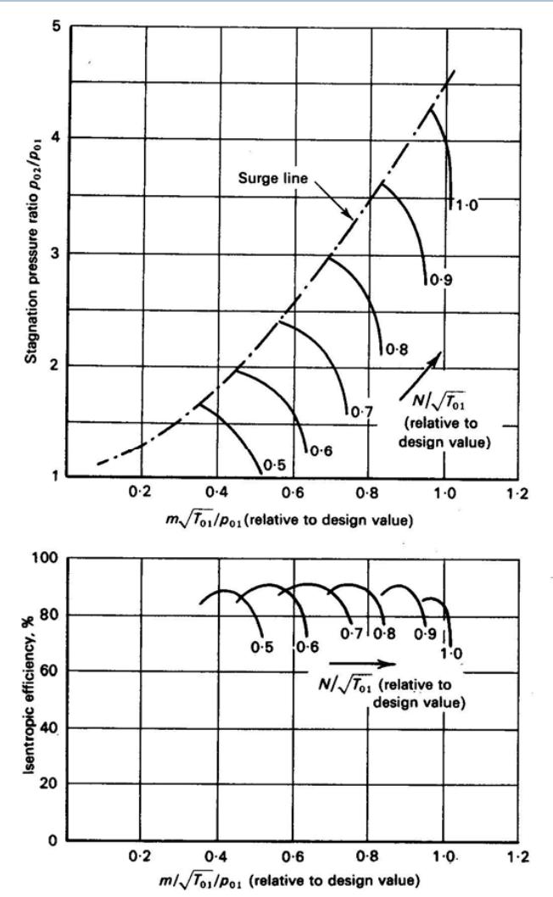 

  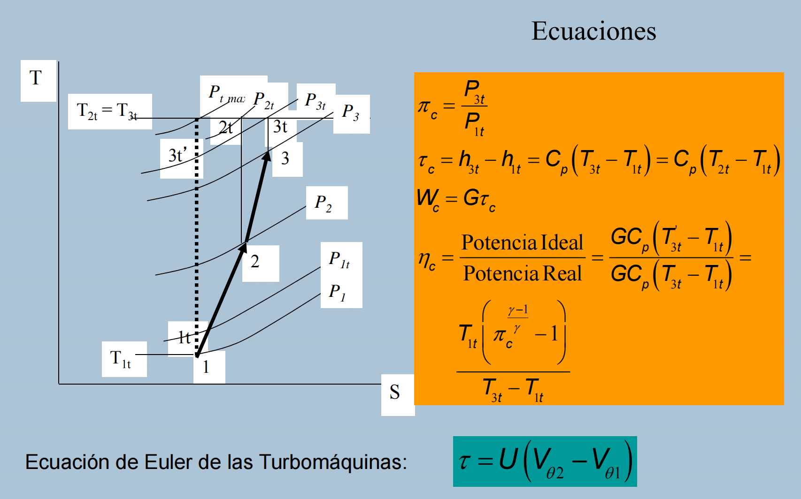

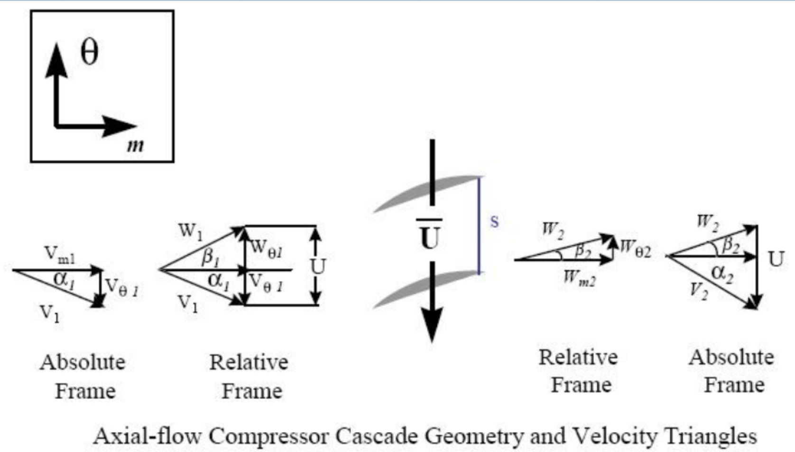 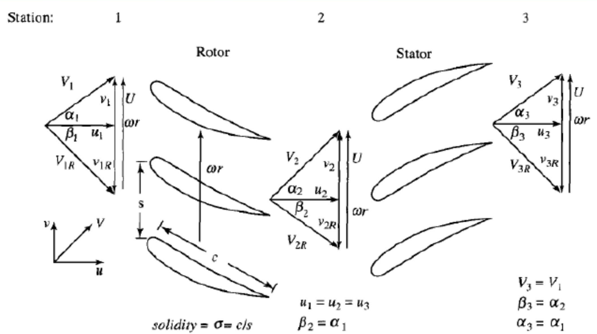 

 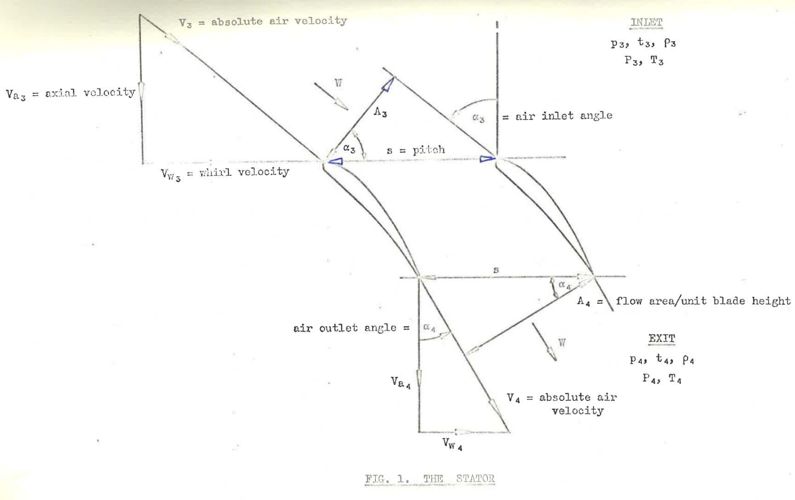 

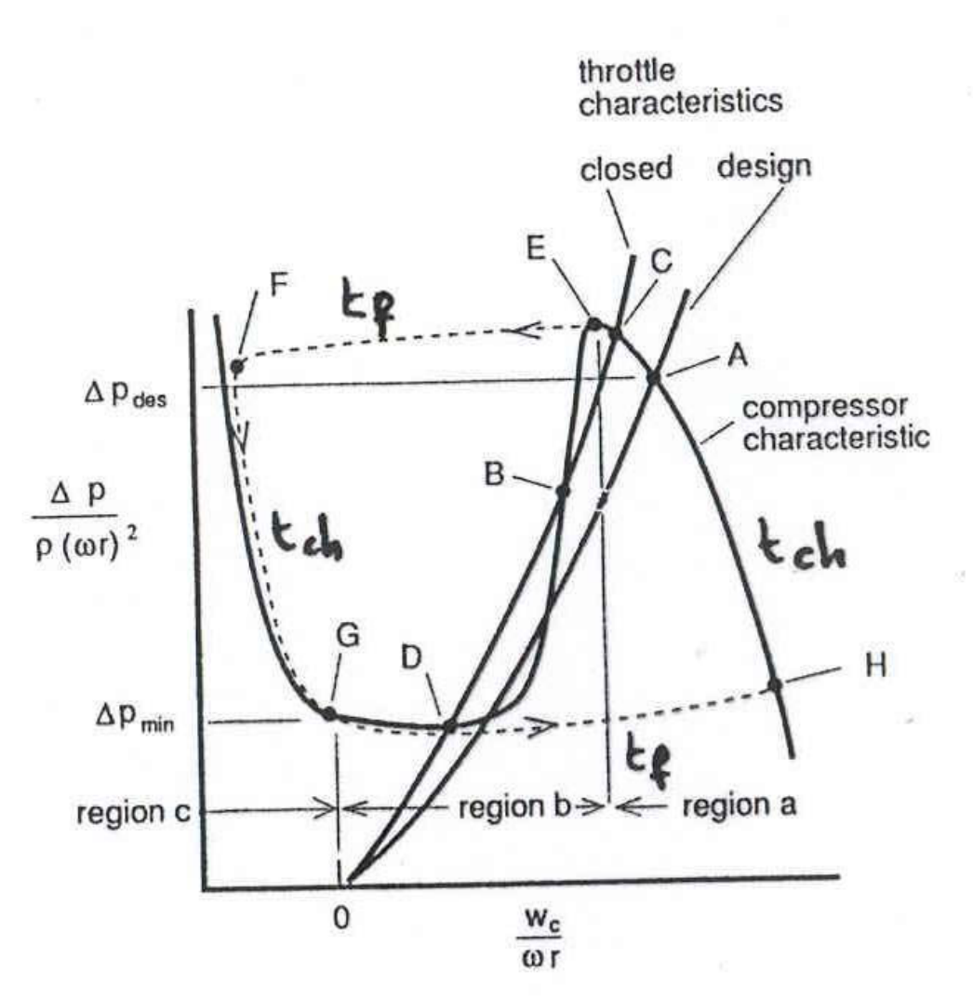  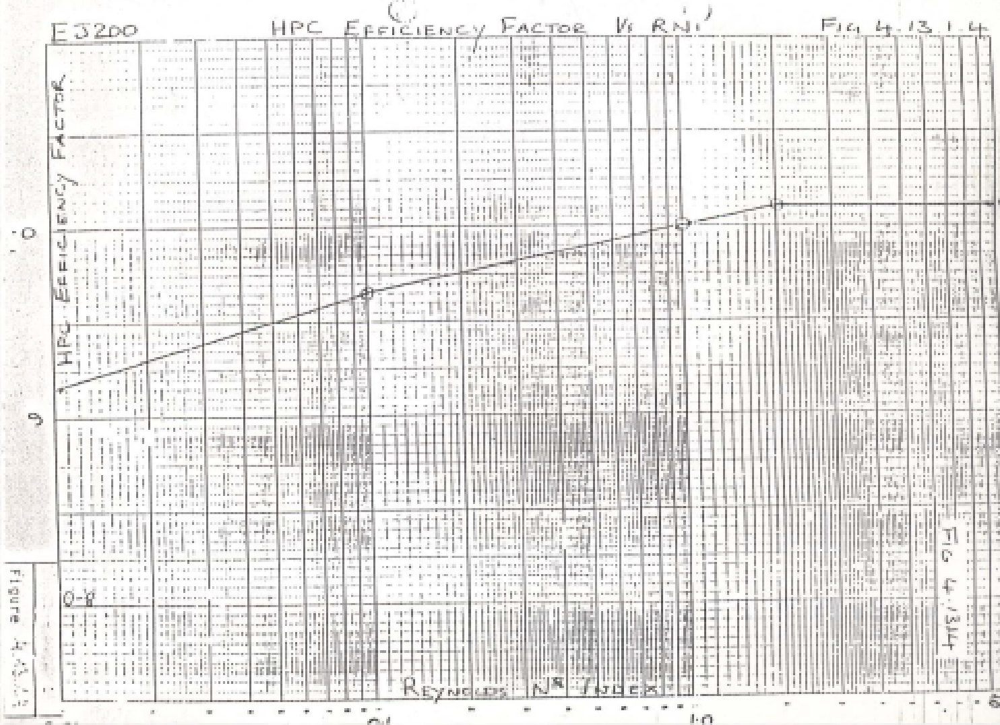

  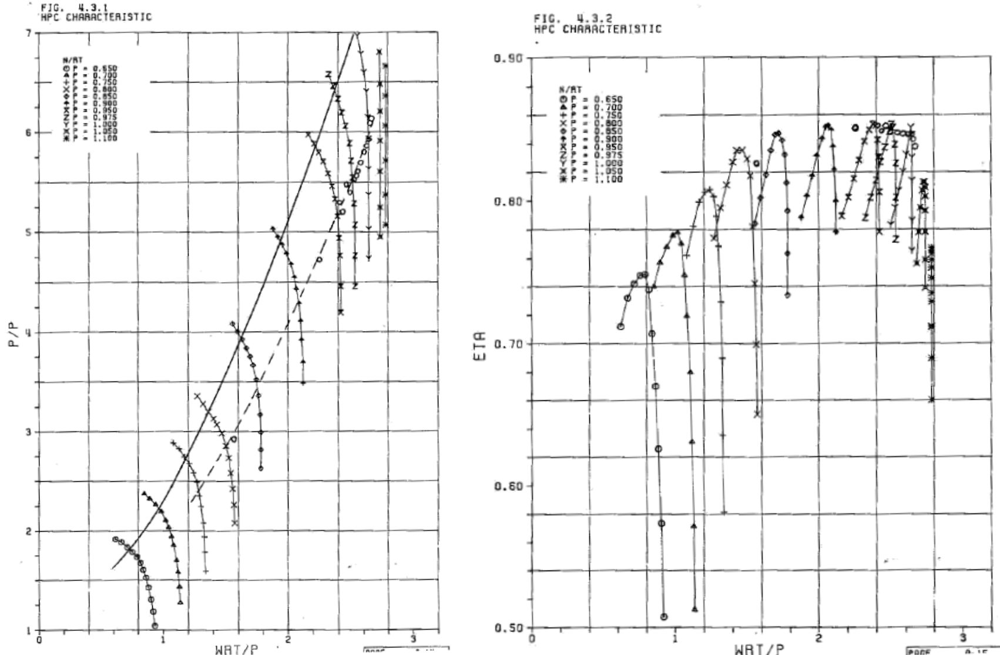

### Actuaciones de Turbinas

- Se quiere obtener (como en compresores) como varían la relación de expansión de la turbina, $\eta_{t}=P_{5 t} / P_{4 t}$, y su rendimiento adiabático, $/, t$, en función de los parámetros que definen su funcionamiento

- Condiciones de entrada, $P_{4 t}, T_{4 t}$

- Condiciones de funcionamiento: Gasto másico, G, y Potencia obtenida, $W_{t}$

- Características del gas, $R, C_{p}, /, k$

- Diseño, caracterizado por una longitud característica, $D$

$$
P_{5 t}, T_{5 t}=f\left(P_{4 t}, T_{4 t}, G, N, R, C_{p}, \mu, k, \text { diseño }, D\right)
$$

- Utilizando como condición de funcionamiento, las revoluciones de la turbina, N, que son las mismas que las revoluciones del compresor.
- Aplicando el teorema de $\Pi$ de Vaschy-Buckingham, se pueden obtener las características adimensionales de la turbina; utilizando P4t, T4t, R y D para adimensionalizar

$$
\frac{P_{4 t}}{P_{5 t}}, \frac{T_{4 t}}{T_{5 t}}=\varphi\left(\frac{G \sqrt{R T_{4 t}}}{P_{4 t} D^{2}}, \frac{N D}{\sqrt{R T_{4 t}}}, \gamma, \frac{\mu \sqrt{R T_{4 i}}}{P_{4 t} D}, \frac{k \sqrt{R T_{4 i}}}{P_{4 i} R D}\right)
$$

- Las dos últimas variables adimensionales (igual que en compresores) son inversamente proporcional al número de Reynolds (Re). Para Re mayor que el crítico, los coeficientes de pérdidas son constantes y no influyen en las funciones.

- La relación de presiones y tenperaturas entre entrada y salida serán función de las variables adimensionales relacionadas con el gasto y las vueltas:

$$
\frac{P_{4 t}}{P_{5 t}}, \frac{T_{4 t}}{T_{5 t}}=\varphi\left(\frac{G \sqrt{R T_{4 t}}}{P_{4 t} D^{2}}, \frac{N D}{\sqrt{R T_{4 t}}}\right)
$$

- Cuando sólo se está interesado en el comportamiento de la turbina funcionando con un único fluido, La relación de calores específicos, c, no cambia y no aparece en las funciones

$$
\frac{P_{4 t}}{P_{5 t}}, \frac{T_{4 t}}{T_{5 t}}=\varphi\left(\frac{G \sqrt{T_{4 t}}}{P_{4 t}}, \frac{N}{\sqrt{T_{4 t}}}\right)
$$

### Curvas Características de Turbinas

- La representación de las funciones $\varphi$ son los mapas de la turbina o curvas características de la turbina.
- Las curvas características de una turbina típica de AE son:
- T4t/T5t se ha sustituido por la del $\eta_{t}$ y se puede representar en forma de curvas de nivel. Se ha utilizado el parámetro de gasto reducido
- El hecho más característicos de las curvas de las turbinas es el bloqueo sónico que se produce y tanto la pt como la de relación de temperaturas no dependen del parámetro de vueltas

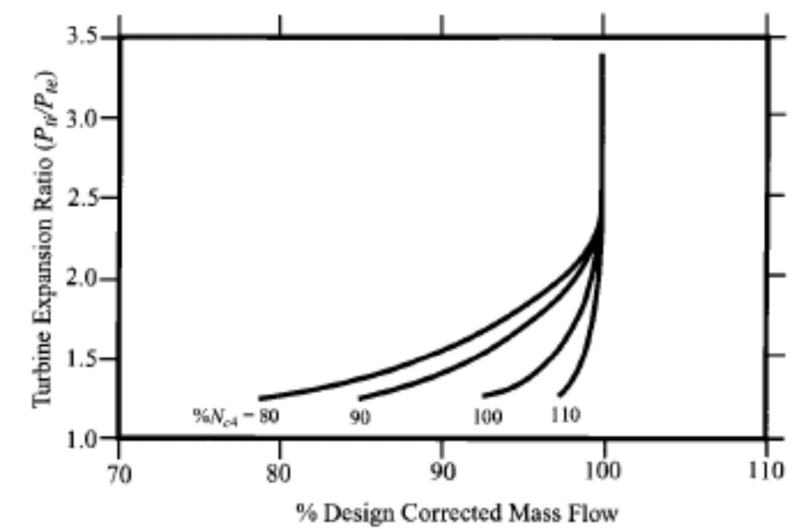  

- La curva característica para un turbina bloqueada sónicamente en su directriz (turbina crítica) es:

$$
\frac{G \sqrt{T_{\text {tdirectriz }}}}{P_{t, \text { directriz }}}=\Gamma(\gamma) \frac{A_{\text {directriz }}}{\sqrt{R}}=c t e \approx \frac{G \sqrt{T_{4 t}}}{P_{4 t}}
$$

- Para discernir a que vueltas aerodinámicas funciona la turbina se representa, en lugar del parámetro de gasto, el parámetro de gasto multiplicado por las vueltas aerodinámicas y el rendimiento como curvas de nivel. Se puede apreciar como los rendimientos adiabáticos de las turbinas son mayores que los rendimientos adiabáticos de los compresores que se vieron anteriormente

 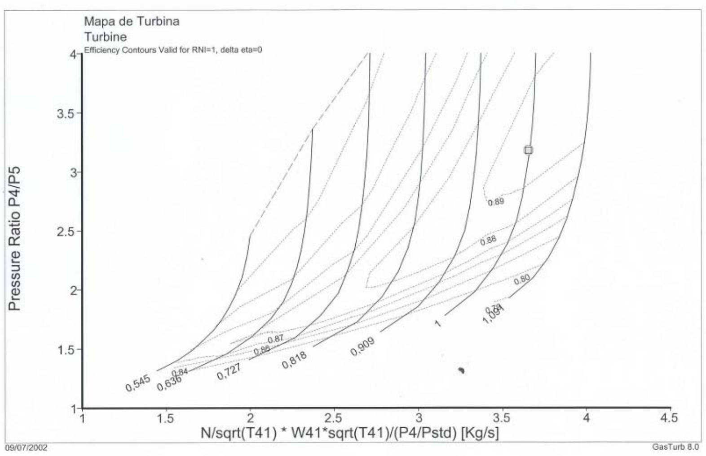 

### Actuaciones Cámaras de Combustión

- Se quieren conocer las condiciones termodinámicas de remanso a la salida del componente, $P_{4 t}$ y $T_{4 t}$, en función de las variables de entrada y de funcionamiento

- Planteando el problema de forma adimensional, se puede establecer que dichas condiciones son función de las

- Condiciones de entrada, $P_{3 t}, T_{3 t}$

- Condiciones de funcionamiento: Gasto másico, $G$, y potencia suministrada por el combustible, $c L$

- Características del gas, $R, C_{p}, /, \kappa$

- Diseño, caracterizado por una longitud característica, $D$

$$
\frac{P_{4 t}}{P_{3 t}}, \frac{T_{4 t}}{T_{3 t}}=\varphi\left(\frac{G \sqrt{R T_{3 t}}}{P_{3 t} D^{2}}, \frac{\eta_{q} c L}{P_{3 t} D^{2} \sqrt{R T_{3 t}}}, \gamma, \frac{\mu \sqrt{R T_{3 t}}}{P_{3 t} D}, \frac{k \sqrt{R T_{3 t}}}{P_{3 t} R D}\right)
$$

- El parámetro de combustible es el que se utiliza directamente para controlar el funcionamiento del aerorreactor.

- Como en los casos anteriores, los números adimensionales que contienen a la viscosidad y conductividad térmica no influyen en las actuaciones del componente y la relación de calores específicos puede suponerse constante para todo punto de funcionamiento.

### Curvas Características de C. Combustión

- Las curvas características son las siguientes relaciones funcionales

$$
\frac{P_{4t}}{P_{3t}}, \frac{T_{4t}}{T_{3t}}=\varphi\left(\frac{G \sqrt{T_{3t}}}{P_{3t}}, \frac{C L}{P_{3t} \sqrt{T_{3t}}}\right)
$$

- La expresión que liga a la relación de temperatura es la ecuación de la energía, que en su forma simplificada tiene la forma:

$$
\eta_{q} c L=G C_{p}\left(T_{4 t}-T_{3 t}\right)=C_{p} \frac{G \sqrt{T_{3 t}}}{P_{3 t}} \sqrt{T_{3 t}} P_{3 t}\left(\frac{T_{4 t}}{T_{3 t}}-1\right) \Rightarrow \frac{T_{4 t}}{T_{3 t}}=1+\frac{1}{C_{p}} \frac{\frac{\eta_{q} c L}{P_{3 t} \sqrt{T_{3 t}}}}{\frac{P_{3 t}}{P_{3 t}}}
$$

- También se podía haber utilizado como parámetro de control, en vez de la potencia calorífica suministrada, la relación combustible - aire, $f$, que es equivalente.

- En este caso, el nuevo parámetro de combustible, que sustituiría al anterior sería

$$
\frac{\eta_{q} f L}{R T_{3 t}} \propto \frac{\eta_{q} f L}{T_{3 t}}
$$

- La ecuación de la energía quedaría:

$$
\eta_{q} f L=C_{p}\left(T_{4 t}-T_{3 t}\right)=C_{p} T_{3 t}\left(\frac{T_{4 t}}{T_{3 t}}-1\right) \Rightarrow \frac{T_{4 t}}{T_{3 t}}=1+\frac{1}{C_{p}} \frac{\eta_{q} f L}{T_{3 t}}
$$

  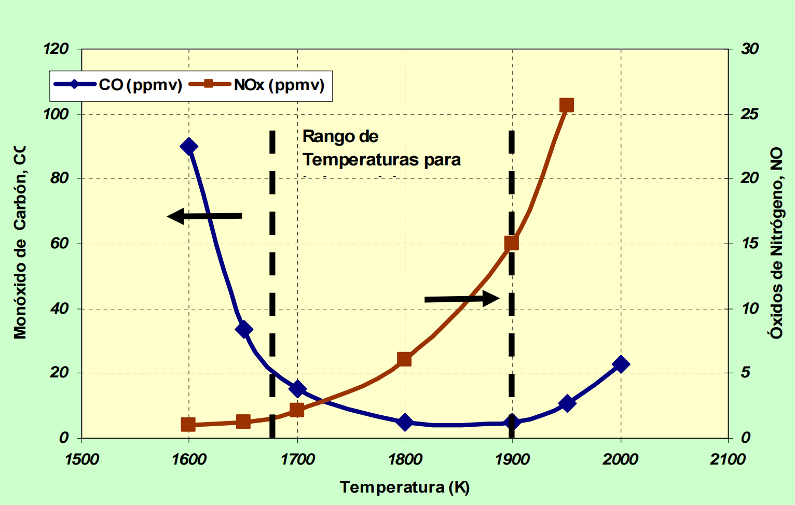

- Las pérdidas de presión de remanso son, principalmente, debidas al movimiento tan turbillonario y disipativo existente en la cámara y también resultado del calentamiento.
- Al calentarse el fluido disminuye su densidad y aumenta la velocidad lo que da lugar a una pérdida de presión de remanso aun en el caso de considerar al fluido ideal (/ $\approx 0$); a estas pérdidas se las suele denominar fundamentales, son proporcionales al aumento de temperatura en la cámara de combustión y fueron calculadas en el capítulo 10 dedicado a postcombustores.

- Normalmente, en cámaras de combustión las pérididas debidas a efectos viscosos son del orden de 10 veces mayores que las debidas a calentamiento; mientras que en postcombustores las pérdidas debidas al calentamiento son algo mayores que las viscosas.

- De forma general se puede poner:

$$
\frac{\Delta P_{t}}{1 / 2 \rho_{3} V_{3}^{2}}=\frac{P_{3 t}-P_{4 t}}{1 / 2 \rho_{3} V_{3}^{2}}=K_{\mu}+K\left(\frac{T_{4 t}}{T_{3 t}}-1\right)
$$

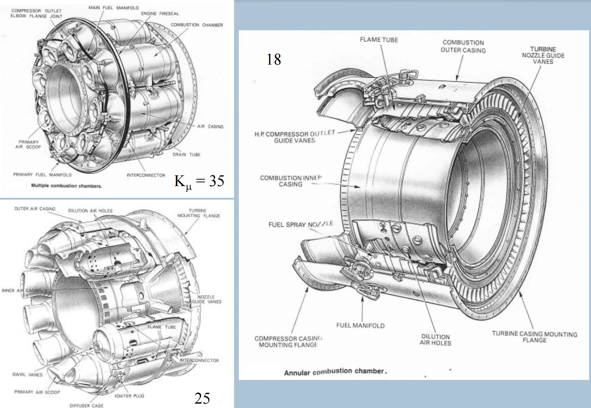

$$
\begin{aligned}
\frac{P_{4 t}}{P_{3 t}}=1 &-\frac{\Delta P_{t}}{P_{3 t}}=1-\frac{\Delta P_{t}}{1 / 2 \rho_{3} V_{3}^{2}} \frac{1 / 2 \rho_{3} V_{3}^{2}}{P_{3 t}}=1-\left[K_{\mu}+K\left(\frac{T_{4 t}}{T_{3 t}}-1\right)\right] \frac{1 / 2}{P_{3 t}}=\\
1 &-\left[K_{\mu}+K\left(\frac{T_{4 t}}{T_{3 t}}-1\right)\right] \frac{1}{2} \frac{\rho_{3}}{P_{3 t}} \frac{G^{2}}{\rho_{3}^{2} A_{r e f}^{2}} \approx 1-\left[K_{\mu}+K\left(\frac{T_{4 t}}{T_{3 t}}-1\right)\right] \frac{1}{2} \frac{R T_{3 t}}{P_{3 t}^{2}} \frac{G^{2}}{A_{r e f}^{2}}=\\
& 1-\left[K_{\mu}+K\left(\frac{T_{4 t}}{T_{3 t}}-1\right)\right] \frac{1}{2}\left(\frac{G \sqrt{R T_{3 t}}}{P_{3 t} A_{r e f}}\right)^{2}
\end{aligned}
$$

### Control de Emisiones

- Emisiones típicas de un motor moderno en crucero

| Especie | CO2  | H20  | NOx  | SOx     | CO      | UHC   | partículas |
| ------- | ---- | ---- | ---- | ------- | ------- | ----- | ---------- |
| EI      | 3200 | 1300 | 9-15 | 0.3-0.8 | 0.2-0.6 | 0-0.1 | 0.01-0.05  |

- Todas las regulaciones para oper cercanas a aeropuertos
- Finales de los 70 preocupación por humos (USA)
- OACI primeras regulaciones en 1981
- CAEP2 en 1993 para aviones dede 1996
- CAEP4 en 1998 para aviones desde 2004
- Regulaciones par procedimiento y límites

- Para cada especie se suma la masa generada en una operación estandarizada de aterrizaje despegue (LTO) de
- 42'' al 100 % del empuje;
- 2,2' al 85 % del MTO (para simular ascenso a $3000 \mathrm{ft}$ );
- 4' al 30 % del MTO (para simular aproximación)
- y 26' al 7% del MTT (para simular carreteo y ralentí)
- La masa obtenida se divide por el Empuje MTO en kN en condiciones estándar
- Normalmente, son los niveles de NOx los más difíciles de cumplir.

- NOx y humos problema a altos empujes.
- CO y UHC problema en carreteo y ralentí.
- Eliminar CO y UHC fácil: tiempo de residencia grande a grandes temperaturas y en exceso de aire $\rightarrow \quad > \eta_{q}$
- Eliminar NOx mayor peoblema. Se forma con reacciones lentas, pero la velocidad de reacción aumenta drásticamente con la temperatura.
- La cantidad creada depende de la temperatura y del tiempo de residencia.
- Por desgracia tiempo de residencia pequeño va en contradicción del control de CO y UHC.
- Futuras descomposición de NOx son muy lentas

 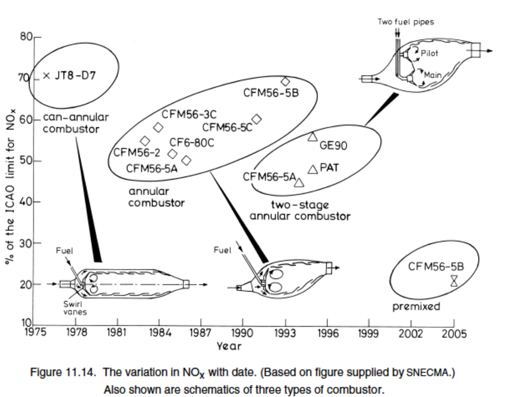

### Actuaciones de Entradas

- Las entradas o difusores proporcionan aire al compresor a un número de Mach dado, independientemente del Mach de vuelo.

- Apantallan la velocidad de vuelo y deben hacerlo con poca perdida de $P_{t}$ y de tal forma que la corriente a la salida del mismo sea lo más uniforme posible.

- Debido a la diferencia de comportamiento de las corrientes subsónicas y supersónicas, las entradas diseñadas para $M_{0}$ subsónico difieren mucho de las diseñadas para $M_{0}$ supersónico

- Como en los elementos anteriores, la temperatura y presión de remanso a la salida definen las actuaciones de las entradas y estas son funciones de

- Condiciones de vuelo, altitud $(P_{O}, T_{O})$ y velocidad, $V_{O}$

- Condiciones de funcionamiento: Gasto másico, $G$

- Características del gas, $\mathrm{R}, C_{p}, \mu, k$

- Diseño, caracterizado por una longitud característica, $D$

$$
\frac{P_{2 t}}{P_{0}}, \frac{T_{2 t}}{T_{0}}=\varphi\left(\frac{G \sqrt{R T_{0}}}{P_{0} D^{2}}, \frac{V_{0}}{\sqrt{R T_{0}}}, \gamma, \frac{\mu \sqrt{R T_{0}}}{P_{0} D}, \frac{k \sqrt{R T_{0}}}{P_{0} R D}\right)
$$

- Vuelve a aparecer el parámetro de gasto y esta vez aparece también un parámetro de velocidad, que como se puede apreciar es el Mach de vuelo.

- Como en los casos anteriores, los números adimensionales que contienen a la / $y k$ no influyen en las actuaciones del componente.

- La relación de calores específicos puede suponerse constante para todo punto de funcionamiento.

- Las curvas características de las entradas son las siguientes relaciones:

$$
\frac{P_{2t}}{P_{0}}, \frac{T_{2t}}{T_{0}}=\varphi\left(\frac{G \sqrt{T_{0}}}{P_{0}}, \frac{V_{0}}{\sqrt{T_{0}}}\right)
$$

### Curvas Características de Entradas

- Donde se han suprimido las constantes.

- La expresión que da la relación de temperatura es la ecuación de la energía

$$
T_{2 t}=T_{0 t}=T_{0}+\frac{V_{0}^{2}}{2 C_{p}} \Rightarrow \frac{T_{2 t}}{T_{0}}=1+\frac{1}{2 C_{p}}\left(\frac{V_{0}}{\sqrt{T_{0}}}\right)^{2}=1+\frac{\gamma-1}{2} M_{0}^{2}
$$

- La relación de temperatura es solamente función del parámetro de velocidad (o Mach de vuelo).
- La relación de presiones se puede poner como un termino de pérdida de presión de remanso y otro función del parámetro de velocidad (o Mach de vuelo).

<eq>
$$
\begin{aligned}
& \frac{P_{2 t}}{P_{0}}=\frac{P_{2 t}}{P_{0 t}} \frac{P_{0 t}}{P_{0}}=\frac{P_{2 t}}{P_{0 t}}\left(\frac{T_{2 t}}{T_{0}}\right)^{\frac{\gamma}{\gamma-1}}=\frac{P_{2 t}}{P_{0 t}}\left[1+\frac{1}{2 C_{p}}\left(\frac{V_{0}}{\sqrt{T_{0}}}\right)^{2}\right]^{\gamma-1} \\
& =\frac{P_{2 t}}{P_{0 t}}\left[1+\frac{\gamma-1}{2} M_{0}^{2}\right]^{\frac{\gamma}{\gamma-1}}
\end{aligned}
$$
</eq>

- El término de relación de presiones que aparece es el que lleva la funcionalidad con el parámetro de gasto.

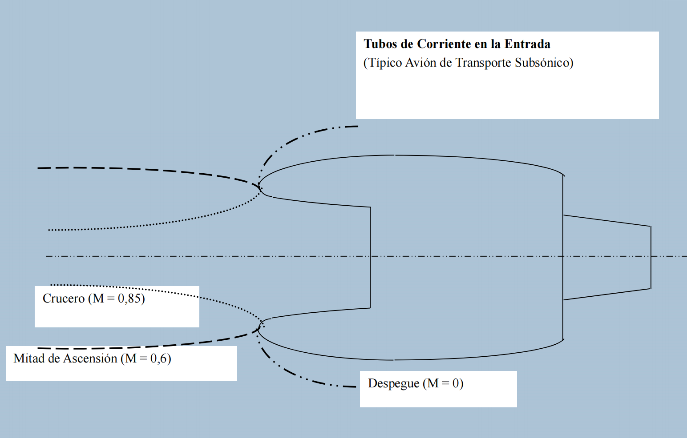 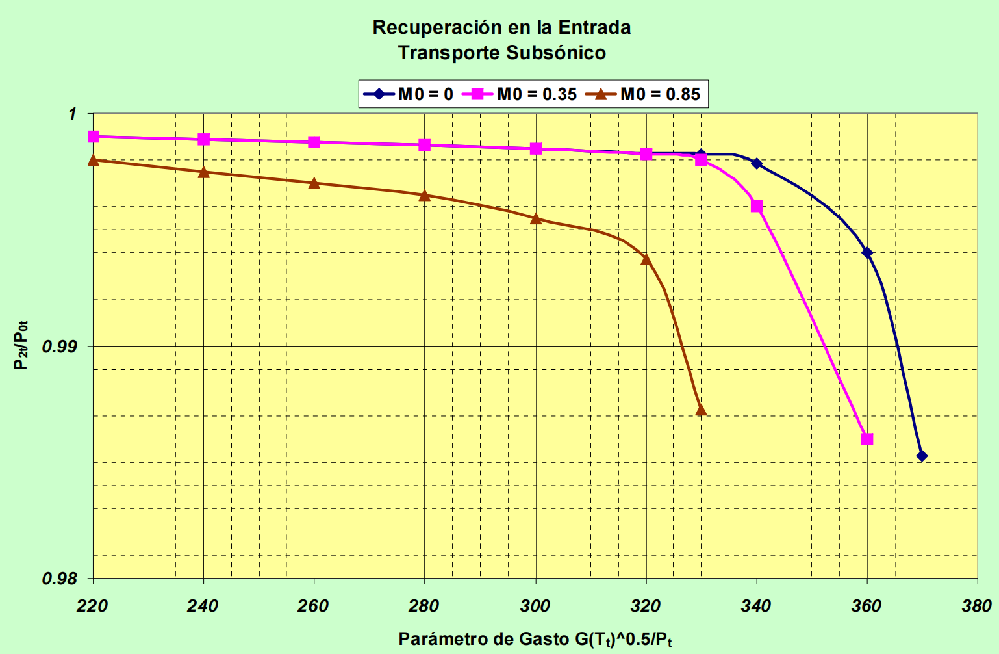 

### Entradas supersónicas

- La principal característica (negativa desde el punto de vista de diseño) de la corriente supersónica es que no pueden existir desviaciones de las líneas de corriente para adaptarse a las condiciones aguas abajo.

- El motor tiene que "tragar" todo el gasto contenido en el tubo de corriente definido por la sección de entrada del motor (funcionamiento crítico)

- Si el motor necesita menos gasto, G, que el máximo, $G_{max}$, la única forma de conseguir “echar fuera” el sobrante es mediante la generación de una onda de choque normal desprendida que convierta la velocidad en subsónica y puedan, entonces, ser desviadas las líneas de corriente (funcionamiento subcrítico)

 

### Actuaciones de Toberas

- El último componente, que se va a estudiar y no por ello menos importante, es la tobera de salida.

- En este elemento los gases se expansionan, obteniéndose la velocidad del chorro de la energía interna del mismo en función de la presión estáticas alcanzada en la salida.

- Para una tobera de geometría fija, el gasto será una de los valores a obtener.

- Por consiguiente, para unas condiciones de remanso de entrada, las actuaciones de la tobera quedarán definidas al conocer la presión de descarga (normalmente la ambiente)

- En las toberas queremos conocer: La velocidad de salida, el gasto, y la temperatura de salida; estos valores serán función de:
  - Condiciones de entrada: $P_{5t}, T_{5t}$

  - Condiciones de funcionamiento: Presión de descarga, $P_{s}$

  - Características del gas, $R, C_{p}, /, k$

  - Diseño, caracterizado por una longitud característica, $D=A_{8}^{1 / 2}$

$$
V_{s}, T_{s}, G=f\left(T_{5 t}, P_{5 t}, P_{0}, R, C_{p}, \mu, k, A_{8}^{1 / 2}\right)
$$

- O en variables adimensionales:

$$
\frac{V_{s}}{\sqrt{R T_{5 t}}}, \frac{T_{s}}{T_{5 t}}, \frac{G \sqrt{R T_{5 t}}}{P_{5 t} A_{8}}=\varphi\left(\frac{P_{s}}{P_{5 t}}, \gamma, \frac{\mu \sqrt{R T_{5 t}}}{P_{5 t} \sqrt{A_{8}}}, \frac{k \sqrt{R T_{5 t}}}{P_{5 t} R \sqrt{A_{8}}}\right)
$$

- Como en los casos anteriores, Ios númmeros adimensionales que contienen a la / $y k$ no influyen en las actuaciones del componente.

- La relación de calores específicos puede suponerse constante para todo punto de funcionamiento.

- Consecuencia de todo ello, las curvas características de las toberas de salida se pueden representar mediante las relaciones funcionales siguientes:

$$
\frac{V_{s}}{\sqrt{T_{5 t}}}, \frac{T_{s}}{T_{5 t}}, \frac{G \sqrt{T_{5 t}}}{P_{5 t} A_{8}}=\varphi\left(\frac{P_{s}}{P_{5 t}}\right)
$$

### Curvas Características de Toberas

- La relación de temperaturas es la relación isentrópica

$$
\frac{T_{s}}{T_{5 t}}=\left(\frac{P_{s}}{P_{5 t}}\right)^{\frac{\gamma-1}{\gamma}}
$$

- La expresión que da la velocidad es la ecuación de la energía

$$
T_{s t}=T_{s}+\frac{V_{s}^{2}}{2 C_{p}}=T_{5 t} \Rightarrow \frac{T_{s}}{T_{5 t}}=1-\frac{1}{2 C_{p}}\left(\frac{V_{s}}{\sqrt{T_{5 t}}}\right)^{2}
$$

$$
\frac{V_{s}}{\sqrt{R T_{5 t}}}=\sqrt{\frac{2 \gamma}{\gamma-1}\left[1-\left(\frac{P_{s}}{P_{5 t}}\right)\right]}
$$

- El gasto se obtiene mediante la ecuación de continuidad

$$
\frac{G \sqrt{R T_{5 t}}}{A_{8} P_{5 t}}=\left(\frac{P_{s}}{P_{5 t}}\right)^{\frac{1}{\gamma}} \sqrt{\frac{2 \gamma}{\gamma-1}\left[1-\left(\frac{P_{s}}{P_{5 t}}\right)\right]}
$$

   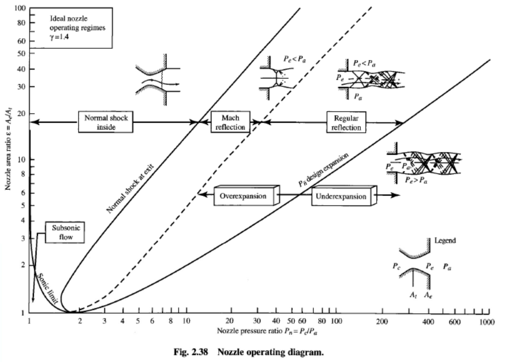
