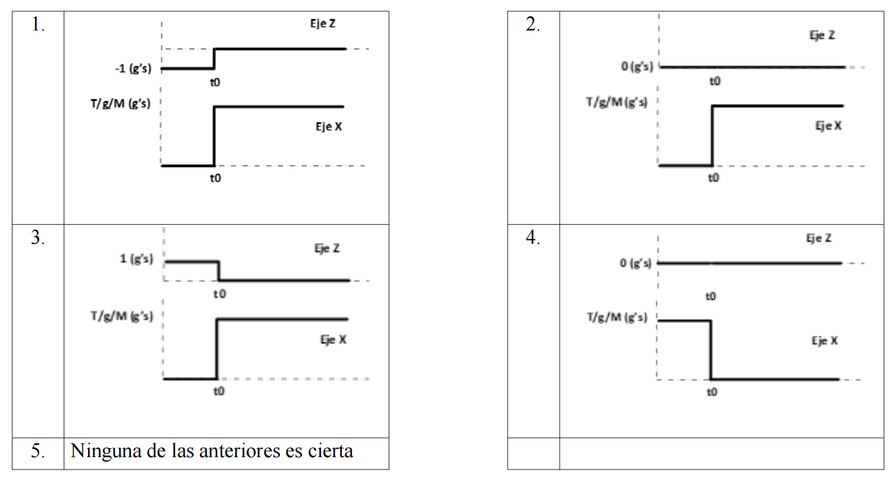

# Exámenes
> **Fuente:** Exámenes de la parte V1 de la asignatura "Vehículos Aeroespaciales" del Grado en Ingeniería Aeroespacial impartida por la E.T.S.I.Aeronaútica y del Espacio (UPM).



## Junio-7-2018

1. Comparando dos misiles, el primero provisto de una sola etapa de propulsada y luego una etapa de planeo, con el segundo provisto de una etapa aceleración y otra de crucero, se puede concluir que:

    a. Para un mismo rango, el primero requerirá una velocidad fin de combustión mayor que el segundo, implicando por tanto mayor resistencia aerodinámica, aunque con la ventaja de un menor calentamiento por rozamiento.

    b. Para un mismo rango, el primero requerirá una velocidad fin de combustión mayor que el segundo, implicando por tanto mayor calentamiento por rozamiento

    

    
Solución

    **b**
    

---

2. En un misil la velocidad de fin de combustión:

    a. En vacío, no depende del tamaño, sino de las relaciones entre masa estructural y masa total, masa de carga de pago y masa total, impulso específico, relación de empuje, etc.

    b. En presencia de atmósfera, se ve menos afectada cuanto menor es el tamaño, gracias a que de esta forma la resistencia aerodinámica es menor.

    c. En presencia de la atmósfera, se ve menos afectada si vuela a baja altura

    d. En vacío aumenta cuanto menor sea el tiempo de combustión, $\mathrm{t}_{\mathrm{b}}$

    

    
Solución

    **a**
    

---

3. En los lanzadores:

    a. En las primeras etapas es crítico que los combustibles sean de altas prestaciones (con alto Isp), dado que hay que vencer la gravedad terrestre

    b. En las últimas etapas no es aconsejable el uso de combustibles criogénico debido a la penalización que supone los tanques a alta presión y térmicamente aislados

    c. En las primeras etapas se suele usar combustibles más densos y que permiten reducir el tamaño de los tanques y por tanto, las perdidas aerodinámicas

    d. Ninguna de las anteriores es cierta.

    

    
Solución

    **c**
    

---

4. Si se desea diseñar un misil táctico de alta maniobrabilidad, ¿qué configuración aerodinámica elegirían?:

    a. Cruciforme con mando por ala

    b. Mono-ala

    c. Triforme

    d. Cruciforme interdigita

    

    
Solución

    **a**
    

---

5. Los misiles auto-guiados pasivos:

    a. Tienen la ventaja de ser más simples que los auto-guiados activos

    b. La radiación que utilizan puede ser radar o IR

    c. Recibe la energía emitida por el blanco y por tanto no requiere de trasmisor de energía

    d. Ninguna de las anteriores es cierta.

    

    
Solución

    **a, b, c**
    

## Julio-4-2018

1. El principio de solidificación aplicado al movimiento de traslación de un cohete consiste en que:

    a. Las ecuaciones del movimiento de traslación y rotación cohete se pueden escribir como si el cohete fuera un sólido de masa igual a la masa del cohete inicial añadiendo a las fuerzas y momentos exteriores $F_{e}$ y $M_{e}$ dos fuerzas y momentos aparentes; la fuerzas y momentos relativos y de Coriolis.

    b. Las ecuaciones de traslación y rotación del cohete se pueden escribir como si el cohete fuera un sólido de masa igual a la masa del cohete en el instante $t$ añadiendo a las fuerzas y momentos exteriores, $F_{e}$ y $M_{e}$ la fuerza relativa y el momento de Coriolis.

    c. Las ecuaciones de traslación y rotación del cohete se puede escribir como si el cohete fuera un sólido de masa igual a la masa del cohete en el instante $t$ añadiendo a las fuerzas y momentos exteriores, $F_{e}$ y $M_{e}$ la fuerza relativa y la de Coriolis y el momento relativo.

    d. Ninguna de las anteriores

    

    
Solución

    **d**
    

---

2. La configuración aerodinámica monoala:

    a. Se caracteriza por proporcionar una compensación del desalineamiento del empuje

    b. Es aplicable a misiles tácticos que requieran alta maniobrabilidad

    c. Es apropiada para misiles crucero que requieran largos alcances

    d. Realiza los virajes mediante la maniobra de viraje inclinado o Bank to Turn (BTT)

    

    
Solución

    **c,d**
    

---

3. El sistema de propulsión de los misiles:

    a. Basado en motor cohete se caracteriza por poder volar a cualquier Mach y proporcionar uno de los impulsos específicos más altos de entre los distintos sistemas de propulsión posibles en un misil, estando dicho impulso específico limitado por motivos de seguridad

    b. Basado en Scramjet se caracteriza por volar en el rango 6-8 Mach y proporcionar un impulso específico en el rango $1000 \mathrm{~s}$, estando limitado por problemas de choque térmico.

    c. Basado en Ramjet, vuela en el rango de 2-5 Mach, proporciona impulsos específicos en torno a los $1300 \mathrm{~s}$ y está limitado por problemas de temperatura en la turbina.

    d. Basado en turbojet, vuela en el rango de 1-2 Mach, proporciona impulsos específicos de 3000 s y está limitado por problemas de choque térmico.

    

    
Solución

    **b**
    

---

4. La principal diferencia entre un autoguiado activo y semiactivo es que el receptor de la energía reflejada por el blanco no se encuentra embarcado en el propio misil.

    a. Verdadero

    b. Falso

    

    
Solución

    **b**
    

---

5. Indicar cuáles de las siguientes aseveraciones son ciertas:

    a. El uso de RGPS en aplicaciones militares se basa en uso de una base auxiliar o conocimiento preciso del terreno

    b. Es suficiente con 3 satélites GPS para hallar la solución de navegación del GPS.

    c. La navegación mediante guiado inercial con strapdown no necesita estimación interna de la gravedad para el cálculo de la posición y velocidad, sin embargo la plataforma flotante si la necesita para compensar el hecho de que los acelerómetros no están fijos a la estructura.

    d. La navegación mediante guiado inercial con plataforma flotante no necesita estimación interna de la gravedad para el cálculo de la posición y velocidad, sin embargo la strapdown si la necesita para compensar el hecho de que los acelerómetros están fijos a la estructura

    

    
Solución

    **a**
    

---

6. El control de velocidad en balance o Rolling Airframe (RA),:

    a. Se basa en un bias en velocidad de balance, que permite compensar desalineamiento del empuje, implica un menor número de sensores y actuadores, menor peso y volumen y una clara ventaja en términos de maniobrabilidad

    b. Se basa en un bias en velocidad de balance, que permite compensar desalineamiento del empuje, implica un menor número de sensores y actuadores, menor peso y volumen, pagando el precio de menor maniobrabilidad y exigencia de lazos de control y adquisición más rápidos.

    

    
Solución

    **b**
    

## Abril-25-2019

El despegue de un lanzador es vertical porque:

   1. Optimiza la carga de pago puesta en órbita
   2. Maximiza la altura que puede alcanzar el lanzador en el fin de combustión
   3. Minimiza las pérdidas por gravedad
   4. Con el fin de minimizar la masa estructural, las estructuras de los lanzadores son muy ligeras y soportan bajas cargas a flexión.
   5. Ninguna de las anteriores es cierta

Solución

**4**

---

Si se hace una comparativa entre misiles tácticos y estratégicos, se puede observar que:

   1. Típicamente, la estructura del misil balístico será más robusta que la del táctico, dado que el misil balístico tiene que soportar las
      grandes aceleraciones producidas durante el despegue y la re-entrada.
   2. El sistema de propulsión del misil balístico será motor cohete o en algunos casos turborreactor, en contraposición al misil táctico
      que tendrá solamente motores cohete
   3. La carga de guerra del misil balístico es típicamente convencional, en contraposición, al misil táctico que siempre lleva carga
      nuclear.
   4. El sistema de guiado del misil balístico será preferentemente navegación por referencia con el terreno, mientras que el del misil
      táctico será autoguiado, teleguiado o haz director
   5. Ninguna de las anteriores es cierta

Solución

**5**

---

El sistema de protección térmica de los misiles tácticos:

   1. Puede ser pasivo (selección de espesores y materiales) o bien activo con sistemas de enfriamiento activo (heat-pipes o cryocoolers)
   2. Busca que la difusividad térmica de la estructura sea lo más alta posible, de manera que el calentamiento en la ojiva se difunda
      rápidamente por el cuerpo del misil y de esta forma la temperatura resultante sea más baja.
   3. Mediante el concepto de estructura caliente consiste en una estructura de gran espesor con una capa de aislante externo y otra
      interna, que supone una penalización en peso pero que maximiza el volumen disponible.
   4. Mediante el concepto de estructura auto-aislante consiste en seleccionar un material de difusividad térmica moderada, como por
      ejemplo un material metálico como el aluminio
   5. Ninguna de las anteriores es cierta.

Solución

**5**

---

La configuración aerodinámica clásica se caracteriza por:

   1. Una configuración mecánica simple
   2. Un buen control en alabeo
   3. Una rápida respuesta dinámica.
   4. Una rápida y brusca entrada en pérdida del control.
   5. Ninguna de las anteriores es cierta

Solución

**2**

---

En el caso de guiado inercial:

   1. Mediante plataforma flotante, las medidas de aceleración de los acelerómetros se realizan en ejes del vehículo
   2. Requiere implementar en el computador un modelo gravitatorio que permite estimar la aceleración gravitatoria.
   3. Mediante plataforma strapdown, las medidas de aceleración se realizan en ejes inerciales
   4. Si los acelerómetros son tipo MEMS, son capaces de medir la aceleración gravitacional y no es necesario implementar en el
      computador una estimación de la aceleración gravitatoria
   5. Ninguna de las anteriores es cierta.

Solución

**2**

---

En el caso de guiado por telemando:

   1. Su aplicación típica es la defensa antiaérea de baja cota, así como la aplicación superficie-superficie (por ejemplo, misiles
      antitanque)
   2. Es el indicado para aplicaciones aire-aire, dada la altas exigencias dinámicas en los combates aire-aire
   3. Consiste en el seguimiento del misil y del blanco (que se puede hacer mediante una unidad para el misil y otra para el blanco o
      bien una misma unidad para misil y blanco) y trasmisión de esas señales al misil, que realiza a bordo el cálculo de las
      desviaciones de la trayectoria pre-establecida para la colisión
   4. Se caracteriza por una gran complejidad, en comparación con el auto-guiado, debido a la necesidad de sistemas para recibir los
      comandos e interpretarlos. Ese es el motivo por lo cual su aparición fue posterior a la del auto-guiado.
   5. Ninguna de las anteriores.

Solución

**1**

## Junio-6-2019

El principio de solidificación aplicado al movimiento de traslación de un cohete consiste en que:

1. La ecuación de traslación del cohete se puede escribir como si el cohete fuera un sólido de masa igual a la masa del cohete inicial añadiendo a las fuerzas exteriores Fe dos fuerzas aparentes; la fuerza relativa y la de Coriolis. Normalmente la fuerza de Coriolis es despreciable comparada con la fuerza relativa.
2. La ecuación de traslación del cohete se puede escribir como si el cohete fuera un sólido de masa igual a la masa del cohete en el instante t añadiendo a las fuerzas exteriores, Fe la fuerza relativa
3. La ecuación de traslación del cohete se puede escribir como si el cohete fuera un sólido de masa igual a la masa del cohete en el instante t añadiendo a las fuerzas exteriores, Fe la fuerza relativa y la de Coriolis. Normalmente la fuerza de Coriolis es despreciable comparada con la fuerza relativa
4. Se desprecian las fuerzas por resistencia aerodinámica, teniendo en cuenta sólo el empuje y la gravedad.
5. Ninguna de las anteriores es cierta

Solución

**3**

---

La configuración aerodinámica mono-ala:

1. Se caracteriza por proporcionar una compensación del desalineamiento del empuje.
2. Es aplicable a misiles tácticos que requieran alta maniobrabilidad.
3. Realiza los virajes mediante la maniobra de viraje inclinado o Bank to Turn (BTT).
4. Es la configuración típica en los misiles balísticos
5. Ninguna de las anteriores es cierta.

Solución

**3**

---

En el caso del guiado semi-activo:

1. Tanto el sistema activo de fuente de energía que ilumina al blanco, como el sistema receptor que recibe la energía reflejada por el blanco están contenidos en el misil.
2. El receptor que recibe la energía generada por el propio blanco está contenido en el misil, no necesitándose un transmisor de energía que ilumine el blanco
3. Requiere de un calculador y una plataforma inercial que permite, mediante integración, predecir la posición futura del blanco y ordenar los comandos necesarios en las superficies de control para dirigir el misil al blanco
4. La radiación utilizada es infra-roja y por tanto sólo se puede usar en misiles de corto alcance
5. Ninguna de las anteriores es cierta.

Solución

**5**

---

En la selección de materiales para un misil:

1. Para un misil supersónico de aplicación multi-modo (radar + IR), es conveniente que el material de la cúpula tenga a la vez una constante di-eléctrica baja y que sea transparente en la banda MWIR/LWIR, así como una baja resistencia a la erosión.
2. En caso de fabricación con materiales metálicos, se podría ordenar de menor a mayor coste: acero < aluminio < titanio
3. Para misiles supersónicos guiados por radar el titanio para la estructura así como Germanio para la cúpula es una selección razonable
4. Para un misil ligero de bajo coste, es más comúnmente usado el Aluminio, el acero, la fibra de vidrio S994/ matriz Epoxy o la fibra de vidrio S994 /con matriz de polimida
5. Ninguna de las anteriores es cierta.

Solución

**4**

---

La ley de guiado de navegación proporcional:

1. Se basa en la idea de apuntar continuamente la velocidad del misil al blanco durante toda la trayectoria.
2. No es muy eficiente en términos de maniobra exigida al misil y se suele aplicar a blancos lentos o fijos
3. Exige la máxima aceleración al misil siempre al final del vuelo.
4. Exige aceleraciones finitas al misil si la constante de navegación reducida es > 2
5. Ninguna de las anteriores es cierta.

Solución

**5**

## Julio-3-2019

El giro por gravedad en un lanzador:

1. Permite optimizar la masa puesta en órbita, al minimizar el gasto de combustible.
2. Se realiza en la última fase de trayectoria en vacío cuando no hay otras fuerzas exteriores más que la gravedad.
3. Busca minimizar los momentos flexores en el lanzador.
4. Permite minimizar las cargas de choque en el lanzador, protegiendo así la carga de pago.
5. Ninguna de las anteriores es cierta.

Solución

**3**

---

Para los misiles que vuelan a muy alta velocidad (misiles de alta temperatura):

1. El material más idóneo para la estructura será titanio.
2. Si el misil es guiado por radar, para la selección del material de la cúpula del buscador es importante que, la constante dieléctrica sea alta y la resistencia a erosión y a altas temperaturas sean altas también.
3. El material más idóneo para la estructura será aluminio.
4. Si el misil es guiado por radar, para la selección del material de la cúpula del buscador es importante que, la constante dieléctrica
sea baja y la resistencia a erosión y a altas temperaturas sean bajas también.
5. Ninguna de las anteriores es cierta.

Solución

**1**

---

La carga de guerra de los misiles del tipo:

1. Carga explosiva, se caracteriza por que el daño se causa por dos barras que forman un anillo que se lanza y expande con la
explosión.
2. Carga hueca, se caracteriza porque el daño lo causa una multitud de fragmentos provenientes de la cubierta de la carga de guerra
que viajan a alta velocidad. Se usa típicamente en blancos acorazados (tanques, bunkers)
3. Carga de fragmentación, se caracteriza porque la carga es un material (típicamente cobre) dispuesto en forma de cono delante del
explosivo HE. Al explotar el HE la onda de choque proyecta el material del cono como un chorro.
4. Carga de Energía cinética, se caracteriza porque el daño lo causa la propia energía cinética del misil. Requiere un error de
puntería bajo. Uno de sus usos típicos es en la intercepción de misiles.
5. Ninguna de las anteriores es cierta.

Solución

**4**

---

Indicar cuál de las siguientes aseveraciones es cierta:

1. Es suficiente con 3 satélites GPS para hallar la solución de navegación del GPS.
2. El uso de RGPS en aplicaciones militares se basa en uso de una base auxiliar o conocimiento preciso del terreno
3. La navegación mediante guiado inercial con strapdown no necesita estimación interna de la gravedad para el cálculo de la
posición y velocidad.
4. La navegación mediante guiado inercial con plataforma flotante no necesita estimación interna de la gravedad para el cálculo de
la posición y velocidad
5. La navegación por referencia del terreno es típicamente usada en los misiles balísticos, lo que permite corregir los errores
acumulados en los sistemas de navegación inercial.

Solución

**2**

---

Indicar cuál de las siguientes aseveraciones es cierta:

1. El margen estático se puede calcular dividiendo la pendiente del coeficiente de sustentación debido al ángulo de ataque $C_{N_{\alpha}}$ por la
pendiente del coeficiente de momentos debido al ángulo de ataque $C_{m_{\alpha}}$.
2. Un misil será estáticamente estable si un cambio en el ángulo de ataque produce un momento en el misil que tiende a reducir el
cambio introducido. Esto pasa cuando el centro de presiones está delante del centro de masas
3. Un misil será estable si el margen estático es mayor que 0.
4. El autopiloto permite aumentar la frecuencia de oscilación y el coeficiente de amortiguamiento del misil
5. El autopiloto sólo es eficaz en misiles estáticamente estables.

Solución

**4**

## PEI-2020

La resistencia de forma de alas y controles se calcula mediante correlación con la resistencia de fricción

Solución

**Falso**

---

En un misil balístico, si Q es igual a 1 existen dos tipos de trayectorias, pero la trayectoria baja corresponde a $\psi 0=0$ (eje de ordenadas) cualquier punto puede ser alcanzado.

Solución

**Verdadero**

---

La configuración de mando por ala se caracteriza por se caracteriza por mala respuesta dinámica, altos mom entos en charnela, bajo ángulo de ataque y excelente comportamiento a la entrada en pérdida

Solución

**Falso**

---

El control de velocidad en balance o Rolling Airframe (RA) requiere unos sensores y actuadores para el control de cabeceo y guiñada más rápidos, con la ventaja de proporcionar mayor maniobrabilidad al misil

Solución

**Falso**

---

Cuanto menor sea la presión dinámica mayor es la frecuencia de picado

Solución

**Falso**

---

La principal diferencia entre un misil autoguiado activo y semiactivo consiste en que el alcance de los misiles semi-activos es mucho mayor que el de los-activos, al llevar usar como fuente de iluminación un radar externo que puede emitir a mucha mayor potencia

Solución

**Verdadero**

---

Si el misil se dispara sin error inicial, pero el blanco maniobra y la constante de navegación reducida es igual a 2, la aceleración tiende a infinito cerca del momento de intercepción.

Solución

**Verdadero**

---

La parte balística de la trayectoria de un misil balístico es la mayor contribuyente al alcance total del misil

Solución

**Verdadero**

---

Para tener un misil con alta man iobrabilidad por mando fijo es mejor volar a gran altitud y a gran velocidad que volar a baja altitud a baja velocidad

Solución

**Verdadero**

---

Si se quiere un misil crucero de alcance de $1300 \mathrm{~km}$, dirigido a un blanco crítico, una buena solución ideal sería un misil motorizado mediante ramjet, volando 6 Mach a nivel del mar.

Solución

**Falso**

---

El empuje de un Vehículo cohete disminuye y a que, al aumentar la presión exterior, la presión de la cámara de combustión dism inuye

Solución

**Falso**

---

El ram-jet es eficiente en el rango $2.5$-5 Mach, estando limitado por el límite de temperatura que puede soportar el material de la turbina

Solución

**Falso**

---

La relación peso/par suministrado es mejor en el actuador gas frio que en hidráulico, ya que en el hidráulico, las válvula de distribución y sistemas de presurización del líquido de trabajo son más pesados que en el caso del gas frío

Solución

**Falso**

## Ordinario-2020

Si se quiere diseñar un misil con alta sustentación se puede emplear una sección elíptica y gran esbeltez lo que permite aumentar la eficiencia aerodinámica.

Solución

**Verdadero**

---

Un misil SAM suele tener un auto-guiado activo mediante radar (si es un SAM de alcance medio) o pasivo mediante IR (si es un SAM de corto alcance).

Solución

**Verdadero**

---

Se está diseñando un lanzador de micro-satélites de dos etapas. Se dispone de dos tipos de escalones y motor cohete; uno con Isp = 450 y eficiencia estructural de $0.22$ y el otro con Isp $=320$ s y eficiencia estructural es $0.12$. Es segundo tipo de motor es el que se pondría preferentemente como primer escalón.

Solución

**Verdadero**

---

En el estudio de la dinámica rotacional y translacional de un misil al que se aplica el principio de solidificación se desprecian las fuerzas de Coriolis sobre el chorro, pero no su momento.

Solución

**Verdadero**

---

Un misil en configuración Canard al que se mueva hacia la proa la posición de la superficie de control se hará más estable.

Solución

**Falso**

---

Un misil en configuración mando por ala, sus controles tienen buen comportamiento a entrada en pérdida ya que su ángulo de ataque efectivo es menor.

Solución

**Falso**

---

Un misil auto-guiado, puede volar con cierta velocidad de rotación en balance siempre que el retraso entre el comando de control y la ejecución del mismo, sea bajo.

Solución

**Verdadero**

---

El autopiloto lateral está formado por un giróscopo cuya función es estabilizar el giro de cabeceo del misil y por un acelerómetro cuya función es medir la aceleración lateral ejecutada y compararla con la comandada .

Solución

**Verdadero**

## Junio-10-2021

La penalización por el efecto de la resistencia aerodinámica en la velocidad de fin de combustión en el caso de movimiento unidimensional del misil:

1. Aumenta con el tamaño del misil y con la esbeltez.
2. Es mayor cuanta mayor sea la altura.
3. En caso de vuelo horizontal, será menor cuanto menor sea el tiempo de combustión, tb.
4. Es proporcional a la velocidad de vuelo.
5. Ninguna de las anteriores.

Solución

**3**

---

El despegue de un lanzador es vertical porque:

1. Optimiza la carga de pago puesta en órbita.
2. Maximiza la altura que puede alcanzar el lanzador en el fin de combustión.
3. Minimiza las pérdidas por gravedad.
4. Minimiza las cargas aerodinámicas mientras densidad atmosférica es alta.
5. Ninguna de las anteriores.

Solución

**4**

---

La configuración aerodinámica:

1. En Canard, se caracteriza por la buena o indiferente respuesta dinámica (para misiles estables), bajos momentos de charnela, excelente
comportamiento en pérdida y capacidad de control del alabeo.
2. Clásica, se caracteriza por una respuesta dinámica lenta (para misiles inestables), bajos momentos en charnela, baja estabilidad en
transónico, y rápida y brusca entrada en pérdida.
3. Mando por ala, se caracteriza por mala respuesta dinámica, altos momentos en charnela, bajo ángulo de ataque y excelente comportamiento
a la entrada en pérdida
4. Control por chorro: Altos momentos en charnela, fácil realización mecánica, brusca entrada en perdida y mala respuesta dinámica,
5. Ninguna de las anteriores.

Solución

**5**

---

La ley de guiado de navegación proporcional:

1. Se basa en la idea de apuntar continuamente la velocidad del misil al blanco durante toda la trayectoria.
2. No es muy eficiente en términos de maniobra exigida al misil y se suele aplicar a blancos lentos o fijos.
3. Exige la máxima aceleración al misil siempre al final del vuelo.
4. Exige aceleraciones finitas al misil si la constante de navegación reducida es > 2.
5. Ninguna de las anteriores es cierta.

Solución

**5**

---

La maniobrabilidad de un misil:

1. Será mayor si el misil vuela a ángulos de ataque pequeños.
2. Será mayor cuanto mayor sea la altura.
3. Será menor a velocidades altas.
4. Será mayor cuanto mayor sea la relación entre el área de la sección del misil divida por su masa.
5. Ninguna de las anteriores

Solución

**4**

## Enero-2022

El vuelo propulsado de un misil presenta mayor resistencia de base que el vuelo no propulsado.

Solución

**Falso**

---

Un misil SAM suele tener un auto-guiado activo mediante radar (si es un SAM de alcance medio) o pasivo mediante IR (si es un SAM de corto alcance).

Solución

**Verdadero**

---

La parte balística de la trayectoria de un misil balístico es la mayor contribuyente al alcance total del misil y puede ser predicha con bastante exactitud mediante las leyes de la mecánica orbital, siendo los efectos de la no esfericidad de la Tierra los principales responsables de la desviación de la trayectoria real de la trayectoria kepleriana ideal.

Solución

**Verdadero**

---

En el estudio de la dinámica rotacional y translacional de un misil al que se aplica el principio de
solidificación se desprecian las fuerzas de Coriolis sobre el chorro, pero no su momento.

Solución

**Verdadero**

---

Un misil en configuración Canard al que se mueva hacia la proa la posición de la superficie de control se hará más estable.

Solución

**Falso**

---

En misiles tele-guiados con configuración Canard, cuyas alas estén desacopladas del resto de misil, no necesitan medir el ángulo de balance.

Solución

**Verdadero**

---

La ventaja de la configuración en aspa es que tiene mayor eficiencia aerodinámica que la configuración en cruz.

Solución

**Verdadero**

---

La función exclusiva del autopiloto es estabilizar misiles inestables.

Solución

**Falso**

## Abril-28-2022

El ángulo de balance de los misiles:

1. No es necesita ser medido ni controlarlo en misiles teleguiados, ya que los comandos son enviados desde un sistema de referencia exterior al
misil.
2. Es imperativo que sea controlado en el caso de los misiles auto-guiados ya que la posición del blanco se conoce con respecto a unos ejes que
giran conjuntamente con el sistema de control.
3. No necesita ser controlado en el caso de que se haga maniobra de giro por inclinación.
4. No se puede controlar en los misiles en configuración Canard mediante deflexión diferencial de los controles. El misil tiene que llevar rolerones
o desacoplar axialmente el conjunto de las alas del resto del misil.
5. Ninguna de las anteriores es cierta

Solución

**4**

---

Indicar cuál de las siguientes aseveraciones es cierta:

1. El uso de RGPS en aplicaciones militares se basa en uso de una base auxiliar o conocimiento preciso del terreno
2. Es suficiente con 3 satélites GPS para hallar la solución de navegación del GPS
3. La navegación mediante guiado inercial con strapdown no necesita estimación interna de la gravedad para el cálculo de la posición y velocidad,
sin embargo, la plataforma flotante si la necesita para compensar el hecho de que los acelerómetros no están fijos a la estructura.
4. La navegación mediante guiado inercial con plataforma flotante no necesita estimación interna de la gravedad para el cálculo de la posición y
velocidad, sin embargo la strapdown si la necesita para compensar el hecho de que los acelerómetros están fijos a la estructura
5. La navegación por referencia del terreno es típicamente usada en los misiles balísticos, lo que permite corregir los errores acumulados en los
sistemas de navegación inercial

Solución

**1**

---

El despegue de un lanzador es vertical porque:

1. Optimiza la carga de pago puesta en órbita
2. Maximiza la altura que puede alcanzar el lanzador en el fin de combustión
3. Minimiza las pérdidas por gravedad
4. Con el fin de minimizar la masa estructural, las estructuras de los lanzadores son muy ligeras y soportan bajas cargas a flexión.
5. Ninguna de las anteriores es cierta

Solución

**4**

---

Considerando la parte balística de la trayectoria de un misil balístico:

1. El valor del alcance viene definido únicamente por el valor de un parámetro; el parámetro Q
2. Para cualquier valor de Q, siempre hay dos órbitas: una baja y otra alta que tienen el mismo alcance.
3. Es una órbita parabólica que sigue totalmente las leyes de la mecánica orbital
4. Es la mayor contribuyente al alcance total del misil.
5. Ninguna de las anteriores es cierta

Solución

**4**

---

En un misil que vuela a velocidad constante y que sigue una ley de guiado por navegación proporcional:

1. Si misil se dispara con un error inicial, pero el blanco no maniobra y la constante de navegación reducida es igual a 2, la aceleración tenderá a
infinito en el momento del impacto.
2. Si el misil se dispara sin error inicial, pero el blanco maniobra y la constante de navegación reducida es mayor que 3, la aceleración está
acotada y se produce en el instante inicial de la trayectoria
3. Si el misil se dispara sin error inicial, pero el blanco maniobra y la constante de navegación reducida es igual a 2, la aceleración será constante
durante toda la trayectoria
4. Si misil se dispara con un error inicial, pero el blanco no maniobra y la constante de navegación reducida es mayor que 3, la aceleración está
acotada y el máximo se produce en el momento del impacto.
5. Ninguna de las anteriores es cierta

Solución

**5**

---

Un misil se lanza horizontalmente, desde un rail. Dicho misil tiene un empuje T y tiene una masa M.
Además, dicho misil dispone de dos acelerómetros: un primer acelerómetro que mide aceleraciones en el eje longitudinal orientado hacia la proa del misil) (eje X positivo) y otro segundo que las mide perpendicularmente a la superficie de la Tierra (eje Z positivo). Supóngase que el instante de
lanzamiento es t0, el cohete alcanza el régimen permanente instantáneamente en t0, la suelta del rail y el encendido del cohete son simultáneos y la resistencia aerodinámica es despreciable en los instantes iniciales. La evolución de la medida de dichos acelerómetros durante los instantes iniciales
será:

Solución

**3**

---