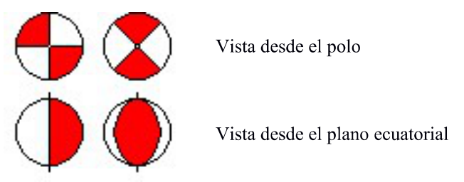
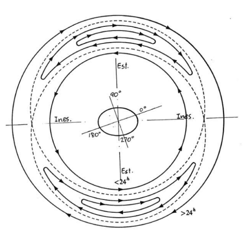
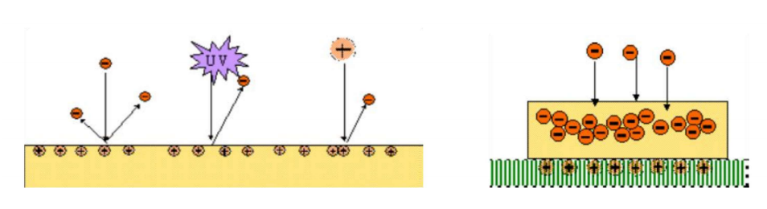

# Exámenes
> **Fuente:** Exámenes de la parte V2 de la asignatura "Vehículos Aeroespaciales" del Grado en Ingeniería Aeroespacial impartida por la E.T.S.I.Aeronaútica y del Espacio (UPM).

## Junio-7-2018

1. Describir los posibles efectos negativos de las cargas electrostáticas en un satélite en órbita terrestre, y explicar de forma razonada cómo minimizar el riesgo de sufrir dichos efectos. (1 punto)

    

    
Solución

   Se pueden acumular cargas en el satélite que den lugar a descargas electrostáticas de dos tipos:

   - La acumulación de cargas en las superficies del satélite, debido al flujo externo de electrones de baja energia y a la radiación electromagnética de alta frecuencia, puede producir descargas entre superficies cercanas con distinto potencial. Esto provoca corrientes no deseadas en los componentes electrónicos que afectan a su integridad y a la de los datos transmitidos, y puede provocar cortocircuitos permanentes en las lineas de potencia de los paneles solares.
   - La carga profunda de dieléctricos, producida por electrones de alta energia que penetran en el dieléctrico acumulando carga negativa en su interior, puede dar lugar a una ruptura del dieléctrico si se acumula la suficiente carga, produciendo daños permanentes.

   La forma de evitar estos efectos es minimizar el riesgo de acumulaciones de carga estática favoreciendo el equilibrio de voltajes en el vehiculo:

   - Poniendo todas las superficies conductoras en contacto eléctrico directo con la estructura del vehiculo.
   - Usando materiales dieléctricos con una resistividad superficial suficientemente baja.
   - Usando recubrimientos conductores cuando sea necesario.

    

---

2. Para comunicarse con un satélite desde tierra, ¿qué frecuencias relativas interesa utilizar y por qué? (1 punto)

    

    
Solución

   La radiación solar produce distintas capas de ionización en la atmósfera, caracterizadas por una frecuencia de plasma de electrones $f_{pe}$. Las frecuencias de comunicación con satélites desde tierra deberán ser mucho mayores que la frecuencia de plasma de la capa $F$ (la de mayor $f_{pe}$ ) para atravesar la ionosfera y evitar:

   - La reflexión de ondas para $f=f_{pe}$.
   - Cambios de fase aleatorios para $f > \sim f_{\text {pe}}$.
   - La absorción total de la radiación para $f < f_{pe}$.

    

---

3. Describir de forma cualitativa las fases tipicas de una maniobra aeroasistida. ( $0.5$ puntos)

    

    
Solución

   Para pasar de una órbita a otra de menor energía, se puede aprovechar la reducción de energia que produce la resistencia aerodinámica:

   1. Reducción de la altura del periapsis
   2. Circularización progresiva de la órbita ($r_{apo} \downarrow$ ) gracias a la resistencia aerodinámica en el periapsis
   3. Elevación de la altura del periapsis

    

---

4. Indicar los componentes principales del segmento de tierra de una misión espacial. ( $0.5$ puntos)

    

    
Solución

   - Sistemas de tierra: todos los elementos de infraestructura en tierra que se usan para dar soporte a las actividades de preparación y ejecución de operaciones y a las actividades post-operativas.
     - Instalaciones de fabricación y ensayos del vehiculo espacial.
     - Instalaciones de lanzamiento.
     - Estaciones de seguimiento en tierra, redes de comunicaciones y Centros de Control.
   - Equipo de gestión de la misión y equipos de operaciones.
    

## Julio-4-2018

1. Describir los principales efectos de la radiación electromagnética solar constante en una misión espacial. (1 punto)

    

    
Solución

   - Es la fuente de energía de muchas misiones espaciales.
   - El equilibrio térmico se obtiene mediante el equilibrio entre la radiación incidente del entorno y la radiación emitida por las superficies del vehiculo:
     - Flujo total de energia solar $\sim 1350 \mathrm{~W} / \mathrm{m}^{2}$.
     - Albedo terrestre $\sim 30$ % del flujo de energía solar.
     - Radiación terrestre $\sim 17$ % del flujo de energia solar.
     - Radiación del vehiculo.
   - Rayos-X y EUV:
      - Afectan a la ionosfera terrestre.
      - Degradan las propiedades de las superficies externas (por ejemplo de los polimeros)
   - Se produce una presión de radiación solar $p=\frac{C_{S}}{c}$ :
     - Se puede aprovechar mediante velas solares.
     - Cambia las trayectorias orbitales, incrementando la excentricidad
      

---

2. Representar de forma esquemática el armónico esférico $\mathrm{J}_{22}$ del potencial gravitatorio terrestre, y explicar brevemente su efecto en las órbitas geoestacionarias. (1 punto)

    

    
Solución

   - Perturbaciones en órbitas geoestacionarias debidas al potencial gravitatorio:
     - $J_{22}$ (armónico sectorial)
      
     - Movimiento oscilatorio alrededor de dos posiciones estables $\left(75^{\circ}\right.$ y $\left.255^{\circ} \mathrm{E}\right)$
     - Dos posiciones inestables.
      
       

## Junio-6-2019

1. Describir las principales ventajas de utilizar órbitas heliosíncronas e indicar, justificando la respuesta, el parámetro orbital que es necesario seleccionar para obtener este tipo de órbita en la mayoría de casos prácticos. (1.5 puntos)

    

    
Solución

    Una órbita heliosíncrona mantiene constante la orientación del plano orbital respecto al meridiano solar.

    Ventajas:
    - Orientación de los paneles solares.
    - Control térmico.
    - Observaciones de zonas de interés a horas solares (esto es, condiciones de iluminación) fijas.

    Para órbitas LEO, la variación secular dominante es la de $\Omega$ debida a $\mathrm{J}_{2}$. En general $e$ y $a$ están fijados por otros requisitos de misión, de modo que se elige la inclinación de la órbita para igualar la variación de $\Omega$ a la del meridiano solar.

    

---

2. Describir los dos principales mecanismos de acumulación de carga electrostática en un vehículo espacial. (1.5 puntos)

    

    
Solución

    - Carga superficial:
      - El flujo de electrones de media energía que incide sobre las superficies del vehículo puede dar lugar a acumulaciones de carga positiva o negativa cuando se liberan más o menos electrones de los que se reciben.
      - La radiación electromagnética incidente de onda corta da lugar a la acumulación de carga positiva por fotoemisión.
    - Carga profunda de dieléctricos: los electrones de alta energía pueden penetrar en los dieléctricos, acumulando carga negativa.

    

    

## Ordinario 2020

Fuera del campo magnético terrestre, los rayos cósmicos son la principal fuente de plasma.

Solución

**Falso**

---

El riesgo de descargas electrostáticas en superficies y dieléctricos se mitiga favoreciendo el movimiento de electrones.

Solución

**Verdadero**

---

Siempre es necesario utilizar al menos una órbita de transferencia para pasar de una órbita inicial a otra final.

Solución

**Falso**

---

Para ir de una órbita inicial a otra final coplanarias, que no se cortan, el consumo mínimo se consigue siempre con una transferencia de Hohmann.

Solución

**Falso**

---

Las órbitas geoestacionarias no permiten tener cobertura en latitudes muy altas.

Solución

**Verdadero**

---

Las órbitas heliosíncronas son necesariamente retrógradas.

Solución

**Verdadero**

---

Para conseguir una órbita frozen es necesario elegir la inclinación que hace que $\left(1-\frac{5}{4} \sin ^{2} i\right)=0$.

Solución

**Falso**

---

Un vehículo tendrá cobertura sobre un punto determinado de la superficie terrestre si el ángulo central entre el punto y la traza es menor que la anchura del swath del sensor.

Solución

**Verdadero**

## Junio-10-2021

1. Si se quiere realizar una transferencia de tipo Hohmann entre dos órbitas circulares pero los propulsores del satélite son pequeños y no proporcionan el impulso necesario para cada maniobra, describir posibles alternativas con impulsos por maniobra menores. (1 punto)

    

    
Solución

    - Bajo empuje químico **Hohmann segmentada**
        - Se dan muchos impulsos en el periapsis hasta que el radio en el apoapsis es igual al radio de la órbita mayor
        - Se da un impulso en el apoapsis para recircularizar la órbita
    - Bajo empuje eléctrico **Transferencia en espiral**
        - Se van dando impulsos progresivamente
    

---

2. Describir brevemente el principio de diseño de una órbita heliosíncrona, indicando sus principales ventajas. (1 punto)

    

    
Solución

    Mantiene constante la orientación del plano orbital respecto al meridiano solar

    - Propiedades:
      - Iluminación solar casi constante
        - Orientación de los paneles solares
        - Control térmico
      - Observaciones a horas fijas
    - Eligiendo la $i$ de la órbita se consigue $\delta=cte \Rightarrow \dot{\Omega}=\dot{\alpha}$
    

---

3. Describir los efectos de la ionosfera terrestre en las comunicaciones entre tierra y vehículos espaciales en función de la frecuencia de la señal. (1 punto)

    

    
Solución

    - Frecuencia de plasma $f_{\mathrm{pe}}=8.97 \sqrt{n_{e}}$, siendo $n_{e}$ la densidad de electrones en $\mathrm{m}^{-3}$
      - Reflexión de ondas de radio para $f=f_{\text {pe }}$
      - Retardos y cambios de fase aleatorios en la señal para $f>f_{\mathrm{pe}}$
      - Retardos impredecibles para $f \gg f_{\mathrm{pe}}$ errores no corregibles en sistemas de navegación
      - Absorción total de las ondas de radio para $f<f_{\text {pe }}$
      $\rightarrow$ Se deben usar frecuencias suficientemente mayores que la del plasma
    

## Enero-2022

Fuera del campo magnético terrestre, el viento solar es la principal fuente de plasma.

Solución

**Verdadero**

---

El riesgo de descargas electrostáticas en superficies y dieléctricos se mitiga impidiendo el
movimiento de electrones.

Solución

**Falso**

---

Para pasar de una órbita inicial a otra final es necesaria una órbita de transferencia sólo si las órbitas inicial y final no se cortan.

Solución

**Verdadero**

---

Para ir de una órbita inicial a otra final coplanarias, que no se cortan, el consumo mínimo no
siempre se consigue con una transferencia de Hohmann.

Solución

**Verdadero**

---

Las órbitas geoestacionarias tienen eclipses de 70 minutos durante todo el año.

Solución

**Falso**

---

En general (teniendo en cuenta otros requisitos de misión habituales), el parámetro orbital que se utiliza para conseguir una órbita heliosíncrona es la inclinación.

Solución

**Verdadero**

---

En una órbita heliosíncrona LAN10, el vehículo hará siempre observaciones de la zona de interés a
las 10:00 hora solar local.

Solución

**Falso**

---

El círculo de visibilidad de una estación de tierra está determinado por el ángulo de elevación
mínimo de la estación y por la altura orbital del vehículo.

Solución

**Verdadero**

