# Apuntes
> **Fuente:**
> - Diapositivas y notas de la parte V2 de la asignatura "Vehículos Aeroespaciales" del Grado en Ingeniería Aeroespacial impartida por la E.T.S.I.Aeronaútica y del Espacio (UPM).
> - Wikipedia

### Parámetros orbitales

- Sistema geocéntrico inercial: el eje x apunta al centro de Aries, el eje z es el eje de rotación y el eje y forma un triedro inercial. El plano XY es el pplano ecuatorial.

Si el vehículo describiese la orbita a esa velocidad cte M seria el ángulo polar correspondiente.

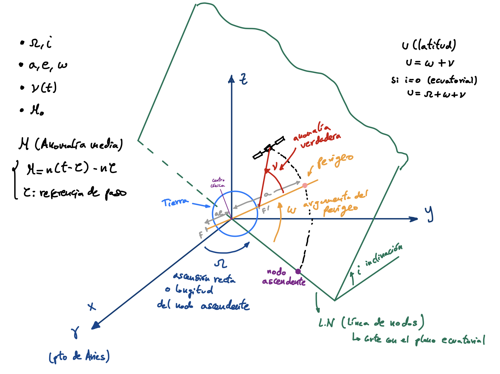

Elementos orbitales de un cuerpo alrededor del Sol

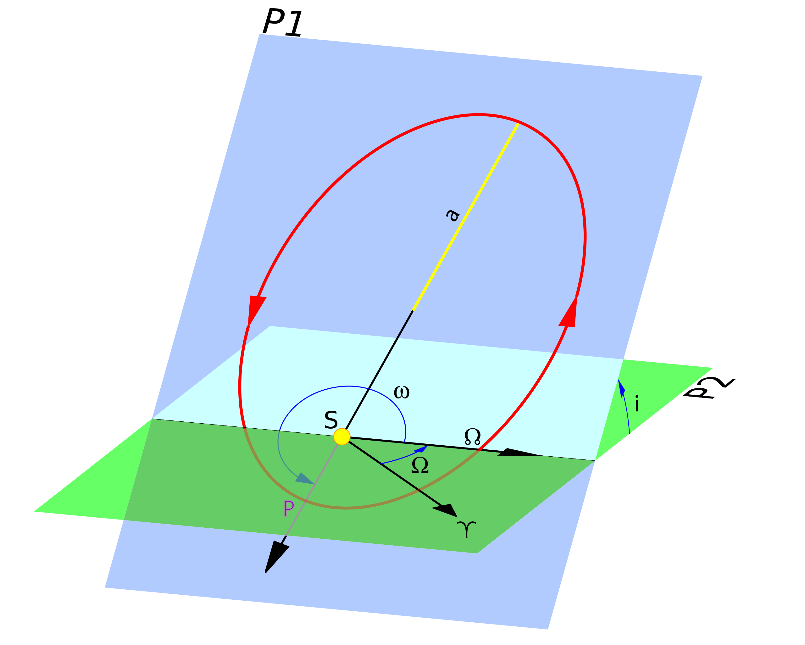
[Fuente](https://es.wikipedia.org/wiki/%C3%93rbita)

Para definir la posición del satélite necesitamos 6 parámetros:

- $\Omega, i$ (plano orbital)
- $a, e, \omega$ (forma de órbita)
- $\nu(t)$ (en que punto está el satélite)
- $M_0$ (referencia)

La expresión general de la anomalia media es $M=n (t-\tau)-n\tau$ donde $\tau$ es un tiempo de referencia, normalmente de paso por el perigeo, inicia la misión, etc. El significado de la anomalía media es el ángulo que tendría el satélite si recorriese su órbita a velocidad angular constante. Por ejemplo en una órbita circular sería:
$$
n = \sqrt{\frac{\mu}{a^{3}}} \quad T=2 \pi \sqrt{\frac{a^{3}}{\mu}} \quad M=\frac{2\pi}{T}
$$

donde n es la velocidad orbital.

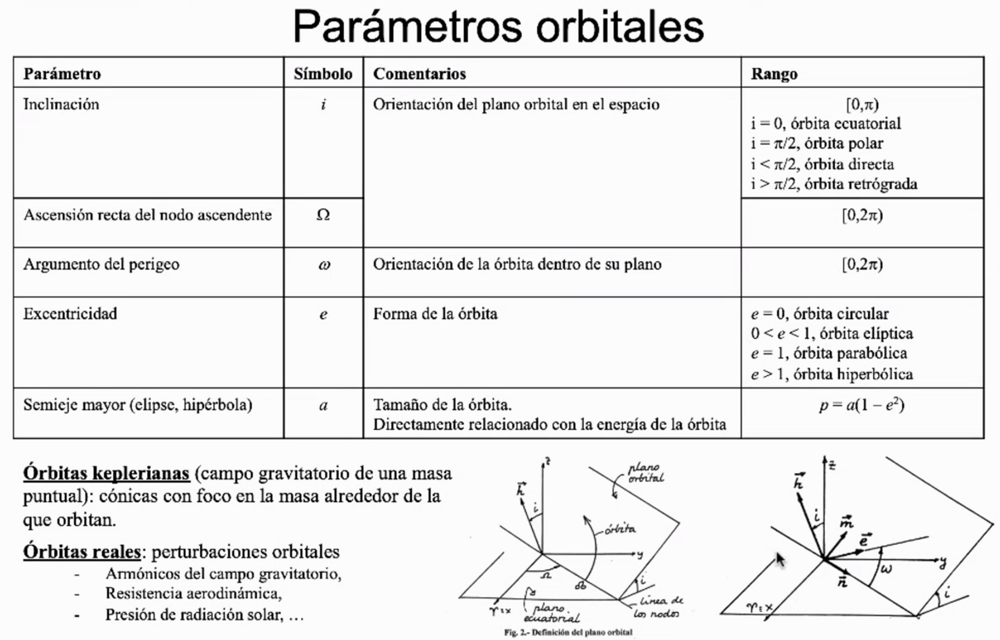

- Definición de la anomalía excéntrica, $E$:

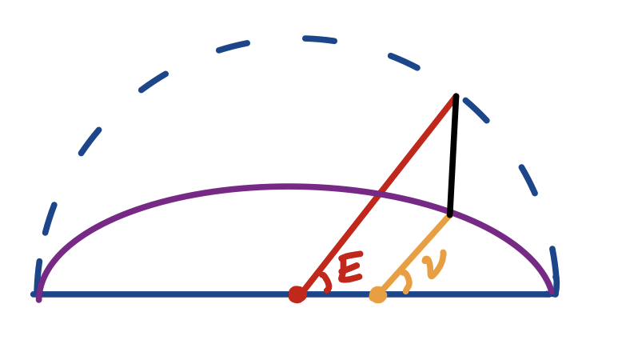

#### Órbitas keplerianas

- Conservación de la energía:

  > Relaciona el módulo del radiovector con el módulo de la velocidad de manera que la relación es única para cada tamaño órbital.

$$
\frac{V^{2}}{2} - \frac{\mu}{r} = - \frac{\mu}{2a}
$$

- Conservación del momento:

  > Si el momento cinético es cte, es $\perp$ al plano orbital.

  $$
  \vec{r} \times \vec{v} = \vec{h} = \vec{cte} \rightarrow \textrm{es } \perp \textrm{al plano orbital.}
  $$

  $$
  h = r v \cos{\gamma}
  $$

  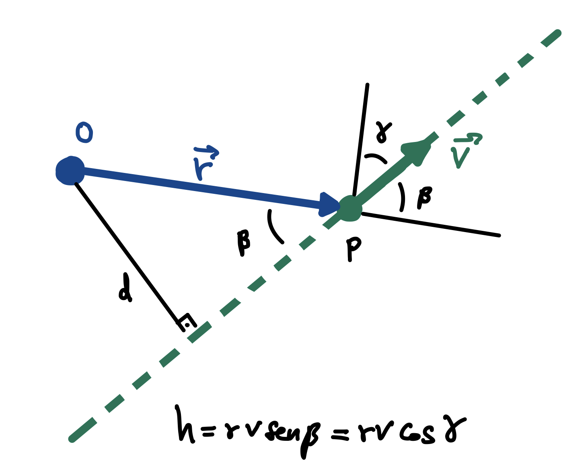

- Expresión paramétrica de la cónica:

  > Cualquier cónica responde a la expresión

$$
r = \frac{p}{1+e \cdot \cos{\nu}} = \frac{\frac{\overbrace{h^{2}}^{a (1-e^{2})}}{\mu}}{1+e \cdot \cos{\nu}}
$$

- Ángulo de asiento del vector velocidad :

	> ángulo entre la velocidad y  el vector director en la dirección polar (dirección angular, horizontal local).Tiene puntos singulares que habrá que tratar de otra forma. $\gamma \in [-\pi/2, \pi/2]$ aunque no tiene definición estricta.

$$
\overbrace{\gamma}^{\text{ ángulo de asiento }} = \hat{\vec{u}_{v}, \vec{v}} = atan[(1- \frac{r}{\rho} \tan{\mu})]
$$

- 3ª Ley de Kepler:

  > *Para cualquier planeta, el cuadrado de su período orbital es directamente proporcional al cubo de la longitud del semieje mayor de su órbita elíptica*.

$$
T = 2 \pi \sqrt{\frac{a^{3}}{\mu}}
$$

## Tema 1 Misión y Elementos

### Tipos de misión

1. Según Desarrolladores de la Misión:

   - **Sin intereses comerciales:** Agencias Espaciales (NASA, ESA)
   - **Militares**
   - **Comercial**

2. Según el Tipo de Orbita:

   - **Orbitadores Terrestres**
     - **LEO:** Low Earth Orbit (ℎ < 3000 𝑘𝑚)
     - **MEO:** Medium Earth Orbit (ℎ < 35790 𝑘𝑚)
     - **GSO:** Geosynchronous Orbit (ℎ = 35790 𝑘𝑚)(24h de periodo)
     - **HEO:** High Eccentricity Orbit
     - **Super-Synchoronous:** Mas alto que GSO, pero más bajo que la luna
   - **Lunar, Puntos de Lagrange (Tierra-Sol)**
   - **Interplanetaria / Misiones de Espacio Profundo**
     - Mas lejos que la Luna, pero en el Sistema Solar
     - Misiones Planetarias
   - **Interestelares**: Fuera del sistema solar

3. Según el Objetivo

   - **Comunicaciones**
   - **Observación Terrestre**
   - **Navegación**
   - **Ciencia y Exploración**

### Misiones de Comunicación

- **No comerciales:** Agencias Espaciales, Militares

  - TDRS, EDRS
  - Constelación Geosíncrona

- **Comerciales**
  Son las mas frecuentes. Estas misiones proporcionan distintos
  canales a los distribuidores de información ya sean compañías telefónicas, canales de
  TV y radiodifusión.

    - Requieren de un gran consumo de energía. Llevaran grandes paneles solares
    - Gran cantidad de antenas y transpondedores
    - Se intenta minimizar costes de inyección y misión, por lo tanto, se emplearán **tecnologías ya conocidas**

  Se tienen:
- **Satélites de Telefonía:**

  - **Geoestacionarias**
  - **LEO:** Proporcionan cobertura global
- **Satélites de TV:**

  - **Geoestacionarias**
  - **HEO:** Utilizado para zonas de alta latitud. El satélite se pasa la mayor parte del
    tiempo en el apogeo de su órbita. Sera necesario tener varios satélites para que cuando uno este dando la vuelta a la tierra el otro este apuntando a la tierra
    - **Molniya:** Periodo de 12 horas. Necesario 2 satélites. Problemas de
    apuntamiento ya que el satélite cambia de posición visto desde la
    tierra
    - **Tundra:** Periodo de 24 horas.
    - **8H:** Reducción de la distancia de la comunicación

### Misiones de Observación Terrestre
Se caracteriza sobre todo por el objetivo que cumplen consistente en la observación de una forma u otra de la superficie terrestre y su entorno.

Estas misiones se desarrollan en orbitas:
- **Geoestacionarias**
- **Orbitas Bajas**

Según el **tipo de observación** pueden ser:

- **Meteorológicas:** Observación y monitorización de la atmosfera
  - **LEO:** Orbitas Heliosincronas o polares
  - **GEO**
- **Observación de la Superficie Terrestre:** Se basan en el uso de una cámara que toma imágenes de la superficie terrestre, a la que apunta el instrumento
  - **GMES:** Global Monitores for Environment and Security
  - **EOEP:** Earth Observation Envelope Programme
- **Nasa’s EOSs**
- **Comerciales:** Landsat, SPOT
- **Militares:** Para aviso temprano y vigilancia

### Misiones de Navegación
Proporcionan la **posición del usuario** a través de la posición de estos con respecto a una
referencia común establecida.

Estos satélites deben:
- **Determinación MUY PRECISA DE LAS ORBITAS**
- Transmisión de las mismas a los usuarios para su uso
- Sincronización de los relojes y señales de los satélites
- Determinación Precisa de los errores asociados a los satélites
- Centros de Control y seguimiento complejos
- **MEO ($h \sim 26000$ km)**
- **Disponibilidad y fiabilidad**

Las misiones más famosas son:

- **GPS**
- **GLONASS**
- **Galileo, Compass, IRNSS, QZSS**

### Misiones de Ciencia
Su objetivo principal es **investigar algún área de la ciencia o el universo**

Estas misiones se pueden dividir a su vez en:

- **Misiones Astrofísica**
- **Misiones Física Fundamental**
- **Misiones del Sistema Solar y su Interacción con la tierra**

Las misiones más destacables son:
- **Integral:** Medición de rayos gamma, rayos x y espectro visible
- **Clúster:** Medición del campo magnético y la interacción con el viento solar
- **Hubble:** Telescopio, UV, Visible e IR o XMN: Rayos X
- **Exosat:** Rayos X

### Misiones de Exploración
Las misiones actuales tienen como objetivo **alcanzar cuerpos no explorados totalmente** hasta el momento, mediante sondas interplanetarias.

El tipo de trayectorias que se siguen en este tipo de misiones son múltiples y en general se les denomina Misiones Interplanetarias, ya que incluyen trayectorias dominadas por la gravedad del sol, tierra y otros planetas además de las asistencias gravitatorias.

Estas misiones destacan por **una fuerte optimización de recursos** para alcanzar el objetivo en plazos y condiciones aceptables

- **No tripuladas**

  - **Fly-bys:** Siguen una trayectoria continua y nunca son capturados en una nueva orbita sobre un cuerpo objetivo
    - Deben permitir observaciones a velocidades altas
    - Deben almacenar mucha información durante periodos muy cortos
    - Necesidad de antenas de alta ganancia y frecuencias elevadas
  - **Sondas:** Suelen ir con un orbitador que le acerca a la atmosfera a estudiar. La sonda realiza una reentrada mientras que el orbitador sigue en su órbita alrededor del planeta
    - No suelen ser autónomas y necesitan un vehículo que las traslade y un repetidor
    - Necesitan estabilización y protección térmica
    No hay expectativas de supervivencia de la sonda

  - **Orbitador:** Llego a un planeta y me quedo orbitando alrededor de él.
    - Necesario capacidad de propulsión para decelerar el vehículo
    - Soportar eclipses de sol
    - Sobrellevar la perdida de comunicaciones durante ocultación de la tierra

    - **Lander:** Vehículos que tienen como objetivo alcanzar de forma controlada la superficie del objetivo y mantenerse activos durante el tiempo necesarios.
      - No suelen ser autónomos
      - Necesitan estabilización y protección térmica
      - Deben resistir las condiciones ambientales en la superficie del planeta
      - Sistema de energía adecuado debido a la mayor duración de la misión

    - **Rovers:** Cochecito caminando por el planeta. Este tipo de vehículos requiere un diseño y por lo tanto unos requisitos independientes del resto.

- **Tripulados**
  - **Orbitadores**
  - **Estaciones Espaciales:** Vehículos establecidos de forma permanente en el espacio, como bases espaciales tripuladas con reabastecimiento y relevos de tripulación periódicos de forma que su vida útil puede extenderse por mucho mas tiempo que en los vehículos convencionales Suelen utilizar orbitas bajas y deben, obviamente, permitir la vida dentro
  - **Transporte:** Permiten realizar conexiones y desconexiones con la estación espacial, así como realizar transferencias de material y tripulación. Están preparados para la supervivencia de la tripulación en la reentrada.
  - **Landers Lunares**

### Presente y futuro de las misiones espaciales

Antiguamente **el objetivo fundamental** era ser los primeros en hacer algo (Carrera espacial).
Ahora el objetivo fundamental es **explotar las ventajas y posibilidades de las misiones**
**espaciales.**

Habrá que tener en cuenta que me puedo permitir, los intereses comerciales, etc.
Los factores que mayor importancia están adquiriendo son:
- **Coste del ciclo de vida de la misión**
- **Actividades Internacionales en el programa**, que permiten un programa de mayor
ambición

### Elementos de una Misión Espacial

Una **misión espacial** esta formada por los siguientes elementos:

- **Segmento Espacial:**
Relacionado con las trayectorias y orbital del vehículo, así como todo lo relacionado
con el vehículo en el espacio.
- **Lanzador:**
Diseño y fabricación de lanzadores
- **Segmento de Tierra:**
Todo lo demás a parte del segmento de lanzamiento. Instalaciones, personal, centros
entrenamiento de astronautas, fabricas de sistemas del vehículo, personal,
operadores, sala de control, etc.
- **Segmento de Usuario:**
La persona o grupo destinatario del objetivo de la misión. En una misión de
navegación, el usuario somos nosotros con nuestros móviles

### Nave Espacial
Está formada por:
- **Carga de Pago:**
  Es el elemento que realmente **realiza la misión**. Tendrá una serie de sensores e
  instrumentos que obtienen la información del objeto de la misión
- **Modulo de Servicio o Bus:**
  Son todos los **subsistemas** que proporcionan a la carga de pago, todos los recursos
  necesarios para que opere y se comunique con tierra
  - Potencia Eléctrica
  - Control Térmico
  - Guardado de datos
  - Comunicaciones

### Trayectorias y Orbitas
Las orbitas son seleccionadas de forma que cumplamos la misión que me hayan asignado con
el **mínimo coste o con un coste permisible**. A veces el mínimo coste da lugar a misiones
arriesgadas por lo tanto es posible que sea mas recomendable pagar un poco mas antes que
petar la nave.

Por lo general se podrá mandar un solo vehículo o se podrá realizar una constelación.

El camino que realiza un vehículo hasta su posición final será:

1. **Trayectoria de Inyección dada por el Lanzador**
2. **Orbita de Aparcamiento**
3. **Orbita de Transferencia**
4. **Orbita de Operación (Orbita Final)**
5. **Corrección de Perturbaciones**

## Tema 2 Ambiente Espacial

### Introducción

El vehículo espacial durante su operación y fabricación se enfrenta a múltiples situaciones con
diferentes características:

- **Fabricación** (control de la humedad y el polvo)
- **Transporte** (cargas importantes)
- **Lanzamiento** (fuertes cargas acústicas)
- **Operación**
- **Reentrada**

**Tener en cuenta todos los entornos** de operación del satélite afectaran a:

- **Diseño**
- **Tiempo de vida**
- **Arquitectura de la misión**

En el caso de una **Orbita cerca de la Tierra** se tienen los siguientes factores:

- **Atmosfera Residual:** Resistencia Aerodinámica
- **Ionosfera:** Puede afectar a los equipos
- **Campo Gravitatorio Terrestre:** No hay simetría exacta
- **Campo Magnético Terrestre**
- **Basura espacial**
- **Sol**
  - **Radiación Electromagnética**
  - **Flujo de Plasma**

Si me salgo de la esfera de influencia de la tierra
- **Entorno Interplanetario**
  - **Otros planetas:** Campo gravitatorio, Atmosfera, Radiación …
  - **Rayos Cósmicos:** Flujo Isotrópico de partículas
  - **Fondo de Radiación Electromagnética**

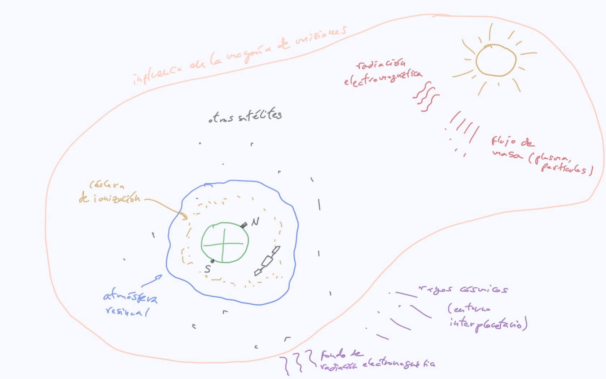

### EL Sol

|                    | Extension                      | Comment                                                      |
| :----------------- | :----------------------------- | :----------------------------------------------------------- |
| 1. Core            | $r < 0,25r_{Sun}$              | Nuclear fusion          |
| 2. Radiative zone  | $0,25r_{Sun}< r < 0,75r_{Sun}$ | Gamma ray diffusion  |
| 3. Convective zone | $0,75r_{Sun}< r < r_{Sun}$     | Plasma convection: solar dynamo  |
| 4. Photosphere     |       | Visible surface (sunspots, machas solares -> relacionada con la actividad solar)|
| 6. Chromosphere    |                                | Colored Surface, IR (sunspots, prominences) |
| 7. Corona          |                                | X-rays, White light   |

El medio interplanetario esta **dominado por los efectos del sol**, sobre todo por el gravitatorio. El
Sol es un **reactor termonuclear** cuya emisión de energía se realiza en su mayor parte en forma
de **RADIACION ELECTROMAGNETICA**, pero no solo, también **EMITE MASA QUE SE PIERDE**

**Efectos del Sol:**

- **Gravitación**
- **Radiación Electromagnética**
- **Emisión de masa**

El sol posee una **zona convectiva** donde hay un plasma que genera un **efecto dinamo** que es el
que da lugar al **campo magnético solar**. Este campo es **MUY DINAMICO** y da lugar a **variaciones**
**de carácter periódico y transitorios de corto plazo**. Esto provocara cambios en lugares que no
están en el sol (Por ejemplo, la atmosfera terrestre)

La **actividad solar** la podemos medir en sus **capas exteriores**. En la **fotosfera** se ven **manchas**
**solares** las cuales están relacionadas directamente con la actividad del sol y por lo tanto con la
**energía emitida**.

Con respecto a la **emisión de masa**, esta es expulsada del Sol a un flujo de un millón de
toneladas por segundo. Esta materia esta en **estado de plasma, electrones y iones**. La cantidad
de masa emitida dependerá de la **actividad solar**

#### Radiación Electromagnética Solar

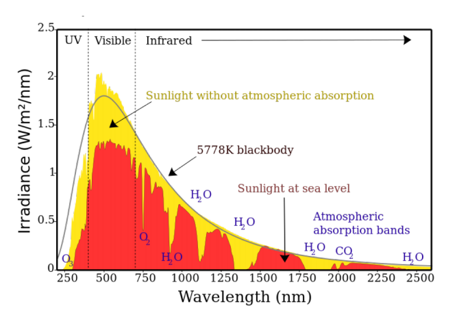

Cada capa del sol emite en unas longitudes de onda características, pero el espectro
electromagnético del Sol se ajusta al de un cuerpo negro a **$5800 \mathrm{k}$.**

Como se puede observar la mayor parte se da en el visible. Cuanto mas pequeña sea la longitud
de onda, **más energía y más ionizante**. Sin embargo, cuando más grande sea la longitud de onda
**menor energía y no ionizante**.

La **radiación electromagnética** emitida va perdiendo intensidad inversamente proporcional a la distancia al sol al cuadrado $\left(\sim 1 / r^{2}\right)$.

La **constante solar**, la cual representa el **valor medio de radiación solar al largo de un año** que Ilega a la tierra es:

$$
C_{s}=1366 \mathrm{~W} / \mathrm{m}^{2}
$$

En **invierno**, esta energía será **MAYOR** ya que nos encontramos **mas cerca del sol**. Además, su emisión dependerá de las variaciones producidas en la actividad solar

#### Actividad Solar

**¿Qué es la actividad solar?**  $\rightarrow $ El flujo que emite el sol hacia el sistema solar. Formado por la **radiación electromagnética** y el **plasma (masa)** que fluye de manera continua.

- **Actividad Estacionaria**

  - **Viento Solar:** Flujo continuo de plasma magnetizado. Tarda en llegar 5 días a la tierra. Tiene temperaturas del orden de $10^{5}-10^{6} \mathrm{~K}$ disminuyendo al alejarse del sol.
  - **Radiación Electromagnética:** Tarda 8 minutos en llegar
- **Actividad Periódica**

  Se debe a zonas activas cerca de las **manchas solares** que emiten **rayos-x** y radiación **ultravioleta extrema**, por lo que esta directamente relacionada con el **ciclo de 11 años** de **formación de manchas solares** en el Sol (Ciclo Solar).

  Los ciclos en los que se forman mayor cantidad de manchas solares resultan en una **mayor intensidad de la radiación solar**.

- **Actividad Transitoria**
  Ocurren en la atmosfera solar (fotosfera, cromosfera, corona)

  - **Llamaradas (Flares):** Explosiones en las proximidades de las manchas solares. Duran varios minutos. Emiten una gran cantidad de energía. Radiación muy intensa en las altas frecuencias
  - **Eyecciones de masa coronaria (CME):** Expulsión de gran cantidad de masa que vieja a altas velocidades. Es un **efecto local**

    El plasma que viaja a velocidad supersónica produce ondas de choque en el viento solar que aceleran partículas solares que pueden **llegar a la Tierra unas horas después del impacto**, y unos días después llegara el resto de masa.

    Este fenómeno nos sirve de aviso para prepararnos para lo que viene. Esto afecta fuertemente al campo magnético de la Tierra y puede freír perfectamente naves y a astronautas

    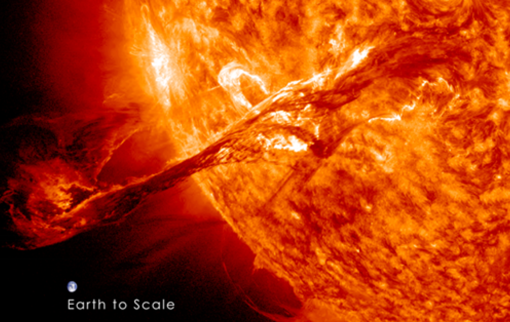 

### Atmósfera Terrestre

La composición, temperatura, presión y densidad son **función de la altitud**.

A bajas altitudes, se da un proceso de expansión adiabática, y al subir en altura disminuye T.

A altitudes **superiores a 150 km**, la densidad y composición dependen mucho de la **actividad solar y geomagnética**. La temperatura en la **estratosfera, termosfera y exosfera** aumentara con la altitud.

Esto es debido a que en la **estratosfera** se absorbe radiación de **alta energía** (EUV) debido a la capa de ozono y la descomposición formara calor.

En la **termosfera** hay un cambio de gradiente de temperatura por la absorción de rayos **EUV/X-Ray**

> La temperatura alcanzada en altas capas de la atmosfera puede ser muy alta ($\sim 1500 ºC$), lo cual puede fundir cualquier nave. Sin embargo, debido a la escasez de masa (baja densidad) la transmisión del calor es nula.

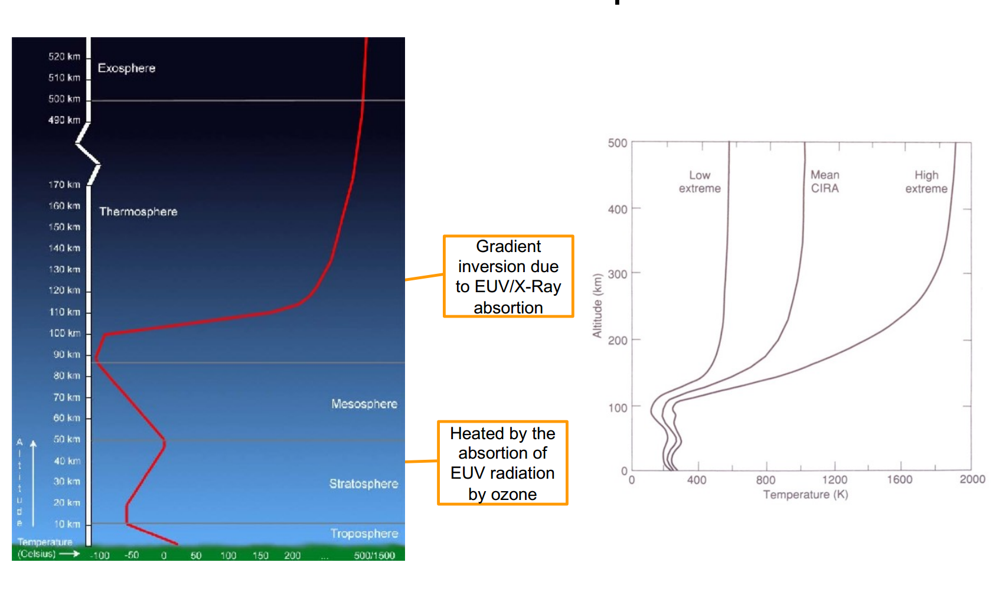

Los **modelos** de la atmosfera pueden ser **estáticos** o **dinámicos**:

- **Estáticos (Standard, CIRA)**

  No tienen en cuenta las variaciones temporales, solo la variación con la altitud.
  $$
  \rho=\rho_{0} e^{\frac{h_{0}-h}{H}}
  $$
  Para cada capa de la atmosfera se usa un valor diferente de la constante H, que **depende** de la **temperatura** como de la **capa de la atmosfera**
- **Dinámicos (Jacchia, MSIS)**
  Tienen en cuenta las **variaciones temporales de la atmosfera**. Incluyen:

  - **Variaciones Periódicas**
    - **Dia/Noche (1 día):** Por el día al haber mas calor aumentara la densidad sobre todo en las capas altas
    - **Rotación Solar (27 días):** Si el sol tiene manchas, al rotar, habrá un periodo de actividad
    - **Actividad Solar Periódica (11 años)**
  - **Variaciones Transitorias**
    - **Actividad Solar Transitoria**

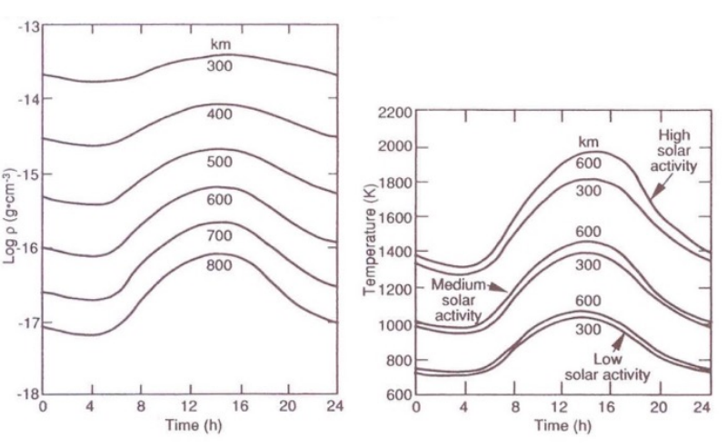

> La actividad solar influye de una manera MUY IMPORTANTE en la temperatura, siendo mucho mas importante que las variaciones debidas a la altitud

> Los CME no se pueden predecir

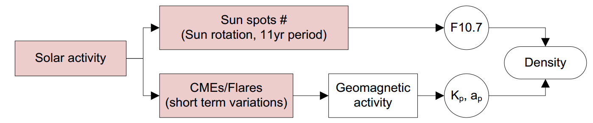

- $a_{p}$ (Índice Geomagnético)
- F10.7 (Flujo Solar en $10.7 cm$ ): Muy relacionado con la actividad de las manchas solares porque esta radiación es emitida por gases que se acumulan en la atmosfera sobre estas manchas.

$K_{p}$ y $a_{p}$ están elaborados a partir de las **variaciones** en **cortos periodos de tiempo** en las **medidas del campo magnético terrestre** en diversas estaciones distribuidas a lo largo de la superficie de la Tierra y por ello son sensibles a **variaciones de alta frecuencia temporal** de la actividad solar, es decir de **llamaradas y CME**

Para hacer **modelos a futuro del periodo de 11 años** es conveniente tener al menos datos de **tres años en el periodo de estudio**, con eso es posible hacer una predicción con buena precisión de la amplitud del periodo

### Ionosfera Terrestre

La ionosfera es una **cascara esférica de plasma ionizado** embebido en la termosfera y mesosfera (60 km $\rightarrow$ 2000 km). Es importante notar que **no es uniforme con la altura** y que hay distintas capas

¿De que esta formado? $\rightarrow$ **Iones y electrones** producidos por la **radiación de alta energía que proviene del sol (Rayos X y EUV)**. La temperatura de este plasma es similar a la de los **átomos neutros** presentes en la atmosfera en la que esta embebido

**Capas:**
- **D**: Esta es la mas interna. Absorbe los **Rayos-X duros**
- **E**: Capa intermedia. Absorbe los **Rayos-X blandos**
- **F**: Es la exterior. Absorbe los **Rayos-UV**

Durante el día la capa F se separa en F1 y F2. Mientras que la **capa D** suele desaparecer durante la noche

#### Efectos debidos a la ionosfera

- Reflexión o Absorción de Ondas electromagnéticas
  La **densidad de electrones** de la **ionosfera** nos definirá una **Frecuencia de Plasma** definida como:

  $$
  f_{p e}=8.97 \sqrt{n_{e}}
  $$

  Donde $n_{e}$ es la **densidad de electrones** $\left(m^{-1}\right)$. Esta densidad de electrones **DEPENDE DE LA ALTURA** según el perfil mostrado en la figura anterior.

  > Cuando una **onda electromagnética** viaja a través del plasma pueden producirse varios efectos **dependiendo de la relación de la frecuencia de radiación y la del plasma**

  1. **Reflexión de las Ondas de Radio** $\rightarrow f=f_{pe}$
  2. **Retrasos y cambios de fase** $\rightarrow f>\sim f_{pe}$
  3. **Retrasos Erráticos** $\rightarrow \boldsymbol{f} >> f_{pe}$
  4. **Absorción de la ondas** $\rightarrow f<f_{pe}$

  Se estamos transmitiendo información al espacio es **importante que no se pierda información** y que **no llegue con demasiado retraso**. Habrá que usar por lo tanto frecuencias **mayores y del orden de la del plasma** ($f >\sim f_{p e}$.

  > Como cada capa tiene una frecuencia distinta **SE UTILIZARÁN FRECUENCIAS QUE ESTAN POR ENCIMA DE TODAS ELLAS**

  Si queremos transmitir información dentro del propio planeta a lo largo de una amplia distancia, nos podemos aprovechar de la **reflexión de las ondas** debidas a la ionosfera. Para ello habrá que **igualar ambas frecuencias** $f = f_{pe}$, sin embargo, cada **capa de la ionosfera tiene unas frecuencias distintas**.

  - **D y E** $\rightarrow$ Ondas de radio AM
  - **F** $\rightarrow$ Ondas de radio CORTAS
  - Las ondas **FM** y de **TV** son muy cortas para ser reflejadas

  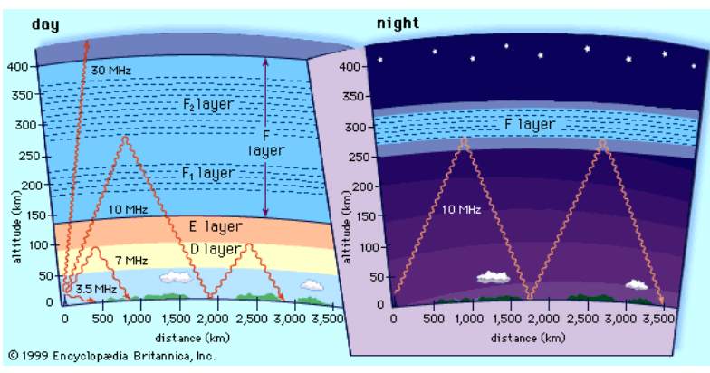

### Campo Gravitatorio Terrestre

#### Modelo Ideal

En el caso **ideal** de que la tierra es una **esfera perfecta** de densidad constante podemos definir la siguiente expresión.

$$
F=-\frac{G M m}{r^{2}} \rightarrow \boldsymbol{F}=m \boldsymbol{a} \rightarrow \boldsymbol{a}=\nabla \mathrm{U} \rightarrow \mathrm{U}(\mathrm{r})=\frac{\mu}{r}
$$

Donde $U(r)$ será el **Potencial Gravitatorio Ideal** que es **independiente de la masa de la partícula** y depende solo de la **distancia** al primario.

> Este potencial es constante en el interior de una cascara, mientras que en el exterior el potencial es **INDEPENDIENTE DE SU TAMAÑO e igual al de un punto de masa situado en su centro y de masa igual a la de la cascara**

Puede valer que la tierra tenga distintas capas, pero cada capa no debe varían ni en longitud ni en latitud (**Capas Homogéneas**).

*"El potencial gravitatorio creado por esferas homogéneas, o por esferas cuya densidad sea función de la distancia al centro, es el correspondiente a un punto material de masa igual a la de la esfera y situado en el centro de la misma"*

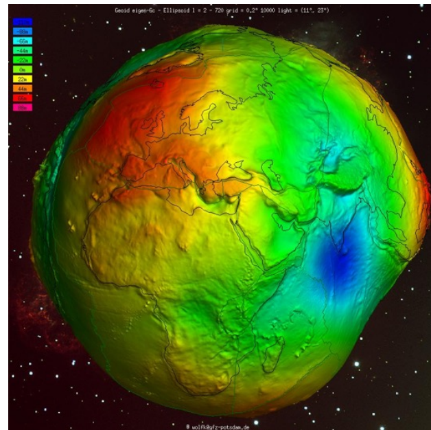

#### Modelo Armónicos Esféricos

Sin embargo, la **Tierra** no es una esfera perfecta.
$$
U = G \int dm / \rho
$$

Donde $\rho$ es la **distancia** del punto al diferencial de masa
Esta expresión la podemos representar como una sumatorio tal que:

$$
U(r, \lambda, \phi)=\frac{\mu}{r} \sum_{n=0}^{\infty} \sum_{m=0}^{n} J_{n m}\left(\frac{R_{\oplus}}{r}\right)^{n} P_{n m}(\sin \phi) \cos \left(\lambda-\lambda_{n m}\right)
$$

Esto representa una **expansión en armónicos esféricos** y como se puede observar contempla variaciones **radiales** en **longitud** $(\lambda)$ y **latitud** $(\phi)$. Incluye los **polinomios de Legendre**, $P_{nm}$, de grado $n$ y orden $m$. $J_{mn}$ y $\lambda_{nm}$ son coeficientes característicos de la distribución de masa asociados a cada armónico $P_{n m}(q)$. $R$ será el **radio del astro**.

> $$
  \text{Longitud } = 0 \leq \lambda \leq 2 \pi \quad \text{Latitud } = \frac{-\pi}{2} \leq \phi \leq \frac{\pi}{2}
> $$

- $n$ **cambios de signo en la esfera totales**
- $n-m$ **cambios de signo en LATITUD** ($-\pi / 2 \leq \phi \leq \pi / 2$)
- $2m$ **ceros en LONGITUD** ($0 \leq \lambda \leq 2\pi$)

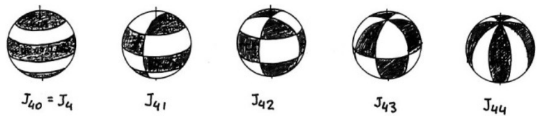

> - Blanco: contribución positiva a la masa
> - Negro: contribución negativa a la masa

- **Términos de Segundo Orden**
  - $J_{20}$: Achatamiento, el término más importante en la serie.
  - $J_{21}$: Cero con una selección adecuada del eje (ejes principales de inercia)
  - $J_{22}$: Elipcidad másica según el Ecuador Planetario. Afecta a satélites geoestacionarios.

  A medida que aumenta n, la contribución empieza a ser menor. Aun así, las diferentes  contribuciones dependen del planeta a analizar.

### Campo Magnético Terrestre

Este campo tiene su origen en el **movimiento convectivo y de rotación de la zona externa del núcleo terrestre.**

La **magnetosfera** será por lo tanto la región del espacio donde el **campo magnético de la Tierra tiene influencia**. Presenta dos zonas diferenciadas:

- **Inner Model** = Campo Magnético Terrestre Dominante (IGRF)
- **Outer Model** = El efecto del viento solar tiene importancia (Tsyganenko)

El campo magnético **no es una región infinita**, **el viento solar deflecta las lineas de campo**, por lo tanto, dejaran de ser simetrías. Cuando estamos a distancias cercanas de la Tierra ($r<4R$) sí que parece más normal.

Sin embargo el **campo magnetico** tambien deflecta el viento solar. El viento solar llega unidireccionalmente, de forma que al encontrarse con el campo magnetico se forma una **onda de choque** que desvia el viento solar.

Este viento pueden pasar dentro, sin una direccion definida (Magnetosheath). Estas partículas serán atrapadas en las **lineas del campo magnetico** en las zonas del polo **norte y sur**, formando las conocidas **auroras boreales**.

Por otro lado este viento solar puede entrar por la cola formada en el campo magnetico

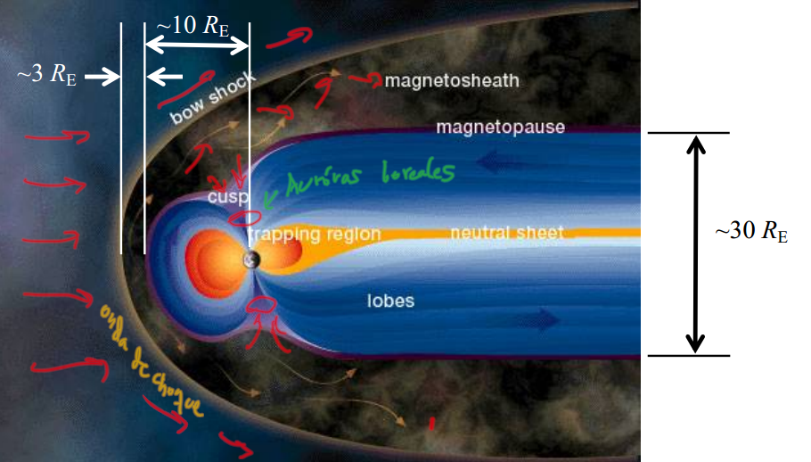

Cuando nos acercamos a la tierra ($r<4R$), empezamos a ver el campo magnético como un dipolo, pero tiene unas cuantas peculiaridades.

El campo magnético creado por el núcleo es análogo al creado por un **dipolo magnético** cuyo **eje forme un ángulo de 11 º con el eje de rotación** de la Tierra y **desplazado unos 400 km** hacia el océano Pacifico

> Es decir, el **campo magnético no está alineado, ni centrado con la Tierra**

Para representar este campo se puede utilizar una **expansión en armónicos esféricos**. Sin embargo, esto **solo es válido hasta del orden de $4R$** debido a la influencia del viento solar.

#### Anillos de Van Allen

El campo magnético esta **influenciado notablemente por el viento solar que llega**. Algunas partículas del viento solar que entran al campo magnético, se quedan atrapadas entre las **líneas de campo**. Estas formaran los anillos de **Van Allen**.

> Los **anillos de Van Allen** serán por lo tanto anillos formados por partículas cargadas que han
quedado atrapadas en el campo magnético

- **Anillo Interior**
  - **Protones** / Radiación Cósmica
  - **Electrones de BAJA Energía** / Viento Solar
- **Anillo Exterior**
  - I**ones y Electrones de ALTA Energía** / Viento Solar

Las **orbitas LEO** caen por **debajo del circulo interior**.

Los satélites de **GPS** están **justo por en el límite inferior del cinturón exterior**.

Los satélites **geoestacionarios están justo por encima**. Habrá que tener **cuidado en con las orbitas de gran excentricidad**

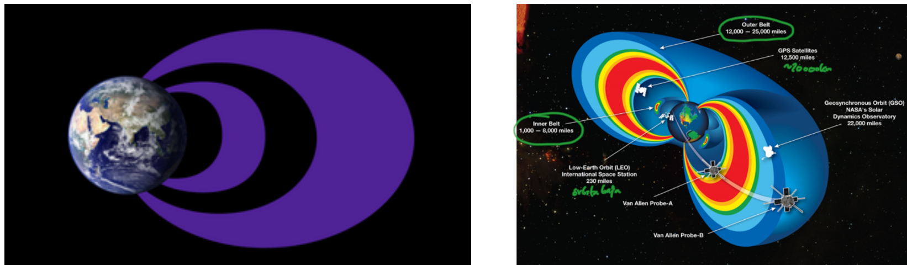

#### Anomalía del Atlántico Sur

Las partículas acumuladas en el cinturón interior de Van Allen, debido a la inclinación y desplazamiento del dipolo magnético, se adentran en **altitudes bajas** en una zona del Atlántico Sur

El **campo magnético es estacionario**, aunque sufre pequeñas variaciones periódicas:

- **Periodo de 24 horas:** Debidas a los cambios en la ionosfera debido a la rotación de la Tierra sobre si misma
- **Periodo del orden de meses:** Debidas a cambios del campo geomagnético terrestre
- **Seculares:** Reducción intensidad, desplazamiento hacia el Atlántico
- **Transitorias:** Debido a la actividad solar

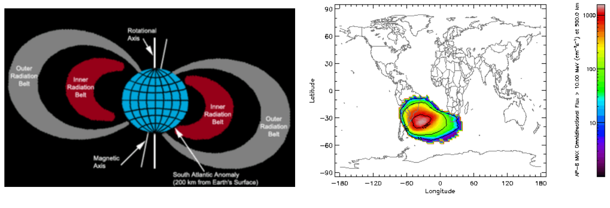

### Ambiente Interplanetario

Es la zona que se encuentra más allá de la magnetosfera terrestre y fuera del área de influencia del ambiente debido a otros planetas, aunque su definición depende del autor.

Este ambiente es mas **peligroso** que el de la Tierra ya que el campo magnético terrestre nos protege de la radiación proveniente del Sol y del espacio profundo

- **RADIACION**
  - **CMB / Fondo de Microondas Cósmico**
    - Radiación **Isotrópica de microonda**s
    - Comportamiento parecido a un cuerpo negro a $T_{b}=2.73 \pm 0.05 K$
    Tiene pequeña influencia en viajes cortos y se suele despreciar, sin embargo, es un **aporte de radiación constante** y puede dar a problemas térmicos si no la considero
  - **Radiación Cósmica / Rayos Cósmicos**
    - Radiación Isotrópica de partículas.
    - Compuesta por protones y partículas alfa (**Alta Energía**, pero **baja densidad**, 1 proton /$m^{2}$)
    - Proceden del espacio interestelar o del propio sol.
    - Contribuyen al cinturón **interior** de Van Alen.
  - **Viento Solar**
  - **Radiación Electromagnética Solar**
- **POLVO MICROSCOPICO**
- **CAMPO MAGNETICO SOLAR**

### Basura Espacial y MicroMeteoritos

La basura espacial se ha visto incrementada debido al incremento de numero de lanzamientos. Esta mayor cantidad de objetos volando en trayectorias que son muy usadas pueden resultar en un gran peligro para las empresas cuyos satélites están orbitando en esas orbitas.

- **Objetos Humanos** ($7.5 km/s$)
  - Operacionales (6 %)
  - No operacionales ($20 %$)
  - Etapas Superiores de Lanzamientos
  - Fragmentos de la misión (Coberturas de lentes, adaptadores de etapas)
  - Fragmentos no intencionados (Originados en explosiones de etapas superiores, trozos de pintura...)
- **Micrometeoritos** ($\sim 70 km/s$)

Hay una **fuerte acumulación de elementos** en **orbitas bajas y orbitas geoestacionarias**.

Lo más peligroso de todos estos tipos son los fragmentos ya que son pequeños y difíciles de trackear. Los objetos grandes los puedo seguir y catalogarlos, por lo tanto, es mejor tener un trozo gigante volando que miles de fragmentos pequeños

#### Medidas Adoptadas
- **Inmediatas:**
  - No producir explosiones de forma deliberada
  - Minimizar la cantidad de basura generada en la fase de operación
  - Vaciar los tanques de propulsante de los depósitos de etapas superiores
  - Desorbitar los vehículos que se encuentran en **orbitas densamente pobladas** antes de que hayan trascurrido 25 años después de finalizada la misión
  - Orbitar en **órbitas supersincronas** para vehículos no operativos

- **Secundarias:**
  - Eliminación de las etapas de lanzadores y vehículos
  - Reorbitar las etapas de lanzadores y vehículos en orbitas diferentes a las anteriores a una **órbita cementerio**
  - Desorbitar sobre el océano para reducir riesgos

- **Largo Plazo:**
  - Dispositivos para desorbitar vehículos

#### Clasificación y Predicción
- **Objetos Pequeños** $\rightarrow$ **Modelos Estadísticos**
  - NASA: Orbital Debris Engineering Model (ORDEM)
  - ESA: Meteoroid and Space Debris Terrestrial Environment Reference

- **Objetos Grandes** $\rightarrow$ **Catálogos**
  - NASA: USSTRATCOM
  - ESA: DISCOS

#### Protección

> El **daño crece con el tamaño y la velocidad relativa** de impacto

- **Escudos Protectores monobloque**
- **Escudos Whipple:** Aumentan el tamaño del vehículo, pero requiere menos masa que la del escudo monobloque

Los escudos por lo general poseen varias capas que están dimensionadas según el impacto esperado. Estas absorben energía de manera que el objeto se divide en una gran multitud de forma que las siguientes capas puedan pararlos de manera más fácil

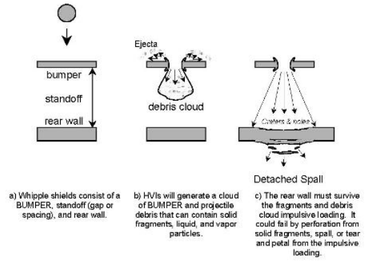

- **Evasión mediante propulsión:** Requieren de propulsante y son complicadas. Valido para misiones caras o de alto riesgo (tripuladas) (ISS, NASA’s EOS)

### Efectos del Ambiente sobre el Vehículo

#### Microgravedad

En un vehículo orbitando la tierra las aceleraciones detectadas por los acelerómetros son del orden de $\mu g$.

Todo ha sido diseñado en la Tierra donde esta presenta una aceleración bastante acusada de 1g. Sin embargo, en el espacio esto no es así y por lo tanto puede haber ciertos problemas

- **Fluidos:** Al no estar sometidos a una **fuerza volumétrica**, estos pueden estar en varios volúmenes. **NO HAY CONVECCION NATURAL**. No tengo ni idea de cómo va a estar un fluido a priori en un contenedor. Sera necesario por lo tanto **presurizar los fluidos para** garantizar su **suministro** Además, habrá que usar **convección forzada** para la refrigeración de ciertos elementos
- **Estructuras estarán descargadas**. Las estructuras se diseñan para el lanzamiento. Ojo que si hay algún mecanismo complejo puede generar cargas en el espacio
- **Efectos en la vida:** Efectos sobre las plantas, humanos …

#### Radiación

La radiación tiene **efectos muy diversos:**

##### Cargas Electroestáticas
Debido a la radiación, se produce una acumulación de cargas en ciertas zonas del vehículo.
Estas zonas pueden ser **exteriores o interiores (aislantes)**.

- **Cargas Superficiales / Externas**:
  Causadas por el flujo de electrones del **viento solar**. La acumulación de carga puede dar lugar a una **carga no neutra**. Esta acumulación de carga puede ser **positiva o negativa**. La **radiación ultravioleta (onda corta)** provocara **cargas positivas**
- **Cargas del Aislante / Internas**: Las partículas que entran serán aquellas de mayor energía. Estas se acumulan en los aislantes los cuales están hechos para **impedir el movimiento de las cargas** eléctricas. Por lo general se acumula **carga negativa**

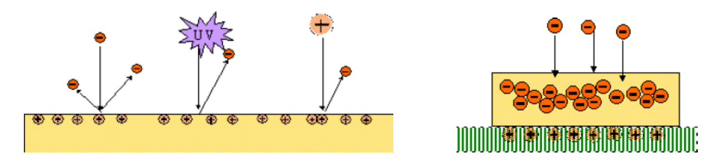

Es posible que **distintas partes de la nave estén expuestas a distintas cargas solares**. Si las condiciones de iluminación cambian puedo tener **DIFERENCIAS DE POTENCIAL** lo cual puede generar **arcos eléctricos dañinos**. Esto puede afectar a los circuitos electrónicos, daño en los datos transmitidos, cortocircuitos permanentes …

Si se acumula **mucha carga en el aislante** también puede provocar su rotura y por lo tanto causando un **daño PERMANENTE**

**¿Cómo solucionamos esto?** → **Dando movilidad a la carga**

1. Poniendo en contacto las superficies exteriores para que estén con el **mismo potencial**
2. Usar dieléctricos con una **resistividad limitada** ($< 10^{7} \Omega/m^{2}$)
3. Mantas conductoras

**¿Qué orbitas son peligrosas?**

- **Orbitas bajas:** **No hay problema de acumulación de carga** ya que se descargan por el plasma de la ionosfera. **Solo en latitudes altas hay problemas.**
- **Navegación:** Están cerca del borde interior (20000 km). Se acumulan electrones del viento solar, además de acumulación en dieléctricos. Pueden causar roturas de estos últimos
- **GSO (Geoestacionarias): MAYOR RIESGO**, ya que no hay nada que nos protege y además no hay ningún camino conductivo. Los diseños deben ser cuidadosos en cuento a equilibrar los potenciales entre las superficies

##### Radiación de Partículas

- **Dañan materiales y electrónica**
  - Electrones penetran mas
  - Iones son más destructivos
  - Bit Flips: Cambio espontaneo de valores de bits (Temporal o permanente)
- **Reducción eficiencia de paneles solares:** Hay que tener en cuenta esta variación de la eficiencia porque sino nuestra misión morirá más pronto de lo planeado.
- **Estrellas Falsas:** En satélites que determinan su actitud basándose en **sensores de estrellas**, un impacto de una partícula en el sensor puede crear estrellas falsas contaminando la entrada de datos
- **Degradación de las propiedades superficiales**
- Los **CMEs** afectan en gran medida
  - Aumentan la densidad atmosférica y la temperatura y también la resistencia
  - Crean turbulencias y cambios de densidad en la ionosfera
  - Cambian la magnetosfera

> **La dosis de radiación** es el **PRINCIPAL FACTOR LIMITANTE de la vida de la mayoría de los
sistemas electrónicos y es un problema muy tocho para MISIONES HUMANAS DE LARGA
DURACION**

##### Radiación electromagnética solar

Me permite **obtener** energía eléctrica mediante **paneles solares**.

Se debe aseguarar el **equilibrio térmico**:

- **INPUT: Radiación que viene desde el entorno**
  - **Energía Total del Sol** $\sim 1350 W / m^{2}$
  - **Albedo Terrestre** (Energía solar que rebota en la Tierra) $\sim 30 %$ del flujo de energía Solar
  - **Radiación Terrestre** $\sim 17 %$ del flujo de energía solar
- **OUTPUT: Emisión de radiación desde las superficies de la nave**

> **Es importante hacer un buen diseño térmico para mantener todo el equipamiento en su
rango de temperaturas de funcionamiento**, ya que algunos funcionan bien a bajas
temperaturas (paneles solares) y otros funcionan bien a otras temperaturas

Los rayos **EUV / X_Ray** que afectan a la **ionosfera** de la Tierra **degradan las
propiedades superficiales** del vehículo (Polímeros)

##### Presión de Radiación Fotónica

La radiación ejerce una **presión**.

$$
p=\frac{\frac{P}{A}}{c}=\frac{C_{s}}{c}=\frac{1370}{3 \cdot 10^{8}}=4,5 \cdot 10^{-6}
$$

Esta presión es ejercida en la dirección de la radiación solar. Aparece una **fuerza proporcional a $C_{s}$**.

Partiendo de una órbita circular, si la fuerza va en contra del movimiento, **la altitud se reduce** (sigue siendo circular la órbita).

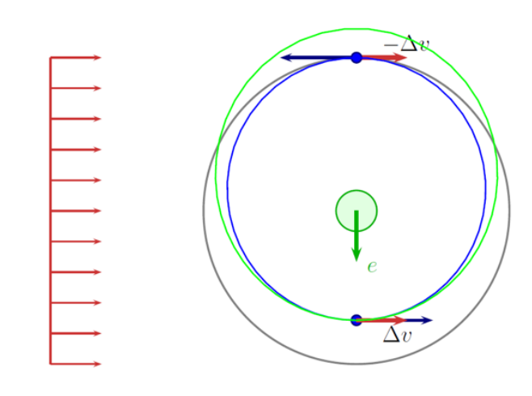

> Entonces cuando el vehículo ha completado media vuelta, tendrá la fuerza a favor, habrá por
lo tanto un incremento de velocidad, **AUMENTANDO LA EXCENTRICIDAD DE LA ORBITA**

Esto puede usarse para **Velas Solares**

##### Atmosfera
La altitud **afecta notablemente** a la **resistencia aerodinámica** ya que está
relacionada **exponencialmente con la densidad**.

$$
a_{D}=\frac{D}{m}=\frac{1}{2} \rho|\boldsymbol{V}|^{2} \frac{A C_{D}}{m}=\frac{\rho}{2 \beta}|\boldsymbol{V}|^{2}
$$

$\beta$ es el **coeficiente balístico** que solo depende del **vehículo** y su **orientación respecto a la velocidad incidente.** Para altitudes entre los $600-1000 km$ no afecta mucho

> **Orbitas de menos de 600 km** de altitud pueden tener que adoptar medidas para mantener su
altitud durante la misión

Para orbitas de más de 600 km, habrá que reservar un poco de fuel para tener generar una
reentrada al terminar la misión.

##### Vacío

- **AUSENCIA DE CONVECCION:** La única manera de evacuar calor será por **radiación** o **convección forzada**
- **Tanques de combustible** y otros sistemas necesitaran **presurización**
- **Sublimación**
  - **Metales** sueltan moléculas de gas absorbidas en su estancia en la Tierra
  - **Polímeros y otros materiales compuestos** de materiales volátiles sueltan partículas
  - **Materiales Higroscópicos** sueltan toda el agua absorbida por el aire

Todo esto puede provocar:
- Cambios en las propiedades de los materiales
- Descomposición contaminando otras superficies
- Interferencias en medidas
- Corto circuitos y malfuncionamiento de instrumentos
- Soldadura Fría

> Habrá que evitar usar metales de fácil sublimación como son el Zinc o Cesio, mantener las piezas móviles en recintos presurizados, o si no usar lubricantes con una débil tasa de evaporación y sublimación

#### Efectos de la basura Espacial

Cada vez hay menos fragmentos de explosiones ya que no se detona nada en el espacio. Sin embargo, si que aumentaran los fragmentos de colisión, al haber mas objetos volando sin eliminar los que ya hay

Se han tomado una serie de medidas para mitigar el problema de los fragmentos como es:

- **Generar la menor cantidad de basura posible durante la misión**
- **Minimizar la posibilidad de explosiones en orbita**
- **Eliminar los vehículos tras la misión y prevenir las colisiones en órbita**

Por lo tanto, habrá dos maneras extra de mitigar el crecimiento de objetos volando:

- **PDM:** Post Mission Disposal (25 years): **Llevar los objetos a orbitas cementerios o que se desintegren en la atmosfera**
- **ADR0x:** **Eliminación de basura de manera activa**. Se eliminarán x objetos por años. Como no hay nadie que lo quiera hacer pues actualmente no se esta realizando, pero hay numerosas naves experimentales que realizar esta tarea.

El uso de basureros (Recogida activa de basura), supondría un descenso increíble de la basura espacial a largo plazo

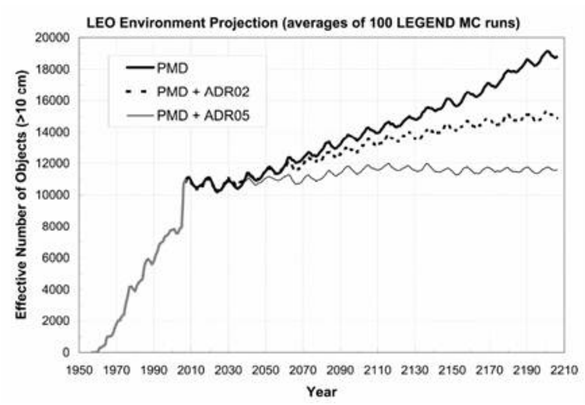

## Tema 3 Maniobras

### Introducción

La misión define una órbita de operación y no siempre es alcanzable directamente con el lanzador y lugar de lanzamiento disponibles/seleccionados. Una vez lanzadas la inmensa mayoría tienen que hacer una serie de maniobras con objeto de modificar o cambiar radicalmente sus trayectorias

- Si la **orbital inicial** y la **órbita final SE CORTAN no hará falta una órbita de transferencia**.
- Si la **órbita inicial y finales no se cortan será necesario emplear** al menos una órbita intermedia, **órbita de transferencia**.

Para realizar órbita una maniobra, es necesario que el cohete posea unos **motores cohete** (Solidos o Líquidos por lo general). Se caracterizan por que **su TIEMPO DE COMBUSTION es MUY PEQUEÑO en comparación con el PERIODO ORBITAL**.

> Por lo tanto, su efecto puede compararse a un **IMPULSO INSTANTANEO O PERCUSION** (𝚫𝑽). Se
cambia de velocidad sin cambiar notablemente de posición

En general se trata de **minimizar ∆𝐕, es decir, la masa**. Siempre que los **tiempos requeridos** para realizar las maniobras **no penalicen demasiado la misión**. Por ejemplo, un **cambio instantáneo** de orbita (sin orbita de transferencia), es un cambio instantáneo sin embargo el **consumo de combustible es muy grande**. Si realizamos una maniobra con asistencia de una **órbita de transferencia, se ahorrará combustible**, pero tendremos una penalización de tiempo al realizar esa transferencia

Es importante tener en cuenta que **Δ𝑽 tiene carácter VECTORIAL**. Por lo tanto, según como este sea aplicado la órbita cambiara de diferente forma.

- Se asume que se emplean impulsos instantáneos
- Dirección de ∆𝐕
 - **Paralela al plano orbital**: puede variar $a, e, \omega$ (caraterísticas de la órbita).    $\omega$ reorientaría el plano orbital.
 - **Perpendicular al plano orbital**: puede variar $\Omega, i$ (características del plano orbital)

### Gasto de propulsante

El impulso necesario en cada maniobra se consigue mediante un motor cohete y varía según el tipo:

- Propulsante líquido: se puede variar ∆𝑉 durante la misión
- Propulsante sólido: no se puede variar ∆𝑉 durante la misión

Dado un Δ𝑉 necesario para realizar una maniobra, podemos calcular la masa de propulsante necesaria para realizar la maniobra a partir de la siguiente expresión:

$$
\Delta V=I_{s p} g \ln \frac{\text { masa inicial }}{\text { masa final }} \quad m_{p}=m_{s}\left[\exp \left(\frac{\Delta V}{I_{s p} g}\right)-1\right]
$$

Donde:
- $m_{P}$: masa de propulsante necesaria
- $m_{s}$ : masa seca
- $I_{sp}$: impulso específico
- g: $9.81 m/s^{2}$

### Trigonometría esférica

> Relaciona lados y ángulos de triángulos esféricos. En realidad los lados son arcos y vienen dados en unidades de ángulo. Por definición, los lados de un triángulo esférico están definidos por circulos máximos. El ecuador es un círculo máximo pero cualquier otro paralelo no porque no incluye el centro de la Tierra.

- Área de la superficie
  $$
  S=\frac{\pi r^{2}}{180^{\circ}}\left(A+B+C-180^{\circ}\right) \geq 0
  $$

  - Un triángulo muy pequeño tiene un área cercana a π, y la trigonometría plana es una buena aproximación

- Teorema del seno
  $$
  \frac{\sin a}{\sin A}=\frac{\sin b}{\sin B}=\frac{\sin c}{\sin C}
  $$

- Teorema de la cotangente
  $$
  \cot a \sin b=\cos b \cos C+\sin C \cot A
  $$

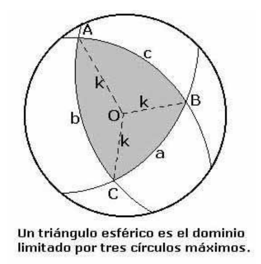

- Teor. del coseno para lados: Relaciona los lados y un ángulo
  $$
  \cos a=\cos b \cos c+\sin b \sin c \cos A
  $$

- Teor. del coseno para ángulos: Relaciona los ángulos y un lado
  $$
  \cos A=-\cos B \cos C+\sin B \sin C \cos a
  $$

### Lanzamiento

> Hay un interes por tener bases de lanzamiento cerca del ecuador. Esto es debido a que las inclinaciones orbitales a las que uno tiene acceso están limitadas por la latitud a la que se lanza.  Se busca minimizar combustible o alcanzar la órbita de la forma más directa posible.

Un vehículo se lanza desde una base L, cuya latitud geométrica es $\phi$. Nuestro objetivo es colocarlo en una órbita cuya inclinación es $i$. ¿Con que ángulo azimutal, $A$, habrá que lanzar el lanzador?

Hipótesis:
- La trayectoria propulsada está contenida en el plano orbital
- No se considera el efecto del giro de la Tierra

Aplicando el teorema del coseno

$$
\cos i=-\cos A \cos \frac{\pi}{2}+\sin A \sin \frac{\pi}{2} \cos \phi
$$

> $$
  \cos i=\sin A \cos \phi
> $$

El mínimo valor de 𝒊 que se puede conseguir es el de la latitud de la base de lanzamiento.

$$
|\cos i| \leq |\cos \phi| \rightarrow \pi - \phi \geq i \geq \phi
$$

> $$
  i_{min} = \phi \quad i_{max} = \pi - \phi
> $$

$sin A$ nunca será mayor que la unidad, por lo tanto, la inclinación estará limitada por la latitud
de la base de lanzamiento y podemos comprobar cómo realizar un lanzamiento desde el ecuador es la mejor opción ya que abarca todos ángulos desde esa zona de lanzamiento.

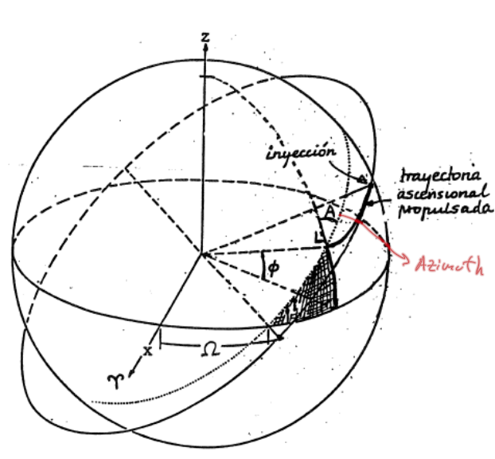 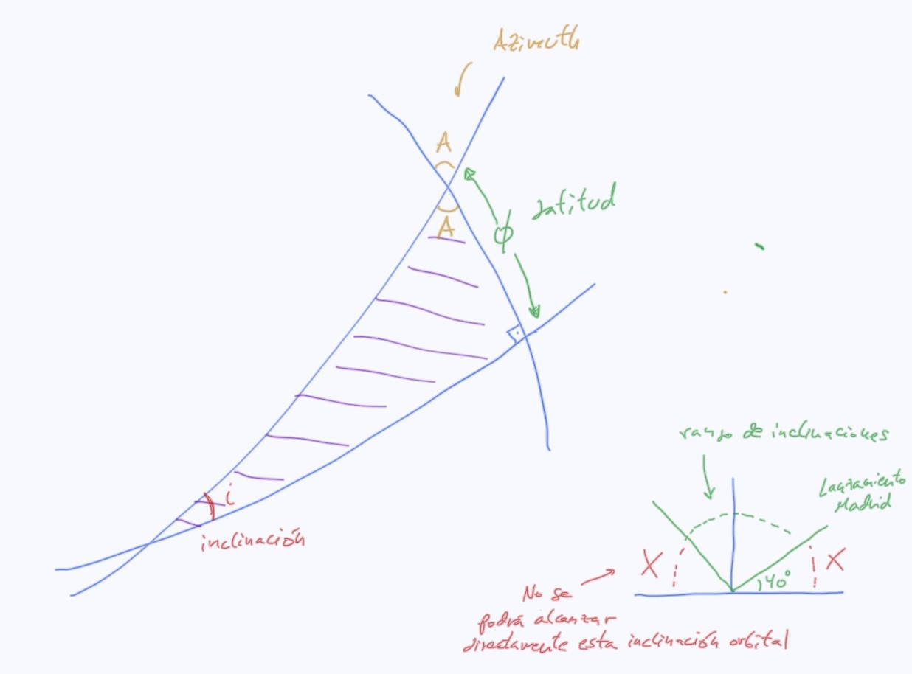

- Si lanzamos desde el polo norte ($\phi = \pi / 2$):
  $$
  \cos i = \sin A \cdot 0 = 0 \rightarrow \quad i = \frac{\pi}{2}
  $$

- Si lanzamos desde el polo sur ($\phi = - \pi / 2$):
  $$
  \cos i = \sin A \cdot 0 = 0 \rightarrow \quad i = \frac{\pi}{2}
  $$

- Si lanzamos desde el ecuador ($\phi = 0; A= \pi / 2$):
  $$
  \cos i = \sin A \cdot 1 = \sin A = 0 \quad \rightarrow \quad 180 \geq i \geq 0
  $$
- Si lanzamos desde Madrid ($\phi = 40º$):
  $$
  cos i = sin A \cdot 0.766 \rightarrow i_{min} = 40º (A=90º); \quad i_{max}=140º(A=270)
  $$

Cada base de lanzamiento dispone de figuras en las que se muestran las inclinaciones posibles para la Base Cabo Cañaberal con azimuth de 29º. Se limita el sur y norte por zonas habitadas.

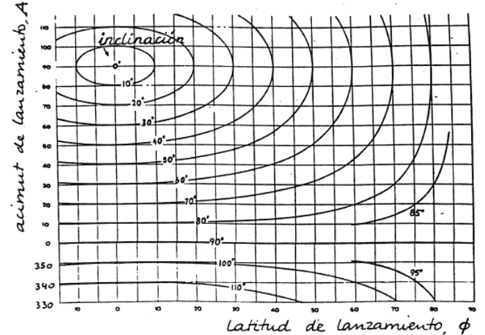 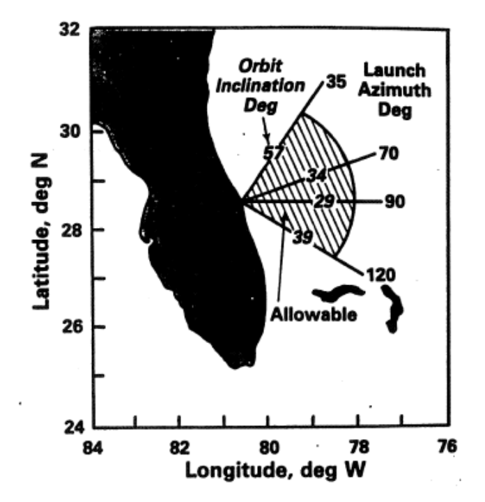

### Maniobras coplanarias

Se da impulsos dentro del plano orbital para cambiar los parámetros de la cónica. Pierdo algo de energía en girar y no en cambiar la energía de la órbita. Para que no exista esta pérdida lo mejor es usar impulsos tangenciales. Sin embargo, si no tengo más remedio por restricciones de tiempo se tendrá que utilizar impulsos no tangenciales.

Un satélite se encuentra en una órbita kepleriana inicial. En una cierta posición se le comunica un impulso, $\Delta \vec{V}$. Por lo tanto, la velocidad pasará de $\vec{V_{l}}$ a $\vec{V_{f}}$ y por lo tanto se encontrará en una nueva orbita

> - $V_f$ tangente a la órbita final
>
> Salvo que quiera cambiar el argumento en el perigeo los impulsos se realizarán en el apoapsis o periapsis.

#### Impulso no tangencial

En el caso de que el impulso se haya dado dentro del plano de la órbita (Maniobra Coplanaria), este impulso se caracterizara con $\Delta V$ y $\varphi$, donde $\varphi$ sera el angulo entre la velocidad inicial y la velocidad final

Si el impulso NO ES TANGENTE A LA TRAYECTORIA $\rightarrow \varphi \neq 0$

A partir del teorema del coseno obtendremos que:

$$
\Delta V=\sqrt{V_{f}^{2}+V_{i}^{2}-2 V_{f} V_{i} \cos \varphi} \geq V_{f}-V_{i}
$$

$$
\sin \psi=\frac{V_{f} \sin \varphi}{\Delta V}
$$

El ángulo $\psi$, nos da el angulo que tiene que formar el impulso con la velocidad inicial

- No se maximiza la eficiencia ($\varphi \neq 0$), parte del impulso no se emplea en aumentar la energía específica de la órbita. Recordemos que la energía específica en un punto dado sólo depende del módulo de la velocidad
- Se emplea cuando se quiere reducir el tiempo requerido para la maniobra

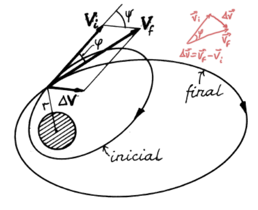

#### Impulso tamngencial

En este caso el impulso se realiza tangencialmente a la órbita (𝜑 = 0), por lo tanto, se maximiza la eficiencia del impulso.

Sera utilizado en el caso de que el tiempo no sea una prioridad.

En general se realizan en el apoapsis o en el periapsis. Sin embargo, si se realiza en el apoapsis conseguiremos VENTAJAS ENERGETICAS

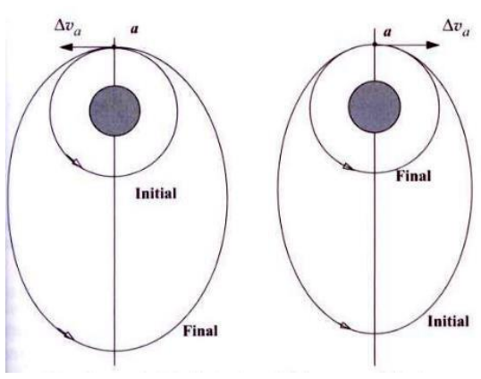

#### Cálculo del impulso no tangencial

Conocidas la órbita inicial y final, conocemos $a, e, \omega$ de ambas orbitas.  Estos parámetros me determinan donde tengo que dar el impulso y con qué ángulo.

Igualamos los radios en el punto de impulso i:

$$
\frac{p_{i}}{1+e_{i} \cos \left(\nu_{i}\right)}=\frac{p_{f}}{1+e_{f} \cos \left(\nu_{i}-\omega_{f}+\omega_{i}\right)}
$$

En la ecuación es todo conocido excepto $\nu_{i}$. EL resultado será $r_{I}, \nu_{I}$ del punto de impulso en la órbita inicial. Las velocidades antes y después de la maniobra serán:

$$
V_{i}^{2}=\mu\left(\frac{2}{r_{I}}-\frac{1}{a_{i}}\right) \quad V_{f}^{2}=\mu\left(\frac{2}{r_{I}}-\frac{1}{a_{f}}\right)
$$

$$
\gamma_{i}=\operatorname{atan}\left(\left(1-\frac{r_{I}}{p_{i}}\right) \tan v_{i}\right)
$$

$$
\gamma_{f}=\operatorname{atan}\left(\left(1-\frac{r_{I}}{p_{f}}\right) \tan \left(\nu_{i}-\omega_{f}+\omega_{i}\right)\right)
$$

Donde $\gamma$ serán los ángulos que forman las velocidades iniciales y finales con la horizontal. La dirección del impulso será:

$$
\varphi=\gamma_{i}-\gamma_{f}
$$

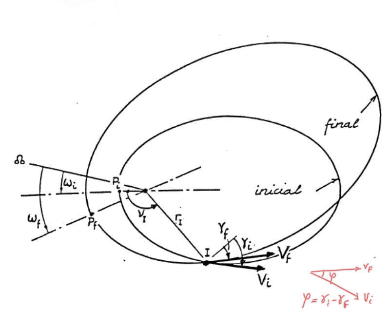

### Transferencias coplanarias

Muy a menudo las órbitas inicial y final no se cortan, por lo que para pasar de una a la otra es necesario una órbita de transferencia. Esta órbita puede ser secante o tangente a las órbitas inicial y final.

Estas orbitas de transferencia necesitaran de al menos 2 impulsos. El primer impulso, $\Delta V_{1}$, origina el abandono del vehículo de su órbita inicial, y el segundo, $\Delta V_{2}$ inserta a este en la órbita final.

En el caso de una transferencia mediante dos impulsos NO tangenciales:

$$
\Delta V=\left|\Delta V_{1}\right|+\left|\Delta V_{2}\right|
$$

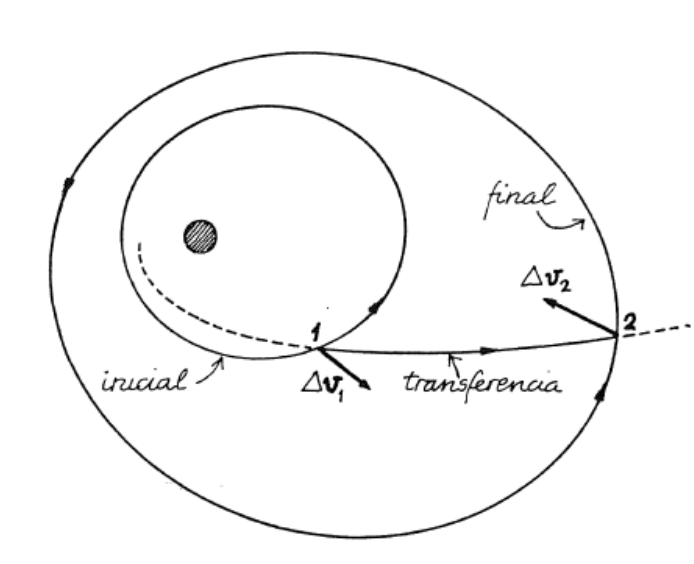

Esta maniobra es:
- Poco eficiente
- Rápida

Lo más eficiente seria hacer dos impulsos tangenciales. Aunque un caso intermedio seria hacer
un impulso tangencial y otro no.

#### Notación para transferencias

- Órbitas
	- Initial
	- Final
	- Transfer
- Posiciones de las maniobras
	- a = Primer Impulso
	- b = Segundo Impulso
- Incrementos de velocidad ($\mathbf{V}_{Orbita,PuntoImpulso}$)
	- $\Delta V_{a} = V_{trans,a} - V_{init}$
	- $\Delta V_{b} = V_{final} - V_{trans, b}$
- Si se emplean más de una órbita de transferencia se denominan trans1, trans2, etc.

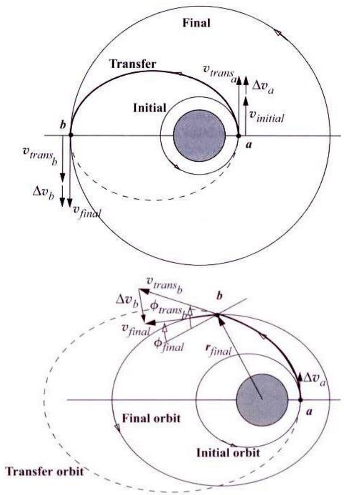

#### Transferencia de Hohmann

Se utilizarán DOS IMPULSOS TANGENCIALES. Se recorre la mitad de una órbita elíptica de
transferencia. Es muy eficiente en la mayoría de casos prácticos

##### Tranferencia entre dos órbitas circulares.

$r_{\text {init }} y r_{\text {final }}$ son los radios de las orbitas inicial y final (Orbitas Circulares). A partir de la ecuación de la energía especifica obtendremos las velocidades en cada punto para cada orbita y así obtener el $\Delta V$ necesario en cada punto

$$
V_{\text {init }}=\sqrt{\frac{\mu}{r_{\text {init }}}} ; V_{\text {final }}=\sqrt{\frac{\mu}{r_{\text {final }}}}
$$

$$
a_{\text {trans }}=\frac{r_{\text {init }}+r_{\text {final }}}{2} ; t_{\text {trans }}=\frac{T}{2}=\pi \sqrt{\frac{a_{\text {trans }}^{3}}{\mu} 1}
$$

$$
V_{\text {trans }, a}=\sqrt{\frac{2 \mu}{r_{\text {init }}}-\frac{\mu}{a_{\text {trans }}}} ; V_{\text {trans }, b}=\sqrt{\frac{2 \mu}{r_{\text {final }}}-\frac{\mu}{a_{\text {trans }}}}
$$

$$
\Delta V_{a}=V_{\text {trans }, a}-V_{\text {init }} ; \Delta V_{b}=V_{\text {final }}-V_{\text {trans }, b} ; \Delta V=\left|\Delta V_{a}\right|+\left|\Delta V_{b}\right|
$$

##### Transferencia entre dos órbitas elípticas coaxiales

La forma de resolver el problema se realiza de la misma forma. Solo
cambian las expresiones de $V_{init}, V_{final}$

$$
V_{\text {init }}=\sqrt{\frac{2 \mu}{r_{\text {init }}}-\frac{\mu}{a_{\text {init }}}} ; \quad V_{\text {final }}=\sqrt{\frac{2 \mu}{r_{\text {final }}}-\frac{\mu}{a_{\text {final }}}}
$$

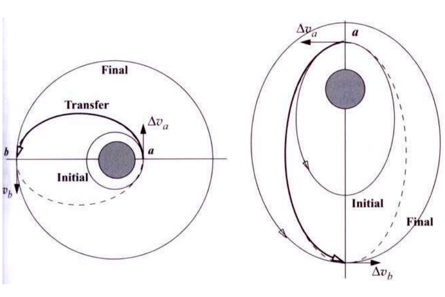

#### Transferencia bielíptica

Se usa para transferencias entre orbitas circulares. El concepto es usar una órbita de transferencia, pero en este caso me voy MUUY LEJOS (Punto B).

> Desde el punto A me voy cuanto más lejos mejor (B) y en este punto doy otro impulso que me lleva a una segunda segunda órbita de transferencia que me dirige al radio final y finalmente doy un último impulso de recircularización. Se utilizan dos elipses de transferencia, de ahí el nombre.

- El punto B será un PARÁMETRO DE DISEÑO, ya que el $\Delta V$ requerido será función del valor que demos a $r_{b}$:
$$
r_{\text {init }}, r_{\text {final }}, r_{b} \rightarrow a_{\text {trans }, 1}, t_{\text {trans, } 1}, a_{\text {trans, } 2}, t_{\text {trans, } 2}, \Delta V_{a}, \Delta V_{b}, \Delta V_{c}
$$
- La distancia del punto en que se realiza el segundo impulso (b) al foco es mayor que el radio de la órbita mayor
- Es más eficiente que la de Hohmann si $R^{*}=\frac{r_{b}}{r_{\text {init }}} \uparrow \uparrow$

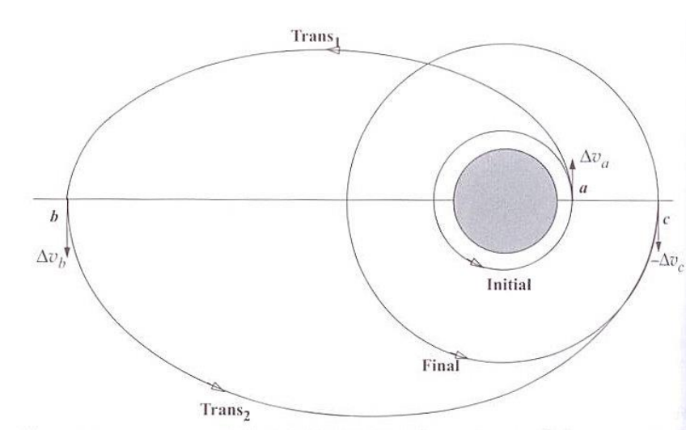

El impulso es más eficiente cuanto más alta es la velocidad cuando doy el impluso (efecto Oberth)

#### Efecto Oberth

Ir más y más lejos no me cuesta cada vez más sino que el límite es la velocidad de escape ($\infty$), y por tanto el $\Delta V$ que necesito para irme muy lejos esta limitado

¿En qué punto interesa más dar el impulso?:

Desde el punto de vista energético y para un impulso tangencial:
$$
\varepsilon_{\text {trans }, a}=\frac{(V+\Delta V)^{2}}{2}-\frac{\mu}{r}=\varepsilon_{\text {init }}+V_{\text {init }} \Delta V+\frac{\Delta V^{2}}{2}
$$

> Cuanto mayor es la velocidad en el punto en que se da el impulso, más eficiente resulta el impulso

#### Transferencias Hohmann vs. bielíptica

El impulso total empleado para una transferencia de Hohmann será:

$$
\frac{\Delta V}{V}=\sqrt{\frac{2 \lambda}{1+\lambda}}\left(1-\frac{1}{\lambda}\right)+\sqrt{\frac{1}{\lambda}}-1
$$

donde $\lambda=r_{f} / r_{i}$. Si $\boldsymbol{\lambda}<\mathbf{1}$, estamos pasando de una órbita exterior a una interior. Si representamos $\Delta V / V$ en funcion de $\lambda$ obtendremos la siguiente gráfica:

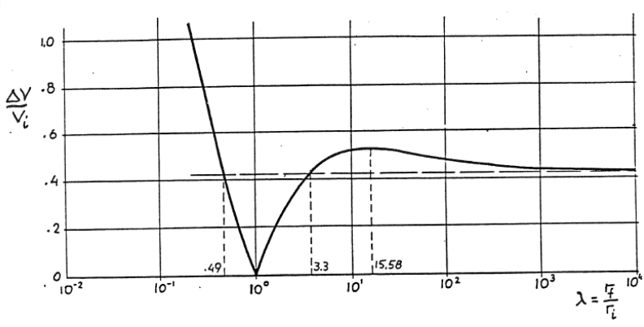

A partir de esta figura se puede deducir que:

1) La transferencia de orbitas interiores a exteriores cuesta menos que pasar de orbitas
exteriores a interiores
2) Es más costoso pasar a una órbita 10 veces mayor que la inicial que a una órbita 1000
veces mayor que la inicial
3) Para valores de $0.49 < \lambda < 3.3$, es más económico la transferencia que el escape. Esto
quiere decir que mandar un satélite de una órbita baja a una geoestacionaria ($\lambda = 6.3$)
cuesta mas que enviar al vehículo fuera de la atracción terrestre

Como podemos ver, ir super lejos no implica aumentar mucho Δ𝑉 porque hay un límite. Ese límite es la velocidad de Escape (Velocidad de Inyección en órbita Parabólica).

Definimos $R^{*}=r_{b} / r_{init }$. Existen unos valores especiales:

- $R^{*}= \lambda = 15.58$:

  Mínimo valor de $R^{*}$ que consigue orbita bieliptica mas barata que una Hohmann
- $\lambda=11.94$ y $R^{*}=\infty$ :

  En el mejor de los casos, en el que quiera gastar un tiempo infinito en la transferencia y me voy al infinito, necesito como mínimo para que la bieliptica me compense que $\lambda=11.94$

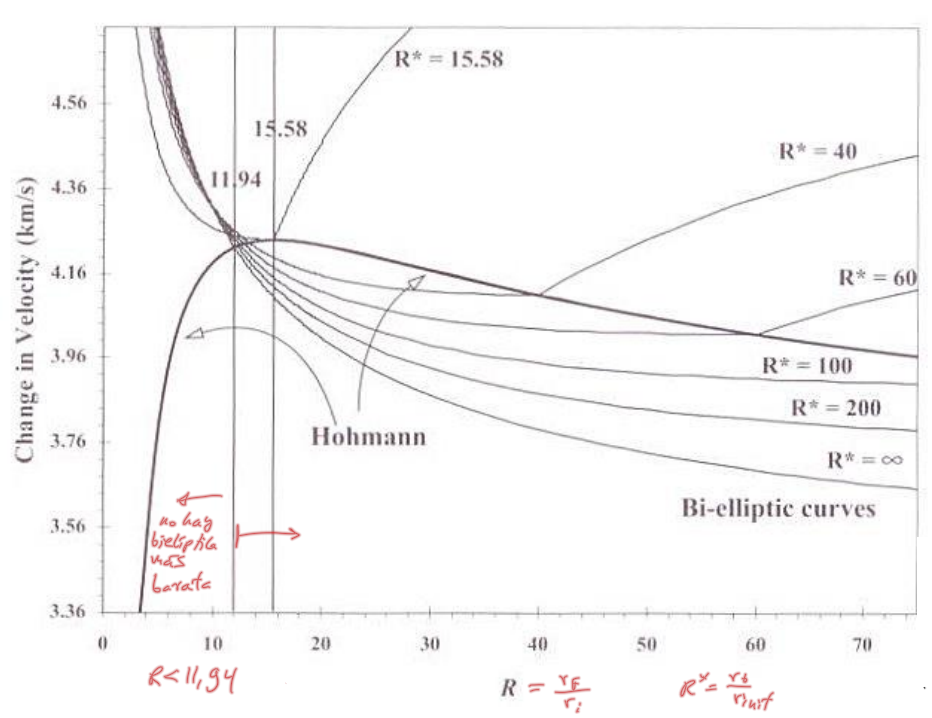

Por lo tanto, podemos llegar a estas conclusiones.

1. $\lambda<$ 11. 94: Usar transferencia de Hohmann
2. $\lambda>$ 11. 94: Habra que ver si renta más Hohmann o Bieliptica dependiendo de $\boldsymbol{R}^{*}$

> A la hora de diseñar una órbita mirar el valor de $\lambda$, y ver si es mayor o menor que 11.94

### Restricción en ∆𝑉

Si los thrusters que lleva el satélite son pequeños el valor de ∆𝑉 puede estar LIMITADO

- Bajo empuje químico $\rightarrow$ Hohmann segmentada
  - Se dan muchos impulsos en el periapsis (punto de menor radio y mayor velocidad) hasta que el radio en el apoapsis es igual al radio de la órbita mayor
  - Se da un impulso en el apoapsis para recircularizar la órbita
- Bajo empuje eléctrico $\rightarrow$ Transferencia en espiral
  - Se van dando impulsos progresivamente

### Maniobra de cambio de plano

Para cambiar el plano de la órbita necesitamos un impulso normal al plano. Al cambiar el plano de la órbita cambiamos la inclinación, $i$, y la ascensión del nodo ascendente, $\Omega$ (RAAN)

Existen tres opciones:

1) Solo cambiar la inclinación: $\Delta i=i_{f}-i_{i}$
2) Solo cambiar RAAN: $\Delta \Omega=\Omega_{f}-\Omega_{i}$
3) Cambiar inclinación y RAAN

> Un cambio de plano orbital, sin modificación de la forma ni del tamaño de la órbita, requerirá un impulso que DEJE INVARIABLE EL MODULO DE LA VELOCIDAD del satélite y que sea perpendicular al radio vector del mismo (Giro a velocidad constante)

> $$
  |V_{i}| = |V_{f}|
> $$

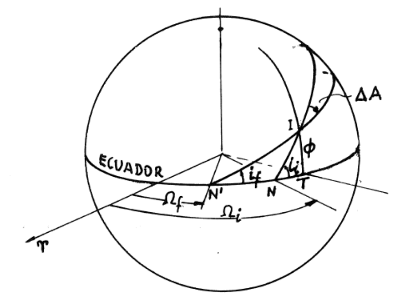

#### Sólo cambia la inclinación

El impulso debe darse en el paso del satélite por el ecuador (Línea de nodos). Si no tendríamos un cambio en la RAAN

Como no se modifica a, el módulo de la velocidad se debe conservar durante el impulso, $V_i = V_f \rightarrow \Delta V = 2 V_{i} sin \frac{\psi}{2}$:

​	$\Delta V=\sqrt{V_{f}^{2}+V_{i}^{2}-2 V_{f} V_{i} \cos \varphi}=2 V_{i} \sqrt{\frac{1-\cos \varphi}{2}}=2 V_{i} \sin \frac{\varphi}{2}$

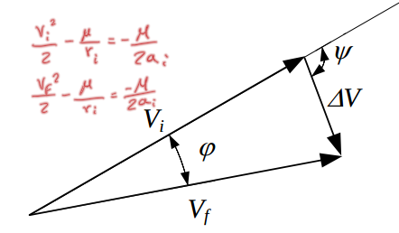

- Para órbitas circulares: $\varphi=\Delta i \rightarrow \Delta V=2 V_{i} \sin \frac{\Delta i}{2}$

- Para órbitas elípticas la componente de la velocidad normal al eje de giro (radiovector) es la que rota un ángulo ∆𝑖: $\Delta V=2 V_{i} \cos \gamma \sin \frac{\Delta i}{2}$

> El coste de la maniobra es altísimo: $\Delta V=2 V_{i} \cos \gamma \sin \frac{\Delta i}{2} \rightarrow \mathrm{i} i \Delta V \sim V_{i} ! !$. En caso de hacerse esta maniobra, conviene que sea en el nodo en que la velocidad sea menor (apogeo).

> LOS CAMBIOS DE PLANO ORBITAL SE DEBEN REALIZAR EN LA ZONA DE MENOR VELOCIDAD

#### Sólo cambia RAAN

> Igual que antes pero con $i_i = i_f$. DEBE HACERSE FUERA DEL ECUADOR    PORQUE SINO, NO LO CAMBIO.

El lanzamiento desde una base se puede hacer en cualquier instante si sólo se tiene como requisito la inclinación de la órbita

Si hay un requisito para el valor de RAAN, será necesario esperar a tener una ventana de lanzamiento, o realizar una maniobra de cambio de RAAN

Particularizando para $i_i = i_f$ (no debe cambiar la inclinación) los resultados obtenidos en el caso anterior…

Se determina la magnitud, dirección y punto de aplicación del impulso $\Delta V, \Delta A, u_{i}$ en función de $i_{i}$ y $\Delta \Omega$.
$u_{i}$ es el argumento de latitud

HIPOTESIS: ORBITA CIRCULAR

Aplicaremos el teorema del coseno para geometría esférica

- Dirección del Impulso:
  $$
  \cos \Delta A=\cos ^{2} i_{i}+\sin ^{2} i_{i} \cos \Delta \Omega
  $$

- El impulso:
  $$
  \Delta V=2 V_{i} \sin \frac{\Delta A}{2}
  $$

- El punto de aplicación del impulso se obtiene del teorema del coseno modificado, con $u = \omega + \nu$
  $$
  \cos u_{i}=\tan i_{i} \frac{\cos \Delta \Omega-\cos \Delta A}{\sin \Delta A}
  $$

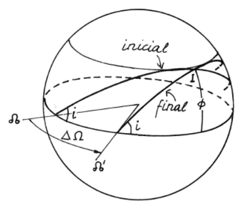

#### Cambio de inclinación y de RAAN

Se debe determinar la magnitud, dirección y punto de aplicación del impulso ($\Delta V, \Delta A, u_{i}$) en función de $i_{i}, i_{f}, \Delta \Omega$

HIPOTESIS: ORBITA CIRCULAR (Si no lo fuese cambiaria el argumento del perigeo $(\omega)$

Aplicando el teorema del coseno para geometría esférica tendremos que:

- Dirección del Impulso
  $$
  \cos \Delta A = - \cos i_{f} \cdot \cos(\pi-i_{i}) + \sin i_{f} \cdot \sin(\pi - i_{i}) \cdot \cos \Delta \Omega
  $$

  $$
  \cos \Delta A = \cos i_{f} \cos i_{i} + \sin i_{f} \sin i_{i} \cos \Delta \Omega
  $$
- Impulso
  $$
  \Delta V=2 V_{i} \sin \frac{\Delta A}{2}
  $$
- Punto Aplicación Impulso
  $$
  u = \omega + \nu
  $$
  $$
  \cos u_{i}=\frac{\cos i_{f}+\cos \Delta A \cdot \cos \left(\pi-i_{i}\right)}{\sin \Delta A \sin \left(\pi-i_{i}\right)}
  $$

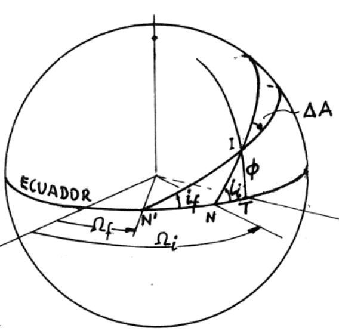

### Maniobra combinada

En este tipo de maniobras, el $\Delta \vec{V}$ tendrá componentes fuera del plano y dentro de él, por lo tanto, habrá un cambio de forma/tamaño de la órbita además de un cambio de plano orbital.

En general se trata de MINIMIZAR EL NUMERO DE IMPULSOS

- Reducir el tiempo de la maniobra completa
- Reducir la complejidad de la maniobra
- Reducir el $\Delta V$ total

HIPOTESIS: ORBITA CIRCULAR

> En principio el cambio de plano es el MÁS COSTOSO, por lo tanto será el que se trate de minimizar, por encima del cambio de forma/tamaño. Se minimiza el gasto debido al cambio de plano por encima del gasto debido al cambio de forma

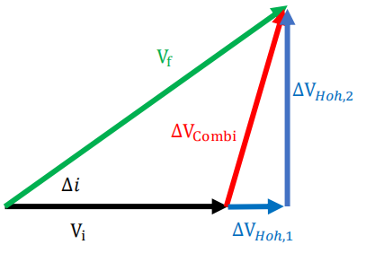 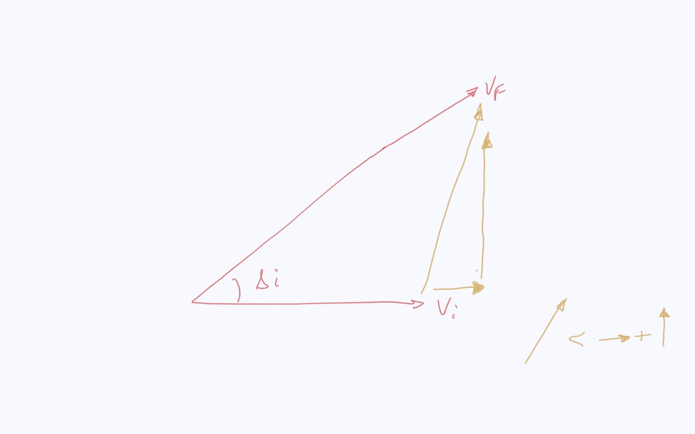

Una maniobra combinada, nos puede ayudar a reducir el $\Delta V$ necesario. En el ejemplo se puede ver, como para alcanzar $V_{f}$ hay dos opciones: Combinada (Roja), o primero impulso en plano y luego otro. Como se puede ver la roja implica menos $\Delta V$ que la suma de las otras dos

$$
\Delta V_{Combi} < \Delta V_{Hoh, 1}+\Delta V_{Hoh, 2}
$$

Es mejor combinar impulsos para reducir complejidad, tiempo y $\Delta V$ de la maniobra

En este tipo de maniobras son utilizadas por satélites para pasar de una órbita de aparcamiento LEO con inclinación $i_{i}$ a una orbita GEO. Para ello habrá que hacer un cambio de altitud y un cambio de inclinación.

> La optimización del problema no es lineal, aunque hay que tener claro unos conceptos, cuanto menor sea la velocidad del satélite, MEJOR PARA CAMBIAR LA INCLINACION. Cuanto más rápido vaya el satélite, mejor para aumentar la energía especifica de la orbita

Una buena maniobra seria por ejemplo realizar la mayor parte del cambio de plano en el apogeo que es el punto de menor velocidad

La formula a utilizar en estos problemas será la más general posible:

$$
\Delta V=\sqrt{V_{f}^{2}+V_{i}^{2}-2 V_{f} V_{i} \cos \phi} \geq V_{f}-V_{i}
$$

Donde $\phi$ será el ángulo que forman los vectores velocidad inicial y final. En el caso de que la órbita inicial sea circular, $\Delta \phi=\Delta i$

### Maniobra Aeroasistida / Aerobraking

Queremos pasar de una orbita a otra de MENOR ENERGIA.

En el caso de estar cerca de un planeta con atmosfera, nos aprovechamos de la resistencia AERODINAMICA para REDUCIR LA ENERGIA DE LA ORBITA. Esto nos ahorra una gran cantidad de combustible además de reducir los costes de la misión.

¿Cómo se realiza?

1) El cohete reduce la altura del perigeo mediante un impulso y forma que pase por la atmosfera del planeta
2) Cada vez que pasa el satélite por la atmosfera, este disminuirá su velocidad y altura del apogeo DISMINUIRA por lo tanto se producirá una circularización progresiva de la orbita
3) Una vez tengo la altura del apogeo necesaria. Meto otro impulso para ALEJAR EL PERIGEO DE LA ATMOSFERA.

> Este tipo de maniobras NO SON NADA SENCILLAS. Las condiciones atmosféricas NO SON CONSTANTES TEMPORALMENTE NI GEOGRAFICAMENTE. Por lo tanto, será necesario controlar las variables atmosféricas donde hago el frenado. La longitud será una variable importante a tener en cuenta debido a que la atmosfera rota con el planeta